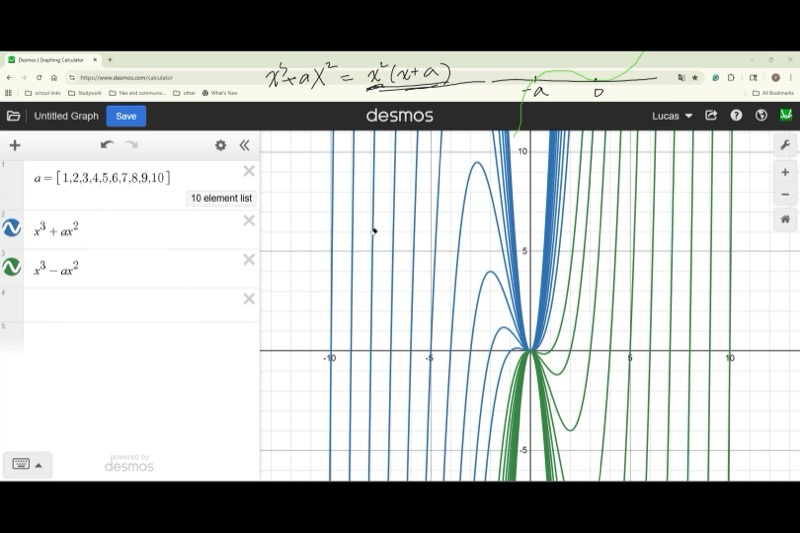
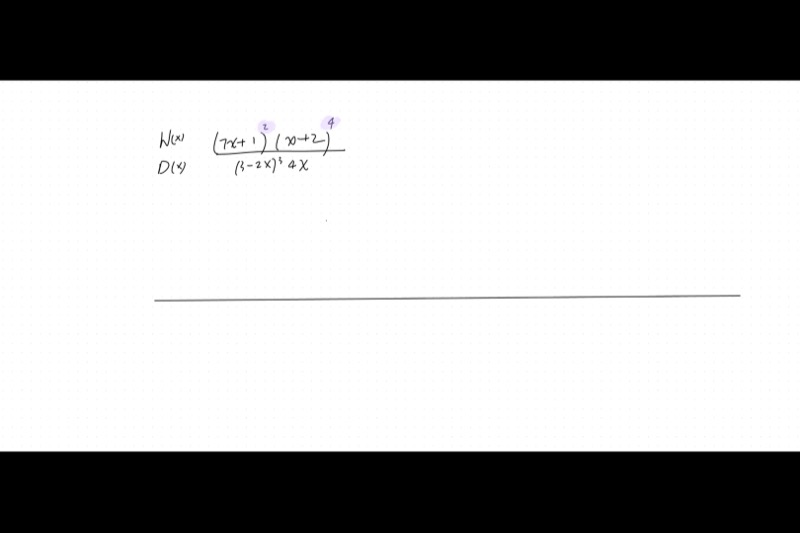
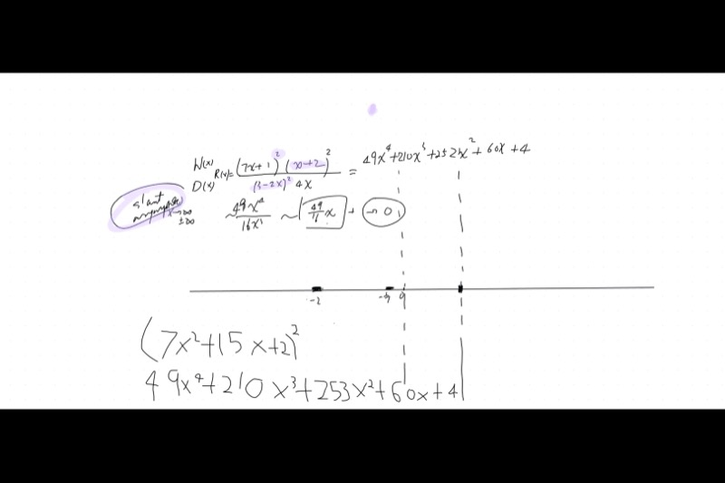
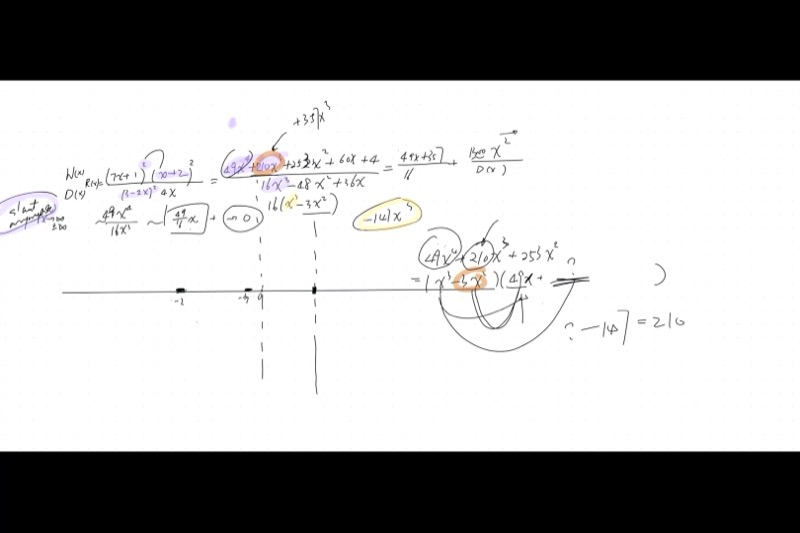

## 课程视频

```{=html}
<video controls width="100%" preload="metadata">
  <source src="https://github.com/ymote/learningmathteam/releases/download/v1.0/Saturday1101morning.mp4" type="video/mp4">
</video>
```

## 背景介绍

你已经知道如何画二次函数的图像——找到顶点、对称轴和截距，就能得到一条抛物线。但当 $x$ 的最高次幂是**三**而不是二时，会发生什么呢？三次多项式产生S形曲线，最多可以有两个转折点，它们的图像具有美妙的**点对称性**（180度旋转对称），而不是轴对称。

本课将教你一种强大而系统的手绘任意因式分解多项式的方法——**蛇形法**——然后将其推广到具有垂直渐近线和斜渐近线的**有理函数**。在此过程中，你将练习**多项式长除法**，这是求斜渐近线和化简有理表达式的关键工具。

::: {.callout-important}
## 核心要点

1. **蛇形法：** 将多项式因式分解，标记所有x轴截距，标注每个根是单根/重根/三重根，然后从右向左"蛇行"画曲线——在奇数重数的根处穿过，在偶数重数的根处弹回。
2. **端部行为：** 首项 $a_n x^n$ 决定了当 $x \to \pm\infty$ 时的走势。从右侧开始，根据 $a_n$ 的符号确定起始方向。
3. **根的重数：**
   - 奇数幂 $(x - r)^1, (x - r)^3, \ldots$ —— 图像**穿过** x轴。
   - 偶数幂 $(x - r)^2, (x - r)^4, \ldots$ —— 图像**弹回**（触碰后折返）。
4. **多项式长除法** 可以将一个多项式除以另一个，得到商和余数——这对求有理函数的斜渐近线至关重要。
5. **三次函数的对称性：** 每一个三次函数 $y = ax^3 + bx^2 + cx + d$ 都有一个位于拐点处的**对称中心**。
:::

## 课程关键帧









## 1. 画三次函数图像：函数族 $y = x^3 + ax^2$

考虑含一个参数的三次函数族：

$$y = x^3 + ax^2$$

### 因式分解与求根

提取公因子 $x^2$：

$$y = x^2(x + a)$$

由此可以立即看出：

- $x = 0$ 是一个**二重根**（来自 $x^2$ 因子）
- $x = -a$ 是一个**单根**（来自 $(x + a)$ 因子）

::: {.callout-note collapse="true"}
## 为什么因式分解能告诉我们根的位置？

乘积等于零，意味着某个因子等于零。令 $x^2 = 0$ 得 $x = 0$，令 $x + a = 0$ 得 $x = -a$。每个因子的指数告诉你该根的**重数**。
:::

### 应用蛇形法

1. **标记x轴截距：** 在数轴上标出 $x = 0$（二重根，画一条横杠）和 $x = -a$（单根，画一个点）。
2. **确定端部行为：** 首项为 $x^3$（正系数，奇数次），所以：
   - 当 $x \to +\infty$ 时，$y \to +\infty$ —— 从右上方开始。
   - 当 $x \to -\infty$ 时，$y \to -\infty$。
3. **蛇行穿过截距：**
   - 从右侧的 $+\infty$ 向下。
   - 在 $x = 0$（二重根）处：**弹回** —— 触碰x轴后折返，不穿过。
   - 继续向左到 $x = -a$（单根）处：**穿过** x轴。
   - 继续向 $-\infty$ 方向延伸。

**探索这个三次函数族——拖动参数 $a$ 的滑块：**

```{=html}
<div id="desmos-1" class="desmos-container"></div>
<script src="https://www.desmos.com/api/v1.9/calculator.js?apiKey=dcb31709b452b1cf9dc26972add0fda6"></script>
<script>
  var calc1 = Desmos.GraphingCalculator(document.getElementById('desmos-1'), {
    expressions: true,
    settingsMenu: false
  });
  calc1.setExpression({ id: 'a', latex: 'a=-3', sliderBounds: {min: -5, max: 5, step: 0.5} });
  calc1.setExpression({ id: 'cubic', latex: 'y=x^3 + a x^2', color: '#2d70b3', lineWidth: 3 });
  calc1.setExpression({ id: 'double', latex: '(0, 0)', color: '#c74440', pointSize: 10, label: 'double root', showLabel: true });
  calc1.setExpression({ id: 'single', latex: '(-a, 0)', color: '#388c46', pointSize: 10, label: 'single root', showLabel: true });
  calc1.setMathBounds({ left: -8, right: 8, bottom: -20, top: 20 });
</script>
```

### 求转折点

要找到转折点（局部最大值和最小值），对函数求导并令其为零：

$$y' = 3x^2 + 2ax = x(3x + 2a) = 0$$

解为：

$$x = 0 \quad \text{and} \quad x = -\frac{2a}{3}$$

::: {.callout-tip collapse="true"}
## 转折点排列在一条直线上！

当 $a$ 变化时，非原点转折点的x坐标为 $x = -\frac{2a}{3}$，这是 $a$ 的**线性**函数。所有转折点的轨迹构成一条直线，而不是曲线！然而，当你将x坐标代回原方程求y坐标时，轨迹在 $(x, y)$ 平面上变成一条三次曲线。
:::

## 2. 蛇形法的一般推广

蛇形法适用于**任何**因式分解的多项式。以下是完整步骤：

### 分步算法

1. **因式分解** 多项式，分解到不可再分。
2. **标记** 数轴上所有的x轴截距。
3. **标注重数：** 单根（点）、二重根（横杠）、三重根，等等。
4. **从右侧开始：** 利用首项系数和次数确定当 $x \to +\infty$ 时 $y \to +\infty$ 还是 $y \to -\infty$。
5. **蛇行穿过：** 从右向左，在每个根处：
   - **奇数重数**（1, 3, 5, ...）：穿过x轴。
   - **偶数重数**（2, 4, 6, ...）：在x轴处弹回（两侧符号相同）。

### 详解示例

::: {.callout-note collapse="true"}
## 示例：画 $y = (3 - 2x)^3 \cdot 4x \cdot (7x + 1)^2 \cdot (x + 2)^4$ 的图像

**第1步——根与重数：**

| 因子 | 根 | 重数 | 行为 |
|---|---|---|---|
| $(3 - 2x)^3$ | $x = \frac{3}{2}$ | 3（奇数） | 穿过 |
| $4x$ | $x = 0$ | 1（奇数） | 穿过 |
| $(7x + 1)^2$ | $x = -\frac{1}{7}$ | 2（偶数） | 弹回 |
| $(x + 2)^4$ | $x = -2$ | 4（偶数） | 弹回 |

**第2步——首项系数：**

展开首项：$(-2x)^3 \cdot 4x \cdot (7x)^2 \cdot (x)^4 = (-8)(4)(49)(1) \cdot x^{10} = -1568x^{10}$

- 10次（偶数次），负首项系数。
- 两端：$y \to -\infty$。

**第3步——从右侧开始蛇行：**

从 $-\infty$ 开始（最右端，在x轴下方）。从左到右排列各根：$-2, -\frac{1}{7}, 0, \frac{3}{2}$。

从右侧 $x = +\infty$（此时 $y \to -\infty$）开始：

- 接近 $x = \frac{3}{2}$：**穿过**（三重根）$\to$ 现在在x轴上方
- 接近 $x = 0$：**穿过**（单根）$\to$ 现在在x轴下方
- 接近 $x = -\frac{1}{7}$：**弹回**（二重根）$\to$ 仍在x轴下方
- 接近 $x = -2$：**弹回**（四重根）$\to$ 仍在x轴下方
- 继续向 $x \to -\infty$ 延伸，$y \to -\infty$（一致！）
:::

## 3. 端部行为参考表

| 首项 | $x \to +\infty$ | $x \to -\infty$ |
|---|---|---|
| $+x^{\text{even}}$ | $+\infty$ | $+\infty$ |
| $-x^{\text{even}}$ | $-\infty$ | $-\infty$ |
| $+x^{\text{odd}}$ | $+\infty$ | $-\infty$ |
| $-x^{\text{odd}}$ | $-\infty$ | $+\infty$ |

::: {.callout-tip collapse="true"}
## 记忆技巧

**奇数**次：两端方向**相反**（像字母S或反S形）。

**偶数**次：两端方向**相同**（都向上像U形，或都向下像倒U形）。

然后首项系数决定哪个方向是"上"。
:::

## 4. 多项式长除法

画有理函数图像时，我们需要求斜（倾斜）渐近线。用到的工具就是**多项式长除法**。

### 基本思想

就像 $157 \div 12 = 13$ 余 $1$ 一样，我们可以写成：

$$\frac{N(x)}{D(x)} = Q(x) + \frac{R(x)}{D(x)}$$

其中 $Q(x)$ 是**商**（多项式部分），$R(x)$ 是**余数**。

当 $x \to \pm\infty$ 时，分式 $\frac{R(x)}{D(x)} \to 0$（当 $R$ 的次数小于 $D$ 的次数时），所以函数趋近于 $Q(x)$。如果 $Q(x)$ 是线性的，那条直线就是**斜渐近线**。

### 课堂示例

::: {.callout-note collapse="true"}
## 完整解题示例：用长除法求斜渐近线

我们需要做以下除法：

$$\frac{49x^4 + 210x^3 + 253x^2 + 60x + 4}{16x^3 - 48x^2 + 36x}$$

**第1步：** 提取分母的公因数以简化运算：

$$16x^3 - 48x^2 + 36x = 4x(4x^2 - 12x + 9) = 4x(2x - 3)^2$$

**第2步：** 进行除法。比较首项：

$$\frac{49x^4}{16x^3} = \frac{49}{16}x$$

**第3步：** 回乘并相减：

$$\frac{49}{16}x \cdot (16x^3 - 48x^2 + 36x) = 49x^4 - 147x^3 + \frac{49 \cdot 36}{16}x^2$$

**第4步：** 从被除式中减去，得到下一项。继续直到余数的次数小于3。

结果为：

$$Q(x) = \frac{49x + 357}{16}$$

这就是**斜渐近线**：$y = \frac{49}{16}x + \frac{357}{16}$。

**关键洞察：** 余数首项的符号告诉你图像从渐近线的**上方**还是**下方**趋近。正的余数首项系数意味着图像在 $|x|$ 较大时位于渐近线上方。
:::

**交互式探索多项式长除法——观察有理函数如何紧贴其斜渐近线：**

```{=html}
<div id="desmos-2" class="desmos-container"></div>
<script>
  var calc2 = Desmos.GraphingCalculator(document.getElementById('desmos-2'), {
    expressions: true,
    settingsMenu: false
  });
  calc2.setExpression({ id: 'rational', latex: 'y=\\frac{(7x+1)^2(x+2)^4}{(2x-3)^2 \\cdot 4x}', color: '#2d70b3', lineWidth: 2 });
  calc2.setExpression({ id: 'asymptote', latex: 'y=\\frac{49}{16}x+\\frac{357}{16}', color: '#c74440', lineStyle: 'DASHED', lineWidth: 2 });
  calc2.setExpression({ id: 'vert1', latex: 'x=0', color: '#888888', lineStyle: 'DASHED', lineWidth: 1 });
  calc2.setExpression({ id: 'vert2', latex: 'x=\\frac{3}{2}', color: '#888888', lineStyle: 'DASHED', lineWidth: 1 });
  calc2.setMathBounds({ left: -10, right: 10, bottom: -50, top: 50 });
</script>
```

## 5. 有理函数与渐近线

当一个多项式因子出现在**分母**中时，它的零点变为**垂直渐近线**，而不是x轴截距。蛇形法可以自然推广：

### 垂直渐近线的规则

| 分母因子 | 重数 | 渐近线处的行为 |
|---|---|---|
| $(x - r)^1$ | 奇数 | $y$ 改变符号（从 $+\infty$ 到 $-\infty$，或反之） |
| $(x - r)^2$ | 偶数 | $y$ 保持相同符号（两侧都趋向 $+\infty$ 或都趋向 $-\infty$） |

::: {.callout-tip collapse="true"}
## 为什么这与根的规则相同？

逻辑完全一致！在根处，偶数幂意味着 $(x - r)^{2k}$ 在 $r$ 附近始终非负，因此函数不变号。在垂直渐近线处，分母中的偶数幂意味着分母在 $r$ 附近始终为正（或始终为负），所以函数在两侧向**同一方向**趋向无穷大。
:::

### 画有理函数图像：完整步骤

1. 将分子和分母完全因式分解。
2. **分子零点** $\to$ x轴截距（遵循重数行为）。
3. **分母零点** $\to$ 垂直渐近线（遵循重数行为）。
4. 通过比较次数或做长除法求**水平/斜渐近线**。
5. 通过余数的符号判断图像从渐近线的**上方还是下方**趋近。
6. 从右向左**蛇行穿过**所有截距和渐近线。

## 6. 根的重数：穿过与弹回

**并排对比三种行为：**

```{=html}
<div id="desmos-3" class="desmos-container"></div>
<script>
  var calc3 = Desmos.GraphingCalculator(document.getElementById('desmos-3'), {
    expressions: true,
    settingsMenu: false
  });
  calc3.setExpression({ id: 'single', latex: 'y=(x+3)', color: '#2d70b3', lineWidth: 2 });
  calc3.setExpression({ id: 'double', latex: 'y=(x-0)^2 - 1', color: '#c74440', lineWidth: 2 });
  calc3.setExpression({ id: 'triple', latex: 'y=0.3(x-3)^3', color: '#388c46', lineWidth: 2 });
  calc3.setExpression({ id: 'p1', latex: '(-3, 0)', color: '#2d70b3', pointSize: 10, label: 'single: crosses', showLabel: true });
  calc3.setExpression({ id: 'p2', latex: '(-1, 0)', color: '#c74440', pointSize: 10, label: 'double: bounces', showLabel: true });
  calc3.setExpression({ id: 'p2b', latex: '(1, 0)', color: '#c74440', pointSize: 10 });
  calc3.setExpression({ id: 'p3', latex: '(3, 0)', color: '#388c46', pointSize: 10, label: 'triple: flat crossing', showLabel: true });
  calc3.setMathBounds({ left: -6, right: 6, bottom: -5, top: 5 });
</script>
```

基本法则：

$$\boxed{\text{Odd multiplicity} \implies \text{crosses} \qquad \text{Even multiplicity} \implies \text{bounces}}$$

::: {.callout-note collapse="true"}
## 为什么这个法则成立？

考虑因子 $(x - r)^k$ 在 $x = r$ 附近的行为：

- 如果 $k$ 是**偶数**，则 $(x - r)^k \geq 0$ 对 $r$ 附近的所有 $x$ 成立。$y$ 的符号不变，所以图像触碰x轴后折返。
- 如果 $k$ 是**奇数**，则 $(x - r)^k$ 在 $x$ 经过 $r$ 时改变符号（一侧为负，另一侧为正）。所以图像必须穿过x轴。

更高次的奇数重数（如三重根）以更**平缓**的方式穿过——图像在x轴附近停留更久，形成类似拐点的形状。
:::

## 7. 三次多项式的对称性

每个三次多项式在其拐点处都有一个**对称中心**。对于 $y = x^3 + ax^2$：

- 拐点在 $x = -\frac{a}{3}$ 处
- 图像关于该点具有180度旋转对称性

::: {.callout-note collapse="true"}
## 如何求对称中心

对于一般三次函数 $y = Ax^3 + Bx^2 + Cx + D$：

1. 拐点在 $y'' = 0$ 处：
$$y'' = 6Ax + 2B = 0 \implies x = -\frac{B}{3A}$$

2. 将此x值代回原方程得到y坐标。

3. 点 $\left(-\frac{B}{3A},\; y\!\left(-\frac{B}{3A}\right)\right)$ 就是对称中心。

这意味着如果你将整个三次函数图像绕该点旋转180度，你会得到同样的图像。
:::

## 速查表

::: {.key-formula}
**多项式作图：蛇形法**

| 步骤 | 操作 |
|---|---|
| 1 | 将多项式完全因式分解 |
| 2 | 在数轴上标记所有x轴截距 |
| 3 | 标注每个根：单根（点）、二重根（横杠）、三重根，等等 |
| 4 | 根据首项确定端部行为 |
| 5 | 从右侧开始蛇行穿过：在奇数根处**穿过**，在偶数根处**弹回** |

**根的重数快速参考**

| 重数 | 图像行为 | 直观表示 |
|---|---|---|
| 1（单根） | 直接穿过 | $\nearrow\!\!\searrow$ |
| 2（二重根） | 弹回（触碰后折返） | $\cup$ 或 $\cap$ |
| 3（三重根） | 平缓地穿过拐点 | 在根处呈S形 |
| 4（四重根） | 平缓弹回 | 平坦的 $\cup$ 或 $\cap$ |

**多项式长除法**

$$\frac{N(x)}{D(x)} = Q(x) + \frac{R(x)}{D(x)}$$

- $Q(x)$ = 商（如果是线性的，则为渐近线）
- $R(x)$ = 余数（决定从上方还是下方趋近）
- 匹配首项，回乘，相减，重复

**有理函数渐近线**

| 次数比较 | 渐近线类型 |
|---|---|
| $\deg(N) < \deg(D)$ | 水平渐近线：$y = 0$ |
| $\deg(N) = \deg(D)$ | 水平渐近线：$y = \frac{a_n}{b_n}$ |
| $\deg(N) = \deg(D) + 1$ | 斜渐近线：$y = Q(x)$，通过长除法求得 |
:::
