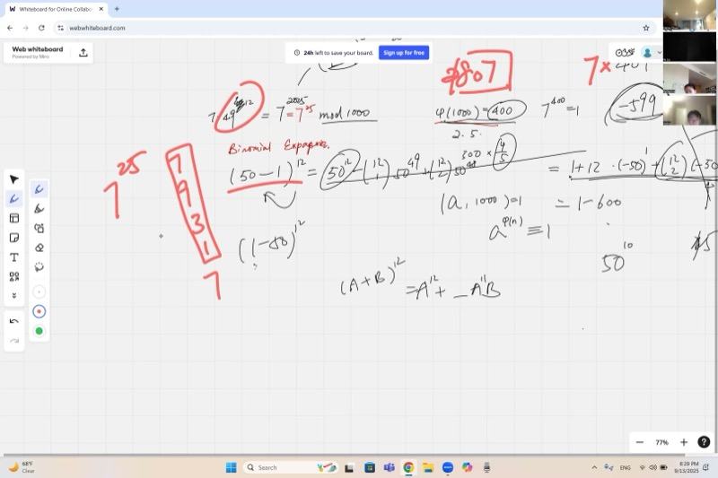
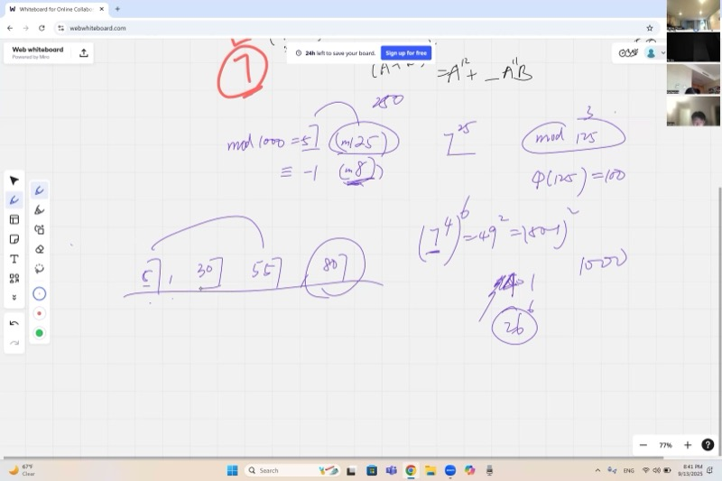
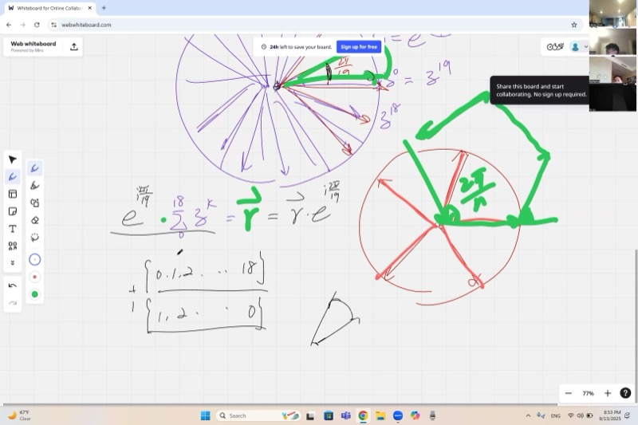
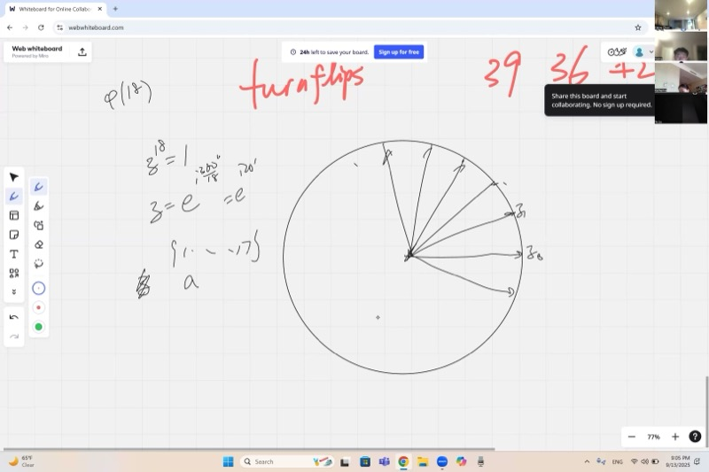

## 背景介绍

在本课中，我们探索数学中最优美的一些思想：用模运算求巨大数的末位数字，用中国剩余定理将难题分解为简单的小问题，以及对称性的概念——它的真正含义和如何计数。这些思想通过复数和单位根将数论与几何联系起来，在代数与形状的视觉世界之间架起一座桥梁。

为什么这很重要？模运算是现代密码学的基础（保护你的在线密码安全）。对称性是物理学家分类粒子和化学家理解晶体的工具。将困难问题分解为更简单部分的能力（正如中国剩余定理所做的那样）是数学中最强大的策略之一。

## 课程视频

```{=html}
<video controls width="100%" preload="metadata">
  <source src="https://github.com/ymote/learningmathteam/releases/download/v1.0/Saturday20250913afternoon.mp4" type="video/mp4">
</video>
```

::: {.callout-important}
## 核心要点

1. **欧拉函数**简化指数：当 $\gcd(a, n) = 1$ 时，$a^{\phi(n)} \equiv 1 \pmod{n}$
2. **二项式展开**可以帮助求末位数字：将 $(k \pm 1)^m$ 展开，只保留低次项
3. **中国剩余定理 (CRT)**：将 $\bmod\; n$ 分解为更小的互素模数，分别求解再重新组合
4. **图形的对称性** = 所有使图形看起来不变的几何操作（旋转、反射）
5. 元素在模 $n$ 下的**阶**总是整除 $\phi(n)$，阶等于 $\phi(n)$ 的元素称为**原根**
:::

## 欧拉函数与指数简化

**欧拉函数** $\phi(n)$ 计算从 $1$ 到 $n$ 中与 $n$ 互素（除了 1 之外没有公因子）的整数个数。

**如何计算：** 将 $n$ 分解为素因子，然后对每个素因子 $p$ 乘以 $(1 - \tfrac{1}{p})$。

::: {.callout-tip collapse="true"}
## 示例：计算 $\phi(1000)$

由于 $1000 = 2^3 \times 5^3$，素因子为 $2$ 和 $5$：

$$\phi(1000) = 1000 \times \left(1 - \frac{1}{2}\right) \times \left(1 - \frac{1}{5}\right) = 1000 \times \frac{1}{2} \times \frac{4}{5} = 400$$

这意味着在 1 到 1000 之间有 400 个与 1000 没有公因子的数。
:::

**欧拉定理：** 若 $\gcd(a, n) = 1$，则：

$$a^{\phi(n)} \equiv 1 \pmod{n}$$

这非常强大，因为它能让我们简化巨大的指数。例如，要求 $7^{2025}$ 的最后三位数字（即 $7^{2025} \bmod 1000$）：

$$7^{2025} = 7^{400 \times 5 + 25} = \left(7^{400}\right)^5 \cdot 7^{25} \equiv 1^5 \cdot 7^{25} = 7^{25} \pmod{1000}$$

我们将指数从 2025 降低到了仅仅 25。

## 用二项式展开求末位数字

得到 $7^{25} \pmod{1000}$ 后，我们可以使用**二项式展开**技巧。思路是：改写底数使其接近一个"整数"（产生末尾零的数）。

::: {.callout-note collapse="true"}
## 推导：$7^{2025}$ 的最后三位数字

我们写 $7^{25} = 7 \cdot (7^2)^{12} = 7 \cdot 49^{12} = 7 \cdot (50 - 1)^{12}$。

用二项式定理展开 $(50 - 1)^{12}$：

$$(50 - 1)^{12} = \sum_{k=0}^{12} \binom{12}{k} 50^k (-1)^{12-k}$$

由于我们只需要 $\bmod\; 1000$，任何含 $50^k$（$k \ge 3$）的项都被 $50^3 = 125{,}000$ 整除而消失。我们只保留 50 的最低次幂：

$$\approx \underbrace{(-1)^{12}}_{k=0} + \underbrace{\binom{12}{1} \cdot 50 \cdot (-1)^{11}}_{k=1} + \underbrace{\binom{12}{2} \cdot 50^2 \cdot (-1)^{10}}_{k=2}$$

$$= 1 - 600 + 66 \times 2500$$

$k = 2$ 项：$66 \times 2500 = 165{,}000 \equiv 0 \pmod{1000}$（因为 $66$ 是偶数，乘积至少有三个末尾零）。

所以我们剩下：

$$49^{12} \equiv 1 - 600 = -599 \equiv 401 \pmod{1000}$$

因此：

$$7^{2025} \equiv 7 \times 401 = 2807 \equiv \boxed{807} \pmod{1000}$$

**验证：** $7^{25}$ 的末位数字。7 的幂的末位数字以周期 4 循环：$7, 9, 3, 1, 7, 9, 3, 1, \ldots$ 由于 $25 \equiv 1 \pmod{4}$，末位数字是 $7$。这与 $807$ 一致。
:::

## 中国剩余定理 (CRT)

**中国剩余定理**指出：如果 $n = n_1 \times n_2$ 且 $\gcd(n_1, n_2) = 1$，那么在 $\bmod\; n$ 下求解等价于分别在 $\bmod\; n_1$ 和 $\bmod\; n_2$ 下求解。

对于 $1000 = 8 \times 125$，有 $\gcd(8, 125) = 1$，我们拆分问题：

::: {.callout-tip collapse="true"}
## 示例：用 CRT 求 $7^{25} \pmod{1000}$

**第一步：模 8**

$7 \equiv -1 \pmod{8}$，所以 $7^{25} \equiv (-1)^{25} = -1 \equiv 7 \pmod{8}$。

**第二步：模 125**

$\phi(125) = 125 \times \tfrac{4}{5} = 100$，且 $25 < 100$，所以无法进一步简化。

使用同样的二项式技巧：$7^{25} = 7 \cdot (50 - 1)^{12}$。

模 125，由于 $50 = 2 \times 5^2$ 已包含 $5^2$，任何含 $50^2$ 或更高次幂的项都被 $5^4 \ge 125 \times 5$ 整除。我们只需要两项：

$$49^{12} \equiv 1 - 600 \equiv 1 - 600 \pmod{125}$$

$600 = 4 \times 125 + 100$，所以 $600 \equiv 100 \pmod{125}$。

$$49^{12} \equiv 1 - 100 = -99 \equiv 26 \pmod{125}$$

$$7^{25} \equiv 7 \times 26 = 182 \equiv 57 \pmod{125}$$

**第三步：重新组合**

我们需要 $x$ 满足 $x \equiv 57 \pmod{125}$ 且 $x \equiv 7 \pmod{8}$，其中 $0 \le x < 1000$。

列出满足第一个方程的候选值：$57, 307, 557, 807$（每次加 250 以保持奇数）。

检查模 8：$807 = 100 \times 8 + 7$。所以 $807 \equiv 7 \pmod{8}$。

$$7^{2025} \equiv \boxed{807} \pmod{1000}$$
:::

## 单位根与向量求和

$n$ 次**单位根**是满足 $z^n = 1$ 的 $n$ 个复数。它们在单位圆上等距分布：

$$z_k = e^{i \cdot 2\pi k / n}, \quad k = 0, 1, 2, \ldots, n-1$$

```{=html}
<div id="desmos-roots" class="desmos-container"></div>
<script src="https://www.desmos.com/api/v1.9/calculator.js?apiKey=dcb31709b452b1cf9dc26972add0fda6"></script>
<script>
var elt = document.getElementById('desmos-roots');
var calculator = Desmos.GraphingCalculator(elt, {expressions: true, settingsMenu: false});
calculator.setExpression({id: 'circle', latex: 'x^2+y^2=1', color: '#aaaaaa', lineWidth: 1});
calculator.setExpression({id: 'n', latex: 'n=5', sliderBounds: {min: 3, max: 19, step: 1}});
calculator.setExpression({id: 'pts', latex: '(\\cos(2\\pi k/n), \\sin(2\\pi k/n))', color: '#2d70b3', pointSize: 10});
calculator.setExpression({id: 'k', latex: 'k=[0,1,...,n-1]'});
calculator.setExpression({id: 'lines', latex: '(t\\cos(2\\pi k/n), t\\sin(2\\pi k/n))', color: '#c74440', lineWidth: 1.5, parametricDomain: {min: '0', max: '1'}});
calculator.setExpression({id: 't', latex: 't=[0,1]'});
calculator.setMathBounds({left: -1.8, right: 1.8, bottom: -1.8, top: 1.8});
</script>
```

*拖动 $n$ 的滑块可以查看不同的单位根。注意这些向量总是构成正多边形。*

**关键事实：** 所有 $n$ 次单位根之和总是零：

$$\sum_{k=0}^{n-1} z_k = 0$$

::: {.callout-note collapse="true"}
## 对称性证明

设 $\omega = e^{i \cdot 2\pi/n}$，令 $R = \sum_{k=0}^{n-1} \omega^k$。

将 $R$ 乘以 $\omega$（这将每个向量旋转 $2\pi/n$）：

$$\omega \cdot R = \sum_{k=0}^{n-1} \omega^{k+1} = \omega^1 + \omega^2 + \cdots + \omega^n = \omega^1 + \omega^2 + \cdots + 1 = R$$

所以 $\omega \cdot R = R$，即 $R(\omega - 1) = 0$。

由于 $\omega \neq 1$（当 $n \ge 2$ 时），必有 $R = 0$。

**几何直觉：** 将这些向量首尾相接，它们构成一个正 $n$ 边形并回到起点。总位移为零。
:::

## 几何图形的对称性

一个图形的**对称性**是使图形看起来完全相同的几何操作（旋转、反射或"旋转-翻转"）。关键要求：操作必须保持**相邻性**——相邻的顶点必须仍然相邻。

### 正方形的对称性

将顶点逆时针标记为 $1, 2, 3, 4$。

| 类型 | 操作 | 数量 |
|------|-----------|-------|
| 旋转 | $0°, 90°, 180°, 270°$ | 4 |
| 反射 | 2 条对角轴 + 2 条中点轴 | 4 |
| **总计** | | **8** |

::: {.callout-tip collapse="true"}
## 用组合方法计数

不逐一列举对称性，而是计算有效标记的数量：

- **4 种选择**确定顶点 1 的位置
- **2 种选择**确定顶点 2 的位置（必须与 1 相邻，一旦选定，顶点 3 和 4 就确定了）

总计：$4 \times 2 = 8$ 种对称性。
:::

### 正方体的对称性

同样的计数策略适用于三维：

- **8 种选择**确定顶点 1 的位置
- **3 种选择**选择顶点 1 的一个邻居（正方体的每个顶点有 3 条棱）
- **2 种选择**确定其余邻居的方向（顺时针与逆时针绕顶点 1，分别对应直接旋转与反射）

$$\text{对称性总数} = 8 \times 3 \times 2 = 48$$

::: {.callout-note collapse="true"}
## 为什么逐一列举正方体的对称性很困难

如果你试图手动列出正方体的所有 48 种对称性，几乎肯定会遗漏一些！人们常犯错得到的数字：36、39、42。

最难的是**旋转反射**（也称"旋转-翻转"）：同时进行旋转和反射。这些在三维中很难可视化。维基百科关于"正方体的对称性"的文章有所有 48 种操作的精彩图解。

48 种对称性分解为：

- **24 种旋转对称性**（保持方向的）
- **24 种非正常对称性**（涉及反射的）
:::

## 模运算中元素的阶

$a$ 在模 $n$ 下的**阶**是使 $a^r \equiv 1 \pmod{n}$ 成立的最小正整数 $r$。如果 $r = \phi(n)$，则 $a$ 称为模 $n$ 的**原根**。

::: {.callout-tip collapse="true"}
## 示例：模 18 的阶

$\phi(18) = 18 \times \frac{1}{2} \times \frac{2}{3} = 6$

与 18 互素的数为：$1, 5, 7, 11, 13, 17$。

| $a$ | $\text{ord}(a)$ | 原因 |
|-----|-----------------|--------|
| $1$ | $1$ | $1^1 = 1$ |
| $17$ | $2$ | $17 \equiv -1$，所以 $17^2 \equiv 1$ |
| $7$ | $3$ | $7^3 = 343 = 19 \times 18 + 1$ |
| $13$ | $3$ | $13 \equiv -5$，且 $(-5)^3 = -125 \equiv 1 \pmod{18}$ |
| $5$ | $6$ | $5^3 = 125 \equiv -1 \pmod{18}$，需要 6 次方才能得到 $+1$ |
| $11$ | $6$ | $11 \equiv -7$，且 $(-7)^3 \equiv -1 \pmod{18}$ |
:::

::: {.callout-note collapse="true"}
## 证明：阶总是整除 $\phi(n)$

假设 $a$ 在模 $n$ 下的阶为 $r$，假设反证 $r \nmid \phi(n)$。

由带余除法：$\phi(n) = qr + p$，其中 $0 < p < r$。

由欧拉定理：$a^{\phi(n)} \equiv 1 \pmod{n}$。

但 $a^{\phi(n)} = a^{qr + p} = (a^r)^q \cdot a^p \equiv 1^q \cdot a^p = a^p \pmod{n}$。

所以 $a^p \equiv 1 \pmod{n}$，其中 $0 < p < r$，这与 $r$ 的最小性矛盾。

因此 $r \mid \phi(n)$。模 18 下可能的阶必须整除 6：它们是 $1, 2, 3, 6$。
:::

**一个有用的快捷方式：** 如果 $a \equiv -b \pmod{n}$ 且 $b$ 的阶为奇数 $r$，则 $a$ 的阶为 $2r$。这是因为 $(-b)^r = -(b^r) = -1$，所以需要再平方一次才能达到 $+1$。

## 联系：数论遇见几何

本课的深刻洞见是，模运算和单位根是从不同角度看到的**相同结构**：

- 加法模 $n$ 下的余数 $\{0, 1, 2, \ldots, n-1\}$ 的行为与乘法下的 $n$ 次单位根完全相同
- 模 $n$ 下幂的**循环性**（例如 $7^1, 7^2, 7^3, \ldots$ 最终循环回到 1）对应于一个点沿单位圆运动
- 元素的**阶**对应于完成一圈完整旋转所需的步数
- **原根**对应于能生成所有其他根的单位根

这是**群论**的预览，群论是现代数学最重要的分支之一。

## 课程关键帧

<div style="display: flex; flex-direction: column; gap: 10px; margin: 1em 0;">
  
  
  
  
</div>

## 速查表

::: {.key-formula}
| 概念 | 公式 / 规则 |
|---------|---------------|
| 欧拉函数 | $\phi(n) = n \prod_{p \mid n}\left(1 - \frac{1}{p}\right)$ |
| 欧拉定理 | $a^{\phi(n)} \equiv 1 \pmod{n}$，当 $\gcd(a,n) = 1$ |
| 二项式定理 | $(a + b)^n = \sum_{k=0}^{n} \binom{n}{k} a^{n-k} b^k$ |
| 中国剩余定理 | 若 $\gcd(m, n) = 1$，方程组 $x \equiv a \pmod{m}$，$x \equiv b \pmod{n}$ 在模 $mn$ 下有唯一解 |
| 单位根之和 | $\sum_{k=0}^{n-1} e^{i \cdot 2\pi k/n} = 0$ |
| 正方形的对称性 | $4 \text{ 种旋转} + 4 \text{ 种反射} = 8$ |
| 正方体的对称性 | $8 \times 3 \times 2 = 48$ |
| $a$ 模 $n$ 的阶 | 使 $a^r \equiv 1$ 的最小 $r > 0$；总是整除 $\phi(n)$ |
| 原根 | 阶等于 $\phi(n)$ 的元素 |

### 快速参考：求末位数字的策略

1. **用 $\phi(n)$ 简化指数**：将 $a^N$ 替换为 $a^{N \bmod \phi(n)}$
2. **二项式展开**：将底数改写为接近整数的形式，只保留低次项
3. **CRT 替代方法**：将模数拆分为互素因子，分别求解再组合
:::
