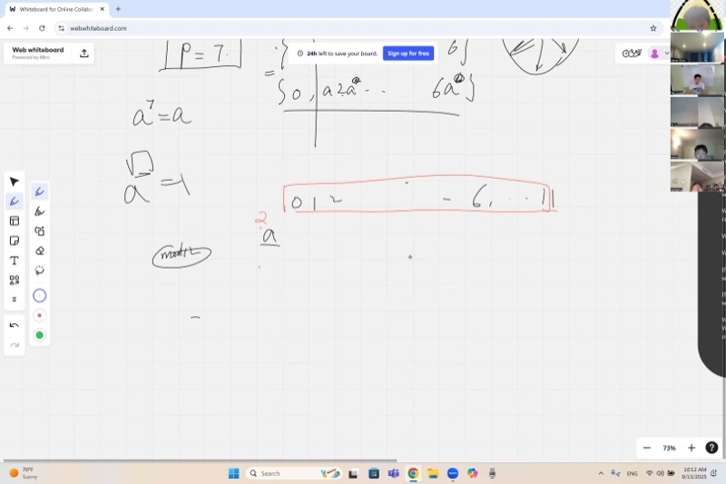
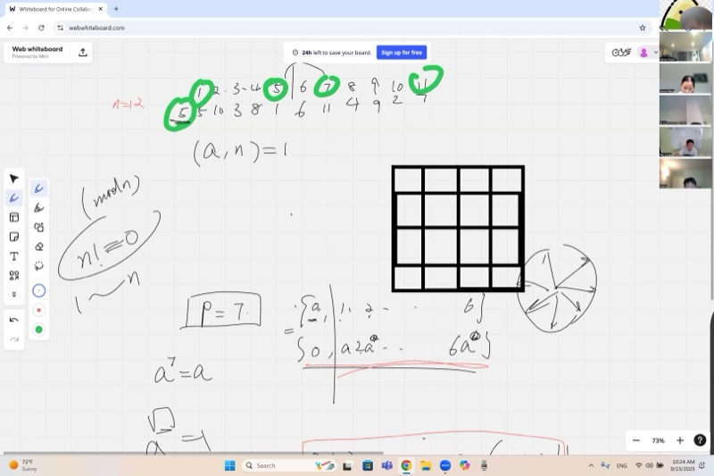
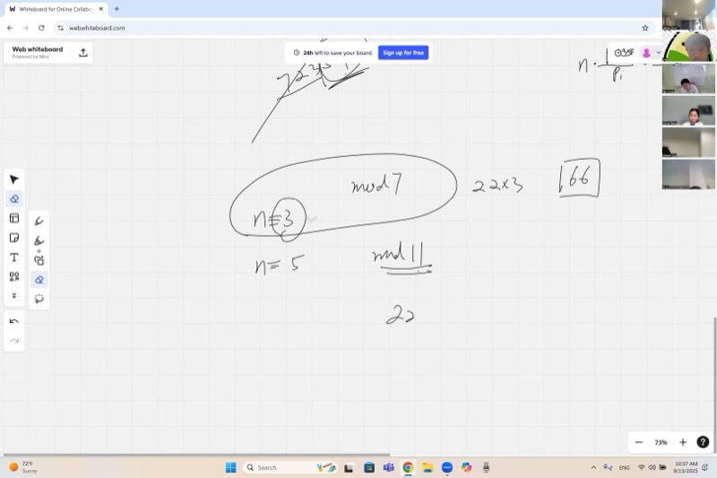
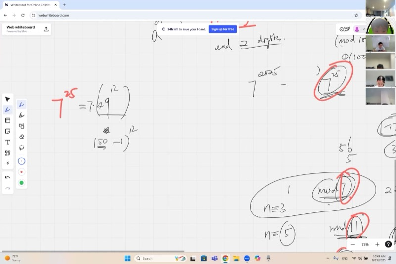

## 课程视频

```{=html}
<video controls width="100%" preload="metadata">
  <source src="https://github.com/ymote/learningmathteam/releases/download/v1.0/Saturday20250913morning.mp4" type="video/mp4">
</video>
```

## 背景介绍

你有没有注意过幂次方末位数字的规律？例如，$7^1 = 7$，$7^2 = 49$，$7^3 = 343$，$7^4 = 2401$——末位数字循环出现：7, 9, 3, 1, 7, 9, 3, 1, ... 这种循环行为并非巧合，而是由数论中的深刻定理所决定的：**费马小定理**及其通过**欧拉函数**的推广。

在本课中，我们从费马小定理对于素数的优美证明出发，然后利用欧拉函数将其推广到合数。在此过程中，我们将这些概念与复平面单位圆上的**单位根**联系起来——模运算中的循环模式同样出现在围绕圆旋转的向量中。最后，我们介绍一个强大的应用：**中国剩余定理**，它能让我们把困难的模运算问题拆解为更简单的部分。

::: {.callout-important}
## 核心要点

1. **费马小定理**：对于任意素数 $p$ 和不被 $p$ 整除的整数 $a$，有 $a^{p-1} \equiv 1 \pmod{p}$。
2. **欧拉函数** $\phi(n)$：计算从 $1$ 到 $n-1$ 中与 $n$ 互素的整数个数。公式为 $\phi(n) = n \prod_{p \mid n}\left(1 - \frac{1}{p}\right)$，其中乘积遍历所有不同的素因子。
3. **欧拉定理**（费马定理的推广）：若 $\gcd(a, n) = 1$，则 $a^{\phi(n)} \equiv 1 \pmod{n}$。
4. **中国剩余定理**：若 $\gcd(m_1, m_2) = 1$，则方程组 $x \equiv a_1 \pmod{m_1}$，$x \equiv a_2 \pmod{m_2}$ 在模 $m_1 m_2$ 意义下有唯一解。
5. **单位根**：$n$ 次单位根是单位圆上 $n$ 个等距分布的向量，它们的和总是等于零。这反映了模运算中的循环结构。
:::

## 费马小定理：素数情形

当 $p$ 为素数（例如 $p = 7$）时，考虑非零余数集合：

$$\{1, 2, 3, 4, 5, 6\}$$

选择任意不被 $7$ 整除的 $a$，将每个元素乘以 $a$。得到的结果 $\{a, 2a, 3a, 4a, 5a, 6a\}$ 只不过是同一个集合的不同排列（在模 7 意义下）。这是因为在模 $p$ 的世界中，乘以非零数是一个双射——它对元素进行置换，不会产生重复。

由于两个集合包含相同的数，它们的乘积相等：

$$1 \cdot 2 \cdot 3 \cdot 4 \cdot 5 \cdot 6 = (1a)(2a)(3a)(4a)(5a)(6a) \pmod{7}$$

右边等于 $(6!) \cdot a^6$，因此：

$$6! \equiv 6! \cdot a^6 \pmod{7}$$

消去 $6!$（它不被 $7$ 整除，所以在模 $7$ 下有逆元）：

$$a^6 \equiv 1 \pmod{7}$$

一般地，对于任意素数 $p$：

$$\boxed{a^{p-1} \equiv 1 \pmod{p}}$$

::: {.callout-tip collapse="true"}
## 示例：验证 $a = 3$，$p = 7$

将 $\{1,2,3,4,5,6\}$ 中的每个元素乘以 $3$，取模 $7$：

- $1 \times 3 = 3$
- $2 \times 3 = 6$
- $3 \times 3 = 9 \equiv 2$
- $4 \times 3 = 12 \equiv 5$
- $5 \times 3 = 15 \equiv 1$
- $6 \times 3 = 18 \equiv 4$

结果：$\{3, 6, 2, 5, 1, 4\}$——同一个集合，只是顺序不同。因此 $3^6 = 729 \equiv 1 \pmod{7}$。验证：$729 = 104 \times 7 + 1$。
:::

## 为什么同样的证明对合数失效

现在试试 $n = 12$。如果我们将 $\{0, 1, 2, \ldots, 11\}$ 乘以某个数 $a$，是否总能得到同样的集合？

**不能。** 例如，乘以 $2$：我们得到 $\{0, 2, 4, 6, 8, 10, 0, 2, 4, 6, 8, 10\}$——只有一半的数出现，每个出现两次。问题在于 $2$ 与 $12$ 有公因子。

哪些数 $a$ **能**返回完整的集合？只有那些与 $12$ **互素**的数：除了 $1$ 之外它们与 $12$ 没有公因子。

此外，模 $12$ 下的 $11!$ 等于 $0$（不是可以消去的数），因为在 $1, 2, \ldots, 11$ 中我们能找到因子 $3$ 和 $4$，它们的乘积是 $12 \equiv 0$。

::: {.callout-note collapse="true"}
## 为什么当 $n$ 为合数时 $n!$ 模 $n$ 总是零

如果 $n$ 是合数，它至少有两个因子 $a$ 和 $b$，满足 $a \cdot b = n$ 且 $1 < a, b < n$。$a$ 和 $b$ 都出现在乘积 $1 \cdot 2 \cdots (n-1)$ 中，所以这个乘积包含 $n$ 作为因子。因此，当 $n$ 为合数时，$n! \equiv 0 \pmod{n}$。

（当 $n = 4$ 时，我们需要 $2$ 出现两次，但 $2$ 和 $4/2 = 2$ 重叠了。然而，$4! = 24$ 且 $24 / 4 = 6$，所以结论仍然成立。一般来说，该论证对所有合数 $n$ 都成立。）
:::

## 欧拉函数

为了修正证明，我们限制到与 $n$ 互素的数。

**定义。** **欧拉函数** $\phi(n)$ 计算从 $1$ 到 $n$ 中与 $n$ 互素的整数个数。

::: {.callout-tip collapse="true"}
## 示例：计算 $\phi(12)$

列出 $1$ 到 $11$ 的整数，检查哪些与 $12$ 没有公因子：

| 数字 | 与 12 的 $\gcd$ | 是否互素？ |
|--------|----------------|-------------------|
| 1 | 1 | 是 |
| 2 | 2 | 否 |
| 3 | 3 | 否 |
| 4 | 4 | 否 |
| 5 | 1 | 是 |
| 6 | 6 | 否 |
| 7 | 1 | 是 |
| 8 | 4 | 否 |
| 9 | 3 | 否 |
| 10 | 2 | 否 |
| 11 | 1 | 是 |

互素的数为 $\{1, 5, 7, 11\}$，所以 $\phi(12) = 4$。

注意**互补配对**：$1$ 和 $11$ 之和为 $12$；$5$ 和 $7$ 之和为 $12$。如果 $a$ 与 $n$ 互素，则 $n - a$ 也与 $n$ 互素（因为 $n - a \equiv -a \pmod{n}$）。所以 $\phi(n)$ 总是偶数（当 $n > 2$ 时）。
:::

### $\phi(n)$ 的公式

不必逐个列出并检查，可以使用**素因子筛法**：

$$\boxed{\phi(n) = n \prod_{p \mid n} \left(1 - \frac{1}{p}\right)}$$

其中乘积遍历 $n$ 的所有**不同素因子** $p$。

思路是：从所有 $n$ 个数开始，筛去每个素因子的倍数。乘以 $\left(1 - \frac{1}{p}\right)$ 可以去除被 $p$ 整除的那 $\frac{1}{p}$ 比例的数。

::: {.callout-tip collapse="true"}
## 示例：$\phi(100)$

$100 = 2^2 \times 5^2$，素因子为 $2$ 和 $5$。

$$\phi(100) = 100 \times \left(1 - \frac{1}{2}\right)\left(1 - \frac{1}{5}\right) = 100 \times \frac{1}{2} \times \frac{4}{5} = 40$$

$1$ 到 $100$ 之间有 $40$ 个与 $100$ 互素的数。
:::

::: {.callout-tip collapse="true"}
## 快速练习：$\phi(16)$ 和 $\phi(18)$

**$\phi(16)$：** $16 = 2^4$，唯一的素因子是 $2$。
$$\phi(16) = 16 \times \left(1 - \frac{1}{2}\right) = 8$$

**$\phi(18)$：** $18 = 2 \times 3^2$，素因子为 $2$ 和 $3$。
$$\phi(18) = 18 \times \left(1 - \frac{1}{2}\right)\left(1 - \frac{1}{3}\right) = 18 \times \frac{1}{2} \times \frac{2}{3} = 6$$
:::

## 欧拉定理：推广

现在使用仅与 $n$ 互素的数来重复费马的证明。

对于 $n = 12$，从简化集合 $S = \{1, 5, 7, 11\}$（这些是与 $12$ 互素的 $\phi(12) = 4$ 个数）开始。将每个元素乘以 $a = 5$：

- $1 \times 5 = 5$
- $5 \times 5 = 25 \equiv 1$
- $7 \times 5 = 35 \equiv 11$
- $11 \times 5 = 55 \equiv 7$

结果：$\{5, 1, 11, 7\}$——同一个集合，只是顺序不同。

将所有元素相乘：

$$1 \times 5 \times 7 \times 11 \equiv (1 \times 5 \times 7 \times 11) \cdot 5^4 \pmod{12}$$

消去乘积（它与 $12$ 互素）：

$$5^4 \equiv 1 \pmod{12}$$

事实上 $5^4 = 625 = 52 \times 12 + 1$。

::: {.callout-note collapse="true"}
## 欧拉定理的一般证明

设 $x_1, x_2, \ldots, x_{\phi(n)}$ 为从 $1$ 到 $n$ 中与 $n$ 互素的所有整数。对于满足 $\gcd(a, n) = 1$ 的任意 $a$，集合 $\{a x_1, a x_2, \ldots, a x_{\phi(n)}\}$ 在模 $n$ 下是 $\{x_1, x_2, \ldots, x_{\phi(n)}\}$ 的一个置换。

将所有元素相乘：

$$\prod x_i \equiv \prod (a x_i) = a^{\phi(n)} \prod x_i \pmod{n}$$

由于 $\prod x_i$ 与 $n$ 互素，可以消去：

$$\boxed{a^{\phi(n)} \equiv 1 \pmod{n} \quad \text{whenever } \gcd(a,n) = 1}$$

当 $n = p$ 为素数时，$\phi(p) = p - 1$，恢复为费马小定理。
:::

## 应用：求 $7^{2025}$ 的最后两位数字

"最后两位数字"意味着我们要求 $7^{2025} \pmod{100}$。

**第一步：应用欧拉定理。** 由于 $\gcd(7, 100) = 1$ 且 $\phi(100) = 40$：

$$7^{40} \equiv 1 \pmod{100}$$

**第二步：化简指数。** 写 $2025 = 40 \times 50 + 25$，所以：

$$7^{2025} = (7^{40})^{50} \cdot 7^{25} \equiv 1^{50} \cdot 7^{25} = 7^{25} \pmod{100}$$

**第三步：用中国剩余定理计算 $7^{25} \pmod{100}$。** 由于 $100 = 4 \times 25$ 且 $\gcd(4, 25) = 1$，分别对模 $4$ 和模 $25$ 进行计算。

- **模 4：** $7 \equiv 3 \pmod{4}$ 且 $3^2 = 9 \equiv 1 \pmod{4}$，所以 $7^{25} = 7^{24} \cdot 7 \equiv 1 \cdot 7 \equiv 3 \pmod{4}$。
- **模 25：** $7^2 = 49 \equiv -1 \pmod{25}$，所以 $7^{24} = (7^2)^{12} \equiv (-1)^{12} = 1$，因此 $7^{25} \equiv 7 \pmod{25}$。

**第四步：合并。** 我们需要满足 $x \equiv 3 \pmod{4}$ 且 $x \equiv 7 \pmod{25}$ 的 $x$。通过观察，$x = 7$ 同时满足两个条件（$7 = 1 \times 4 + 3$ 且 $7 = 0 \times 25 + 7$）。

$$\boxed{7^{2025} \equiv 07 \pmod{100}}$$

$7^{2025}$ 的最后两位数字是 $\mathbf{07}$。

::: {.callout-note collapse="true"}
## 替代方法：利用二项式定理

写 $7^{25} = (7^2)^{12} \cdot 7 = 49^{12} \cdot 7$。而 $49 = 50 - 1$，所以由二项式展开：

$$49^{12} = (50 - 1)^{12} = \sum_{k=0}^{12} \binom{12}{k} 50^k (-1)^{12-k}$$

对模 $100$：当 $k \geq 2$ 时，含 $50^k$ 的项都能被 $2500$ 整除，从而被 $100$ 整除。只有最后两项有影响：

$$49^{12} \equiv \binom{12}{0}(-1)^{12} + \binom{12}{1}(50)(-1)^{11} = 1 - 600 \equiv 1 \pmod{100}$$

因此 $7^{25} \equiv 1 \times 7 = 7 \pmod{100}$。
:::

## 中国剩余定理

当模数可以分解为互素的部分时，我们可以分别求解模方程再组合。

**定理。** 若 $\gcd(m, n) = 1$，则对于任意余数 $a$ 和 $b$，方程组

$$x \equiv a \pmod{m}, \quad x \equiv b \pmod{n}$$

在模 $mn$ 下有唯一解。

**方法：** 找到 $n$ 的一个倍数使其 $\equiv 1 \pmod{m}$，再找到 $m$ 的一个倍数使其 $\equiv 1 \pmod{n}$，然后组合。

::: {.callout-tip collapse="true"}
## 示例：糖果问题

你有 $n$ 颗糖果。分给 $7$ 个人还剩 $3$ 颗；分给 $11$ 个人还剩 $5$ 颗。

$$n \equiv 3 \pmod{7}, \quad n \equiv 5 \pmod{11}$$

**第一步：** 找 $11$ 的倍数使其 $\equiv 1 \pmod{7}$。尝试 $11, 22, \ldots$：$22 = 3 \times 7 + 1$，所以 $22 \equiv 1 \pmod{7}$。要得到余数 $3$：用 $22 \times 3 = 66$。

**第二步：** 找 $7$ 的倍数使其 $\equiv 1 \pmod{11}$。尝试 $7, 14, \ldots, 56$：$56 = 5 \times 11 + 1$，所以 $56 \equiv 1 \pmod{11}$。要得到余数 $5$：用 $56 \times 5 = 280$。

**第三步：** 相加：$66 + 280 = 346$。对 $77$ 取模：$346 - 4 \times 77 = 346 - 308 = 38$。

$$\boxed{n \equiv 38 \pmod{77}}$$

验证：$38 = 5 \times 7 + 3$ 且 $38 = 3 \times 11 + 5$。
:::

## 单位根与单位圆

$n$ 次**单位根**是 $z^n = 1$ 的 $n$ 个解。它们在单位圆上等距分布：

$$z_k = e^{2\pi i k / n} \quad \text{for } k = 0, 1, 2, \ldots, n-1$$

对于 $n = 12$，这是 $12$ 个分别在角度 $0°, 30°, 60°, \ldots, 330°$ 处的向量。

```{=html}
<div id="desmos-roots" class="desmos-container"></div>
<script src="https://www.desmos.com/api/v1.9/calculator.js?apiKey=dcb31709b452b1cf9dc26972add0fda6"></script>
<script>
  var elt = document.getElementById('desmos-roots');
  var calc = Desmos.GraphingCalculator(elt, {
    expressions: true,
    settingsMenu: false
  });
  calc.setExpression({id: 'circle', latex: 'x^2 + y^2 = 1', color: '#aaaaaa', lineWidth: 1});
  for (var k = 0; k < 12; k++) {
    var angle = 2 * Math.PI * k / 12;
    var cx = Math.cos(angle).toFixed(4);
    var cy = Math.sin(angle).toFixed(4);
    calc.setExpression({id: 'pt' + k, latex: '(' + cx + ',' + cy + ')', color: '#2d70b3', pointSize: 10, label: 'z_' + k, showLabel: true});
    calc.setExpression({id: 'line' + k, latex: 'y = \\frac{' + cy + '}{' + cx + '}x \\left\\{0 \\le x \\le ' + cx + '\\right\\}', color: '#2d70b3', lineWidth: 1});
  }
  calc.setMathBounds({left: -1.5, right: 1.5, bottom: -1.5, top: 1.5});
</script>
```

### 单位根的幂运算

当你取一个根 $z_k$ 并依次求幂时，它会在某些根之间**循环**：

$$z_k^m = e^{2\pi i km / n} = z_{km \bmod n}$$

- 如果 $\gcd(k, n) = 1$，$z_k$ 的幂会遍历**每一个**根——它循环经过所有 $n$ 个点。
- 如果 $\gcd(k, n) = d > 1$，$z_k$ 的幂只访问 $n/d$ 个根，在一个子群中循环。

这与模运算中的乘法行为完全相同：在模 $n$ 下乘以 $k$，只有当 $\gcd(k, n) = 1$ 时才能置换完整的集合。

### 为什么单位根之和为零

**命题：** 对于任意 $n \geq 2$，

$$\sum_{k=0}^{n-1} z_k = \sum_{k=0}^{n-1} e^{2\pi i k/n} = 0$$

::: {.callout-note collapse="true"}
## 一行证明

设 $\omega = e^{2\pi i / n}$。该和是一个等比级数：

$$\sum_{k=0}^{n-1} \omega^k = \frac{\omega^n - 1}{\omega - 1} = \frac{1 - 1}{\omega - 1} = 0$$

因为 $\omega^n = 1$ 且 $\omega \neq 1$。

**几何直觉：** $n$ 个向量具有完美的旋转对称性。将它们全部旋转角度 $2\pi/n$ 会将集合映射到自身，但将和乘以 $\omega \neq 1$。在乘以 $\omega$ 下不变的唯一向量是零向量。
:::

### 与模运算的联系

模运算中幂的循环行为与单位根的旋转相互映射：

| 模运算 | 单位根 |
|---|---|
| 模 $n$ 下的数 $1, 2, \ldots, n-1$ | 单位圆上的向量 $z_1, z_2, \ldots, z_{n-1}$ |
| 当 $\gcd(a,n)=1$ 时乘以 $a$ 可置换集合 | 当 $\gcd(k,n)=1$ 时 $z_k$ 的幂遍历所有根 |
| $a^{\phi(n)} \equiv 1 \pmod{n}$ | $z_k^n = 1$（回到起点） |
| 与 $n$ 有公因子的数坍缩为 $0$ | 当 $\gcd(k,n)>1$ 时 $z_k$ 的幂在子群中循环 |

## 课程关键帧

<div style="display: flex; flex-direction: column; gap: 10px; margin: 1em 0;">
  
  
  
  
</div>

## 速查表

::: {.key-formula}
| 概念 | 公式 / 规则 |
|---|---|
| 费马小定理 | $a^{p-1} \equiv 1 \pmod{p}$，其中 $p$ 为素数，$\gcd(a,p)=1$ |
| 欧拉函数 | $\phi(n) = n \displaystyle\prod_{p \mid n}\left(1 - \frac{1}{p}\right)$ |
| 欧拉定理 | $a^{\phi(n)} \equiv 1 \pmod{n}$，其中 $\gcd(a,n) = 1$ |
| 中国剩余定理 | 若 $\gcd(m,n)=1$：分别对模 $m$ 和模 $n$ 求解，再合并 |
| $n$ 次单位根 | $z_k = e^{2\pi i k/n}$，且 $\displaystyle\sum_{k=0}^{n-1} z_k = 0$ |
| 二项式快捷法 | $(a - 1)^n \pmod{a^2}$：只有最后两项有效 |
| 互补配对 | 若 $\gcd(a, n) = 1$，则 $\gcd(n-a, n) = 1$ |

### 快速参考：常见欧拉函数值

| $n$ | 素因子分解 | $\phi(n)$ |
|-----|---------------------|-----------|
| 7 | $7$（素数） | $6$ |
| 10 | $2 \times 5$ | $4$ |
| 12 | $2^2 \times 3$ | $4$ |
| 16 | $2^4$ | $8$ |
| 18 | $2 \times 3^2$ | $6$ |
| 100 | $2^2 \times 5^2$ | $40$ |
:::
