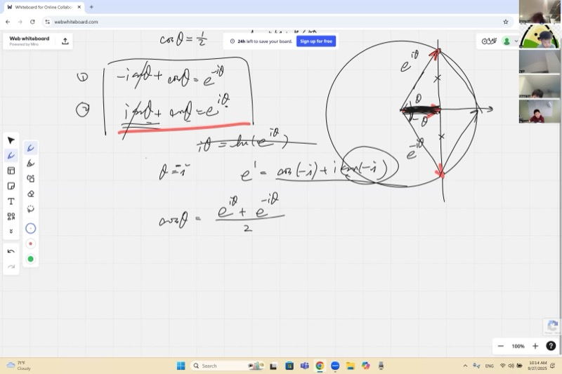
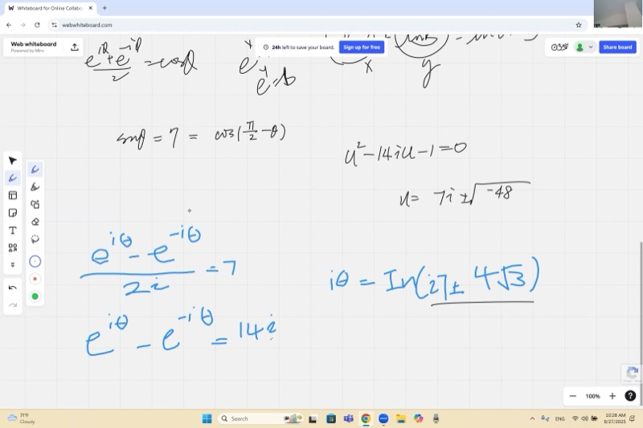
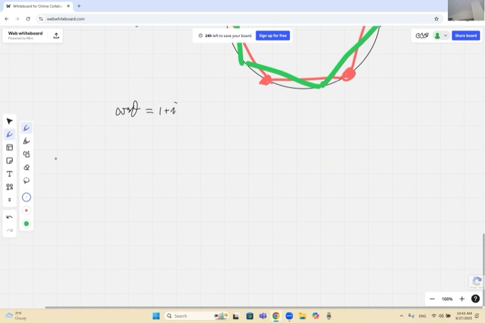
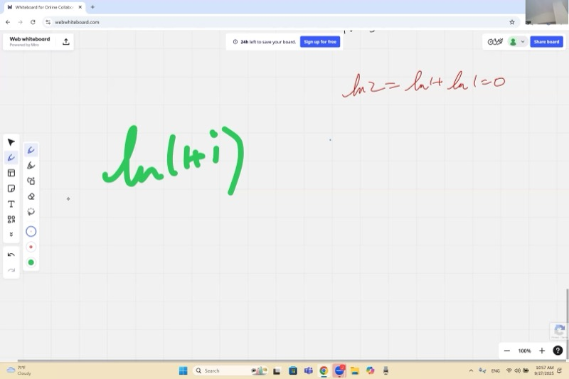

::: {.callout-tip collapse="true"}
## 为什么复数三角学重要

你已经知道 $\cos\theta = \tfrac{1}{2}$ 有无穷多个实数解。但如果有人让你解 $\cos\theta = 2$ 呢？没有任何实角的余弦值大于 1！

事实证明**复数拯救了一切**。通过将欧拉公式 $e^{i\theta} = \cos\theta + i\sin\theta$ 与对数联系起来，我们可以求解"不可能"的三角方程——答案是复角。这与信号处理、量子力学和电气工程中使用的数学是一样的。
:::

## 本课内容

- 用复指数表示 $\cos\theta$ 和 $\sin\theta$
- 当 $a > 1$ 时求解 $\cos\theta = a$ 和 $\sin\theta = a$（复角）
- 复对数与 $\ln i$
- 同终角及其在角度除法中的重要性
- 求解 $\cos(5\theta) = \tfrac{1}{2}$：在单位圆上找到全部 10 个解

## 课程视频

```{=html}
<video controls width="100%" preload="metadata">
  <source src="https://github.com/ymote/learningmathteam/releases/download/v1.0/Saturday20250927morning.mp4" type="video/mp4">
</video>
```

## 课程关键帧









## 预备知识

::: {.callout-note collapse="true"}
## 欧拉公式

欧拉公式将指数函数与三角函数联系起来：

$$e^{i\theta} = \cos\theta + i\sin\theta$$

在单位圆上，复数 $e^{i\theta}$ 是角度为 $\theta$（弧度）的点。其实部是 $\cos\theta$，虚部是 $\sin\theta$。

$e^{i\theta}$ 的**共轭**是 $e^{-i\theta} = \cos\theta - i\sin\theta$。
:::

::: {.callout-note collapse="true"}
## 什么是对数？

对数是指数的**逆运算**。如果 $a^x = b$，则根据定义：

$$x = \log_a b$$

**自然对数** $\ln$ 使用底数 $e \approx 2.718$：

$$e^x = b \quad\Longleftrightarrow\quad x = \ln b$$

关键恒等式：$\ln(ab) = \ln a + \ln b$（指数相加 = 乘幂相乘）。
:::

::: {.callout-note collapse="true"}
## 根式共轭

像 $2 + \sqrt{3}$ 和 $2 - \sqrt{3}$ 这样的两个表达式是**根式共轭**。它们的乘积总是有理数：

$$(2 + \sqrt{3})(2 - \sqrt{3}) = 4 - 3 = 1$$

所以它们互为**倒数**。这个事实在我们证明 $\ln(2+\sqrt{3}) + \ln(2-\sqrt{3}) = 0$ 时至关重要。
:::

## 核心要点

::: {.callout-important}
## 本课核心公式

**余弦和正弦的指数形式：**

$$\cos\theta = \frac{e^{i\theta} + e^{-i\theta}}{2}, \qquad \sin\theta = \frac{e^{i\theta} - e^{-i\theta}}{2i}$$

**$\cos\theta = a$ 的通解：**

$$e^{i\theta} = a \pm \sqrt{a^2 - 1}$$

$$\theta = -i\ln\!\bigl(a \pm \sqrt{a^2 - 1}\bigr) + 2k\pi, \quad k \in \mathbb{Z}$$

**复数 $z = re^{i\phi}$ 的复对数：**

$$\ln z = \ln r + i\phi + 2k\pi i, \quad k \in \mathbb{Z}$$

**同终角很重要：** 当你将 $5\theta = \pm\frac{\pi}{3} + 2k\pi$ 两边除以 5 时，$2k\pi$ 项变为 $\frac{2k\pi}{5}$，产生的不同解**不会**被彼此遮挡。
:::

## 热身：求解 $\cos\theta = \tfrac{1}{2}$（实数情形）

在单位圆上，$\cos\theta$ 是水平坐标。要解 $\cos\theta = \tfrac{1}{2}$，画竖直线 $x = \tfrac{1}{2}$——它在两点与圆相交：

$$\theta = \pm\frac{\pi}{3} + 2k\pi, \quad k \in \mathbb{Z}$$

即 $60°$ 和 $300°$，加上任意整圈旋转。

```{=html}
<div id="desmos-warmup" class="desmos-container"></div>
<script src="https://www.desmos.com/api/v1.9/calculator.js?apiKey=dcb31709b452b1cf9dc26972add0fda6"></script>
<script>
  var calcW = Desmos.GraphingCalculator(document.getElementById('desmos-warmup'), {
    expressions: true,
    settingsMenu: false
  });
  calcW.setExpression({ id: 'circle', latex: 'x^2+y^2=1', color: '#2d70b3' });
  calcW.setExpression({ id: 'vline', latex: 'x=0.5', color: '#c74440', lineStyle: 'DASHED' });
  calcW.setExpression({ id: 'p1', latex: '(0.5, \\sqrt{3}/2)', color: '#388c46', pointSize: 10, label: '60\\degree', showLabel: true });
  calcW.setExpression({ id: 'p2', latex: '(0.5, -\\sqrt{3}/2)', color: '#388c46', pointSize: 10, label: '300\\degree', showLabel: true });
  calcW.setMathBounds({ left: -1.5, right: 1.5, bottom: -1.5, top: 1.5 });
</script>
```

## 推导余弦的指数形式

从欧拉公式及其共轭出发：

$$e^{i\theta} = \cos\theta + i\sin\theta$$
$$e^{-i\theta} = \cos\theta - i\sin\theta$$

**相加**以消去正弦项：

$$e^{i\theta} + e^{-i\theta} = 2\cos\theta$$

::: {.callout-tip collapse="true"}
## 为什么相加可以消去正弦？

单位圆上的两个向量 $e^{i\theta}$ 和 $e^{-i\theta}$ 关于实轴对称。它们有相同的水平分量（$\cos\theta$）但有**相反**的垂直分量（$+i\sin\theta$ 和 $-i\sin\theta$）。相加使实部加倍，虚部归零。
:::

$$\boxed{\cos\theta = \frac{e^{i\theta} + e^{-i\theta}}{2}}$$

类似地，**相减**以分离正弦：

$$e^{i\theta} - e^{-i\theta} = 2i\sin\theta$$

$$\boxed{\sin\theta = \frac{e^{i\theta} - e^{-i\theta}}{2i}}$$

## 求解 $\cos\theta = 2$（复角）

由于没有实角的 $|\cos\theta| > 1$，角度 $\theta$ 必定是**复数**。代入指数形式：

$$\frac{e^{i\theta} + e^{-i\theta}}{2} = 2$$

令 $u = e^{i\theta}$，则 $e^{-i\theta} = \frac{1}{u}$（指数函数永不为零）：

$$u + \frac{1}{u} = 4$$

两边乘以 $u$：

$$u^2 - 4u + 1 = 0$$

::: {.callout-tip collapse="true"}
## 详细解法：二次方程

应用求根公式：

$$u = \frac{4 \pm \sqrt{16 - 4}}{2} = \frac{4 \pm \sqrt{12}}{2} = 2 \pm \sqrt{3}$$

两个解都是正实数。注意它们互为**倒数**：

$$(2+\sqrt{3})(2-\sqrt{3}) = 4 - 3 = 1$$

现在从 $e^{i\theta} = u$ 恢复 $\theta$：

$$i\theta = \ln u \quad\Longrightarrow\quad \theta = \frac{\ln u}{i} = -i\ln u$$

所以：

$$\theta = -i\ln(2+\sqrt{3}) \quad\text{或}\quad \theta = -i\ln(2-\sqrt{3})$$

由于 $\ln(2-\sqrt{3}) = -\ln(2+\sqrt{3})$（它们互为倒数），可以写成：

$$\boxed{\theta = \pm i\ln(2+\sqrt{3}) + 2k\pi, \quad k \in \mathbb{Z}}$$

答案是**纯虚数**（加上实数的同终偏移 $2k\pi$）。
:::

::: {.callout-note collapse="true"}
## 证明：$\ln(2+\sqrt{3})$ 和 $\ln(2-\sqrt{3})$ 互为相反数

由于 $(2+\sqrt{3})(2-\sqrt{3}) = 1$，有 $2-\sqrt{3} = \frac{1}{2+\sqrt{3}}$。

若 $e^x = 2+\sqrt{3}$，则 $e^{-x} = \frac{1}{2+\sqrt{3}} = 2-\sqrt{3}$。

取 $\ln$：$\ln(2-\sqrt{3}) = -x = -\ln(2+\sqrt{3})$。

等价地，利用乘积法则：

$$\ln(2+\sqrt{3}) + \ln(2-\sqrt{3}) = \ln\!\bigl[(2+\sqrt{3})(2-\sqrt{3})\bigr] = \ln 1 = 0 \;\;\checkmark$$
:::

## 通解：$\cos\theta = a$

::: {.callout-important}
## 通解

对于任意实数 $a$（即使 $|a| > 1$）：

$$e^{i\theta} = a \pm \sqrt{a^2 - 1}$$

$$\theta = -i\ln\!\bigl(a \pm \sqrt{a^2-1}\bigr) + 2k\pi$$

- 当 $|a| \le 1$ 时：$a^2 - 1 \le 0$，所以 $\sqrt{a^2-1}$ 是虚数，$\theta$ 结果是**纯实数**（熟悉的实角）。
- 当 $|a| > 1$ 时：$\sqrt{a^2-1}$ 是实数，$\theta$ 是**纯虚数**（加上同终的 $2k\pi$）。
:::

## 求解 $\sin\theta = 7$（复角）

使用正弦的指数形式：

$$\frac{e^{i\theta} - e^{-i\theta}}{2i} = 7$$

令 $u = e^{i\theta}$：

$$u - \frac{1}{u} = 14i$$

乘以 $u$：

$$u^2 - 14iu - 1 = 0$$

::: {.callout-tip collapse="true"}
## 详细解法

$$u = \frac{14i \pm \sqrt{-196 + 4}}{2} = \frac{14i \pm \sqrt{-192}}{2} = \frac{14i \pm 8i\sqrt{3}}{2} = i(7 \pm 4\sqrt{3})$$

所以 $e^{i\theta} = i(7 \pm 4\sqrt{3})$。

要取 $\ln$，用模和辐角改写。由于 $i = e^{i\pi/2}$：

$$e^{i\theta} = (7 \pm 4\sqrt{3})\,e^{i\pi/2}$$

对两边取 $\ln$：

$$i\theta = \ln(7 \pm 4\sqrt{3}) + \frac{\pi}{2}i + 2k\pi i$$

除以 $i$：

$$\theta = \frac{\pi}{2} + 2k\pi \;\pm\; i\ln(7 + 4\sqrt{3})$$

与余弦的情形不同，答案同时有**实部和虚部**。实部 $\frac{\pi}{2}$ 来自 $i$ 的辐角。
:::

## 复对数：$\ln i$ 与 $\ln z$

每个非零复数 $z$ 可以写成极坐标形式 $z = re^{i\phi}$。

$$\ln z = \ln r + i\phi$$

但因为 $e^{i(\phi + 2k\pi)} = e^{i\phi}$ 对任意整数 $k$ 成立，对数有**无穷多个值**：

$$\ln z = \ln r + i(\phi + 2k\pi), \quad k \in \mathbb{Z}$$

::: {.callout-tip collapse="true"}
## 示例：$\ln i$

由于 $i = e^{i\pi/2}$，有 $r = 1$，$\phi = \frac{\pi}{2}$：

$$\ln i = \frac{\pi}{2}i + 2k\pi i, \quad k \in \mathbb{Z}$$

主值（$k=0$ 时）是 $\frac{\pi}{2}i$。

其他值：$\frac{5\pi}{2}i$，$-\frac{3\pi}{2}i$，等等。
:::

::: {.callout-tip collapse="true"}
## 示例：$\ln(1+i)$

将 $1+i$ 写成极坐标形式。模为 $\sqrt{1^2+1^2} = \sqrt{2}$，辐角为 $\frac{\pi}{4}$：

$$1+i = \sqrt{2}\,e^{i\pi/4}$$

因此：

$$\ln(1+i) = \ln\sqrt{2} + \frac{\pi}{4}i + 2k\pi i = \frac{1}{2}\ln 2 + \frac{\pi}{4}i + 2k\pi i$$

**关键技巧：** 在取 $\ln$ 之前，总是先将复数分解为**模**（正实数）和**辐角**（单位复指数）。然后使用 $\ln(r \cdot e^{i\phi}) = \ln r + i\phi$。
:::

## 同终角：为什么它们重要

### 求解 $\cos(5\theta) = \tfrac{1}{2}$

从热身中，我们知道：

$$5\theta = \pm\frac{\pi}{3} + 2k\pi, \quad k \in \mathbb{Z}$$

除以 5：

$$\theta = \pm\frac{\pi}{15} + \frac{2k\pi}{5}$$

周期从 $2\pi$ 缩短到 $\frac{2\pi}{5} = 72°$。这意味着之前"隐藏在彼此后面"的解现在变成了单位圆上的**不同点**。

::: {.callout-tip collapse="true"}
## 找出全部 10 个解

**从 $\theta = \frac{\pi}{15}$（即 $12°$）出发：**

| $k$ | $\theta$ | 角度 |
|---|---|---|
| 0 | $12°$ | $12°$ |
| 1 | $12° + 72°$ | $84°$ |
| 2 | $12° + 144°$ | $156°$ |
| 3 | $12° + 216°$ | $228°$ |
| 4 | $12° + 288°$ | $300°$ |

**从 $\theta = -\frac{\pi}{15}$（即 $-12°$ 或等价地 $348°$）出发：**

| $k$ | $\theta$ | 角度 |
|---|---|---|
| 0 | $-12°$ | $348°$ |
| 1 | $-12° + 72°$ | $60°$ |
| 2 | $-12° + 144°$ | $132°$ |
| 3 | $-12° + 216°$ | $204°$ |
| 4 | $-12° + 288°$ | $276°$ |

这给出单位圆上 **10 个不同的解**。每组 5 个构成一个**正五边形**！
:::

```{=html}
<div id="desmos-coterminal" class="desmos-container"></div>
<script>
  var calcC = Desmos.GraphingCalculator(document.getElementById('desmos-coterminal'), {
    expressions: false,
    settingsMenu: false
  });
  calcC.setExpression({ id: 'circle', latex: 'x^2+y^2=1', color: '#bbbbbb' });
  // Pentagon 1: 12, 84, 156, 228, 300
  calcC.setExpression({ id: 'p1', latex: '(\\cos(12\\cdot\\pi/180), \\sin(12\\cdot\\pi/180))', color: '#2d70b3', pointSize: 9, label: '12\\degree', showLabel: true });
  calcC.setExpression({ id: 'p2', latex: '(\\cos(84\\cdot\\pi/180), \\sin(84\\cdot\\pi/180))', color: '#2d70b3', pointSize: 9, label: '84\\degree', showLabel: true });
  calcC.setExpression({ id: 'p3', latex: '(\\cos(156\\cdot\\pi/180), \\sin(156\\cdot\\pi/180))', color: '#2d70b3', pointSize: 9, label: '156\\degree', showLabel: true });
  calcC.setExpression({ id: 'p4', latex: '(\\cos(228\\cdot\\pi/180), \\sin(228\\cdot\\pi/180))', color: '#2d70b3', pointSize: 9, label: '228\\degree', showLabel: true });
  calcC.setExpression({ id: 'p5', latex: '(\\cos(300\\cdot\\pi/180), \\sin(300\\cdot\\pi/180))', color: '#2d70b3', pointSize: 9, label: '300\\degree', showLabel: true });
  // Pentagon 2: 348, 60, 132, 204, 276
  calcC.setExpression({ id: 'q1', latex: '(\\cos(348\\cdot\\pi/180), \\sin(348\\cdot\\pi/180))', color: '#c74440', pointSize: 9, label: '348\\degree', showLabel: true });
  calcC.setExpression({ id: 'q2', latex: '(\\cos(60\\cdot\\pi/180), \\sin(60\\cdot\\pi/180))', color: '#c74440', pointSize: 9, label: '60\\degree', showLabel: true });
  calcC.setExpression({ id: 'q3', latex: '(\\cos(132\\cdot\\pi/180), \\sin(132\\cdot\\pi/180))', color: '#c74440', pointSize: 9, label: '132\\degree', showLabel: true });
  calcC.setExpression({ id: 'q4', latex: '(\\cos(204\\cdot\\pi/180), \\sin(204\\cdot\\pi/180))', color: '#c74440', pointSize: 9, label: '204\\degree', showLabel: true });
  calcC.setExpression({ id: 'q5', latex: '(\\cos(276\\cdot\\pi/180), \\sin(276\\cdot\\pi/180))', color: '#c74440', pointSize: 9, label: '276\\degree', showLabel: true });
  calcC.setMathBounds({ left: -1.6, right: 1.6, bottom: -1.6, top: 1.6 });
</script>
```

蓝色点和红色点各构成一个正五边形——两个五边形相差 $24°$ 的旋转，给出 10 个近似等距的解。

## 求解 $\cos\theta = 1+i$（复数参数）

通解公式即使当 $a$ 是复数时也适用：

$$e^{i\theta} = (1+i) \pm \sqrt{(1+i)^2 - 1}$$

::: {.callout-tip collapse="true"}
## 设置计算

首先计算 $(1+i)^2 - 1$：

$$(1+i)^2 = 1 + 2i + i^2 = 1 + 2i - 1 = 2i$$

$$\sqrt{(1+i)^2 - 1} = \sqrt{2i}$$

要求 $\sqrt{2i}$，写 $2i = 2e^{i\pi/2}$，所以：

$$\sqrt{2i} = \sqrt{2}\,e^{i\pi/4} = \sqrt{2}\left(\frac{\sqrt{2}}{2} + i\frac{\sqrt{2}}{2}\right) = 1 + i$$

因此：

$$e^{i\theta} = (1+i) \pm (1+i) = \begin{cases} 2+2i \\ 0 \end{cases}$$

由于 $e^{i\theta} \ne 0$，我们只保留 $e^{i\theta} = 2+2i$。

写 $2+2i = 2\sqrt{2}\,e^{i\pi/4}$，则：

$$i\theta = \ln(2\sqrt{2}) + \frac{\pi}{4}i + 2k\pi i$$

$$\theta = \frac{\pi}{4} + 2k\pi - i\ln(2\sqrt{2})$$

**课后作业：** 验证此结果并找到完整的解集（$2i$ 的另一个平方根还有第二个分支）。
:::

## 速查表

::: {.key-formula}
| 公式 | 表达式 |
|---|---|
| 欧拉公式 | $e^{i\theta} = \cos\theta + i\sin\theta$ |
| 余弦（指数形式） | $\cos\theta = \dfrac{e^{i\theta}+e^{-i\theta}}{2}$ |
| 正弦（指数形式） | $\sin\theta = \dfrac{e^{i\theta}-e^{-i\theta}}{2i}$ |
| 求解 $\cos\theta = a$ | $e^{i\theta} = a \pm \sqrt{a^2-1}$，然后 $\theta = -i\ln(\cdots)+2k\pi$ |
| 求解 $\sin\theta = a$ | $e^{i\theta} = ia \pm \sqrt{1-a^2}$，然后 $\theta = -i\ln(\cdots)+2k\pi$ |
| 复对数 | $\ln(re^{i\phi}) = \ln r + i\phi + 2k\pi i$ |
| $\ln i$ | $\dfrac{\pi}{2}i + 2k\pi i$ |
| 倒数的 $\ln$ | $\ln\!\tfrac{1}{b} = -\ln b$ |
| 同终角 | $\theta$ 和 $\theta + 2k\pi$ 表示同一方向 |
| 同终角除法 | $n\theta = \alpha + 2k\pi \;\Rightarrow\; \theta = \frac{\alpha}{n} + \frac{2k\pi}{n}$（每个基本角产生 $n$ 个不同的解） |

### 快速参考：对复数取 $\ln$

1. 写 $z = r\,e^{i\phi}$（模 $r$ 和辐角 $\phi$）。
2. $\ln z = \ln r + i\phi + 2k\pi i$。
3. $\ln r$ 部分处理**大小**；$i\phi$ 部分处理**角度**。
:::
