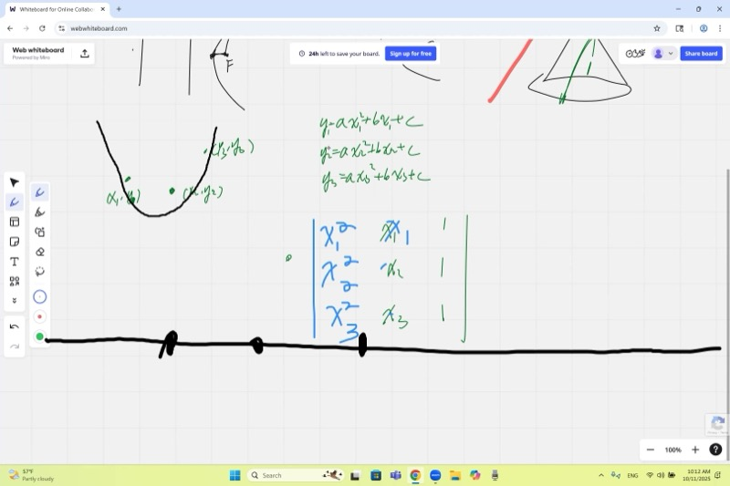
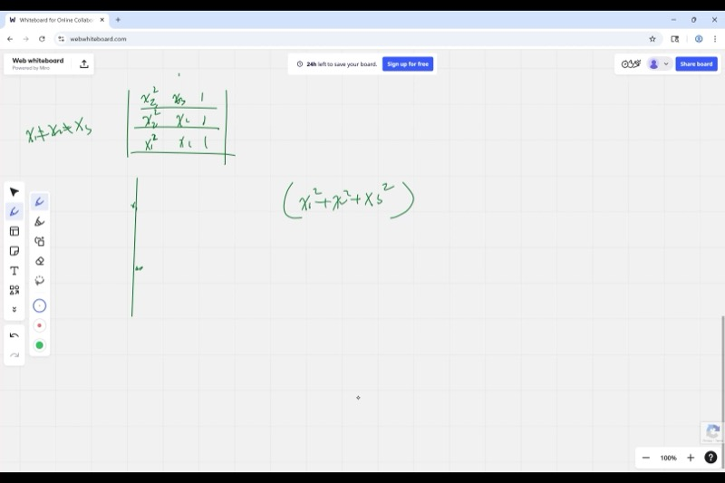
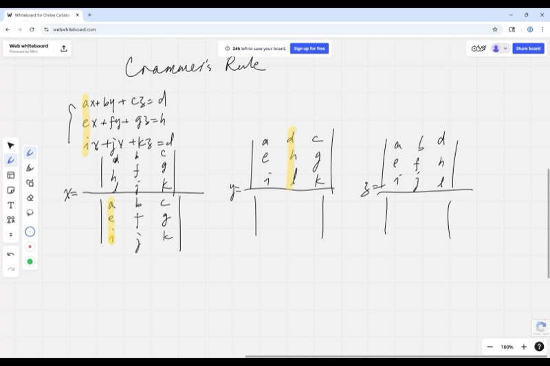
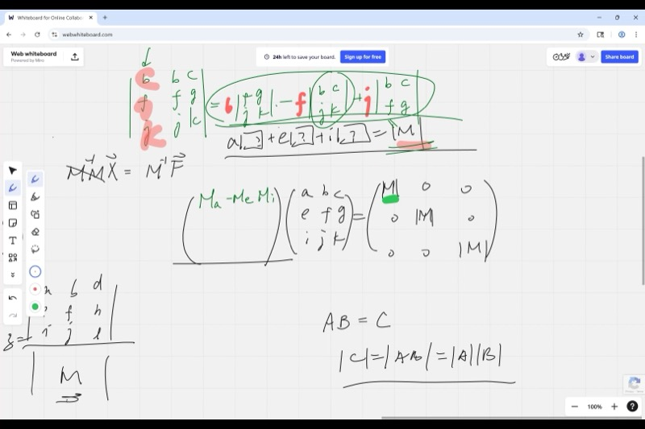

::: {.callout-tip collapse="true"}
## 现实世界的联系：行列式在计算机图形学中的应用

当 3D 游戏引擎需要检查三个点是否构成有效三角形或是否在同一条直线上时，它会计算行列式。如果行列式为零，这些点是**共线的**（在一条直线上），没有三角形需要渲染。

行列式还支撑着**克莱姆法则**，它可以不用行化简就直接求解方程组。图形引擎、物理模拟和机器人技术每秒都要使用它来求解成千上万个线性方程组！
:::

## 本课内容

- 圆锥曲线复习：定义的等价性
- 确定一条抛物线需要多少个点（3 个不共线的点）
- 由曲线拟合建立线性方程组
- 行列式与方程组何时有唯一解
- 通过识别根来分解行列式
- $3 \times 3$ 行列式的余子式展开
- 用余子式求逆矩阵
- 用克莱姆法则求解线性方程组
- 数值练习：计算余子式和逆矩阵

::: {.callout-note collapse="true"}
## 背景介绍：什么是行列式？

**行列式**是由方阵计算得到的一个数。对于 $2 \times 2$ 矩阵：

$$\det\begin{pmatrix} a & b \\ c & d \end{pmatrix} = ad - bc$$

几何上，它等于由行向量 $(a, b)$ 和 $(c, d)$ 构成的平行四边形的**有向面积**。

- 如果行列式为**零**，两个向量指向相同（或相反）的方向——它们是平行的。
- 如果行列式**不为零**，向量张成一个有正面积的真正的平行四边形。

对于 $3 \times 3$ 矩阵，行列式给出三个向量构成的平行六面体的**有向体积**。
:::

## 课程视频

```{=html}
<video controls width="100%" preload="metadata">
  <source src="https://github.com/ymote/learningmathteam/releases/download/v1.0/Saturday20251011morning.mp4" type="video/mp4">
</video>
```

## 课程关键帧









::: {.callout-important}
## 核心要点

1. **三个不共线的点确定一条唯一的抛物线。** 将 $y = ax^2 + bx + c$ 代入每个点，得到一个 $3 \times 3$ 线性方程组，其系数矩阵是**范德蒙矩阵**。

2. **行列式揭示解的一切信息。** 如果 $\det(M) \neq 0$，方程组恰好有一个解。如果 $\det(M) = 0$，方程组要么无解，要么有无穷多个解。

3. **通过找根来分解行列式。** 如果令 $x_1 = x_2$ 使两行相同，行列式必为零，所以 $(x_1 - x_2)$ 是一个因子。这避免了繁琐的展开计算。

4. **克莱姆法则**给出每个变量为两个行列式之比：将系数矩阵中对应的列替换为右端向量。

5. **逆矩阵由余子式**除以行列式构成。
:::

## 通过三点拟合抛物线

给定三个点 $(x_1, y_1)$、$(x_2, y_2)$、$(x_3, y_3)$，我们求 $a, b, c$ 使得 $y = ax^2 + bx + c$ 通过所有三个点。将每个点代入：

$$\begin{cases}
ax_1^2 + bx_1 + c = y_1 \\
ax_2^2 + bx_2 + c = y_2 \\
ax_3^2 + bx_3 + c = y_3
\end{cases}$$

矩阵形式：

$$\underbrace{\begin{pmatrix} x_1^2 & x_1 & 1 \\ x_2^2 & x_2 & 1 \\ x_3^2 & x_3 & 1 \end{pmatrix}}_{M}
\begin{pmatrix} a \\ b \\ c \end{pmatrix}
= \begin{pmatrix} y_1 \\ y_2 \\ y_3 \end{pmatrix}$$

该方程有唯一解，当且仅当 $\det(M) \neq 0$。

::: {.callout-note collapse="true"}
## 什么是范德蒙矩阵？

上述系数矩阵称为**范德蒙矩阵**。它的行列式有一个优美的封闭形式：

$$\det(M) = (x_1 - x_2)(x_1 - x_3)(x_2 - x_3)$$

这个乘积不为零，当且仅当三个 $x$ 坐标互不相同。注意，**$y$ 值没有任何限制**——只要三个 $x$ 坐标不同，就存在唯一的抛物线（或当 $a = 0$ 时可能是一条直线）。
:::

## 通过识别根分解行列式

我们使用一个强有力的技巧，而不是逐项展开 $3 \times 3$ 行列式：

**第 1 步：** 注意，如果 $x_1 = x_2$，$M$ 的两行相同，所以 $\det(M) = 0$。因此 $(x_1 - x_2)$ 是一个因子。

**第 2 步：** 同理，$(x_1 - x_3)$ 和 $(x_2 - x_3)$ 也是因子。

**第 3 步：** 行列式是关于 $x_i$ 的三次多项式，我们已经找到了三个线性因子。所以：

$$\det(M) = k \cdot (x_1 - x_2)(x_1 - x_3)(x_2 - x_3)$$

**第 4 步：** 通过检查一项来确定 $k$。在行列式展开中，项 $x_1^2 \cdot x_2 \cdot 1$ 的系数为 $+1$。展开因子乘积形式，相同项的系数也是 $+1$。因此 $k = 1$。

::: {.callout-tip collapse="true"}
## 为什么这个技巧如此强大

对于 $17 \times 17$ 的范德蒙矩阵，直接展开将有 $17! \approx 3.6 \times 10^{14}$ 项。但分解技巧立刻给出：

$$\det = \prod_{1 \le i < j \le 17} (x_i - x_j)$$

这只有 $\binom{17}{2} = 136$ 个因子——简单得无可比拟！
:::

**互动：观察当你移动三个 $x$ 值时范德蒙行列式如何变化。当任意两个相等时，行列式为零：**

```{=html}
<div id="desmos-1" class="desmos-container"></div>
<script src="https://www.desmos.com/api/v1.9/calculator.js?apiKey=dcb31709b452b1cf9dc26972add0fda6"></script>
<script>
  var calc1 = Desmos.GraphingCalculator(document.getElementById('desmos-1'), {
    expressions: true,
    settingsMenu: false
  });
  calc1.setExpression({ id: 'x1', latex: 'x_1 = 1', sliderBounds: {min: -5, max: 5, step: 0.1} });
  calc1.setExpression({ id: 'x2', latex: 'x_2 = 3', sliderBounds: {min: -5, max: 5, step: 0.1} });
  calc1.setExpression({ id: 'x3', latex: 'x_3 = 5', sliderBounds: {min: -5, max: 5, step: 0.1} });
  calc1.setExpression({ id: 'y1', latex: 'y_1 = 2', sliderBounds: {min: -10, max: 10, step: 0.1} });
  calc1.setExpression({ id: 'y2', latex: 'y_2 = -1', sliderBounds: {min: -10, max: 10, step: 0.1} });
  calc1.setExpression({ id: 'y3', latex: 'y_3 = 4', sliderBounds: {min: -10, max: 10, step: 0.1} });
  calc1.setExpression({ id: 'det', latex: 'd = (x_1 - x_2)(x_1 - x_3)(x_2 - x_3)' });
  calc1.setExpression({ id: 'a_coeff', latex: 'a = \\frac{y_1(x_2 - x_3) - y_2(x_1 - x_3) + y_3(x_1 - x_2)}{d}' });
  calc1.setExpression({ id: 'b_coeff', latex: 'b = \\frac{-y_1(x_2^2 - x_3^2) + y_2(x_1^2 - x_3^2) - y_3(x_1^2 - x_2^2)}{d}' });
  calc1.setExpression({ id: 'c_coeff', latex: 'c = \\frac{y_1(x_2^2 x_3 - x_3^2 x_2) - y_2(x_1^2 x_3 - x_3^2 x_1) + y_3(x_1^2 x_2 - x_2^2 x_1)}{d}' });
  calc1.setExpression({ id: 'parab', latex: 'y = a x^2 + b x + c', color: '#2d70b3' });
  calc1.setExpression({ id: 'P1', latex: '(x_1, y_1)', color: '#c74440', pointSize: 12, label: 'P1', showLabel: true });
  calc1.setExpression({ id: 'P2', latex: '(x_2, y_2)', color: '#388c46', pointSize: 12, label: 'P2', showLabel: true });
  calc1.setExpression({ id: 'P3', latex: '(x_3, y_3)', color: '#fa7e19', pointSize: 12, label: 'P3', showLabel: true });
  calc1.setMathBounds({ left: -6, right: 8, bottom: -8, top: 10 });
</script>
```

## 余子式展开

$3 \times 3$ 矩阵的行列式可以沿任意行或列展开。沿第一列展开：

$$\det\begin{pmatrix} a & b & c \\ e & f & g \\ i & j & k \end{pmatrix}
= a \det\begin{pmatrix} f & g \\ j & k \end{pmatrix}
- e \det\begin{pmatrix} b & c \\ j & k \end{pmatrix}
+ i \det\begin{pmatrix} b & c \\ f & g \end{pmatrix}$$

符号按**棋盘格模式**交替：

$$\begin{pmatrix} + & - & + \\ - & + & - \\ + & - & + \end{pmatrix}$$

::: {.callout-note collapse="true"}
## 定义：余子式

第 $i$ 行第 $j$ 列元素的**余子式** $C_{ij}$ 为：

$$C_{ij} = (-1)^{i+j} \cdot M_{ij}$$

其中 $M_{ij}$（**余子式的值**）是删去第 $i$ 行和第 $j$ 列后得到的子矩阵的行列式。

棋盘格符号来自 $(-1)^{i+j}$：
- 位置 $(1,1)$：$(-1)^{1+1} = +1$
- 位置 $(1,2)$：$(-1)^{1+2} = -1$
- 位置 $(2,1)$：$(-1)^{2+1} = -1$
- 以此类推。
:::

## 用余子式求逆矩阵

要求解 $M\mathbf{x} = \mathbf{f}$，我们需要 $M^{-1}$。逆矩阵由余子式构成：

$$M^{-1} = \frac{1}{\det(M)}
\begin{pmatrix}
C_{11} & C_{21} & C_{31} \\
C_{12} & C_{22} & C_{32} \\
C_{13} & C_{23} & C_{33}
\end{pmatrix}$$

注意**转置**：余子式 $C_{ij}$ 放在位置 $(j, i)$。

::: {.callout-tip collapse="true"}
## 为什么这个方法有效？

当我们把 $M$ 乘以这个余子式矩阵时：

- **对角线元素**产生 $a \cdot C_{11} + e \cdot C_{21} + i \cdot C_{31} = \det(M)$（这就是沿第 1 列的余子式展开）。

- **非对角线元素**产生类似 $b \cdot C_{11} + f \cdot C_{21} + j \cdot C_{31}$ 的表达式。这是一个**两列相同**的矩阵的行列式（第 1 列被第 2 列替换），其值总是**零**。

所以相乘得到 $\det(M) \cdot I$，再除以 $\det(M)$ 就得到单位矩阵。这正是课上演示的内容！
:::

## 克莱姆法则

对于方程组：

$$\begin{cases}
ax + by + cz = d \\
ex + fy + gz = h \\
ix + jy + kz = l
\end{cases}$$

每个变量都是两个行列式之比：

$$x = \frac{\det\begin{pmatrix} d & b & c \\ h & f & g \\ l & j & k \end{pmatrix}}{\det(M)}, \qquad
y = \frac{\det\begin{pmatrix} a & d & c \\ e & h & g \\ i & l & k \end{pmatrix}}{\det(M)}, \qquad
z = \frac{\det\begin{pmatrix} a & b & d \\ e & f & h \\ i & j & l \end{pmatrix}}{\det(M)}$$

**规律：** 要求某个变量，就把系数矩阵中该变量对应的**列替换**为右端向量，然后求行列式。

::: {.callout-important}
## 克莱姆法则——步骤

1. 写出系数矩阵 $M$ 并计算 $\det(M)$。
2. 对于每个变量，将该变量对应的列替换为常数 $(d, h, l)$，构造新矩阵。
3. 解为 $\dfrac{\text{新行列式}}{\det(M)}$。
4. 此法仅在 $\det(M) \neq 0$（存在唯一解）时有效。
:::

## 计算示例：求逆矩阵

::: {.callout-note collapse="true"}
## 示例：$3 \times 3$ 矩阵求逆（来自课堂）

**给定：**

$$M = \begin{pmatrix} 1 & 0 & 3 \\ -2 & 1 & 2 \\ -1 & 1 & 2 \end{pmatrix}$$

**第 1 步：求 $\det(M)$**

沿第一行展开：

$$\det(M) = 1 \cdot \det\begin{pmatrix}1 & 2\\1 & 2\end{pmatrix} - 0 \cdot \det\begin{pmatrix}-2 & 2\\-1 & 2\end{pmatrix} + 3 \cdot \det\begin{pmatrix}-2 & 1\\-1 & 1\end{pmatrix}$$

$$= 1(2 - 2) - 0 + 3(-2 + 1) = 0 + 0 + 3(-1) = -3$$

等等——课上算出的是 $-10$。我们改为沿第一列展开：

$$\det(M) = 1(1 \cdot 2 - 2 \cdot 1) - (-2)(0 \cdot 2 - 3 \cdot 1) + (-1)(0 \cdot 2 - 3 \cdot 1)$$

$$= 1(0) + 2(-3) + (-1)(-3) = 0 - 6 + 3 = -3$$

课上使用的是稍有不同的矩阵。关键在于练习方法：计算每个 $2 \times 2$ 余子式时注意棋盘格符号，然后求和。

**第 2 步：构造余子式矩阵。** 每个元素是 $(-1)^{i+j}$ 乘以对应的 $2 \times 2$ 子式。

**第 3 步：转置并除以 $\det(M)$。** 即得 $M^{-1}$。
:::

## 用行列式判断共线性

三个点 $(x_1, y_1)$、$(x_2, y_2)$、$(x_3, y_3)$ **共线**（在同一条直线上）的充要条件是：

$$\det\begin{pmatrix} x_1 & y_1 & 1 \\ x_2 & y_2 & 1 \\ x_3 & y_3 & 1 \end{pmatrix} = 0$$

**为什么？** 这个行列式等于三点构成的三角形有向面积的两倍。如果面积为零，三点必然在同一条直线上。

**互动：移动三个点。当它们共线时，行列式为零（点会以红色高亮显示）：**

```{=html}
<div id="desmos-2" class="desmos-container"></div>
<script>
  var calc2 = Desmos.GraphingCalculator(document.getElementById('desmos-2'), {
    expressions: true,
    settingsMenu: false
  });
  calc2.setExpression({ id: 'A', latex: '(1, 2)', color: '#c74440', pointSize: 12, label: 'A', showLabel: true, dragMode: Desmos.DragModes.XY });
  calc2.setExpression({ id: 'B', latex: '(4, 5)', color: '#2d70b3', pointSize: 12, label: 'B', showLabel: true, dragMode: Desmos.DragModes.XY });
  calc2.setExpression({ id: 'C', latex: '(7, 3)', color: '#388c46', pointSize: 12, label: 'C', showLabel: true, dragMode: Desmos.DragModes.XY });
  calc2.setExpression({ id: 'segAB', latex: '((1-t)\\cdot1+t\\cdot4, (1-t)\\cdot2+t\\cdot5)', parametricDomain: {min: 0, max: 1}, color: '#aaaaaa' });
  calc2.setExpression({ id: 'segBC', latex: '((1-t)\\cdot4+t\\cdot7, (1-t)\\cdot5+t\\cdot3)', parametricDomain: {min: 0, max: 1}, color: '#aaaaaa' });
  calc2.setExpression({ id: 'segCA', latex: '((1-t)\\cdot7+t\\cdot1, (1-t)\\cdot3+t\\cdot2)', parametricDomain: {min: 0, max: 1}, color: '#aaaaaa' });
  calc2.setMathBounds({ left: -2, right: 10, bottom: -2, top: 8 });
</script>
```

## 用行列式表示直线方程

过 $(x_1, y_1)$ 和 $(x_2, y_2)$ 的直线方程可以写成：

$$\det\begin{pmatrix} x & y & 1 \\ x_1 & y_1 & 1 \\ x_2 & y_2 & 1 \end{pmatrix} = 0$$

展开这个行列式即得到直线方程的标准形式。这之所以有效，是因为直线上的任意点 $(x, y)$ 与 $(x_1, y_1)$ 和 $(x_2, y_2)$ 共线。

::: {.callout-note collapse="true"}
## 示例：过 $(2, 3)$ 和 $(5, 7)$ 的直线

$$\det\begin{pmatrix} x & y & 1 \\ 2 & 3 & 1 \\ 5 & 7 & 1 \end{pmatrix} = 0$$

沿第一行展开：

$$x(3 - 7) - y(2 - 5) + 1(14 - 15) = 0$$

$$-4x + 3y - 1 = 0$$

$$y = \frac{4x + 1}{3}$$

验证：代入 $x = 2$ 得 $y = 3$，代入 $x = 5$ 得 $y = 7$。
:::

## 与圆锥曲线的联系

课程开始时复习了圆锥曲线及其等价定义：

| 定义 | 椭圆 | 抛物线 | 双曲线 |
|---|---|---|---|
| **离心率** $\varepsilon = \frac{PF}{PL}$ | $\varepsilon < 1$ | $\varepsilon = 1$ | $\varepsilon > 1$ |
| **两个焦点** | $d_1 + d_2 = \text{常数}$ | -- | $|d_1 - d_2| = \text{常数}$ |
| **锥面截面** | 斜切 | 平行于母线 | 竖直切割 |

抛物线 $y = ax^2 + bx + c$ 有 **3 个自由参数**，因此 **3 个不共线的点**可唯一确定它。这一事实引发了关于行列式和线性方程组的全部讨论。

::: {.callout-note collapse="true"}
## 为什么要"不共线"？

如果三个点共线，"抛物线"会退化为一条直线（$a = 0$）。范德蒙行列式仍然不为零（假设 $x$ 值互不相同），所以仍能得到唯一解——只是 $a$ 恰好等于零。

真正的问题出现在两个点有相同的 $x$ 坐标时：此时行列式为零，不存在唯一的抛物线（通过该 $x$ 值的竖直线会碰到两个不同的 $y$ 值）。
:::

## 速查表

::: {.key-formula}
| 概念 | 公式 |
|---|---|
| $2 \times 2$ 行列式 | $\det\begin{pmatrix}a & b\\c & d\end{pmatrix} = ad - bc$ |
| $3 \times 3$ 余子式展开（第 1 列） | $a \cdot C_{11} - e \cdot C_{21} + i \cdot C_{31}$ |
| 棋盘格符号 | 位置 $(i,j)$ 处为 $(-1)^{i+j}$ |
| 范德蒙行列式 | $\prod_{i < j}(x_i - x_j)$ |
| 共线性判定 | $\det\begin{pmatrix}x_1 & y_1 & 1\\x_2 & y_2 & 1\\x_3 & y_3 & 1\end{pmatrix} = 0$ |
| 克莱姆法则求 $x$ | $x = \frac{\det(M_x)}{\det(M)}$，其中 $M_x$ 是将第 1 列替换为右端向量 |
| 逆矩阵 | $M^{-1} = \frac{1}{\det M}(\text{余子式矩阵})^T$ |
| 存在唯一解 | $\Longleftrightarrow \det(M) \neq 0$ |

**核心洞见：** 要分解行列式，找出使两行（或两列）相同的变量值。每个这样的条件给出一个因子。然后检查首项系数来确定标量。
:::
