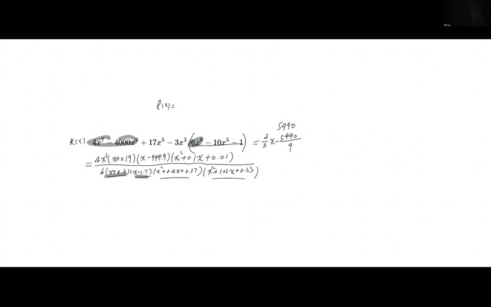
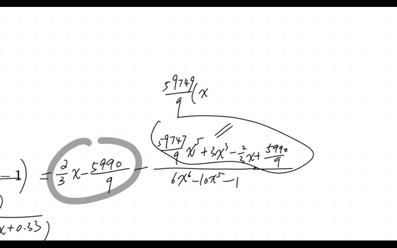
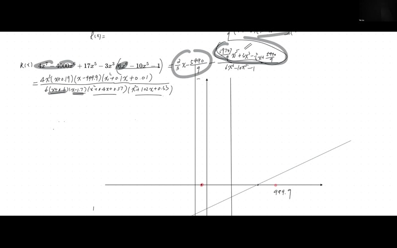
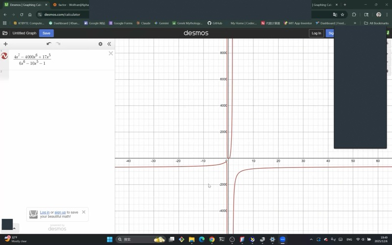

::: {.callout-tip collapse="true"}
## 为什么要学会手绘有理函数图像？

图形计算器可以立即绘制任何函数，但它们常常会误导你。陡峭的垂直渐近线可能看起来像一条竖直线。两个靠近的根可能看起来像一个。一条几乎穿过渐近线的曲线在屏幕上可能不可见。

当你手绘图像时，你会理解曲线**为什么**会这样弯曲。你学会仅从方程就能预测行为——这在微积分、物理学和工程学中非常有用，因为你需要分析计算器无法完美处理的函数。
:::

## 涵盖的主题

- 有理函数的多项式长除法
- 斜（倾斜）渐近线与水平渐近线
- 分解分子和分母以找到截距和渐近线
- 使用韦达定理从共轭复数根重构二次方程
- 画任意有理函数图像的完整分步方法
- 根的重数与曲线穿越行为

## 课程视频

```{=html}
<video controls width="100%" preload="metadata">
  <source src="https://github.com/ymote/learningmathteam/releases/download/v1.0/Saturday20251206afternoon.mp4" type="video/mp4">
</video>
```

## 课程关键帧









::: {.callout-important}
## 核心要点

1. 对 $R(x) = \frac{P(x)}{Q(x)}$ 进行**长除法**，将函数分解为**多项式部分**加上一个在无穷远处趋近于零的**真分式余数**。

2. 多项式部分就是**渐近曲线**（线性时为斜渐近线，二次时为抛物线渐近线，等等）。

3. **垂直渐近线**来自分母 $Q(x)$ 的实数根。

4. 曲线与斜渐近线的交点在**余数的分子**等于零的地方。

5. **重数很重要**：奇数重数的根导致符号变化（曲线穿过）；偶数重数的根导致弹回（曲线触碰后折返）。

6. 始终检查**端部行为**以确定曲线在 $\pm\infty$ 处是在渐近线上方还是下方。
:::

## 背景介绍：有理函数与渐近线

**有理函数**是两个多项式的比：

$$R(x) = \frac{P(x)}{Q(x)}$$

其中 $P(x)$ 的次数为 $n$，$Q(x)$ 的次数为 $m$。$n$ 和 $m$ 的关系决定了大尺度行为：

| 次数比较 | 渐近线类型 | 如何求 |
|---|---|---|
| $n < m$ | 水平：$y = 0$ | 自动成立 |
| $n = m$ | 水平：$y = \dfrac{a_n}{b_m}$ | 首项系数之比 |
| $n = m + 1$ | **斜（倾斜）直线** | 多项式长除法 |
| $n > m + 1$ | 多项式曲线 | 多项式长除法 |

在本课中，我们处理 $n = m + 1$ 的情况，产生**斜渐近线**。

## 所研究的有理函数

本课分析的具体函数是：

$$R(x) = \frac{4x^7 - 4000x^6 + \cdots}{6x^6 - 10x - 1}$$

分子次数为7，分母次数为6，所以 $n = m + 1$，保证存在斜渐近线。

::: {.callout-note collapse="true"}
## 第1步：分解分母（求垂直渐近线）

分母是一个6次多项式——一般情况下无法手工分解。使用Desmos或图形计算器，我们找到：

- **两个实数根**：$x \approx -0.6$ 和 $x \approx 1.7$
- **两对共轭复数根**（不产生垂直渐近线）

分母的因式分解形式：

$$Q(x) = 6(x + 0.6)(x - 1.7)(x^2 + 0.41x + 0.37)(x^2 + 1.02x + 0.33)$$

两个不可分解的二次因式的判别式为负（$b^2 - 4ac < 0$），确认它们的根是复数。它们**不**产生垂直渐近线。

**垂直渐近线**：$x = -0.6$ 和 $x = 1.7$
:::

::: {.callout-note collapse="true"}
## 第2步：分解分子（求x轴截距）

提取首项系数和公因子幂次：

$$P(x) = 4x^3(x + 0.09)(x - 999.9)(x^2 - 0.1x + 0.01)$$

由此得到x轴截距：

| 根 | 重数 | 行为 |
|---|---|---|
| $x = 0$ | 3（三重，奇数） | 曲线**穿过** x轴 |
| $x \approx -0.09$ | 1（单根，奇数） | 曲线**穿过** x轴 |
| $x \approx 999.9$ | 1（单根，奇数） | 曲线**穿过** x轴 |

剩余的二次因式 $x^2 - 0.1x + 0.01$ 的判别式为负，所以没有实数根，不贡献x轴截距。
:::

## 第3步：多项式长除法

::: {.callout-note collapse="true"}
## 回顾：多项式长除法的原理

将 $P(x)$ 除以 $Q(x)$：

1. 将被除式的首项与除式的首项匹配。
2. 将整个除式乘以该比率并相减。
3. 重复直到余数的次数小于除式的次数。

结果：

$$R(x) = \underbrace{\text{商}}_{\text{多项式部分}} + \frac{\text{余数}}{Q(x)}$$

多项式部分就是渐近曲线。真分式当 $x \to \pm\infty$ 时趋向零。
:::

对我们的函数进行长除法：

$$R(x) = \frac{2}{3}x - \frac{5990}{9} + \frac{\text{余数}}{Q(x)}$$

**斜渐近线**为：

$$y = \frac{2}{3}x - \frac{5990}{9} \approx 0.667x - 665.6$$

::: {.callout-tip collapse="true"}
## 详解示例：长除法的第一步

我们要将 $4x^7 - 4000x^6 + \cdots$ 除以 $6x^6 - 10x - 1$。

**第1步**：如果可能，提取公因数（系数除以2）：

$$\frac{2x^7 - 2000x^6 + \cdots}{3x^6 - 5x - \tfrac{1}{2}}$$

**第2步**：匹配首项：$\dfrac{2x^7}{3x^6} = \dfrac{2}{3}x$

**第3步**：将除式乘以 $\dfrac{2}{3}x$ 并从被除式中减去。

**第4步**：商的下一项来自新的首项除以 $3x^6$，得到常数 $-\dfrac{5990}{9}$。

**第5步**：余数是一个5次多项式（次数小于6），除法结束。
:::

## 第4步：分解余数的分子

长除法后的余数有一个5次分子。令其等于零，可以告诉我们 $R(x)$ 在哪里**穿过**斜渐近线。

使用Desmos求余数分子的根：

- **一个实数根**：$x \approx -0.6$
- **两对共轭复数根**：$x \approx -0.2 \pm 0.6i$ 和 $x \approx 0.5 \pm 0.4i$

::: {.callout-note collapse="true"}
## 从复数根重构二次方程（韦达定理）

给定一对共轭复数根 $x = \alpha \pm \beta i$，对应的二次因式为：

$$x^2 - (\text{根之和})\,x + (\text{根之积})$$

**和**：$(\alpha + \beta i) + (\alpha - \beta i) = 2\alpha$

**积**：$(\alpha + \beta i)(\alpha - \beta i) = \alpha^2 + \beta^2$

所以二次因式为：

$$x^2 - 2\alpha\, x + (\alpha^2 + \beta^2)$$

**例子**：对于根 $-0.2 \pm 0.6i$：

- 和 $= -0.4$，所以 $-a = -0.4 \Rightarrow a = 0.4$
- 积 $= (-0.2)^2 + (0.6)^2 = 0.04 + 0.36 = 0.40$

二次因式：$x^2 + 0.4x + 0.40$

**例子**：对于根 $0.5 \pm 0.4i$：

- 和 $= 1.0$，所以 $-a = 1.0 \Rightarrow a = -1.0$
- 积 $= 0.25 + 0.16 = 0.41$

二次因式：$x^2 - 1.0x + 0.41$
:::

由于余数的唯一实数根是 $x \approx -0.6$，曲线与斜渐近线在**一个点**相交，非常接近 $x = -0.6$ 处的垂直渐近线。这在该渐近线附近产生了一个非常紧凑的转弯。

## 第5步：完整的作图步骤

::: {.callout-important}
## 画 $R(x) = \frac{P(x)}{Q(x)}$ 图像的总体方法

**第一阶段——大尺度结构**

1. 进行**多项式长除法**得到渐近曲线（斜渐近线、水平渐近线或多项式曲线）。
2. 从 $Q(x)$ 的实数根找到**垂直渐近线**。

**第二阶段——关键点**

3. 从 $P(x)$ 的实数根找到所有**x轴截距**。注意每个根的**重数**（奇数 = 穿过，偶数 = 弹回）。
4. 计算 $R(0)$ 求**y轴截距**。
5. 令余数的分子等于零，求**与渐近线的交点**。

**第三阶段——描绘曲线**

6. 通过检查余数的符号，确定曲线在 $x \to +\infty$ 时从渐近线的**上方还是下方**开始。
7. 从右侧开始，通过所有关键点描绘曲线，注意：
   - 每个根处的重数（穿过还是弹回）
   - 垂直渐近线处的行为（奇数重数时符号变化）
   - 曲线**不能穿过** x轴或渐近线，除非在已确定的点处
:::

## 描绘曲线

**从 $x \to +\infty$ 开始：**

余数的首项系数为负（被减去），对于大的正 $x$，奇数次分子为正而分母为正。总体余数为**负**，所以曲线从斜渐近线的**下方**开始。

::: {.callout-note collapse="true"}
## 为什么在 $+\infty$ 处是"下方"？

真分式部分为：

$$-\frac{\text{（首项系数为正的5次多项式）}}{Q(x)}$$

对于大的正 $x$：分子为大正数，分母为大正数，但负号使整体为**负**。所以 $R(x)$ 略**小于**斜渐近线的值——曲线在**下方**。
:::

**从右到左描绘：**

1. 从 $x \to +\infty$ 处斜渐近线下方开始。
2. 曲线必须在 $x \approx 999.9$ 处遇到x轴截距（单根——穿过）。
3. 当 $x$ 从右侧接近垂直渐近线 $x = 1.7$ 时，曲线下降到 $-\infty$。
4. 从 $x = 1.7$ 另一侧出来（分母中的单根——符号变化），曲线从 $+\infty$ 出现。
5. 曲线必须在 $x \approx -0.6$ 处穿过渐近线（单一交点），从上方切换到下方。
6. 它经过 $x = 0$ 附近的x轴截距（三重根）和 $x \approx -0.09$（单根）。
7. 在 $x = -0.6$（垂直渐近线）附近，曲线急剧下降。
8. 在最左侧，曲线重新出现，当 $x \to -\infty$ 时必须在斜渐近线**上方**结束。

**检查 $x \to -\infty$ 处的行为：**

对于大的负 $x$：余数的奇数次分子变为负数，分母保持正数（偶数次主导项），但总体负号使余数为**正**。所以曲线在渐近线**上方**。这与我们的描绘一致。

## 交互式探索

**探索一个带斜渐近线的简单有理函数：**

```{=html}
<div id="desmos-1" class="desmos-container"></div>
<script src="https://www.desmos.com/api/v1.9/calculator.js?apiKey=dcb31709b452b1cf9dc26972add0fda6"></script>
<script>
  var calc1 = Desmos.GraphingCalculator(document.getElementById('desmos-1'), {
    expressions: true,
    settingsMenu: false
  });
  calc1.setExpression({ id: 'func', latex: 'y=\\frac{x^2 - 1}{x - 2}', color: '#2d70b3' });
  calc1.setExpression({ id: 'asymp', latex: 'y=x+2', color: '#c74440', lineStyle: 'DASHED', lineWidth: 1.5 });
  calc1.setExpression({ id: 'va', latex: 'x=2', color: '#fa7e19', lineStyle: 'DASHED', lineWidth: 1.5 });
  calc1.setExpression({ id: 'z1', latex: '(1, 0)', color: '#388c46', pointSize: 8, label: 'x=1', showLabel: true });
  calc1.setExpression({ id: 'z2', latex: '(-1, 0)', color: '#388c46', pointSize: 8, label: 'x=-1', showLabel: true });
  calc1.setMathBounds({ left: -8, right: 10, bottom: -15, top: 20 });
</script>
```

这里 $R(x) = \dfrac{x^2 - 1}{x - 2}$。长除法得到 $R(x) = x + 2 + \dfrac{3}{x-2}$，所以斜渐近线为 $y = x + 2$。注意曲线在两端如何趋近虚线。

::: {.callout-tip collapse="true"}
## 自己试试：验证除法

对 $\dfrac{x^2 - 1}{x - 2}$ 进行长除法：

1. $\dfrac{x^2}{x} = x$。回乘：$x(x-2) = x^2 - 2x$。相减：$(x^2 - 1) - (x^2 - 2x) = 2x - 1$。

2. $\dfrac{2x}{x} = 2$。回乘：$2(x-2) = 2x - 4$。相减：$(2x-1) - (2x-4) = 3$。

结果：$x + 2 + \dfrac{3}{x-2}$。

余数 $3$ 永远不为零，所以这条曲线**永远不会**穿过它的斜渐近线！
:::

**探索：根的重数对穿越行为的影响：**

```{=html}
<div id="desmos-2" class="desmos-container"></div>
<script>
  var calc2 = Desmos.GraphingCalculator(document.getElementById('desmos-2'), {
    expressions: true,
    settingsMenu: false
  });
  calc2.setExpression({ id: 'f1', latex: 'y=\\frac{x(x-2)}{(x+1)(x-3)}', color: '#2d70b3', label: 'simple roots', showLabel: true });
  calc2.setExpression({ id: 'f2', latex: 'y=\\frac{x^2(x-2)}{(x+1)^2(x-3)}', color: '#6042a6', label: 'double root at x=0', showLabel: true });
  calc2.setExpression({ id: 'va1', latex: 'x=-1', color: '#fa7e19', lineStyle: 'DASHED', lineWidth: 1 });
  calc2.setExpression({ id: 'va2', latex: 'x=3', color: '#fa7e19', lineStyle: 'DASHED', lineWidth: 1 });
  calc2.setExpression({ id: 'ha', latex: 'y=1', color: '#c74440', lineStyle: 'DASHED', lineWidth: 1 });
  calc2.setMathBounds({ left: -6, right: 8, bottom: -15, top: 15 });
</script>
```

比较蓝色曲线（单根——穿过x轴）和紫色曲线（$x=0$ 处的二重根——在x轴处弹回而不穿过）。

## 特殊情况：渐近线分类

::: {.callout-note collapse="true"}
## 所有渐近线类型总结

设 $R(x) = \dfrac{P(x)}{Q(x)}$，其中 $\deg(P) = n$，$\deg(Q) = m$。

| 条件 | 渐近线 | 方法 |
|---|---|---|
| $n < m$ | 水平：$y = 0$ | 直接观察 |
| $n = m$ | 水平：$y = \dfrac{a_n}{b_m}$ | 首项系数之比 |
| $n = m + 1$ | 斜直线：$y = cx + d$ | 长除法 |
| $n > m + 1$ | 多项式曲线 | 长除法 |

**关键洞察**：长除法始终有效。其他情况只是当商足够简单时可以直接读出的快捷方法。
:::

## 速查表

::: {.key-formula}
| 任务 | 方法 |
|---|---|
| **垂直渐近线** | 分母 $Q(x) = 0$ 的实数根 |
| **斜渐近线** | 多项式长除法 $\to$ 商 |
| **x轴截距** | 分子 $P(x) = 0$ 的实数根 |
| **y轴截距** | 计算 $R(0)$ |
| **在哪里穿过渐近线？** | 令余数分子 $= 0$ |
| **在 $\pm\infty$ 处在上方还是下方？** | 检查对于大的 $\pm x$ 余数的符号 |
| **在根处穿过还是弹回？** | 奇数重数 = 穿过，偶数 = 弹回 |
| **垂直渐近线处是否变号？** | 奇数重数因子 = 是，偶数 = 否 |

### 二次方程 $x^2 + ax + b$ 的韦达定理

给定根 $r_1, r_2$：

$$r_1 + r_2 = -a, \qquad r_1 \cdot r_2 = b$$

对于共轭复数根 $\alpha \pm \beta i$：

$$x^2 - 2\alpha\, x + (\alpha^2 + \beta^2)$$

### 多项式长除法模板

$$\frac{P(x)}{Q(x)} = \text{商}(x) + \frac{\text{余数}(x)}{Q(x)}$$

- $\deg(\text{余数}) < \deg(Q)$ 始终成立
- $\deg(\text{商}) = n - m$
- 当 $x \to \pm\infty$ 时：$\dfrac{\text{余数}}{Q(x)} \to 0$，所以 $R(x) \approx \text{商}(x)$
:::
