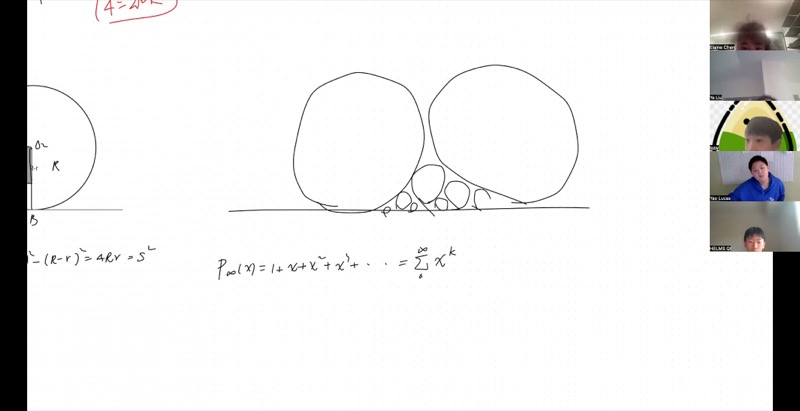
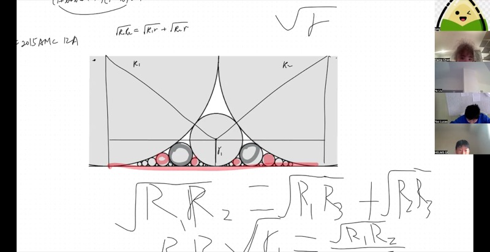
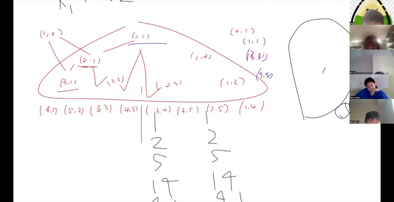
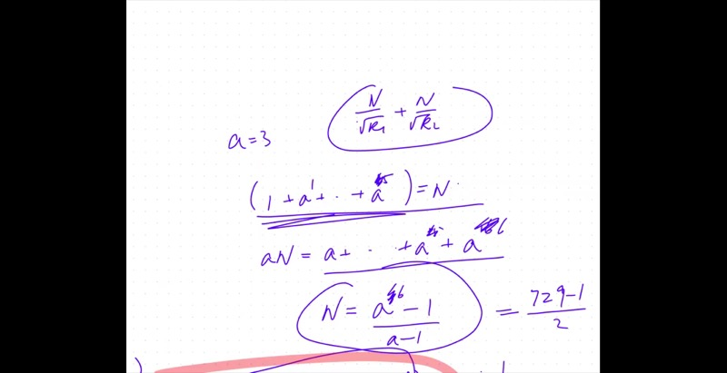

::: {.callout-tip collapse="true"}
## 应用背景

本节课以令人惊讶的方式连接了几何与代数。从一个关于切线圆的简单问题出发，我们发现了一个公式，将我们引入**无穷级数**的世界——永不结束但仍能等于有限数的和。在此过程中，我们遇到了与**二进制数**的美妙联系，并学会了如何分解无穷多项式。这些思想构成了微积分的基础，并在竞赛数学（包括AMC/AIME）中频繁出现。
:::

## 涵盖的主题

- 两个圆在直线上切点之间的距离
- 无穷级数与收敛的入门
- 等比级数：封闭公式
- AMC 2015 12A 第25题（圆的堆叠）
- 将等比级数分解为无穷乘积
- 二进制表示与唯一性

## 课程视频

```{=html}
<video controls width="100%" preload="metadata">
  <source src="https://github.com/ymote/learningmathteam/releases/download/v1.0/Saturday20251213.mp4" type="video/mp4">
</video>
```

## 课程关键帧









## 前置知识

::: {.callout-note collapse="true"}
## 什么是切线圆？

两个圆**相切**是指它们恰好在一个点接触。如果从外部接触，称为**外切**——两圆心之间的距离等于两半径之和。

圆与直线**相切**是指圆恰好在一个点接触直线。在该点处，半径垂直于直线。
:::

::: {.callout-note collapse="true"}
## 什么是级数？

**数列**是一个有序的数的列表：$a_1, a_2, a_3, \ldots$

**级数**是数列各项的和：

$$S = a_1 + a_2 + a_3 + \cdots$$

如果数列有有限项，这是**有限级数**。如果无限延续，这是**无穷级数**。

无穷级数如果其部分和趋近于一个固定的数，则**收敛**。否则**发散**。
:::

::: {.callout-note collapse="true"}
## 什么是二进制数？

在我们通常的十进制系统中，我们用10的幂来表示数。在**二进制**中，我们用2的幂。

例如，$13 = 8 + 4 + 1 = 2^3 + 2^2 + 2^0$，所以二进制为：$13_{10} = 1101_2$。

每个正整数都有**唯一的**二进制表示。
:::

## 核心概念

::: {.callout-important}
## 核心要点

1. **切点距离公式：** 如果半径分别为 $r$ 和 $R$ 的两个圆都与同一条直线相切，且两圆外切，则它们在直线上的切点之间的距离为 $s = 2\sqrt{rR}$。

2. **等比级数（无穷）：** $\displaystyle \sum_{k=0}^{\infty} x^k = \frac{1}{1-x}$，当 $|x| < 1$ 时成立。

3. **等比级数（有限）：** $\displaystyle \sum_{k=0}^{n} x^k = \frac{x^{n+1} - 1}{x - 1}$。

4. **二进制分解：** $\displaystyle 1 + x + x^2 + x^3 + \cdots = (1+x)(1+x^2)(1+x^4)(1+x^8)\cdots$
:::

---

## 1. 直线上两切点之间的距离

### 问题设置

半径分别为 $r$（小圆）和 $R$（大圆）的两个圆都放在一条平直线上（都从上方与直线相切），且两圆外切。两圆与直线切点之间的水平距离 $s$ 是多少？

### 梯形构造

::: {.callout-tip collapse="true"}
## 逐步推导

连接两圆圆心。这条线段的长度为 $r + R$（因为两圆外切）。

现在从圆心画水平和垂直参考线，构成一个直角三角形：

- **竖直边**是半径之差：$R - r$
- **斜边**是圆心距：$R + r$
- **水平边**是切点之间的距离：$s$

由勾股定理：

$$s^2 + (R - r)^2 = (R + r)^2$$

展开：

$$s^2 = (R+r)^2 - (R-r)^2 = 4Rr$$

因此：

$$\boxed{s = 2\sqrt{Rr}}$$
:::

```{=html}
<div id="desmos-1" class="desmos-container"></div>
<script src="https://www.desmos.com/api/v1.9/calculator.js?apiKey=dcb31709b452b1cf9dc26972add0fda6"></script>
<script>
  var calc1 = Desmos.GraphingCalculator(document.getElementById('desmos-1'), {
    expressions: true,
    settingsMenu: false
  });
  calc1.setExpression({ id: 'r', latex: 'r=1', sliderBounds: {min: 0.3, max: 3, step: 0.1} });
  calc1.setExpression({ id: 'R', latex: 'R=3', sliderBounds: {min: 1, max: 5, step: 0.1} });
  calc1.setExpression({ id: 'line', latex: 'y=0', color: '#000000', lineWidth: 2 });
  calc1.setExpression({ id: 'small', latex: '(x-0)^2+(y-r)^2=r^2', color: '#2d70b3' });
  calc1.setExpression({ id: 'big', latex: '(x-2\\sqrt{rR})^2+(y-R)^2=R^2', color: '#6042a6' });
  calc1.setExpression({ id: 'ptA', latex: '(0, 0)', color: '#c74440', pointSize: 10, label: 'A', showLabel: true });
  calc1.setExpression({ id: 'ptB', latex: '(2\\sqrt{rR}, 0)', color: '#c74440', pointSize: 10, label: 'B', showLabel: true });
  calc1.setExpression({ id: 'dist', latex: '(\\sqrt{rR}, -0.5)', color: '#388c46', pointSize: 0, label: 's = 2sqrt(rR)', showLabel: true });
  calc1.setMathBounds({ left: -3, right: 12, bottom: -2, top: 10 });
</script>
```

拖动 $r$ 和 $R$ 的滑块，观察切点距离如何变化。

### 示例：Toby的开场题

::: {.callout-tip collapse="true"}
## 详解答案

两个圆都与由两条直线构成的楔形相切。从顶点到每个切点的距离都是4。求较小圆的面积。

利用切线性质和上述构造，如果切点之间的距离为4，且半径之比为 $r : 2r$，则：

$$4 = 2\sqrt{r \cdot 2r} = 2r\sqrt{2}$$

求解：$r = \sqrt{2}$

小圆的面积：$\pi r^2 = 2\pi$。
:::

---

## 2. 无穷级数入门

### 从多项式到幂级数

多项式有有限项。但如果我们允许*无穷多*项呢？

$$P(x) = 1 + x + x^2 + x^3 + \cdots = \sum_{k=0}^{\infty} x^k$$

这叫做**幂级数**——一个"无穷次多项式"。

### 推导封闭公式

::: {.callout-tip collapse="true"}
## Lucas的自生成技巧

设 $S = 1 + x + x^2 + x^3 + \cdots$

两边乘以 $x$：

$$xS = x + x^2 + x^3 + x^4 + \cdots$$

相减：

$$S - xS = 1$$

$$S(1 - x) = 1$$

$$\boxed{S = \frac{1}{1-x}}$$

这是一个**形式**等式。只有当 $|x| < 1$（级数收敛）时，它才在数值上成立。例如：

- $x = \tfrac{1}{2}$：$1 + \tfrac{1}{2} + \tfrac{1}{4} + \cdots = \frac{1}{1 - 1/2} = 2$ —— 正确！
- $x = 2$：$1 + 2 + 4 + \cdots = \frac{1}{1-2} = -1$ —— 荒谬！（级数发散。）

**合理性检验：** 将 $(1 + x + x^2 + \cdots) \times (1 - x)$ 相乘。除了首项 $1$ 外，所有项都抵消。
:::

### 有限等比级数

对于**有限**和，末项的遗留项很重要：

$$S_n = \sum_{k=0}^{n} x^k = 1 + x + x^2 + \cdots + x^n$$

乘以 $x$ 并相减：

$$S_n - xS_n = 1 - x^{n+1}$$

$$\boxed{S_n = \frac{x^{n+1} - 1}{x - 1}}$$

此公式对**任何** $x \neq 1$ 均成立，即使 $|x| > 1$，因为和是有限的。

```{=html}
<div id="desmos-2" class="desmos-container"></div>
<script>
  var calc2 = Desmos.GraphingCalculator(document.getElementById('desmos-2'), {
    expressions: true,
    settingsMenu: false
  });
  calc2.setExpression({ id: 'x', latex: 'a=0.5', sliderBounds: {min: -0.99, max: 0.99, step: 0.01} });
  calc2.setExpression({ id: 'n', latex: 'n=5', sliderBounds: {min: 1, max: 20, step: 1} });
  calc2.setExpression({ id: 'partial', latex: 'y=\\sum_{k=0}^{n} a^k \\cdot \\left\\{x=1\\right\\}', color: '#2d70b3', hidden: true });
  calc2.setExpression({ id: 'limit', latex: 'y=\\frac{1}{1-a}', color: '#c74440' });
  calc2.setExpression({ id: 'finite', latex: 'y=\\frac{a^{n+1}-1}{a-1}', color: '#2d70b3', lineStyle: 'DASHED' });
  calc2.setExpression({ id: 'label1', latex: '(0.5, \\frac{1}{1-a})', color: '#c74440', pointSize: 0, label: '1/(1-a) (infinite sum)', showLabel: true });
  calc2.setExpression({ id: 'label2', latex: '(0.5, \\frac{a^{n+1}-1}{a-1})', color: '#2d70b3', pointSize: 0, label: 'Finite partial sum', showLabel: true });
  calc2.setMathBounds({ left: -1, right: 2, bottom: -2, top: 8 });
</script>
```

调节 $a$（公比）和 $n$（项数），观察有限部分和如何趋近无穷和。

---

## 3. AMC 2015 12A 第25题：圆的堆叠

### 题目

一组圆被堆叠在半径分别为 $R_1$ 和 $R_2$ 的两个大圆之间，所有圆都与同一条直线相切。圆一层一层地插入：第一层（$L_1$）有一个圆在 $R_1$ 和 $R_2$ 之间，第二层（$L_2$）有两个圆，第三层（$L_3$）有四个，以此类推——第 $k$ 层有 $2^{k-1}$ 个圆。

题目要求前六层所有小圆的 $\sum \frac{1}{\sqrt{r_i}}$。

### 求 $r_1$：第一个插入的圆

::: {.callout-tip collapse="true"}
## 推导关键递推关系

半径为 $r_1$ 的圆插入两个原始圆之间，与三者都相切（两个大圆和底线）。

利用我们的切点距离公式：

$$2\sqrt{R_1 R_2} = 2\sqrt{R_1 r_1} + 2\sqrt{R_2 r_1}$$

两边除以 $2\sqrt{r_1}$：

$$\frac{\sqrt{R_1 R_2}}{\sqrt{r_1}} = \sqrt{R_1} + \sqrt{R_2}$$

因此：

$$\frac{1}{\sqrt{r_1}} = \frac{\sqrt{R_1} + \sqrt{R_2}}{\sqrt{R_1 R_2}} = \frac{1}{\sqrt{R_1}} + \frac{1}{\sqrt{R_2}}$$

这是关键洞察：**每个新圆的 $\frac{1}{\sqrt{r}}$ 值等于其两个相邻圆的 $\frac{1}{\sqrt{r}}$ 之和。**
:::

### 各层的规律

这个加法性质意味着每个新圆的 $\frac{1}{\sqrt{r}}$ 值是 $\frac{1}{\sqrt{R_1}}$ 和 $\frac{1}{\sqrt{R_2}}$ 的某些副本之和。追踪每项的副本数：

| 层 | 圆（$\frac{1}{\sqrt{R_1}}$、$\frac{1}{\sqrt{R_2}}$ 的副本数） | 每项的总副本数 |
|---|---|---|
| $L_0$（原始） | $(1, 0)$ 和 $(0, 1)$ | 1, 1 |
| $L_1$ | $(1, 1)$ | 1, 1 |
| $L_2$ | $(2, 1)$ 和 $(1, 2)$ | 3, 3 |
| $L_3$ | $(3, 1), (3, 2), (2, 3), (1, 3)$ | 9, 9 |
| $L_k$ | ... | $3^{k-1}$, $3^{k-1}$ |

每层的总副本数遵循3的幂次！所以前六层的总和为：

$$\sum_{k=1}^{6} 3^{k-1} = \frac{3^6 - 1}{3 - 1} = \frac{729 - 1}{2} = 364$$

最终答案为：

$$364 \left(\frac{1}{\sqrt{R_1}} + \frac{1}{\sqrt{R_2}}\right)$$

::: {.callout-tip collapse="true"}
## 为什么每层副本数是三倍？

当你插入新一层时，每个新圆由两个相邻的已有圆构成。它的副本数是其邻居的和。在边界处，原始大圆始终贡献 $(1,0)$ 或 $(0,1)$。

将一层中所有副本数加起来与上一层比较，总数乘以3。这可以用归纳法证明。
:::

---

## 4. 等比级数的分解：二进制联系

### Lucas的精彩观察

无穷等比级数可以写成**无穷乘积**：

$$1 + x + x^2 + x^3 + \cdots = (1+x)(1+x^2)(1+x^4)(1+x^8) \cdots$$

::: {.callout-important}
## 为什么这是对的？

展开右侧时，乘积中的每一项要么贡献 $1$，要么贡献 $x^{2^j}$。展开后的一个典型项为：

$$x^{2^{a_1}} \cdot x^{2^{a_2}} \cdots = x^{2^{a_1} + 2^{a_2} + \cdots}$$

指数是**不同的**2的幂之和——这恰好是一个**二进制数**！由于每个非负整数都有**唯一的**二进制表示，每个幂次 $x^n$ 恰好出现一次。
:::

### 证明二进制的唯一性

::: {.callout-tip collapse="true"}
## Lucas的递归证明

**命题：** 每个正整数都可以唯一地表示为不同的2的幂之和。

**证明：** 假设某个整数 $N$ 有两种不同的二进制表示。考虑每种表示中最大的2的幂。

- 如果不同，比如一种使用 $2^k$ 而另一种不使用，那么不含 $2^k$ 的那种必须仅用 $2^0, 2^1, \ldots, 2^{k-1}$ 来弥补差额。但 $2^0 + 2^1 + \cdots + 2^{k-1} = 2^k - 1 < 2^k$，所以这是不可能的。

- 因此，两种表示必须使用相同的最大幂次。将其从两种表示中去掉，对余数重复上述论证。

由数学归纳法，两种表示完全相同。$\square$

这是关键事实：所有较小的2的幂之和仍然小于下一个2的幂：$1 + 2 + 4 + \cdots + 2^{k-1} = 2^k - 1$。
:::

### 示例：哪些因子产生 $x^{101}$？

将101写成二进制：

$$101 = 64 + 32 + 4 + 1 = 2^6 + 2^5 + 2^2 + 2^0$$

所以 $101_{10} = 1100101_2$。

从乘积中，在 $(1+x^{64})$ 中选 $x^{64}$，在 $(1+x^{32})$ 中选 $x^{32}$，在 $(1+x^{4})$ 中选 $x^{4}$，在 $(1+x)$ 中选 $x^{1}$。其他所有因子都选 $1$。

$$x^1 \cdot 1 \cdot x^4 \cdot 1 \cdot x^{32} \cdot x^{64} \cdot 1 \cdots = x^{101}$$

这个组合是**唯一的**，所以 $x^{101}$ 恰好以系数1出现。

---

## 5. 应用：二项式系数的奇偶性

### 课后思考题

$\binom{211}{143}$ 是偶数还是奇数？

::: {.callout-tip collapse="true"}
## 与二进制的联系（Kummer定理）

$\binom{m}{n}$ 的奇偶性可以通过二进制表示来判断。根据**Lucas定理**（一个不同的Lucas！），$\binom{m}{n}$ 是奇数当且仅当 $n$ 的每一个二进制位都 $\leq$ $m$ 的对应二进制位。

写成二进制：

- $211 = 128 + 64 + 16 + 2 + 1 = 11010011_2$
- $143 = 128 + 8 + 4 + 2 + 1 = 10001111_2$

逐位比较：

| 位置 | $2^7$ | $2^6$ | $2^5$ | $2^4$ | $2^3$ | $2^2$ | $2^1$ | $2^0$ |
|---|---|---|---|---|---|---|---|---|
| 211 | 1 | 1 | 0 | 1 | 0 | 0 | 1 | 1 |
| 143 | 1 | 0 | 0 | 0 | 1 | 1 | 1 | 1 |

在 $2^3$ 位置：143有1，但211有0。所以 $\binom{211}{143}$ 是**偶数**。
:::

---

## 速查表

::: {.key-formula}
| 公式 | 表达式 |
|---|---|
| 切点距离 | $s = 2\sqrt{rR}$，适用于直线上半径分别为 $r, R$ 的两个圆 |
| 无穷等比级数 | $\displaystyle\sum_{k=0}^{\infty} x^k = \frac{1}{1-x}$，当 $\lvert x\rvert < 1$ 时成立 |
| 有限等比级数 | $\displaystyle\sum_{k=0}^{n} x^k = \frac{x^{n+1}-1}{x-1}$ |
| 二进制乘积分解 | $(1+x)(1+x^2)(1+x^4)\cdots = 1 + x + x^2 + x^3 + \cdots$ |
| 二进制唯一性 | 每个正整数都有唯一的二进制表示 |
| $\binom{m}{n}$ 的奇偶性 | 奇数当且仅当 $n$ 的每个二进制位 $\leq$ $m$ 的对应位 |

### 等比级数技巧（请牢记！）

求和 $S = 1 + a + a^2 + \cdots + a^n$：

1. 乘以 $a$：$aS = a + a^2 + \cdots + a^{n+1}$
2. 相减：$aS - S = a^{n+1} - 1$
3. 求解：$\displaystyle S = \frac{a^{n+1} - 1}{a - 1}$
:::
