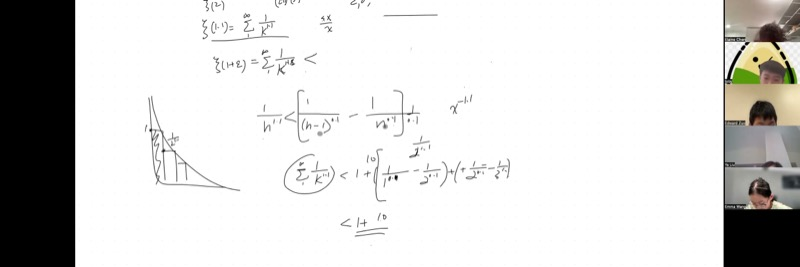
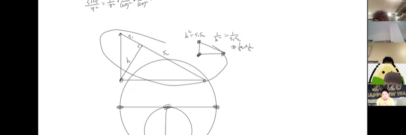
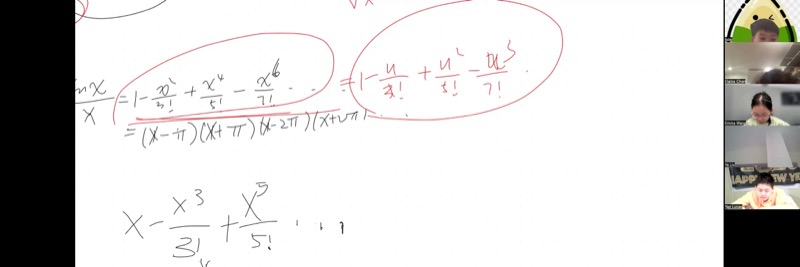

::: {.callout-tip collapse="true"}
## 应用背景

1735年，莱昂哈德·欧拉以一个惊人的证明震撼了数学界：完全平方数的倒数之和恰好等于 $\frac{\pi^2}{6}$。没有人预料到一个关于整数的问题中会出现圆周率！这个结果——**巴塞尔问题**——将代数、微积分和无穷级数以数学中最优美的恒等式之一联系在一起。今天，我们将重新走过这段旅程。
:::

## 本课涵盖的主题

- 对任意 $\varepsilon > 0$，黎曼 zeta 函数 $\zeta(1+\varepsilon)$ 的收敛性
- 用于约束无穷级数的逐项消去比较技巧
- 通过黎曼和建立求和与积分之间的联系
- 将韦达定理应用于无穷次多项式
- 求解巴塞尔问题：$\zeta(2) = \frac{\pi^2}{6}$

## 课程视频

```{=html}
<video controls width="100%" preload="metadata">
  <source src="https://github.com/ymote/learningmathteam/releases/download/v1.0/Saturday20260103Morning.mp4" type="video/mp4">
</video>
```

## 课程关键帧








## 背景介绍：什么是黎曼 Zeta 函数？

**黎曼 zeta 函数**定义为如下无穷级数

$$\zeta(s) = \sum_{k=1}^{\infty} \frac{1}{k^s} = \frac{1}{1^s} + \frac{1}{2^s} + \frac{1}{3^s} + \cdots$$

当 $s = 1$ 时，这就是**调和级数**，它发散到无穷大。当 $s = 2$ 时，它收敛到著名的值 $\frac{\pi^2}{6}$。一个核心问题是：*对于哪些 $s$ 的值，$\zeta(s)$ 是收敛的？*

::: {.callout-important}
## 核心要点

1. **调和级数发散**：$\zeta(1) = 1 + \frac{1}{2} + \frac{1}{3} + \cdots = \infty$（通过将各项分组为 $\frac{1}{2}$ 的块来证明）。
2. **任何大于 1 的幂都保证收敛**：对于每个 $\varepsilon > 0$，无论多小，$\zeta(1+\varepsilon) < \infty$。
3. **逐项消去比较**：我们可以用涉及 $k^{\varepsilon}$ 项的逐项消去差分来约束 $\frac{1}{k^{1+\varepsilon}}$，使其消去后得到一个有限值。
4. **韦达定理遇上泰勒展开**：通过将 $\frac{\sin x}{x}$ 的幂级数展开与韦达定理（关于根的倒数之和的公式）相结合，我们证明了 $\zeta(2) = \frac{\pi^2}{6}$。
:::

## 第一部分：为什么调和级数发散

::: {.callout-note collapse="true"}
## 证明 $\zeta(1) = \infty$

将连续的项分组：

$$\underbrace{\frac{1}{1}}_{\ge\,1/2} + \underbrace{\frac{1}{2}}_{\ge\,1/2} + \underbrace{\frac{1}{3} + \frac{1}{4}}_{\ge\,1/2} + \underbrace{\frac{1}{5}+\frac{1}{6}+\frac{1}{7}+\frac{1}{8}}_{\ge\,1/2} + \cdots$$

每个分组的和至少为 $\frac{1}{2}$，而这样的分组有无穷多个。因此该级数发散。
:::

## 第二部分：$\zeta(1+\varepsilon)$ 的收敛性

### 具体情况 $\zeta(1.1)$

我们要证明 $\displaystyle\sum_{k=1}^{\infty} \frac{1}{k^{1.1}}$ 收敛到一个有限值。

**策略**：利用逐项消去技巧拆分每一项。我们假设：

$$\frac{1}{k^{1.1}} \;\le\; \frac{1}{\varepsilon}\left(\frac{1}{(k-1)^{\varepsilon}} - \frac{1}{k^{\varepsilon}}\right)$$

其中 $\varepsilon = 0.1$。因子 $\frac{1}{\varepsilon} = \frac{1}{0.1} = 10$ 来源于降低幂次时的二项展开。

::: {.callout-note collapse="true"}
## 为什么会出现系数 $\frac{1}{\varepsilon}$

当我们试图将 $\frac{1}{k^{1+\varepsilon}}$ 写成相邻的 $\varepsilon$ 次幂项之差时，反向运用幂次法则（即求原函数）会引入一个系数。具体来说，$x^{-\varepsilon}$ 的导数为 $-\varepsilon \cdot x^{-\varepsilon - 1} = \frac{-\varepsilon}{x^{1+\varepsilon}}$。重新整理：

$$\frac{1}{x^{1+\varepsilon}} = \frac{-1}{\varepsilon}\cdot \frac{d}{dx}\!\left(x^{-\varepsilon}\right)$$

这就是因子 $\frac{1}{\varepsilon}$ 的来源。
:::

### 逐项消去

分离第一项，并从 $k = 2$ 开始求和：

$$\sum_{k=1}^{\infty}\frac{1}{k^{1.1}} \;=\; 1 + \sum_{k=2}^{\infty}\frac{1}{k^{1.1}}$$

尾部的每一项都被逐项消去差分（系数为 10）所约束：

$$\sum_{k=2}^{\infty}\frac{1}{k^{1.1}} \;\le\; 10\sum_{k=2}^{\infty}\left(\frac{1}{(k-1)^{0.1}} - \frac{1}{k^{0.1}}\right)$$

右边是逐项消去的：

$$10\!\left(\frac{1}{1^{0.1}} - \lim_{k\to\infty}\frac{1}{k^{0.1}}\right) = 10\,(1 - 0) = 10$$

因此：

$$\boxed{\zeta(1.1) \;\le\; 1 + 10 = 11}$$

### 一般情况

::: {.callout-note collapse="true"}
## 证明：对于每个 $\varepsilon > 0$，$\zeta(1+\varepsilon)$ 收敛

使用完全相同的论证，对一般的 $\varepsilon$：

$$\zeta(1+\varepsilon) \;\le\; 1 + \frac{1}{\varepsilon}$$

**关键步骤**：$\frac{1}{x^{1+\varepsilon}}$ 的原函数为 $\frac{x^{-\varepsilon}}{-\varepsilon}$。这为我们提供了逐项消去的上界，无论 $\varepsilon$ 多小，级数都消去为一个有限值。

注意：上界 $1 + \frac{1}{\varepsilon}$ 在 $\varepsilon \to 0$ 时趋于增大，这与调和级数（$\varepsilon = 0$）发散的结论一致。
:::

### 与积分的联系

求和 $\displaystyle\sum_{k=1}^{\infty}\frac{1}{k^{1+\varepsilon}}$ 是积分的**左黎曼和**（$\Delta x = 1$）

$$\int_1^{\infty} \frac{1}{x^{1+\varepsilon}}\,dx$$

直接计算：

$$\int_1^{\infty} x^{-(1+\varepsilon)}\,dx = \left[\frac{x^{-\varepsilon}}{-\varepsilon}\right]_1^{\infty} = 0 - \frac{1}{-\varepsilon} = \frac{1}{\varepsilon}$$

这个积分判别法验证了 $\varepsilon > 0$ 时的收敛性，并得出相同的上界。

**探索积分比较：**

```{=html}
<div id="desmos-1" class="desmos-container"></div>
<script src="https://www.desmos.com/api/v1.9/calculator.js?apiKey=dcb31709b452b1cf9dc26972add0fda6"></script>
<script>
  var calc1 = Desmos.GraphingCalculator(document.getElementById('desmos-1'), {
    expressions: true,
    settingsMenu: false
  });
  calc1.setExpression({ id: 'eps', latex: '\\varepsilon=0.1', sliderBounds: {min: 0.01, max: 2, step: 0.01} });
  calc1.setExpression({ id: 'func', latex: 'y=\\frac{1}{x^{1+\\varepsilon}}', color: '#2d70b3' });
  calc1.setExpression({ id: 'r1', latex: 'y=\\frac{1}{1^{1+\\varepsilon}}\\left\\{1\\le x\\le 2\\right\\}', color: '#388c46', fillOpacity: 0.3, fill: true, lines: false });
  calc1.setExpression({ id: 'r2', latex: 'y=\\frac{1}{2^{1+\\varepsilon}}\\left\\{2\\le x\\le 3\\right\\}', color: '#388c46', fillOpacity: 0.3, fill: true, lines: false });
  calc1.setExpression({ id: 'r3', latex: 'y=\\frac{1}{3^{1+\\varepsilon}}\\left\\{3\\le x\\le 4\\right\\}', color: '#388c46', fillOpacity: 0.3, fill: true, lines: false });
  calc1.setExpression({ id: 'r4', latex: 'y=\\frac{1}{4^{1+\\varepsilon}}\\left\\{4\\le x\\le 5\\right\\}', color: '#388c46', fillOpacity: 0.3, fill: true, lines: false });
  calc1.setExpression({ id: 'r5', latex: 'y=\\frac{1}{5^{1+\\varepsilon}}\\left\\{5\\le x\\le 6\\right\\}', color: '#388c46', fillOpacity: 0.3, fill: true, lines: false });
  calc1.setMathBounds({ left: 0, right: 10, bottom: -0.1, top: 1.5 });
</script>
```

*拖动 $\varepsilon$ 滑块可以观察函数 $\frac{1}{x^{1+\varepsilon}}$ 的变化。绿色矩形是左黎曼和。当 $\varepsilon$ 接近 0 时，矩形几乎无法容纳在任何有限面积之下。*

## 第三部分：巴塞尔问题 --- $\zeta(2) = \frac{\pi^2}{6}$

现在我们从证明收敛性转向计算 $\zeta(2)$ 的**精确值**。

### 第 1 步：找到一个以 $k\pi$ 为根的多项式

我们需要一个零点为 $\pm\pi, \pm 2\pi, \pm 3\pi, \ldots$ 的函数。这正是 $\sin x$，因为对每个整数 $k$，$\sin(k\pi) = 0$。

但 $\sin(0) = 0$，而我们无法对根 $x = 0$ 取倒数。因此我们除去这个根：

$$f(x) = \frac{\sin x}{x}$$

这个函数的根为 $x = \pm\pi, \pm 2\pi, \pm 3\pi, \ldots$，且 $f(0) = 1$（可去奇点）。

### 第 2 步：写出幂级数

由 $\sin x$ 的泰勒展开：

$$\frac{\sin x}{x} = 1 - \frac{x^2}{3!} + \frac{x^4}{5!} - \frac{x^6}{7!} + \cdots$$

### 第 3 步：换元使根变为 $(k\pi)^2$

::: {.callout-note collapse="true"}
## 换元：$u = x^2$

令 $u = x^2$，我们得到一个关于 $u$ 的新"多项式"（无穷次）：

$$g(u) = 1 - \frac{u}{3!} + \frac{u^2}{5!} - \frac{u^3}{7!} + \cdots$$

$g(u)$ 的根恰好为 $u = \pi^2,\; 4\pi^2,\; 9\pi^2,\; \ldots = (k\pi)^2$（$k = 1, 2, 3, \ldots$）

这就是我们要对其应用韦达定理的关键多项式。
:::

### 第 4 步：应用韦达定理

::: {.callout-note collapse="true"}
## 回顾：通过韦达定理求倒数之和

对于有限多项式 $a_n x^n + a_{n-1} x^{n-1} + \cdots + a_1 x + a_0 = 0$，其根为 $x_1, x_2, \ldots, x_n$，韦达定理告诉我们：

- 根之和：$\sigma_1 = x_1 + x_2 + \cdots + x_n = -\frac{a_{n-1}}{a_n}$
- 两两乘积之和：$\sigma_2 = \sum_{i<j} x_i x_j = \frac{a_{n-2}}{a_n}$

对于**倒数之和**，我们可以：

1. 计算 $\frac{\sigma_{n-1}}{\sigma_n}$（通分法），或
2. 构造**倒数多项式**：用 $x^n$ 去除后反转系数顺序。

**示例**：对于 $4x^3 - 7x + 1 = 0$，根的倒数之和为：

$$\frac{1}{x_1} + \frac{1}{x_2} + \frac{1}{x_3} = \frac{\sigma_2}{\sigma_3} = \frac{-7/4}{1/4\cdot(-1)} = 7$$

或者等价地，用 $x^3$ 去除得到 $4 - \frac{7}{x^2} + \frac{1}{x^3} = 0$，读取倒数根的 $\sigma_1$：$\frac{-(-7)}{4}$……但最简洁的方法是反转多项式为 $1 - 7x^2 + 4x^3$，然后直接应用韦达定理。
:::

对于我们的无穷多项式 $g(u) = 1 - \frac{u}{6} + \frac{u^2}{120} - \cdots$，我们将其视为"首项系数" $a_0 = 1$（常数项）和"下一个系数" $a_1 = -\frac{1}{6}$（$u$ 的系数）。

根的倒数之和为：

$$\sum_{k=1}^{\infty} \frac{1}{(k\pi)^2} = -\frac{a_1}{a_0} = -\frac{-1/6}{1} = \frac{1}{6}$$

::: {.callout-note collapse="true"}
## 为什么要反转读取系数？

由于这个多项式有无穷多项，我们永远无法到达"最高次"（最高阶）系数。但是，为了求根的**倒数之和**，我们通过除以最高次幂来构造倒数多项式。从低阶端读取，常数项 $a_0 = 1$ 变成新的首项系数，$a_1 = -\frac{1}{6}$ 变成下一个系数。对倒数多项式应用韦达定理可得：

$$\sigma_{-1} = \sum \frac{1}{u_k} = -\frac{a_1}{a_0} = \frac{1}{6}$$
:::

### 第 5 步：提取 $\zeta(2)$

我们已经证明：

$$\frac{1}{\pi^2}\sum_{k=1}^{\infty}\frac{1}{k^2} = \frac{1}{6}$$

因此：

$$\boxed{\zeta(2) = \sum_{k=1}^{\infty}\frac{1}{k^2} = \frac{\pi^2}{6}}$$

**探索逼近 $\frac{\pi^2}{6}$ 的部分和：**

```{=html}
<div id="desmos-2" class="desmos-container"></div>
<script>
  var calc2 = Desmos.GraphingCalculator(document.getElementById('desmos-2'), {
    expressions: true,
    settingsMenu: false
  });
  calc2.setExpression({ id: 'target', latex: 'y=\\frac{\\pi^2}{6}', color: '#c74440', lineStyle: 'DASHED', lineWidth: 2 });
  calc2.setExpression({ id: 'pts', latex: '\\left(n,\\ \\sum_{k=1}^{n}\\frac{1}{k^2}\\right)', color: '#2d70b3', pointSize: 6 });
  calc2.setExpression({ id: 'n', latex: 'n=[1,2,...,30]' });
  calc2.setExpression({ id: 'label', latex: '(25, 1.68)', color: '#c74440', label: 'pi^2/6 ≈ 1.6449', showLabel: true, pointSize: 0 });
  calc2.setMathBounds({ left: 0, right: 32, bottom: 0.8, top: 1.8 });
</script>
```

*蓝色圆点显示部分和 $\sum_{k=1}^{n}\frac{1}{k^2}$ 逐渐逼近红色虚线 $\frac{\pi^2}{6} \approx 1.6449$。*

### 灯塔证明（3Blue1Brown）

::: {.callout-tip collapse="true"}
## 一种替代的几何证明

巴塞尔问题有一个优美的几何证明，使用了**灯塔**类比。核心思想：

1. **平方反比定律**：距离为 $d$ 的灯塔提供的亮度与 $\frac{1}{d^2}$ 成正比。
2. **高定理**：对于直角三角形，两条直角边为 $a, b$，斜边上的高为 $h$，有 $\frac{1}{h^2} = \frac{1}{a^2} + \frac{1}{b^2}$。这是因为 $ab = ch$（两者都给出面积），从而导出了平方反比关系。
3. **圆构造**：在半径不断翻倍的圆上等距放置灯塔。反复使用高定理，重新分配灯塔以形成级数 $\frac{1}{1^2} + \frac{1}{2^2} + \frac{1}{3^2} + \cdots$
4. **极限**：当圆的半径趋于无穷大时，圆周趋近于一条直线，总亮度收敛到 $\frac{\pi^2}{6}$。

这个证明由 Grant Sanderson（3Blue1Brown）推广。搜索"3Blue1Brown Basel Problem"可以观看完整的可视化讲解。
:::

## 作业

::: {.callout-warning}
## 习题

使用相同的韦达定理 + 幂级数技巧来求 $\zeta(4)$：

$$\zeta(4) = \sum_{k=1}^{\infty} \frac{1}{k^4} = \;?$$

**提示**：你需要多项式 $g(u) = 1 - \frac{u}{3!} + \frac{u^2}{5!} - \cdots$ 中 $u^2$ 的系数，以及将 $\sigma_{-2}$ 与 $\sigma_{-1}$ 和系数联系起来的韦达公式。
:::

## 速查表

::: {.key-formula}
| 结果 | 公式 |
|---|---|
| 调和级数 | $\zeta(1) = \sum \frac{1}{k} = \infty$（发散） |
| 收敛阈值 | 对任意 $\varepsilon > 0$，$\zeta(1+\varepsilon) \le 1 + \frac{1}{\varepsilon}$ |
| 巴塞尔问题 | $\zeta(2) = \frac{\pi^2}{6} \approx 1.6449$ |
| 积分判别法 | $\int_1^{\infty} \frac{dx}{x^{1+\varepsilon}} = \frac{1}{\varepsilon}$ |
| 通过韦达定理求倒数之和 | 对多项式 $a_0 + a_1 u + a_2 u^2 + \cdots$，其根为 $u_k$：$\sum \frac{1}{u_k} = -\frac{a_1}{a_0}$ |

### 你需要的幂级数

$$\sin x = x - \frac{x^3}{3!} + \frac{x^5}{5!} - \frac{x^7}{7!} + \cdots$$

$$\frac{\sin x}{x} = 1 - \frac{x^2}{6} + \frac{x^4}{120} - \frac{x^6}{5040} + \cdots$$

### 证明流程

$$\sin x \;\xrightarrow{\div\, x}\; \frac{\sin x}{x} \;\xrightarrow{u = x^2}\; g(u) \;\xrightarrow{\text{韦达}}\; \sum\frac{1}{(k\pi)^2} = \frac{1}{6} \;\xrightarrow{\times\,\pi^2}\; \zeta(2) = \frac{\pi^2}{6}$$
:::
