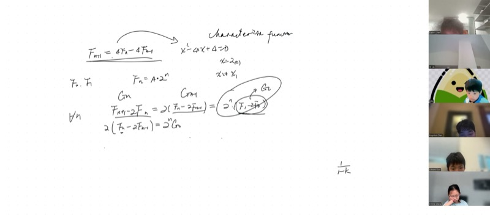
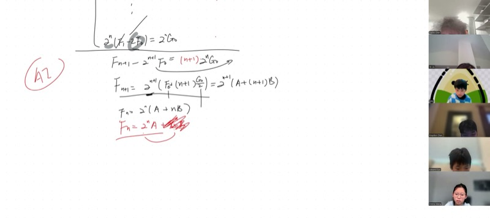
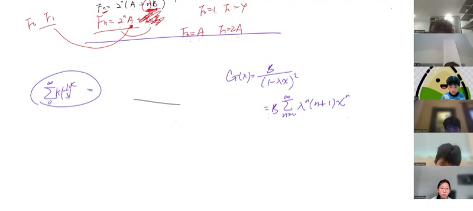
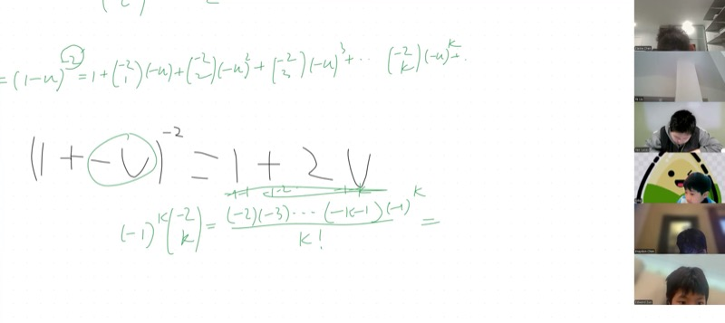

::: {.callout-tip collapse="true"}
## 现实世界的联系：无处不在的数列

线性递推出现在任何下一个值依赖于前面值的场景中——种群模型、复利、计算机算法和信号处理都依赖于它们。斐波那契数列是一个著名的例子，本课中的技巧可以让你以封闭形式求解*任何*二阶线性递推。
:::

## 本课涵盖的主题

- 通过特征方程求解二阶线性递推
- **重根**情况：为什么单个指数项不够
- 自由度与拟合初始条件
- 逐项消去求和以恢复通解公式
- 生成函数与幂级数展开
- 加权几何级数求和：$\sum (n+1) r^n$
- 负整数幂的二项展开
- 与帕斯卡三角和 $\frac{1}{1-x}$ 的高次幂的联系

## 课程视频

```{=html}
<video controls width="100%" preload="metadata">
  <source src="https://github.com/ymote/learningmathteam/releases/download/v1.0/Saturday20260124morning.mp4" type="video/mp4">
</video>
```

## 课程关键帧









## 背景介绍：二阶线性递推

**二阶线性递推**是用前两项定义每一项的规则：

$$f(n+1) = p \cdot f(n) + q \cdot f(n-1)$$

以及两个初始条件 $f(0)$ 和 $f(1)$。

::: {.callout-note collapse="true"}
## 为什么叫"线性"？

这个递推是*线性的*，因为 $f(n)$ 和 $f(n-1)$ 只出现一次幂——没有 $f(n)^2$ 或 $f(n) \cdot f(n-1)$ 这样的项。这正是特征方程法能够奏效的原因。
:::

## 特征方程法

::: {.callout-important}
## 核心要点

1. **特征方程：** 将 $f(n+1) = p\,f(n) + q\,f(n-1)$ 替换为 $x^2 = px + q$，即 $x^2 - px - q = 0$。
2. **不同根** $x_1 \neq x_2$：通解为 $f(n) = A\,x_1^n + B\,x_2^n$。
3. **重根** $x_1 = x_2 = r$：通解为 $f(n) = (A + Bn)\,r^n$。
4. **两个自由度**（$A$ 和 $B$）总是需要的，以拟合两个初始条件 $f(0)$ 和 $f(1)$。
5. **生成函数**提供了另一种方法：将整个数列编码为幂级数并使用部分分式分解。
:::

### 第 1 步：从递推到特征方程

考虑课堂中的示例：

$$f(n+1) = 4\,f(n) - 4\,f(n-1)$$

我们猜测形如 $f(n) = x^n$ 的解。代入：

$$x^{n+1} = 4x^n - 4x^{n-1}$$

两边除以 $x^{n-1}$（假设 $x \neq 0$）：

$$x^2 - 4x + 4 = 0$$

::: {.callout-note collapse="true"}
## 为什么可以猜 $f(n) = x^n$？

指数解对于线性递推是自然的，就像 $e^{rx}$ 对于线性微分方程是自然的一样。递推关系说"下一项是前面各项的固定线性组合"，而几何数列 $x^n$ 恰好是相邻项之比为常数的数列。
:::

### 第 2 步：求解特征方程

$$x^2 - 4x + 4 = (x - 2)^2 = 0$$

这给出一个**重根** $x_1 = x_2 = 2$。

### 第 3 步：为什么一个指数项不够

::: {.callout-warning collapse="true"}
## 自由度问题

如果我们尝试用 $f(n) = A \cdot 2^n$ 作为通解，我们只有**一个**自由参数 $A$。但我们需要满足**两个**初始条件：

- $f(0) = A \cdot 2^0 = A$
- $f(1) = A \cdot 2^1 = 2A$

一旦选定 $f(0)$，$f(1)$ 就被迫等于 $2 \cdot f(0)$。但递推关系允许*任意*一对 $(f(0), f(1))$！例如，$f(0) = 1$ 和 $f(1) = 4$ 就无法仅用 $f(n) = A \cdot 2^n$ 来满足。

我们需要一个**第二个**独立参数来匹配两个初始条件。
:::

## 通过逐项消去推导重根公式

这是本课的核心。我们将二阶递推化简为一阶递推，然后逐项消去。

### 化简为几何数列

定义 $g(n) = f(n+1) - 2\,f(n)$。则由 $f(n+1) = 4f(n) - 4f(n-1)$：

$$g(n) = f(n+1) - 2f(n) = 4f(n) - 4f(n-1) - 2f(n) = 2f(n) - 4f(n-1) = 2\bigl(f(n) - 2f(n-1)\bigr) = 2\,g(n-1)$$

所以 $g(n) = 2\,g(n-1)$，这意味着 $\{g(n)\}$ 是公比为 $2$ 的**几何数列**：

$$g(n) = g(0) \cdot 2^n, \quad \text{其中 } g(0) = f(1) - 2f(0)$$

### 逐项消去求和

::: {.callout-note collapse="true"}
## 逐项消去的原理

写出每个下标的方程，每次乘以适当的 2 的幂次：

| 方程 | 左边 | 右边 |
|---|---|---|
| $n=0$ | $f(1) - 2f(0)$ | $2^0 \cdot g(0)$ |
| $n=1$（乘 2） | $2f(2) - 2^2 f(1)$ | $2^1 \cdot g(0)$ |
| $n=2$（乘 $2^2$） | $2^2 f(3) - 2^3 f(2)$ | $2^2 \cdot g(0)$ |
| $\vdots$ | $\vdots$ | $\vdots$ |
| $n=k$（乘 $2^k$） | $2^k f(k+1) - 2^{k+1} f(k)$ | $2^k \cdot g(0)$ |

将 $k = 0$ 到 $k = n$ 的所有方程相加：左边逐项消去，右边求和得到 $n+1$ 个等幂次项。
:::

消去 $n+1$ 个方程后，我们得到：

$$f(n+1) - 2^{n+1} f(0) = (n+1) \cdot 2^n \cdot g(0)$$

求解 $f(n+1)$ 并重新标号：

$$\boxed{f(n) = \bigl(A + Bn\bigr) \cdot 2^n}$$

其中 $A = f(0)$，$B = g(0) = f(1) - 2f(0)$。

**探索重根递推——改变 $f(0)$ 和 $f(1)$：**

```{=html}
<div id="desmos-1" class="desmos-container"></div>
<script src="https://www.desmos.com/api/v1.9/calculator.js?apiKey=dcb31709b452b1cf9dc26972add0fda6"></script>
<script>
  var calc1 = Desmos.GraphingCalculator(document.getElementById('desmos-1'), {
    expressions: true,
    settingsMenu: false
  });
  calc1.setExpression({ id: 'f0', latex: 'a=1', sliderBounds: {min: -3, max: 3, step: 0.5} });
  calc1.setExpression({ id: 'f1', latex: 'b=4', sliderBounds: {min: -5, max: 10, step: 0.5} });
  calc1.setExpression({ id: 'B_param', latex: 'B = b - 2a' });
  calc1.setExpression({ id: 'formula', latex: 'y = (a + B \\cdot x) \\cdot 2^x', color: '#2d70b3', lineWidth: 2 });
  calc1.setExpression({ id: 'pts', latex: '(n, (a + B \\cdot n) \\cdot 2^n)', color: '#c74440', pointSize: 8 });
  calc1.setExpression({ id: 'nvals', latex: 'n = [0,1,2,3,4,5,6]' });
  calc1.setMathBounds({ left: -1, right: 7, bottom: -10, top: 200 });
</script>
```

## 几何级数回顾

::: {.callout-note collapse="true"}
## 等差数列与等比数列

**等差数列：** 相邻项的差 $d$ 为常数。
$$a_n = a_0 + nd$$

**等比数列：** 相邻项的比 $k$ 为常数。
$$g_n = g_0 \cdot k^n$$

各项形如：$g_0,\; g_0 k,\; g_0 k^2,\; g_0 k^3, \ldots$
:::

等比级数的和（无穷情况下需 $|k| < 1$）：

$$\sum_{n=0}^{\infty} k^n = \frac{1}{1-k}, \qquad |k| < 1$$

有限和的情况：

$$\sum_{n=0}^{N} k^n = \frac{1 - k^{N+1}}{1 - k}$$

## 加权几何级数求和

本课推导的一个关键结果将生成函数与递推解联系起来。

::: {.callout-important}
## 关键公式

$$\frac{1}{(1-x)^2} = \sum_{n=0}^{\infty} (n+1)\,x^n, \qquad |x| < 1$$

即：$1 + 2x + 3x^2 + 4x^3 + \cdots = \dfrac{1}{(1-x)^2}$。
:::

::: {.callout-note collapse="true"}
## 证明：负整数幂的二项展开

我们使用广义二项式定理：对于任意实数 $\alpha$ 和 $|u| < 1$，

$$(1 + u)^\alpha = \sum_{k=0}^{\infty} \binom{\alpha}{k} u^k$$

其中广义二项式系数为：

$$\binom{\alpha}{k} = \frac{\alpha(\alpha-1)(\alpha-2)\cdots(\alpha-k+1)}{k!}$$

**第 1 步。** 写出 $\frac{1}{(1-u)^2} = (1 + (-u))^{-2}$。

**第 2 步。** 以 $\alpha = -2$ 应用展开：

$$(1-u)^{-2} = \sum_{k=0}^{\infty} \binom{-2}{k} (-u)^k$$

**第 3 步。** 计算 $\binom{-2}{k}$：

$$\binom{-2}{k} = \frac{(-2)(-3)(-4)\cdots(-2-k+1)}{k!} = \frac{(-1)^k \cdot (k+1)!}{k!} = (-1)^k(k+1)$$

分子有 $k$ 个因子：$(-2)(-3)\cdots(-(k+1))$。提取 $(-1)^k$ 得到 $2 \cdot 3 \cdots (k+1) = (k+1)!$。

**第 4 步。** 乘以 $(-u)^k = (-1)^k u^k$：

$$\binom{-2}{k}(-u)^k = (-1)^k(k+1) \cdot (-1)^k u^k = (k+1)\,u^k$$

$(-1)^k$ 因子相消，给出全部正系数。

**结果：**

$$\frac{1}{(1-u)^2} = \sum_{k=0}^{\infty}(k+1)\,u^k = 1 + 2u + 3u^2 + 4u^3 + \cdots \qquad \blacksquare$$
:::

### 计算示例

::: {.callout-note collapse="true"}
## 示例：计算 $\displaystyle\sum_{k=1}^{\infty} k \left(\frac{1}{3}\right)^k$

我们要求 $\sum_{k=1}^{\infty} k \cdot \left(\frac{1}{3}\right)^k$ 的值。

**第 1 步。** 提取因子 $\frac{1}{3}$：

$$\sum_{k=1}^{\infty} k \left(\frac{1}{3}\right)^k = \frac{1}{3}\sum_{k=1}^{\infty} k \left(\frac{1}{3}\right)^{k-1} = \frac{1}{3}\sum_{j=0}^{\infty} (j+1) \left(\frac{1}{3}\right)^{j}$$

**第 2 步。** 以 $x = \frac{1}{3}$ 应用我们的公式：

$$= \frac{1}{3} \cdot \frac{1}{\left(1 - \frac{1}{3}\right)^2} = \frac{1}{3} \cdot \frac{1}{\left(\frac{2}{3}\right)^2} = \frac{1}{3} \cdot \frac{9}{4} = \frac{3}{4}$$
:::

## 生成函数与部分分式分解

数列 $\{f(n)\}$ 的**生成函数**是幂级数：

$$G(x) = \sum_{n=0}^{\infty} f(n)\,x^n$$

对于具有特征根 $\lambda_1, \lambda_2$ 的线性递推，生成函数的形式为：

$$G(x) = \frac{P(x)}{(1 - \lambda_1 x)(1 - \lambda_2 x)}$$

其中 $P(x)$ 是由初始条件确定的多项式。

::: {.callout-note collapse="true"}
## 部分分式分解：不同根与重根

**不同根**（$\lambda_1 \neq \lambda_2$）：使用部分分式分解：

$$\frac{P(x)}{(1-\lambda_1 x)(1-\lambda_2 x)} = \frac{A}{1-\lambda_1 x} + \frac{B}{1-\lambda_2 x}$$

每一项展开为几何级数，得到 $f(n) = A\lambda_1^n + B\lambda_2^n$。

**重根**（$\lambda_1 = \lambda_2 = \lambda$）：生成函数的形式为：

$$\frac{A}{1-\lambda x} + \frac{B}{(1-\lambda x)^2}$$

第一项给出 $A\lambda^n$。第二项根据我们的关键公式给出 $B(n+1)\lambda^n$。合并得到：$f(n) = (A + B(n+1))\lambda^n$，重新定义常数后等价于 $(A' + B'n)\lambda^n$。
:::

**探索部分分式分解——观察两部分如何组合：**

```{=html}
<div id="desmos-2" class="desmos-container"></div>
<script>
  var calc2 = Desmos.GraphingCalculator(document.getElementById('desmos-2'), {
    expressions: true,
    settingsMenu: false
  });
  calc2.setExpression({ id: 'r', latex: 'r=0.5', sliderBounds: {min: -0.9, max: 0.9, step: 0.05} });
  calc2.setExpression({ id: 'geo', latex: 'y = \\frac{1}{1-r\\cdot x}', color: '#2d70b3', lineWidth: 2, label: '1/(1-rx)', showLabel: true });
  calc2.setExpression({ id: 'scaled', latex: 'y = \\frac{1}{(1-r\\cdot x)^2}', color: '#c74440', lineWidth: 2, label: '1/(1-rx)^2', showLabel: true });
  calc2.setMathBounds({ left: -1, right: 3, bottom: -1, top: 10 });
</script>
```

## 高次幂与帕斯卡三角

::: {.callout-tip collapse="true"}
## Lucas 的观察：$(1-x)^{-3}$ 呢？

这个模式可以扩展！使用相同的二项展开技巧：

$$\frac{1}{(1-x)^m} = \sum_{n=0}^{\infty} \binom{n+m-1}{m-1} x^n$$

| 幂次 | 系数 | 名称 |
|---|---|---|
| $(1-x)^{-1}$ | $1, 1, 1, 1, \ldots$ | 常数（帕斯卡第 0 列） |
| $(1-x)^{-2}$ | $1, 2, 3, 4, \ldots$ | 自然数（帕斯卡第 1 列） |
| $(1-x)^{-3}$ | $1, 3, 6, 10, \ldots$ | 三角数（帕斯卡第 2 列） |
| $(1-x)^{-4}$ | $1, 4, 10, 20, \ldots$ | 四面体数（帕斯卡第 3 列） |

每一列给出帕斯卡三角的**对角线**！这是因为 $\binom{n+m-1}{m-1}$ 恰好挑出了那些元素。
:::

## 速查表

::: {.key-formula}
| 概念 | 公式 / 规则 |
|---|---|
| 特征方程 | $f(n+1) = pf(n) + qf(n-1) \implies x^2 - px - q = 0$ |
| 不同根 $x_1 \neq x_2$ | $f(n) = Ax_1^n + Bx_2^n$ |
| 重根 $r$ | $f(n) = (A + Bn)\,r^n$ |
| 等比级数 | $\sum_{n=0}^{\infty} x^n = \frac{1}{1-x}$，$|x|<1$ |
| 加权几何级数 | $\sum_{n=0}^{\infty} (n+1)x^n = \frac{1}{(1-x)^2}$ |
| 一般负整数幂 | $\frac{1}{(1-x)^m} = \sum_{n=0}^{\infty}\binom{n+m-1}{m-1}x^n$ |
| 广义二项式系数 | $\binom{\alpha}{k} = \frac{\alpha(\alpha-1)\cdots(\alpha-k+1)}{k!}$ |
| 自由度 | $k$ 阶递推需要 $k$ 个参数来匹配 $k$ 个初始条件 |
:::
