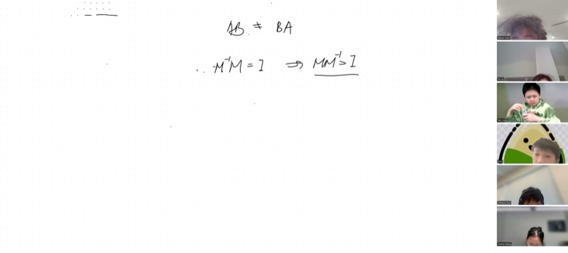
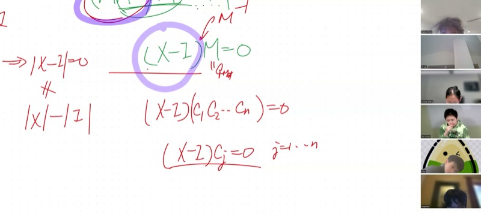
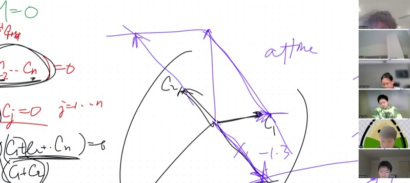
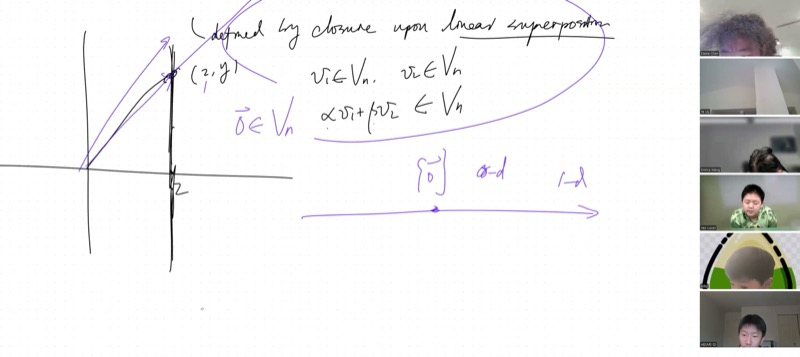

## 课程视频

```{=html}
<video controls width="100%" preload="metadata">
  <source src="https://github.com/ymote/learningmathteam/releases/download/v1.0/video1132904715.mp4" type="video/mp4">
</video>
```

## 背景介绍

我们已经学过如何通过代入法或消元法解二元一次方程组。但如果有*五*个方程五个未知数——甚至一百个呢？矩阵为我们提供了系统化的处理方法，而**逆矩阵**可以一步到位给出答案：$\mathbf{x} = M^{-1}\mathbf{f}$。

本课我们将之前几节课的多条线索汇总在一起。首先，我们完成**克拉默法则**的证明，展示分子为何恰好是替换了一列后的行列式。然后我们证明一个微妙但重要的事实：如果 $M^{-1}M = I$，那么 $M M^{-1} = I$ 也成立——逆矩阵从两边都有效。最后，我们进入新的领域：**线性向量空间**。我们给出严格定义，探索二维和三维中的例子，并认识矩阵的**核**——一个将方程的解与空间几何联系起来的概念。

::: {.callout-important}
## 核心要点

1. **克拉默法则（分子）**：解的第 $i$ 个分量为 $x_i = \frac{\det(M_i)}{\det(M)}$，其中 $M_i$ 是将 $M$ 的第 $i$ 列替换为常数向量 $\mathbf{f}$ 后得到的矩阵。
2. **逆的交换性**：如果 $M^{-1}M = I$，那么 $MM^{-1} = I$ 也成立——利用 $M$ 的非零行列式来证明。
3. **线性向量空间**：集合 $V$ 是线性向量空间，如果它**对线性组合封闭**：对于任意 $\mathbf{v}_1, \mathbf{v}_2 \in V$ 和标量 $\alpha, \beta$，都有 $\alpha \mathbf{v}_1 + \beta \mathbf{v}_2 \in V$。
4. **核**：$\ker(M) = \{\mathbf{x} : M\mathbf{x} = \mathbf{0}\}$ 总是一个线性向量空间。
5. **值域**：$\text{range}(M) = \{\mathbf{w} : \mathbf{w} = M\mathbf{u} \text{ 对某个 } \mathbf{u}\}$ 也是一个线性向量空间（作为课后习题证明）。
:::

## 完成克拉默法则：分子从何而来

回顾设置。我们有方程组 $M\mathbf{x} = \mathbf{f}$，其中：

$$M = \begin{pmatrix} m_{11} & m_{12} & \cdots & m_{1n} \\ m_{21} & m_{22} & \cdots & m_{2n} \\ \vdots & & \ddots & \vdots \\ m_{n1} & m_{n2} & \cdots & m_{nn} \end{pmatrix}, \quad \mathbf{f} = \begin{pmatrix} f_1 \\ f_2 \\ \vdots \\ f_n \end{pmatrix}$$

解为 $\mathbf{x} = M^{-1}\mathbf{f}$，其中逆矩阵由**余子式**构建：

$$(M^{-1})_{ij} = \frac{(-1)^{i+j} \, \mathcal{M}_{ji}}{\det(M)}$$

这里 $\mathcal{M}_{ji}$ 是余子式（删除第 $j$ 行第 $i$ 列后得到的子矩阵的行列式）。

### 展开计算 $x_1$

要求 $x_1$，将 $M^{-1}$ 的第一行乘以 $\mathbf{f}$：

$$x_1 = \frac{1}{\det(M)}\bigl(\mathcal{M}_{11}\,f_1 - \mathcal{M}_{21}\,f_2 + \mathcal{M}_{31}\,f_3 - \cdots + (-1)^{n+1}\mathcal{M}_{n1}\,f_n\bigr)$$

::: {.callout-tip collapse="true"}
## 为什么这是一个行列式

看括号中的表达式。每个 $\mathcal{M}_{k1}$ 是原矩阵第 $k$ 行第 $1$ 列对应元素的余子式。但我们不是用 $m_{k1}$（原来第一列的元素）乘以每个余子式，而是用 $f_k$ 来乘。

这恰好是沿第一列展开一个修改后的矩阵——即将 $M$ 的第一列替换为 $\mathbf{f}$ 的矩阵——的**余子式展开**：

$$M_1 = \begin{pmatrix} f_1 & m_{12} & \cdots & m_{1n} \\ f_2 & m_{22} & \cdots & m_{2n} \\ \vdots & & \ddots & \vdots \\ f_n & m_{n2} & \cdots & m_{nn} \end{pmatrix}$$

余子式 $\mathcal{M}_{k1}$ 保持不变，因为它们来自删除第 $k$ 行和第 $1$ 列——而我们只改变了第 $1$ 列。所以分子就是 $\det(M_1)$，由此我们得到：

$$\boxed{x_i = \frac{\det(M_i)}{\det(M)}}$$

其中 $M_i$ 是将 $M$ 的第 $i$ 列替换为 $\mathbf{f}$ 后的矩阵。这就是**克拉默法则**。
:::

::: {.callout-tip collapse="true"}
## 示例：$2 \times 2$ 方程组的克拉默法则

解 $\begin{cases} 3x + 2y = 7 \\ x - y = 1 \end{cases}$

这里 $M = \begin{pmatrix} 3 & 2 \\ 1 & -1 \end{pmatrix}$，$\mathbf{f} = \begin{pmatrix} 7 \\ 1 \end{pmatrix}$。

$$\det(M) = 3(-1) - 2(1) = -5$$

$$x = \frac{\det\begin{pmatrix} 7 & 2 \\ 1 & -1 \end{pmatrix}}{\det(M)} = \frac{7(-1) - 2(1)}{-5} = \frac{-9}{-5} = \frac{9}{5}$$

$$y = \frac{\det\begin{pmatrix} 3 & 7 \\ 1 & 1 \end{pmatrix}}{\det(M)} = \frac{3(1) - 7(1)}{-5} = \frac{-4}{-5} = \frac{4}{5}$$

验证：$3(9/5) + 2(4/5) = 27/5 + 8/5 = 35/5 = 7$，$9/5 - 4/5 = 5/5 = 1$。
:::

## 证明 $M^{-1}M = I \implies MM^{-1} = I$

矩阵乘法一般**不**满足交换律：$AB \neq BA$。因此，如果 $M^{-1}M = I$（左逆），$MM^{-1} = I$（右逆）并不显然成立。以下是课堂上推导出的优雅证明。

### 设置

已知 $M^{-1}M = I$。定义未知矩阵：

$$X = MM^{-1}$$

我们要证明 $X = I$。

### 第一步：发现 $X$ 的性质

将 $X$ 右乘 $M$：

$$XM = (MM^{-1})M = M(M^{-1}M) = MI = M$$

这里用了矩阵乘法的**结合律**。因此我们知道：

$$XM = M$$

改写为：

$$(X - I)M = 0$$

### 第二步：为什么 $(X - I)$ 必须是零矩阵

方程 $(X - I)M = 0$ 表示矩阵 $(X - I)$ 将 $M$ 的每一列都映射为零向量。令 $\mathbf{c}_1, \mathbf{c}_2, \ldots, \mathbf{c}_n$ 为 $M$ 的列：

$$(X - I)\mathbf{c}_j = \mathbf{0} \quad \text{对 } j = 1, 2, \ldots, n$$

由于 $\det(M) \neq 0$，$M$ 的列是**线性无关**的——它们张成整个 $n$ 维空间。任何向量 $\mathbf{v}$ 都可以写成线性组合 $\mathbf{v} = \alpha_1 \mathbf{c}_1 + \cdots + \alpha_n \mathbf{c}_n$。

由线性性：

$$(X - I)\mathbf{v} = \alpha_1 (X - I)\mathbf{c}_1 + \cdots + \alpha_n (X - I)\mathbf{c}_n = \alpha_1 \mathbf{0} + \cdots + \alpha_n \mathbf{0} = \mathbf{0}$$

既然 $(X - I)\mathbf{v} = \mathbf{0}$ 对**所有**向量 $\mathbf{v}$ 成立，矩阵 $X - I$ 必须是零矩阵。

::: {.callout-note collapse="true"}
## 两种完成证明的方式（来自课堂讨论）

**Lucas 的方法（用 $I$ 测试）：** 选取 $\mathbf{v}$ 为各个标准基向量 $\mathbf{e}_1 = (1,0,\ldots,0)^T$，$\mathbf{e}_2 = (0,1,\ldots,0)^T$ 等。则 $(X - I)\mathbf{e}_j$ 提取出 $X - I$ 的第 $j$ 列，该列必须为零。所有 $n$ 列都为零，因此 $X - I = 0$。

**Toby 的方法（反证法）：** 假设某个元素 $(X - I)_{ij} \neq 0$。选取 $\mathbf{v} = \mathbf{e}_j$（在第 $j$ 个位置为 $1$、其余为零的向量）。则 $(X - I)\mathbf{e}_j$ 在第 $i$ 行有非零元素——与 $(X - I)\mathbf{v} = \mathbf{0}$ 矛盾。

两种方法都关键地使用了 $\det(M) \neq 0$ 这一事实，它保证 $M$ 的列张成 $\mathbb{R}^n$。
:::

$$\boxed{X - I = 0 \implies MM^{-1} = I}$$

## 线性向量空间

**线性向量空间** $V_n$ 是一个**对线性组合封闭**的向量集合：

$$\text{对所有 } \mathbf{v}_1, \mathbf{v}_2 \in V_n \text{ 和所有标量 } \alpha, \beta \in \mathbb{R}: \quad \alpha\mathbf{v}_1 + \beta\mathbf{v}_2 \in V_n$$

这一个条件自动保证了：

- **缩放**：令 $\beta = 0$，得 $\alpha\mathbf{v}_1 \in V_n$
- **零向量**：令 $\alpha = \beta = 0$，得 $\mathbf{0} \in V_n$
- **加法**：令 $\alpha = \beta = 1$，得 $\mathbf{v}_1 + \mathbf{v}_2 \in V_n$

### 例子与反例

```{=html}
<div id="desmos-vectorspace" class="desmos-container"></div>
<script src="https://www.desmos.com/api/v1.9/calculator.js?apiKey=dcb31709b452b1cf9dc26972add0fda6"></script>
<script>
  var elt = document.getElementById('desmos-vectorspace');
  var calc = Desmos.GraphingCalculator(elt, {
    expressions: true,
    settingsMenu: false
  });
  // A line through the origin (valid subspace)
  calc.setExpression({id: 'subspace', latex: 'y = 1.5x', color: '#2d70b3', lineWidth: 2});
  // A line NOT through origin (not a subspace)
  calc.setExpression({id: 'notsubspace', latex: 'y = x + 2', color: '#c74440', lineWidth: 2, lineStyle: Desmos.Styles.DASHED});
  // Origin
  calc.setExpression({id: 'origin', latex: '(0,0)', color: '#000000', pointSize: 8, label: 'Origin', showLabel: true});
  // Two vectors on the subspace
  calc.setExpression({id: 'v1', latex: '(1, 1.5)', color: '#2d70b3', pointSize: 8, label: 'v₁', showLabel: true});
  calc.setExpression({id: 'v2', latex: '(2, 3)', color: '#2d70b3', pointSize: 8, label: '2v₁', showLabel: true});
  // A point on the shifted line
  calc.setExpression({id: 'p1', latex: '(0, 2)', color: '#c74440', pointSize: 8, label: 'Not a subspace', showLabel: true});
  // Labels
  calc.setExpression({id: 'label1', latex: '(-2, -3)', color: '#2d70b3', label: 'Subspace (through origin)', showLabel: true, pointSize: 0});
  calc.setExpression({id: 'label2', latex: '(-2, 0)', color: '#c74440', label: 'Not a subspace (misses origin)', showLabel: true, pointSize: 0});
  calc.setMathBounds({left: -5, right: 5, bottom: -5, top: 5});
</script>
```

::: {.callout-tip collapse="true"}
## 直线 $x = 2$ 是向量空间吗？

**不是。** 取该直线上的两个向量：$\mathbf{v}_1 = (2, 0)$ 和 $\mathbf{v}_2 = (2, 5)$。将 $\mathbf{v}_1$ 乘以 $3$：得到 $(6, 0)$，其中 $x = 6 \neq 2$——它离开了这条直线。

此外，零向量 $(0, 0)$ 的 $x = 0 \neq 2$，因此它不在该集合中。一条直线必须过原点才能成为向量空间。
:::

::: {.callout-tip collapse="true"}
## 三维空间中过原点的平面是向量空间吗？

**是的。** 平面上的任意两个向量都可以相加（平行四边形法则）和缩放，结果仍然在平面内。该平面是一个**二维**线性向量空间，尽管它位于三维空间中。

不过原点的平面则不行：它不包含 $\mathbf{0}$。
:::

### 线性向量空间的层级

| 维度 | 描述 | 元素个数 |
|-----------|-------------|-------------------|
| $0$ | 仅包含零向量 $\{\mathbf{0}\}$ | $1$ |
| $1$ | 过原点的直线 | $\infty$ |
| $2$ | 过原点的平面 | $\infty$ |
| $n$ | 完整的 $n$ 维空间 $\mathbb{R}^n$ | $\infty$ |

**最小**的线性向量空间只有一个元素：$\{\mathbf{0}\}$。其他所有线性向量空间都有无穷多个元素。

### 仿射坐标与非正交基

如果两个向量 $\mathbf{c}_1$ 和 $\mathbf{c}_2$ 线性无关（不平行），它们**张成**整个二维平面。平面上的任何向量 $\mathbf{v}$ 都可以分解为：

$$\mathbf{v} = \alpha \mathbf{c}_1 + \beta \mathbf{c}_2$$

系数 $(\alpha, \beta)$ 就是 $\mathbf{v}$ 相对于基 $\{\mathbf{c}_1, \mathbf{c}_2\}$ 的**仿射坐标**。网格线形成平行四边形网格而非矩形网格，但每个点仍然被唯一确定。

```{=html}
<div id="desmos-affine" class="desmos-container"></div>
<script>
  var elt2 = document.getElementById('desmos-affine');
  var calc2 = Desmos.GraphingCalculator(elt2, {
    expressions: true,
    settingsMenu: false
  });
  // Basis vector c1
  calc2.setExpression({id: 'c1', latex: '(2, 0.5)', color: '#2d70b3', pointSize: 8, label: 'c₁', showLabel: true});
  calc2.setExpression({id: 'c1line', latex: 'y = 0.25x', color: '#2d70b3', lineWidth: 1, lineStyle: Desmos.Styles.DASHED});
  // Basis vector c2
  calc2.setExpression({id: 'c2', latex: '(0.5, 1.5)', color: '#388c46', pointSize: 8, label: 'c₂', showLabel: true});
  calc2.setExpression({id: 'c2line', latex: 'y = 3x', color: '#388c46', lineWidth: 1, lineStyle: Desmos.Styles.DASHED});
  // Target vector v = 1.5*c1 + 1*c2
  calc2.setExpression({id: 'vtarget', latex: '(3.5, 2.25)', color: '#c74440', pointSize: 10, label: 'v = 1.5c₁ + c₂', showLabel: true});
  // Parallelogram construction lines
  calc2.setExpression({id: 'para1', latex: '(3, 0.75)', color: '#2d70b3', pointSize: 6, label: '1.5c₁', showLabel: true});
  // Origin
  calc2.setExpression({id: 'origin2', latex: '(0,0)', color: '#000000', pointSize: 8, label: 'O', showLabel: true});
  calc2.setMathBounds({left: -1, right: 5, bottom: -1, top: 4});
</script>
```

## 矩阵的核

**定义。** 矩阵 $M$ 的**核**（或**零空间**）是所有被 $M$ 映射为零的向量的集合：

$$\ker(M) = \{\mathbf{x} \in \mathbb{R}^n : M\mathbf{x} = \mathbf{0}\}$$

::: {.callout-note collapse="true"}
## 证明：核是一个线性向量空间

设 $\mathbf{x}_1, \mathbf{x}_2 \in \ker(M)$，即 $M\mathbf{x}_1 = \mathbf{0}$ 且 $M\mathbf{x}_2 = \mathbf{0}$。

对于任意标量 $\alpha, \beta$：

$$M(\alpha\mathbf{x}_1 + \beta\mathbf{x}_2) = \alpha M\mathbf{x}_1 + \beta M\mathbf{x}_2 = \alpha\mathbf{0} + \beta\mathbf{0} = \mathbf{0}$$

因此 $\alpha\mathbf{x}_1 + \beta\mathbf{x}_2 \in \ker(M)$。

关键步骤使用了矩阵乘法的**线性性**：$M(\alpha\mathbf{u} + \beta\mathbf{v}) = \alpha M\mathbf{u} + \beta M\mathbf{v}$。
:::

### 核的两种情况

| 条件 | 核 |
|-----------|--------|
| $\det(M) \neq 0$（可逆） | $\ker(M) = \{\mathbf{0}\}$——仅有平凡解，零维空间 |
| $\det(M) = 0$（奇异） | $\ker(M)$ 包含非平凡解——维度 $\geq 1$ |

当 $\det(M) = 0$ 时，$M$ 的列线性相关，存在一整个子空间的向量被 $M$ 压缩为零。

## 矩阵的值域（课后习题）

**定义。** $M$ 的**值域**（或**列空间**）是所有可以表示为 $M\mathbf{u}$（对某个 $\mathbf{u}$）的向量的集合：

$$\text{range}(M) = \{\mathbf{w} : \mathbf{w} = M\mathbf{u} \text{ 对某个 } \mathbf{u} \in \mathbb{R}^n\}$$

::: {.callout-warning}
## 课后习题

证明 $\text{range}(M)$ 是一个线性向量空间。*提示*：采用与核的证明相同的方法。取值域中的两个向量 $\mathbf{w}_1 = M\mathbf{u}_1$ 和 $\mathbf{w}_2 = M\mathbf{u}_2$，证明 $\alpha\mathbf{w}_1 + \beta\mathbf{w}_2$ 也在值域中。
:::

## 课程关键帧

<div style="display: flex; flex-direction: column; gap: 10px; margin: 1em 0;">
  
  
  
  
</div>

## 速查表

::: {.key-formula}
| 概念 | 公式 / 规则 |
|---|---|
| 克拉默法则 | $x_i = \dfrac{\det(M_i)}{\det(M)}$，其中 $M_i$ 的第 $i$ 列被替换为 $\mathbf{f}$ |
| 逆矩阵 | $(M^{-1})_{ij} = \dfrac{(-1)^{i+j}\,\mathcal{M}_{ji}}{\det(M)}$（余子式，转置） |
| 逆的交换性 | $M^{-1}M = I \iff MM^{-1} = I$（要求 $\det(M) \neq 0$） |
| 线性向量空间 | 对 $\alpha\mathbf{v}_1 + \beta\mathbf{v}_2$ 封闭，对所有标量 $\alpha, \beta$ |
| 必须包含 $\mathbf{0}$ | 在封闭条件中令 $\alpha = \beta = 0$ |
| 核 | $\ker(M) = \{\mathbf{x} : M\mathbf{x} = \mathbf{0}\}$——总是一个线性向量空间 |
| 值域 | $\text{range}(M) = \{M\mathbf{u} : \mathbf{u} \in \mathbb{R}^n\}$——总是一个线性向量空间 |
| 线性无关 | $\det(M) \neq 0 \iff$ $M$ 的列张成整个 $\mathbb{R}^n$ |
| 仿射坐标 | 当 $\mathbf{c}_1, \mathbf{c}_2$ 线性无关时，任意 $\mathbf{v} = \alpha\mathbf{c}_1 + \beta\mathbf{c}_2$ |
| 最小向量空间 | $\{\mathbf{0}\}$（零维，一个元素） |

### 快速参考：可逆矩阵的关键性质

| 性质 | 推论 |
|----------|-------------|
| $\det(M) \neq 0$ | $M$ 可逆 |
| $M^{-1}$ 存在 | $M\mathbf{x} = \mathbf{f}$ 有唯一解 $\mathbf{x} = M^{-1}\mathbf{f}$ |
| 列线性无关 | 它们张成 $\mathbb{R}^n$ 并构成一组基 |
| $\ker(M) = \{\mathbf{0}\}$ | $M\mathbf{x} = \mathbf{0}$ 只有平凡解 |
| $\det(AB) = \det(A)\det(B)$ | 乘积的行列式等于行列式的乘积 |
:::
