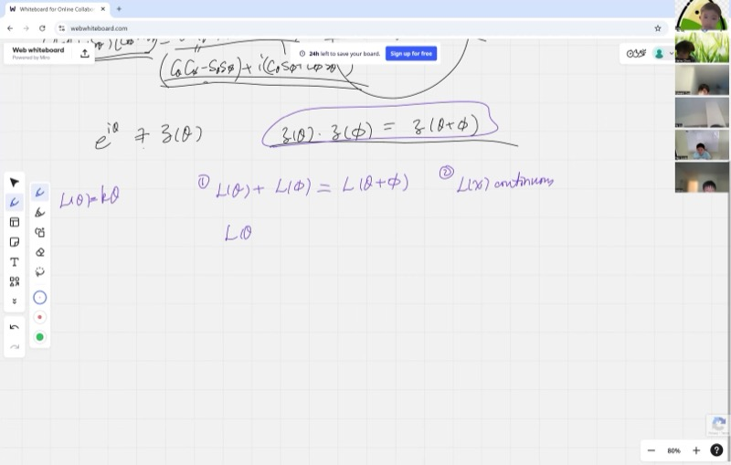

::: {.callout-tip collapse="true"}
## Why Euler's Formula Matters

Euler's formula is one of the most beautiful equations in all of mathematics. It connects three seemingly unrelated worlds:

- **Exponential functions** (growth and decay, compound interest)
- **Trigonometric functions** (circles, waves, rotations)
- **Complex numbers** (numbers with a "sideways" direction)

It is the key to understanding how rotating a complex number on the unit circle is the same as multiplying by an exponential. Engineers use it to analyze electrical circuits, physicists use it in quantum mechanics, and signal processing relies on it every time you stream music or video.
:::

## Topics Covered

- Additive functions and the functional equation $f(x + y) = f(x) + f(y)$
- Proving that continuous additive functions must be linear
- Multiplicative functions and the functional equation $g(x + y) = g(x) \cdot g(y)$
- Connecting multiplication to addition via logarithms
- The proof that $e^{i\theta} = \cos\theta + i\sin\theta$
- Continuity: the rigorous epsilon definition

## Lecture Video

```{=html}
<video controls width="100%" preload="metadata">
  <source src="https://github.com/ymote/learningmathteam/releases/download/v1.0/Saturday20250920morning.mp4" type="video/mp4">
</video>
```

## Key Video Frames

<div style="display: flex; flex-direction: column; gap: 10px; margin: 1em 0;">
  
  
  
  
</div>

## Background: What You Need to Know First

::: {.callout-note collapse="true"}
## Complex numbers on the unit circle

A **complex number** $z = a + bi$ has a real part $a$ and an imaginary part $b$, where $i^2 = -1$.

On the **unit circle** (radius 1), every point can be written as:

$$z = \cos\theta + i\sin\theta$$

where $\theta$ is the angle measured counterclockwise from the positive real axis. The real part is $\cos\theta$ (horizontal coordinate) and the imaginary part is $\sin\theta$ (vertical coordinate).
:::

::: {.callout-note collapse="true"}
## The angle-addition formulas for sine and cosine

When you multiply two unit complex numbers with angles $\theta$ and $\phi$, you get a unit complex number with angle $\theta + \phi$. Expanding the multiplication gives the **angle-addition identities**:

$$\cos(\theta + \phi) = \cos\theta\cos\phi - \sin\theta\sin\phi$$

$$\sin(\theta + \phi) = \cos\theta\sin\phi + \sin\theta\cos\phi$$

These can be proven geometrically by dropping an altitude on the unit circle and computing coordinates.
:::

::: {.callout-note collapse="true"}
## The exponential function and its power series

We previously proved (via compound interest / binomial expansion) that:

$$e^x = \sum_{n=0}^{\infty} \frac{x^n}{n!} = 1 + x + \frac{x^2}{2!} + \frac{x^3}{3!} + \cdots$$

A key property of the exponential is that $e^{a+b} = e^a \cdot e^b$ -- adding exponents corresponds to multiplying values.
:::

::: {.callout-important}
## Key Ideas

1. **Additive functions** satisfy $L(\theta + \phi) = L(\theta) + L(\phi)$. If continuous, the only solution is $L(\theta) = k\theta$ (a line through the origin).
2. **Multiplicative functions** satisfy $Z(\theta + \phi) = Z(\theta) \cdot Z(\phi)$. Taking the logarithm converts them to additive functions.
3. **Logarithms bridge multiplication and addition**: $\log(ab) = \log a + \log b$.
4. **Euler's formula** $e^{i\theta} = \cos\theta + i\sin\theta$ follows from proving $Z(\theta) = e^{k\theta}$ and determining $k = i$ from the geometry of the unit circle.
5. **Continuity** means nearby inputs give nearby outputs: for any desired closeness in output, you can find inputs close enough to guarantee it.
:::

## Part 1: The Multiplicative Property of Unit Complex Numbers

Define $Z(\theta) = \cos\theta + i\sin\theta$, the unit complex number at angle $\theta$.

From the angle-addition identities, we can verify:

$$Z(\theta) \cdot Z(\phi) = (\cos\theta + i\sin\theta)(\cos\phi + i\sin\phi)$$

Multiplying out and using $i^2 = -1$:

$$= (\cos\theta\cos\phi - \sin\theta\sin\phi) + i(\cos\theta\sin\phi + \sin\theta\cos\phi)$$

$$= \cos(\theta + \phi) + i\sin(\theta + \phi) = Z(\theta + \phi)$$

So $Z$ is a **multiplicative function**: adding the angles corresponds to multiplying the complex numbers.

::: {.callout-tip collapse="true"}
## Example: Checking with specific angles

Let $\theta = \frac{\pi}{3}$ and $\phi = \frac{\pi}{6}$.

- $Z\!\left(\frac{\pi}{3}\right) = \cos 60° + i\sin 60° = \frac{1}{2} + i\frac{\sqrt{3}}{2}$
- $Z\!\left(\frac{\pi}{6}\right) = \cos 30° + i\sin 30° = \frac{\sqrt{3}}{2} + i\frac{1}{2}$

Multiplying:

$$Z\!\left(\frac{\pi}{3}\right) \cdot Z\!\left(\frac{\pi}{6}\right) = \left(\frac{1}{2}\right)\!\left(\frac{\sqrt{3}}{2}\right) - \left(\frac{\sqrt{3}}{2}\right)\!\left(\frac{1}{2}\right) + i\left[\left(\frac{1}{2}\right)\!\left(\frac{1}{2}\right) + \left(\frac{\sqrt{3}}{2}\right)\!\left(\frac{\sqrt{3}}{2}\right)\right] = 0 + i \cdot 1 = i$$

And indeed $Z\!\left(\frac{\pi}{2}\right) = \cos 90° + i\sin 90° = i$. It checks out!
:::

```{=html}
<div id="desmos-unit-circle" class="desmos-container"></div>
<script src="https://www.desmos.com/api/v1.9/calculator.js?apiKey=dcb31709b452b1cf9dc26972add0fda6"></script>
<script>
var elt1 = document.getElementById('desmos-unit-circle');
var calc1 = Desmos.GraphingCalculator(elt1, {
  expressions: true,
  settingsMenu: false
});
calc1.setExpression({id: 'circle', latex: 'x^2+y^2=1', color: '#aaaaaa'});
calc1.setExpression({id: 'theta', latex: '\\theta_1=1', sliderBounds: {min: 0, max: 6.28, step: 0.01}});
calc1.setExpression({id: 'pt', latex: '(\\cos(\\theta_1), \\sin(\\theta_1))', color: '#c74440', pointSize: 12, label: 'Z(θ)', showLabel: true});
calc1.setExpression({id: 'ray', latex: 't(\\cos(\\theta_1), \\sin(\\theta_1))', color: '#2d70b3', parametricDomain: {min: 0, max: 1}});
calc1.setExpression({id: 'realaxis', latex: 'y=0', color: '#888888', lineStyle: 'DASHED', lineWidth: 0.5});
calc1.setExpression({id: 'imagaxis', latex: 'x=0', color: '#888888', lineStyle: 'DASHED', lineWidth: 0.5});
calc1.setMathBounds({left: -1.8, right: 1.8, bottom: -1.5, top: 1.5});
</script>
```

## Part 2: Proving Continuous Additive Functions Are Linear

Before tackling $Z(\theta)$ directly, we prove a foundational result about **additive functions**.

**Theorem.** If $L: \mathbb{R} \to \mathbb{R}$ is continuous and satisfies

$$L(\theta + \phi) = L(\theta) + L(\phi) \quad \text{for all } \theta, \phi \in \mathbb{R},$$

then $L(\theta) = k\theta$ for some constant $k$.

::: {.callout-note collapse="true"}
## Proof: Additive + continuous implies linear

**Step 1: Find $L(0)$.**

Set $\theta = \phi = 0$:

$$L(0) + L(0) = L(0) \implies 2L(0) = L(0) \implies L(0) = 0$$

So the function passes through the origin.

**Step 2: Prove $L(n\theta) = nL(\theta)$ for positive integers $n$.**

Set $\theta = \phi$: $L(2\theta) = 2L(\theta)$.

Then $L(3\theta) = L(\theta + 2\theta) = L(\theta) + L(2\theta) = L(\theta) + 2L(\theta) = 3L(\theta)$.

By induction: $L(n\theta) = nL(\theta)$ for all positive integers $n$.

**Step 3: $L$ is an odd function.**

Set $\phi = -\theta$:

$$L(\theta) + L(-\theta) = L(0) = 0 \implies L(-\theta) = -L(\theta)$$

So the result extends to all integers: $L(n\theta) = nL(\theta)$ for $n \in \mathbb{Z}$.

**Step 4: Extend to rational multiples.**

From Step 2, $L(m \cdot \frac{\theta}{m}) = m \cdot L\!\left(\frac{\theta}{m}\right)$, so:

$$L\!\left(\frac{\theta}{m}\right) = \frac{1}{m} L(\theta)$$

Combining: $L\!\left(\frac{n}{m}\theta\right) = \frac{n}{m}L(\theta)$ for any integers $n, m$ with $m \neq 0$.

Setting $\theta = 1$ and calling $k = L(1)$:

$$L(q) = kq \quad \text{for all rational } q$$

**Step 5: Use continuity to extend to all reals.**

Every real number $x$ is the limit of a sequence of rationals $q_1, q_2, q_3, \ldots \to x$.

By continuity:

$$L(x) = \lim_{n\to\infty} L(q_n) = \lim_{n\to\infty} kq_n = k \cdot \lim_{n\to\infty} q_n = kx$$

Therefore $L(x) = kx$ for all $x \in \mathbb{R}$. $\blacksquare$
:::

## Part 3: What Is Continuity?

The proof above relied on **continuity**. Here is the rigorous definition.

A function $f(x)$ is **continuous** at $x_0$ if:

$$f(x_0) = \lim_{h \to 0} f(x_0 + h)$$

More precisely: for any desired accuracy $\delta > 0$, there exists a tolerance $\varepsilon > 0$ such that whenever $|h| < \varepsilon$, we have $|f(x_0 + h) - f(x_0)| < \delta$.

::: {.callout-tip collapse="true"}
## Example: Why continuity matters here

Consider a function that equals $kx$ on all rationals but does something wild on irrationals (this is possible!). Such a function would satisfy $f(x+y) = f(x) + f(y)$ but would NOT be continuous.

Continuity is the condition that rules out these "pathological" solutions and forces $L(x) = kx$ to be the only answer. The rational numbers are **dense** in the reals -- between any two real numbers there is a rational number -- so a continuous function that is $kx$ on the rationals must be $kx$ everywhere.
:::

```{=html}
<div id="desmos-continuity" class="desmos-container"></div>
<script>
var elt2 = document.getElementById('desmos-continuity');
var calc2 = Desmos.GraphingCalculator(elt2, {
  expressions: true,
  settingsMenu: false
});
calc2.setExpression({id: 'line', latex: 'y=1.5x', color: '#2d70b3', lineWidth: 2.5});
calc2.setExpression({id: 'x0', latex: 'a=2', sliderBounds: {min: -3, max: 5, step: 0.1}});
calc2.setExpression({id: 'pt', latex: '(a, 1.5a)', color: '#c74440', pointSize: 12, label: '(a, L(a))', showLabel: true});
calc2.setExpression({id: 'origin', latex: '(0,0)', color: '#388c46', pointSize: 10, label: 'Origin', showLabel: true});
calc2.setMathBounds({left: -4, right: 6, bottom: -6, top: 9});
</script>
```

## Part 4: From Multiplicative to Additive via Logarithms

The unit complex number function $Z(\theta)$ is **multiplicative**:

$$Z(\theta + \phi) = Z(\theta) \cdot Z(\phi)$$

To use our result about additive functions, we take the **natural logarithm** of both sides.

::: {.callout-note collapse="true"}
## Proof: $\log(ab) = \log a + \log b$

Let $\log a = x$ and $\log b = y$, meaning $e^x = a$ and $e^y = b$.

Then:

$$ab = e^x \cdot e^y = e^{x+y}$$

Taking the logarithm:

$$\log(ab) = x + y = \log a + \log b \quad \blacksquare$$

This is the fundamental property that converts multiplication into addition.
:::

Define $f(\theta) = \log Z(\theta)$. Then:

$$f(\theta + \phi) = \log Z(\theta + \phi) = \log\!\big[Z(\theta) \cdot Z(\phi)\big] = \log Z(\theta) + \log Z(\phi) = f(\theta) + f(\phi)$$

So $f$ is **additive**! Since $Z(\theta)$ is continuous (it traces the unit circle smoothly), and $\log$ is continuous (for nonzero inputs), the composite $f$ is also continuous.

By our theorem from Part 2:

$$f(\theta) = k\theta \quad \text{for some constant } k$$

Translating back from logarithm to exponential:

$$\log Z(\theta) = k\theta \implies Z(\theta) = e^{k\theta}$$

## Part 5: Determining $k = i$

We have shown $Z(\theta) = e^{k\theta}$, but what is $k$?

Consider an infinitesimal angle $d\theta$ near zero. The power series gives:

$$Z(d\theta) = e^{k \cdot d\theta} = 1 + k \, d\theta + \frac{(k \, d\theta)^2}{2!} + \cdots \approx 1 + k \, d\theta$$

(Higher-order terms like $(d\theta)^2$ are negligible when $d\theta$ is tiny.)

Now look at the **geometry** of $Z(d\theta)$ on the unit circle:

- $Z(0) = 1$ (the point $(1, 0)$ on the real axis)
- $Z(d\theta)$ is displaced from $Z(0)$ by a tiny arc of length $d\theta$
- This arc is essentially **vertical** (perpendicular to the real axis) when $d\theta \approx 0$
- So the displacement is $i \cdot d\theta$ (magnitude $d\theta$, direction $90°$)

Comparing: $Z(d\theta) \approx 1 + k \, d\theta \approx 1 + i \, d\theta$, so $k = i$.

Therefore:

$$\boxed{Z(\theta) = e^{i\theta} = \cos\theta + i\sin\theta}$$

This is **Euler's formula**.

::: {.callout-tip collapse="true"}
## Example: Euler's identity $e^{i\pi} + 1 = 0$

Setting $\theta = \pi$ in Euler's formula:

$$e^{i\pi} = \cos\pi + i\sin\pi = -1 + 0 = -1$$

Therefore:

$$e^{i\pi} + 1 = 0$$

This single equation links the five most fundamental constants in mathematics: $e$, $i$, $\pi$, $1$, and $0$.
:::

```{=html}
<div id="desmos-euler" class="desmos-container"></div>
<script>
var elt3 = document.getElementById('desmos-euler');
var calc3 = Desmos.GraphingCalculator(elt3, {
  expressions: true,
  settingsMenu: false
});
calc3.setExpression({id: 'circle', latex: 'x^2+y^2=1', color: '#aaaaaa'});
calc3.setExpression({id: 'theta', latex: '\\theta_1=3.14159', sliderBounds: {min: 0, max: 6.28, step: 0.01}});
calc3.setExpression({id: 'pt', latex: '(\\cos(\\theta_1), \\sin(\\theta_1))', color: '#c74440', pointSize: 14, label: 'e^{iθ}', showLabel: true});
calc3.setExpression({id: 'arc', latex: '(\\cos(t), \\sin(t))', color: '#6042a6', parametricDomain: {min: 0, max: '\\theta_1'}, lineWidth: 3});
calc3.setExpression({id: 'one', latex: '(1,0)', color: '#388c46', pointSize: 10, label: '1', showLabel: true});
calc3.setExpression({id: 'negone', latex: '(-1,0)', color: '#c74440', pointSize: 10, label: 'e^{iπ} = -1', showLabel: true});
calc3.setExpression({id: 'i_pt', latex: '(0,1)', color: '#2d70b3', pointSize: 10, label: 'i', showLabel: true});
calc3.setMathBounds({left: -2, right: 2, bottom: -1.5, top: 1.5});
</script>
```

## Part 6: Summary of the Proof Strategy

The proof followed a beautiful chain of reasoning:

1. **Geometry** $\to$ The angle-addition formulas show $Z(\theta)\cdot Z(\phi) = Z(\theta+\phi)$
2. **Algebra** $\to$ Taking logarithms converts the multiplicative equation to an additive one
3. **Analysis** $\to$ The only continuous additive function is $f(\theta) = k\theta$
4. **Geometry again** $\to$ Examining infinitesimal rotations shows $k = i$

Each step uses a different branch of mathematics, and they all fit together to prove one elegant formula.

## Cheat Sheet

::: {.key-formula}
| Concept | Formula / Definition |
|---|---|
| Unit complex number at angle $\theta$ | $Z(\theta) = \cos\theta + i\sin\theta$ |
| Euler's formula | $e^{i\theta} = \cos\theta + i\sin\theta$ |
| Euler's identity | $e^{i\pi} + 1 = 0$ |
| Additive function | $L(x+y) = L(x) + L(y)$; if continuous, then $L(x) = kx$ |
| Multiplicative function | $Z(x+y) = Z(x)\cdot Z(y)$ |
| Logarithm converts $\times$ to $+$ | $\log(ab) = \log a + \log b$ |
| Continuity at $x_0$ | $\forall\,\delta>0,\;\exists\,\varepsilon>0$ such that $|h|<\varepsilon \Rightarrow |f(x_0+h)-f(x_0)|<\delta$ |
| Power series for $e^x$ | $e^x = 1 + x + \frac{x^2}{2!} + \frac{x^3}{3!} + \cdots$ |
| Angle addition (cosine) | $\cos(\theta+\phi) = \cos\theta\cos\phi - \sin\theta\sin\phi$ |
| Angle addition (sine) | $\sin(\theta+\phi) = \cos\theta\sin\phi + \sin\theta\cos\phi$ |
:::
