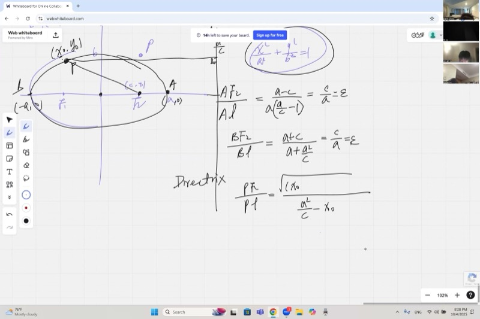
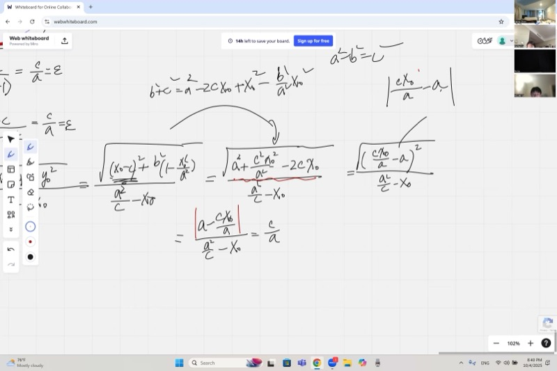
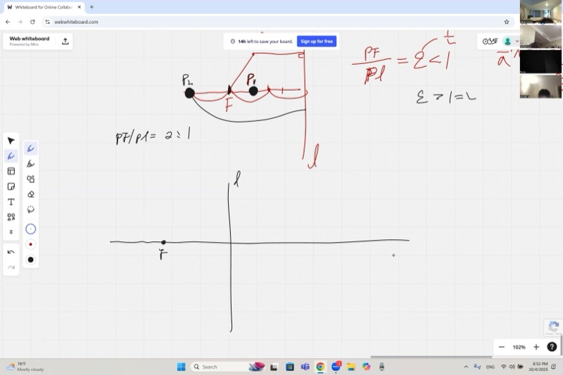
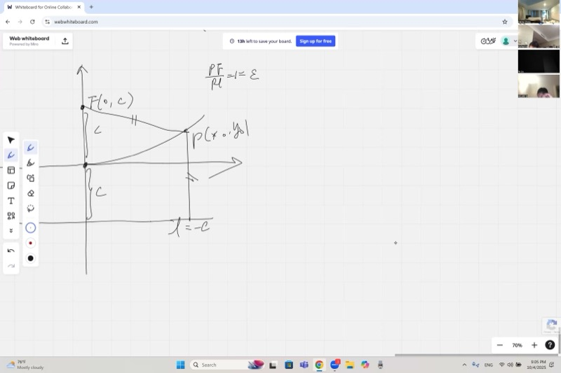

::: {.callout-tip collapse="true"}
## Motivation

The planets orbit the Sun in ellipses. Satellite dishes, flashlight reflectors, and radio telescopes are shaped like parabolas. Every GPS satellite relies on hyperbolic calculations. These three curves --- ellipse, parabola, hyperbola --- are the **conic sections**, and they are all unified by a single elegant idea: the ratio of a point's distance to a focus versus its distance to a line. That ratio, called **eccentricity**, is the star of today's lesson.
:::

## Topics Covered

- The focus-directrix definition of an ellipse (third definition)
- Proving the eccentricity ratio $\varepsilon = c/a$ for every point on an ellipse
- Eccentricity for hyperbolas ($\varepsilon > 1$) and the directrix at $x = a^2/c$
- Deriving the parabola equation from $\varepsilon = 1$ (equal distance condition)
- Why all parabolas are similar to each other

## Lecture Video

```{=html}
<video controls width="100%" preload="metadata">
  <source src="https://github.com/ymote/learningmathteam/releases/download/v1.0/Saturday20251004afternoon.mp4" type="video/mp4">
</video>
```

## Key Video Frames









## Prerequisites

::: {.callout-note collapse="true"}
## Review: Ellipse basics from the morning session

An **ellipse** centered at the origin with semi-major axis $a$ (along $x$) and semi-minor axis $b$ (along $y$) has the equation

$$\frac{x^2}{a^2} + \frac{y^2}{b^2} = 1$$

The **foci** are at $(\pm c, 0)$ where $c^2 = a^2 - b^2$, and every point $P$ on the ellipse satisfies

$$d_1 + d_2 = 2a$$

where $d_1$ and $d_2$ are the distances from $P$ to the two foci. This is the "constant sum" definition. The ellipse can also be seen as a circle stretched (dilated) by the factor $b/a$ in the $y$-direction.
:::

::: {.callout-note collapse="true"}
## Review: Hyperbola basics

A **hyperbola** centered at the origin has the equation

$$\frac{x^2}{a^2} - \frac{y^2}{b^2} = 1$$

The foci are at $(\pm c, 0)$ where $c^2 = a^2 + b^2$ (note the **plus** sign --- this is the key difference from ellipses). For any point $P$ on the hyperbola, $|d_1 - d_2| = 2a$.
:::

::: {.callout-note collapse="true"}
## What is a directrix?

A **directrix** is a fixed straight line used together with a focus to define a conic section. For every point $P$ on the conic, the ratio of the distance to the focus over the distance to the directrix is a constant called the **eccentricity** $\varepsilon$.
:::

::: {.callout-important}
## Key Ideas

1. **Eccentricity** $\varepsilon = \dfrac{c}{a}$ classifies every conic section:
   - $\varepsilon < 1$ : ellipse
   - $\varepsilon = 1$ : parabola
   - $\varepsilon > 1$ : hyperbola

2. **Directrix location**: For an ellipse or hyperbola, the directrix is the vertical line $x = \dfrac{a^2}{c}$.

3. **Focus-directrix property**: For any point $P$ on the conic, $\dfrac{PF}{PL} = \varepsilon$ (distance to focus over distance to directrix).

4. **Parabola equation**: Setting $\varepsilon = 1$ with focus at $(0, c)$ and directrix $y = -c$ yields $x^2 = 4cy$.

5. **All parabolas are similar** --- you can always rescale one to match another (unlike cubics or exponentials).
:::

## 1. The Third Definition of an Ellipse

We already have two definitions of an ellipse:

- **Definition 1 (constant sum):** The set of points where $d_1 + d_2 = 2a$.
- **Definition 2 (stretched circle):** A circle scaled by $b/a$ in one direction.

Now we introduce a third, the **focus-directrix definition**.

Given a focus $F_2 = (c, 0)$ and a vertical line $L$ (called the **directrix**) at $x = \dfrac{a^2}{c}$, we claim that for every point $P$ on the ellipse:

$$\frac{PF_2}{PL} = \frac{c}{a} = \varepsilon$$

```{=html}
<div id="desmos-1" class="desmos-container"></div>
<script src="https://www.desmos.com/api/v1.9/calculator.js?apiKey=dcb31709b452b1cf9dc26972add0fda6"></script>
<script>
  var calc1 = Desmos.GraphingCalculator(document.getElementById('desmos-1'), {
    expressions: true,
    settingsMenu: false
  });
  calc1.setExpression({ id: 'a_val', latex: 'a_0=5', sliderBounds: {min: 2, max: 8, step: 0.1} });
  calc1.setExpression({ id: 'b_val', latex: 'b_0=3', sliderBounds: {min: 1, max: 7, step: 0.1} });
  calc1.setExpression({ id: 'c_val', latex: 'c_0=\\sqrt{a_0^2-b_0^2}' });
  calc1.setExpression({ id: 'ellipse', latex: '\\frac{x^2}{a_0^2}+\\frac{y^2}{b_0^2}=1', color: '#2d70b3' });
  calc1.setExpression({ id: 'focus', latex: '(c_0, 0)', color: '#c74440', pointSize: 10, label: 'F₂', showLabel: true });
  calc1.setExpression({ id: 'directrix', latex: 'x=\\frac{a_0^2}{c_0}', color: '#388c46', lineStyle: 'DASHED', lineWidth: 2 });
  calc1.setExpression({ id: 'theta', latex: '\\theta=1', sliderBounds: {min: 0, max: 6.28, step: 0.01} });
  calc1.setExpression({ id: 'Px', latex: 'P_x=a_0\\cos(\\theta)' });
  calc1.setExpression({ id: 'Py', latex: 'P_y=b_0\\sin(\\theta)' });
  calc1.setExpression({ id: 'P', latex: '(P_x, P_y)', color: '#fa7e19', pointSize: 10, label: 'P', showLabel: true });
  calc1.setExpression({ id: 'segPF', latex: '((1-t)P_x+t\\cdot c_0,(1-t)P_y)', color: '#c74440', lineWidth: 1.5, parametricDomain: {min: 0, max: 1} });
  calc1.setExpression({ id: 'segPL', latex: '((1-t)P_x+t\\cdot\\frac{a_0^2}{c_0},(P_y))', color: '#388c46', lineWidth: 1.5, parametricDomain: {min: 0, max: 1} });
  calc1.setMathBounds({ left: -8, right: 10, bottom: -6, top: 6 });
</script>
```

**Drag the $\theta$ slider** to move point $P$ around the ellipse. Adjust $a_0$ and $b_0$ to reshape the ellipse and watch the directrix move.

### Checking the Vertices

::: {.callout-tip collapse="true"}
## Verify at vertex $A = (a, 0)$

The right vertex is $A = (a, 0)$.

**Distance to focus:** $AF_2 = a - c$

**Distance to directrix:** $AL = \dfrac{a^2}{c} - a = \dfrac{a^2 - ac}{c} = \dfrac{a(a - c)}{c}$

**Ratio:**

$$\frac{AF_2}{AL} = \frac{a - c}{\;\dfrac{a(a-c)}{c}\;} = \frac{c}{a} = \varepsilon \;\checkmark$$
:::

::: {.callout-tip collapse="true"}
## Verify at vertex $B = (-a, 0)$

The left vertex is $B = (-a, 0)$.

**Distance to focus:** $BF_2 = a + c$

**Distance to directrix:** $BL = \dfrac{a^2}{c} + a = \dfrac{a^2 + ac}{c} = \dfrac{a(a + c)}{c}$

**Ratio:**

$$\frac{BF_2}{BL} = \frac{a + c}{\;\dfrac{a(a+c)}{c}\;} = \frac{c}{a} = \varepsilon \;\checkmark$$
:::

## 2. Proof for an Arbitrary Point

::: {.callout-tip collapse="true"}
## Full algebraic proof: $PF_2 / PL = c/a$ for any point on the ellipse

Let $P = (x_0, y_0)$ lie on the ellipse, so $\dfrac{x_0^2}{a^2} + \dfrac{y_0^2}{b^2} = 1$.

**Distance to the directrix (denominator):**

$$PL = \frac{a^2}{c} - x_0$$

**Distance to the focus (numerator):**

$$PF_2 = \sqrt{(x_0 - c)^2 + y_0^2}$$

**Step 1 --- Eliminate $y_0^2$:** From the ellipse equation,

$$y_0^2 = b^2\!\left(1 - \frac{x_0^2}{a^2}\right) = \frac{b^2(a^2 - x_0^2)}{a^2}$$

**Step 2 --- Substitute into $PF_2^2$:**

$$PF_2^2 = (x_0 - c)^2 + \frac{b^2(a^2 - x_0^2)}{a^2}$$

Expand:

$$= x_0^2 - 2cx_0 + c^2 + b^2 - \frac{b^2 x_0^2}{a^2}$$

Since $b^2 + c^2 = a^2$ and $1 - \dfrac{b^2}{a^2} = \dfrac{c^2}{a^2}$:

$$= \frac{c^2 x_0^2}{a^2} - 2cx_0 + a^2 = \left(\frac{cx_0}{a} - a\right)^{\!2} = \left(a - \frac{cx_0}{a}\right)^{\!2}$$

**Step 3 --- Take the square root.** Since $-a \le x_0 \le a$, we have $\dfrac{c\,x_0}{a} \le c < a$, so $a - \dfrac{cx_0}{a} > 0$. Therefore:

$$PF_2 = a - \frac{cx_0}{a}$$

**Step 4 --- Form the ratio:**

$$\frac{PF_2}{PL} = \frac{a - \dfrac{cx_0}{a}}{\dfrac{a^2}{c} - x_0} = \frac{\dfrac{a^2 - cx_0}{a}}{\dfrac{a^2 - cx_0}{c}} = \frac{c}{a} = \varepsilon \;\;\square$$
:::

The common factor $a^2 - cx_0$ cancels in numerator and denominator, leaving $c/a$ --- independent of which point $P$ we chose. This proves the focus-directrix definition is equivalent to the original constant-sum definition.

## 3. Eccentricity Across the Conic Family

The eccentricity $\varepsilon$ smoothly connects all three conic sections:

| Conic | Relationship | Eccentricity | Shape |
|---|---|---|---|
| **Circle** | $c = 0$ | $\varepsilon = 0$ | Perfectly round |
| **Ellipse** | $c < a$, $\;a^2 = b^2 + c^2$ | $0 < \varepsilon < 1$ | Oval |
| **Parabola** | focus = directrix distance | $\varepsilon = 1$ | Open U-shape |
| **Hyperbola** | $c > a$, $\;c^2 = a^2 + b^2$ | $\varepsilon > 1$ | Two branches |

```{=html}
<div id="desmos-2" class="desmos-container"></div>
<script>
  var calc2 = Desmos.GraphingCalculator(document.getElementById('desmos-2'), {
    expressions: true,
    settingsMenu: false
  });
  calc2.setExpression({ id: 'eps', latex: '\\varepsilon=0.6', sliderBounds: {min: 0.1, max: 2.5, step: 0.01} });
  calc2.setExpression({ id: 'note', latex: '', label: 'Drag ε: <1 ellipse, =1 parabola, >1 hyperbola', showLabel: true, hidden: true, color: '#000' });
  calc2.setExpression({ id: 'focus', latex: '(1, 0)', color: '#c74440', pointSize: 10, label: 'Focus', showLabel: true });
  calc2.setExpression({ id: 'dir', latex: 'x=-1', color: '#388c46', lineStyle: 'DASHED', lineWidth: 2 });
  calc2.setExpression({ id: 'conic', latex: 'r=\\frac{1}{1-\\varepsilon\\cos(\\theta)}', color: '#2d70b3', lineWidth: 2.5 });
  calc2.setMathBounds({ left: -6, right: 8, bottom: -6, top: 6 });
</script>
```

**Drag the $\varepsilon$ slider.** Watch the conic section transform from an ellipse ($\varepsilon < 1$) through a parabola ($\varepsilon = 1$) to a hyperbola ($\varepsilon > 1$).

## 4. The Hyperbola: Directrix at $x = a^2/c$

For the hyperbola $\dfrac{x^2}{a^2} - \dfrac{y^2}{b^2} = 1$ with $c^2 = a^2 + b^2$:

- The foci are at $(\pm c, 0)$ with $c > a$, so $\varepsilon = c/a > 1$.
- The directrix is still at $x = a^2/c$, which now falls **inside** the vertex (since $a^2/c < a$).

::: {.callout-tip collapse="true"}
## Geometric intuition: why the directrix is inside for hyperbolas

For an ellipse, $c < a$, so $a^2/c > a$ --- the directrix is **outside** the ellipse, beyond the vertex.

For a hyperbola, $c > a$, so $a^2/c < a$ --- the directrix is **between** the center and the vertex. The focus is far out, the directrix is pulled inward, and $\varepsilon > 1$ means each point is **farther** from the focus than from the line.
:::

::: {.callout-warning collapse="true"}
## Homework: Prove the focus-directrix property for the hyperbola

**Task:** For any point $P = (x_0, y_0)$ on the hyperbola $\dfrac{x_0^2}{a^2} - \dfrac{y_0^2}{b^2} = 1$, show that

$$\frac{PF_2}{PL} = \frac{c}{a}$$

where $F_2 = (c,0)$ and $L$ is the line $x = a^2/c$.

**Hint:** The algebra is very similar to the ellipse proof. Substitute $y_0^2 = b^2\!\left(\dfrac{x_0^2}{a^2} - 1\right)$, expand $PF_2^2$, and use $c^2 = a^2 + b^2$. Watch the sign carefully when taking the square root --- consider which branch $P$ is on and the range of $x_0$.
:::

## 5. Deriving the Parabola from $\varepsilon = 1$

When $\varepsilon = 1$, every point $P$ is **equidistant** from the focus and the directrix. We place:

- **Focus** $F$ at $(0, c)$
- **Directrix** $L$ at $y = -c$
- **Origin** at the midpoint (a natural vertex for the parabola)

```{=html}
<div id="desmos-3" class="desmos-container"></div>
<script>
  var calc3 = Desmos.GraphingCalculator(document.getElementById('desmos-3'), {
    expressions: true,
    settingsMenu: false
  });
  calc3.setExpression({ id: 'c_val', latex: 'c_0=1', sliderBounds: {min: 0.25, max: 4, step: 0.05} });
  calc3.setExpression({ id: 'parab', latex: 'x^2=4c_0 y', color: '#2d70b3', lineWidth: 2.5 });
  calc3.setExpression({ id: 'focus', latex: '(0, c_0)', color: '#c74440', pointSize: 10, label: 'Focus (0, c)', showLabel: true });
  calc3.setExpression({ id: 'dir', latex: 'y=-c_0', color: '#388c46', lineStyle: 'DASHED', lineWidth: 2, label: 'Directrix y = -c', showLabel: true });
  calc3.setExpression({ id: 't_val', latex: 't_0=2', sliderBounds: {min: -5, max: 5, step: 0.1} });
  calc3.setExpression({ id: 'Ppt', latex: '(t_0, \\frac{t_0^2}{4c_0})', color: '#fa7e19', pointSize: 10, label: 'P', showLabel: true });
  calc3.setExpression({ id: 'toF', latex: '((1-s)t_0, (1-s)\\frac{t_0^2}{4c_0}+s\\cdot c_0)', color: '#c74440', lineWidth: 1.5, parametricDomain: {min: 0, max: 1} });
  calc3.setExpression({ id: 'toL', latex: '(t_0, (1-s)\\frac{t_0^2}{4c_0}-s\\cdot c_0)', color: '#388c46', lineWidth: 1.5, parametricDomain: {min: 0, max: 1} });
  calc3.setMathBounds({ left: -8, right: 8, bottom: -4, top: 10 });
</script>
```

**Drag $c_0$** to change the focal length --- small $c$ gives a narrow parabola, large $c$ gives a wide one. **Drag $t_0$** to move point $P$ and watch the two equal distances (red to focus, green to directrix).

::: {.callout-tip collapse="true"}
## Full derivation of the parabola equation

**Setup:** $F = (0, c)$, directrix $y = -c$, and $P = (x_0, y_0)$.

**Condition:** $PF = PL$, i.e., the distance from $P$ to the focus equals the distance from $P$ to the directrix.

**Distance to directrix:**

$$PL = y_0 + c$$

(the vertical distance from $P$ to the line $y = -c$)

**Distance to focus:**

$$PF = \sqrt{x_0^2 + (y_0 - c)^2}$$

**Set them equal and square both sides:**

$$(y_0 + c)^2 = x_0^2 + (y_0 - c)^2$$

**Expand both sides:**

$$y_0^2 + 2cy_0 + c^2 = x_0^2 + y_0^2 - 2cy_0 + c^2$$

**Cancel $y_0^2$ and $c^2$:**

$$2cy_0 = x_0^2 - 2cy_0$$

$$4cy_0 = x_0^2$$

**Result:** Dropping the subscripts, the equation of the parabola is

$$\boxed{x^2 = 4cy}$$

This is the standard form of an upward-opening parabola with vertex at the origin. $\square$
:::

### Key observations

- The parameter $c$ (focal length) controls how "wide" or "narrow" the parabola is.
- **Small $c$** $\Rightarrow$ large coefficient $\Rightarrow$ narrow parabola (focus and directrix close together).
- **Large $c$** $\Rightarrow$ small coefficient $\Rightarrow$ wide parabola (focus and directrix far apart).
- In the form $y = kx^2$, we have $k = \dfrac{1}{4c}$.

## 6. All Parabolas Are Similar

::: {.callout-important}
## A surprising fact

**Every parabola is similar to every other parabola.** You can always zoom in or out to make one parabola coincide with another. This is NOT true for cubics, exponentials, or most other curves.
:::

Consider two parabolas: $y = kx^2$ and $y = \beta x^2$ where $k \neq \beta$.

::: {.callout-tip collapse="true"}
## Proof sketch: similarity of all parabolas

To show two parabolas are similar, we need to find a uniform scaling factor $\lambda$ such that if $(x, y)$ is on one parabola, then $(\lambda x, \lambda y)$ is on the other.

If $(x, y)$ is on $y = kx^2$, then $y = kx^2$.

Scale by $\lambda$: the new point is $(X, Y) = (\lambda x, \lambda y)$, so $x = X/\lambda$ and $y = Y/\lambda$.

Substituting: $\dfrac{Y}{\lambda} = k \cdot \dfrac{X^2}{\lambda^2}$, which gives $Y = \dfrac{k}{\lambda} X^2$.

We want this to equal $Y = \beta X^2$, so we need $\dfrac{k}{\lambda} = \beta$, i.e.,

$$\lambda = \frac{k}{\beta}$$

This always has a solution, so any two parabolas are similar. $\square$

**Counterexample (homework):** Try the same argument with $y = kx^3$ and $y = \beta x^3$. You will find that scaling $x$ by $\lambda$ scales $y$ by $\lambda^3$ (not $\lambda$), so a **uniform** scaling does not work --- cubics with different coefficients are genuinely different curves.
:::

```{=html}
<div id="desmos-4" class="desmos-container"></div>
<script>
  var calc4 = Desmos.GraphingCalculator(document.getElementById('desmos-4'), {
    expressions: true,
    settingsMenu: false
  });
  calc4.setExpression({ id: 'k_val', latex: 'k=1', sliderBounds: {min: 0.1, max: 5, step: 0.1} });
  calc4.setExpression({ id: 'beta_val', latex: '\\beta=0.25', sliderBounds: {min: 0.1, max: 5, step: 0.1} });
  calc4.setExpression({ id: 'p1', latex: 'y=kx^2', color: '#2d70b3', lineWidth: 2.5, label: 'y = kx²', showLabel: true });
  calc4.setExpression({ id: 'p2', latex: 'y=\\beta x^2', color: '#c74440', lineWidth: 2.5, label: 'y = βx²', showLabel: true });
  calc4.setExpression({ id: 'lam', latex: '\\lambda=\\frac{k}{\\beta}' });
  calc4.setExpression({ id: 'p1_scaled', latex: 'y=kx^2/\\lambda', color: '#2d70b3', lineStyle: 'DASHED', lineWidth: 1.5, label: 'y=kx²  scaled by λ', showLabel: true });
  calc4.setMathBounds({ left: -5, right: 5, bottom: -1, top: 10 });
</script>
```

**Drag $k$ and $\beta$** to see two different parabolas. The dashed blue curve shows the first parabola after scaling by $\lambda = k/\beta$ --- it always coincides with the red one.

## Homework

::: {.callout-warning}
## Assignments from this lesson

1. **Hyperbola focus-directrix proof:** For any point $P = (x_0, y_0)$ on $\dfrac{x^2}{a^2} - \dfrac{y^2}{b^2} = 1$, prove $\dfrac{PF_2}{PL} = \dfrac{c}{a}$ where $F_2 = (c,0)$ and $L\!: x = a^2/c$. (Use algebra similar to the ellipse proof.)

2. **Parabola similarity:** Prove rigorously that $y = kx^2$ and $y = \beta x^2$ are always similar curves. Then show, as a counterexample, that $y = kx^3$ and $y = \beta x^3$ (with $k \neq \beta$) are **not** similar.
:::

## Cheat Sheet

::: {.key-formula}
| Concept | Formula / Fact |
|---|---|
| Ellipse equation | $\dfrac{x^2}{a^2} + \dfrac{y^2}{b^2} = 1$, $\;a^2 = b^2 + c^2$ |
| Hyperbola equation | $\dfrac{x^2}{a^2} - \dfrac{y^2}{b^2} = 1$, $\;c^2 = a^2 + b^2$ |
| Parabola equation | $x^2 = 4cy$ (focus at $(0,c)$, directrix $y = -c$) |
| Eccentricity | $\varepsilon = \dfrac{c}{a}$ |
| Directrix (ellipse/hyperbola) | $x = \dfrac{a^2}{c}$ |
| Focus-directrix property | $\dfrac{PF}{PL} = \varepsilon$ for all points $P$ on the conic |
| Distance: point to focus (ellipse) | $PF_2 = a - \dfrac{c\,x_0}{a}$ |
| Classifying conics | $\varepsilon < 1$: ellipse, $\;\varepsilon = 1$: parabola, $\;\varepsilon > 1$: hyperbola |
| All parabolas are similar | Scale by $\lambda = k/\beta$ to map $y = kx^2$ onto $y = \beta x^2$ |

### Quick Reference: Completing the Square for PF

$$PF_2^2 = (x_0 - c)^2 + y_0^2 = \frac{c^2 x_0^2}{a^2} - 2cx_0 + a^2 = \left(a - \frac{cx_0}{a}\right)^{\!2}$$

Key substitution: $y_0^2 = b^2\!\left(1 - \dfrac{x_0^2}{a^2}\right)$ and $b^2 + c^2 = a^2$.
:::
