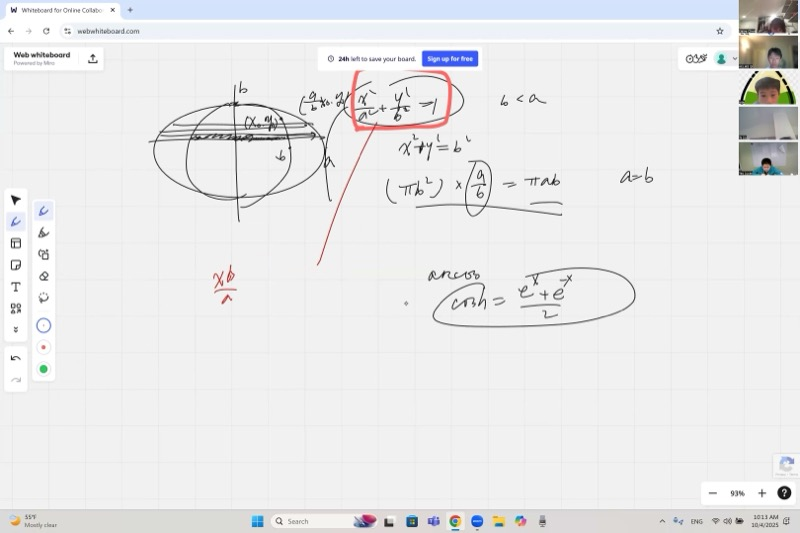
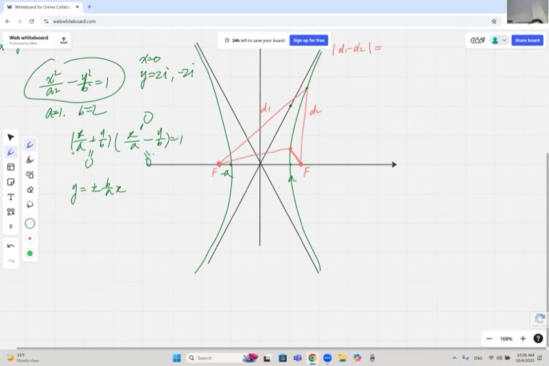
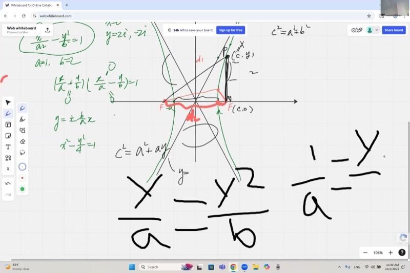
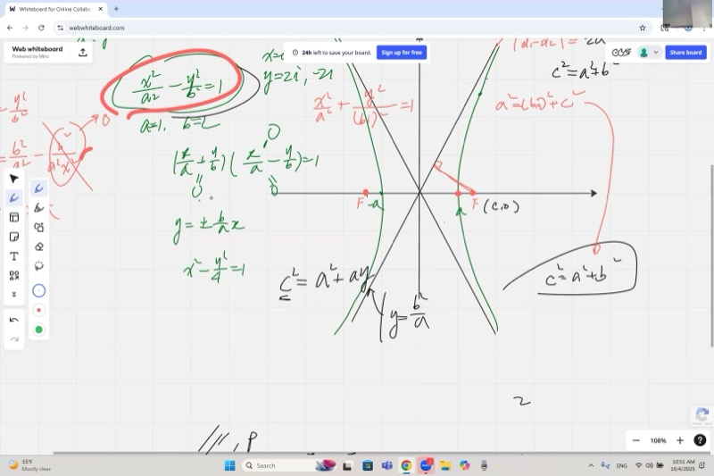

## Lecture Video

```{=html}
<video controls width="100%" preload="metadata">
  <source src="https://github.com/ymote/learningmathteam/releases/download/v1.0/Saturday20251004morning.mp4" type="video/mp4">
</video>
```

## Key Video Frames

```{=html}
<div style="display: flex; flex-direction: column; gap: 10px; margin: 1em 0;">
  
  
  
  
</div>
```

## Background

Conic sections are the family of curves you get by slicing a cone at different angles: circles, ellipses, parabolas, and hyperbolas. You already know circles ($x^2 + y^2 = r^2$) and have seen parabolas ($y = ax^2$). This lesson explores the next two members of that family --- the **ellipse** and the **hyperbola** --- and reveals how they are connected through their *focal point* properties. Think of ellipses as stretched circles and hyperbolas as their "inside-out" cousins. Both curves are defined by distance conditions involving two special points called **foci**.

::: {.callout-important}
## Key Ideas

1. An **ellipse** is the set of all points where the *sum* of distances to two foci is constant: $d_1 + d_2 = 2a$.
2. A **hyperbola** is the set of all points where the *difference* of distances to two foci is constant: $|d_1 - d_2| = 2a$.
3. For the ellipse $\dfrac{x^2}{a^2} + \dfrac{y^2}{b^2} = 1$, the focal distance satisfies $a^2 = b^2 + c^2$.
4. For the hyperbola $\dfrac{x^2}{a^2} - \dfrac{y^2}{b^2} = 1$, the focal distance satisfies $c^2 = a^2 + b^2$.
5. The ellipse is a **dilated circle** --- stretch a circle of radius $b$ horizontally by the factor $a/b$ and you get the ellipse. This gives the area formula $A = \pi a b$.
6. The hyperbola has **asymptotes** $y = \pm \dfrac{b}{a}\,x$, found by factoring $\dfrac{x^2}{a^2} - \dfrac{y^2}{b^2} = \left(\dfrac{x}{a} + \dfrac{y}{b}\right)\!\left(\dfrac{x}{a} - \dfrac{y}{b}\right) = 1$.
7. The **parabola** is the limiting case between ellipse and hyperbola, defined by equal distance to a point and a line.
:::

## 1. The Ellipse as a Stretched Circle

An ellipse with equation

$$\frac{x^2}{a^2} + \frac{y^2}{b^2} = 1$$

can be obtained by starting with a circle of radius $b$,

$$x^2 + y^2 = b^2,$$

and stretching every point horizontally by the factor $\dfrac{a}{b}$. Each point $(x_0, y_0)$ on the circle maps to $\left(\dfrac{a}{b}\,x_0,\; y_0\right)$ on the ellipse.

::: {.callout-tip collapse="true"}
## Why does stretching a circle produce the ellipse equation?

Start with a point $(x_0, y_0)$ on the circle $x^2 + y^2 = b^2$, so $x_0^2 + y_0^2 = b^2$.

After stretching, the new point is $(X, Y) = \left(\frac{a}{b}\,x_0,\; y_0\right)$, which means $x_0 = \frac{b}{a}\,X$ and $y_0 = Y$.

Substituting back:

$$\left(\frac{b}{a}\,X\right)^2 + Y^2 = b^2 \;\;\Longrightarrow\;\; \frac{X^2}{a^2} + \frac{Y^2}{b^2} = 1$$

That is exactly the ellipse equation.
:::

### Area of the Ellipse

Since the ellipse is a circle of radius $b$ (area $\pi b^2$) dilated horizontally by $\dfrac{a}{b}$, every infinitesimally thin vertical strip is widened by that factor. Therefore,

$$A_{\text{ellipse}} = \pi b^2 \cdot \frac{a}{b} = \pi a b$$

When $a = b = r$, this returns the familiar $\pi r^2$.

```{=html}
<div id="desmos-1" class="desmos-container"></div>
<script src="https://www.desmos.com/api/v1.9/calculator.js?apiKey=dcb31709b452b1cf9dc26972add0fda6"></script>
<script>
  var calc1 = Desmos.GraphingCalculator(document.getElementById('desmos-1'), {
    expressions: true,
    settingsMenu: false
  });
  calc1.setExpression({ id: 'a', latex: 'a=3', sliderBounds: {min: 1, max: 5, step: 0.1} });
  calc1.setExpression({ id: 'b', latex: 'b=2', sliderBounds: {min: 1, max: 5, step: 0.1} });
  calc1.setExpression({ id: 'ellipse', latex: '\\frac{x^2}{a^2}+\\frac{y^2}{b^2}=1', color: '#2d70b3' });
  calc1.setExpression({ id: 'circle', latex: 'x^2+y^2=b^2', color: '#888888', lineStyle: 'DASHED' });
  calc1.setExpression({ id: 'f1', latex: '(-\\sqrt{a^2-b^2}, 0)', color: '#c74440', pointSize: 10, label: 'F1', showLabel: true });
  calc1.setExpression({ id: 'f2', latex: '(\\sqrt{a^2-b^2}, 0)', color: '#c74440', pointSize: 10, label: 'F2', showLabel: true });
  calc1.setMathBounds({ left: -6, right: 6, bottom: -4, top: 4 });
</script>
```

## 2. Focal Points of the Ellipse

The two focal points $F_1(-c, 0)$ and $F_2(c, 0)$ satisfy $a^2 = b^2 + c^2$.

::: {.callout-tip collapse="true"}
## Example: Finding the foci using the special point at $(0, b)$

Consider the point $P = (0, b)$ at the top of the ellipse. By symmetry, the distances to both foci are equal:

$$d_1 = d_2 = \sqrt{c^2 + b^2}$$

Since $d_1 + d_2 = 2a$, we get:

$$2\sqrt{c^2 + b^2} = 2a \;\;\Longrightarrow\;\; c^2 + b^2 = a^2$$

This is a clean geometric proof that the focal distance $c = \sqrt{a^2 - b^2}$ for an ellipse.
:::

## 3. The Hyperbola: Equation and Graph

The hyperbola

$$\frac{x^2}{a^2} - \frac{y^2}{b^2} = 1$$

is defined by the condition that the *difference* of distances to the two foci is constant:

$$|d_1 - d_2| = 2a$$

### Finding Intercepts

- **$x$-intercepts:** Set $y = 0$ to get $x = \pm a$.
- **$y$-intercepts:** Set $x = 0$ to get $y^2 = -b^2$, so $y = \pm bi$ --- purely imaginary. There are **no real $y$-intercepts**.

::: {.callout-tip collapse="true"}
## Example: Graphing $x^2 - \dfrac{y^2}{4} = 1$

Here $a = 1$, $b = 2$.

- $x$-intercepts at $(\pm 1, 0)$.
- No $y$-intercepts (they would be at $\pm 2i$).
- Asymptotes: $y = \pm 2x$.
- The curve approaches but never touches the asymptotes.
- Focal points at $(\pm\sqrt{5}, 0)$ since $c^2 = 1 + 4 = 5$.
:::

### Asymptotes by Factoring

Factor the left-hand side:

$$\frac{x^2}{a^2} - \frac{y^2}{b^2} = \left(\frac{x}{a} + \frac{y}{b}\right)\!\left(\frac{x}{a} - \frac{y}{b}\right) = 1$$

Neither factor can be zero (because their product is 1). Setting each factor to zero gives the **untouchable lines** --- the asymptotes:

$$y = +\frac{b}{a}\,x \qquad\text{and}\qquad y = -\frac{b}{a}\,x$$

```{=html}
<div id="desmos-2" class="desmos-container"></div>
<script>
  var calc2 = Desmos.GraphingCalculator(document.getElementById('desmos-2'), {
    expressions: true,
    settingsMenu: false
  });
  calc2.setExpression({ id: 'a', latex: 'a=1', sliderBounds: {min: 0.5, max: 4, step: 0.1} });
  calc2.setExpression({ id: 'b', latex: 'b=2', sliderBounds: {min: 0.5, max: 4, step: 0.1} });
  calc2.setExpression({ id: 'hyp', latex: '\\frac{x^2}{a^2}-\\frac{y^2}{b^2}=1', color: '#2d70b3' });
  calc2.setExpression({ id: 'asym1', latex: 'y=\\frac{b}{a}x', color: '#c74440', lineStyle: 'DASHED' });
  calc2.setExpression({ id: 'asym2', latex: 'y=-\\frac{b}{a}x', color: '#c74440', lineStyle: 'DASHED' });
  calc2.setExpression({ id: 'f1', latex: '(-\\sqrt{a^2+b^2}, 0)', color: '#388c46', pointSize: 10, label: 'F1', showLabel: true });
  calc2.setExpression({ id: 'f2', latex: '(\\sqrt{a^2+b^2}, 0)', color: '#388c46', pointSize: 10, label: 'F2', showLabel: true });
  calc2.setMathBounds({ left: -6, right: 6, bottom: -5, top: 5 });
</script>
```

## 4. Proving $c^2 = a^2 + b^2$ for the Hyperbola

The lecture proves this relationship three different ways.

### Method 1: Using the vertex point

::: {.callout-note collapse="true"}
## Proof using $(\pm a, 0)$

Take the vertex point $(a, 0)$. The distances to the foci are:

$$d_1 = c + a, \qquad d_2 = c - a$$

Their difference is:

$$d_1 - d_2 = (c + a) - (c - a) = 2a \;\checkmark$$

This confirms the constant difference but does not yet determine $c$ in terms of $a$ and $b$.
:::

### Method 2: Using the latus rectum

::: {.callout-note collapse="true"}
## Proof using the point directly above the focus

Let $P = (c, y_P)$ be the point on the hyperbola directly above the focus $F_2 = (c, 0)$. This vertical segment is called the **latus rectum**.

**Step 1:** Plug $x = c$ into the hyperbola equation:

$$\frac{c^2}{a^2} - \frac{y_P^2}{b^2} = 1$$

**Step 2:** Compare with the relationship we want to prove. If $c^2 = a^2 + b^2$, then $\frac{c^2}{a^2} = 1 + \frac{b^2}{a^2}$, so:

$$\frac{y_P^2}{b^2} = \frac{c^2}{a^2} - 1 = \frac{b^2}{a^2} \;\;\Longrightarrow\;\; y_P = \frac{b^2}{a}$$

**Step 3:** The distances from $P = (c, b^2/a)$ to the two foci are:

$$d_2 = \frac{b^2}{a}, \qquad d_1 = \sqrt{4c^2 + \frac{b^4}{a^2}}$$

Setting $d_1 - d_2 = 2a$ and solving produces $c^2 = a^2 + b^2$.
:::

### Method 3: Asymptotic argument at infinity

::: {.callout-note collapse="true"}
## Proof using a point at infinity on the asymptote

Take a point $P$ on the hyperbola far from the origin, where the curve nearly coincides with the asymptote $y = \frac{b}{a}x$.

At infinity, the lines $PF_1$ and $PF_2$ become essentially **parallel** to the asymptote. The difference $d_1 - d_2$ reduces to the projection of the segment $F_1 F_2$ (length $2c$) onto the asymptote direction.

The asymptote makes angle $\theta$ with the $x$-axis where $\tan\theta = \frac{b}{a}$.

Projecting: $d_1 - d_2 = 2c \cos\theta$.

Since $\cos\theta = \frac{a}{\sqrt{a^2+b^2}}$, the condition $2c\cos\theta = 2a$ gives:

$$c \cdot \frac{a}{\sqrt{a^2+b^2}} = a \;\;\Longrightarrow\;\; c = \sqrt{a^2 + b^2}$$

This same construction produces a right triangle with legs $2a$ and $2b$ and hypotenuse $2c$, confirming $c^2 = a^2 + b^2$ geometrically.
:::

### Method 4: Imaginary substitution (Toby's insight)

::: {.callout-note collapse="true"}
## Proof by rewriting the hyperbola as an "imaginary ellipse"

Replace $b$ with $bi$ in the ellipse equation:

$$\frac{x^2}{a^2} + \frac{y^2}{(bi)^2} = 1 \;\;\Longrightarrow\;\; \frac{x^2}{a^2} - \frac{y^2}{b^2} = 1$$

This is exactly the hyperbola equation. For the ellipse, $a^2 = b_{\text{ell}}^2 + c^2$. Substituting $b_{\text{ell}} = bi$:

$$a^2 = (bi)^2 + c^2 = -b^2 + c^2 \;\;\Longrightarrow\;\; c^2 = a^2 + b^2$$

No geometry required --- just algebraic substitution.
:::

## 5. Distance from Focus to Asymptote

::: {.callout-tip collapse="true"}
## Example: Finding the distance from a focus to the asymptote

The triangle formed at infinity has sides $2a$, $2b$, and $2c$. The small triangle formed by dropping a perpendicular from $F_2 = (c, 0)$ to the asymptote is **similar** to this larger triangle (same angle $\theta$).

Since the large triangle has the ratio hypotenuse : opposite = $2c : 2b$, the smaller triangle (with hypotenuse $c$) has opposite side:

$$d = \frac{b}{2c} \cdot 2c \cdot \frac{1}{2} = b$$

Wait --- even simpler by similarity: the large triangle has sides $2c$, $2a$, $2b$. The small triangle has hypotenuse $c$ (half the large hypotenuse), so all sides are halved. The perpendicular distance from the focus to the asymptote is simply:

$$\boxed{d = b}$$
:::

## 6. The Parabola: A Limiting Case

The **parabola** is the conic section that lives between the ellipse and the hyperbola.

- **Ellipse:** sum of distances to two foci = constant.
- **Hyperbola:** difference of distances to two foci = constant.
- **Parabola:** distance to one focus = distance to a line (the *directrix*).

You can think of the parabola as the case where one focus has moved to infinity while the other stays fixed, and the constant sum/difference also tends to infinity.

## Cheat Sheet

::: {.key-formula}
| Conic | Equation | Distance Property | Focal Relation |
|---|---|---|---|
| **Ellipse** | $\dfrac{x^2}{a^2} + \dfrac{y^2}{b^2} = 1$ | $d_1 + d_2 = 2a$ | $a^2 = b^2 + c^2$ |
| **Hyperbola** | $\dfrac{x^2}{a^2} - \dfrac{y^2}{b^2} = 1$ | $\lvert d_1 - d_2\rvert = 2a$ | $c^2 = a^2 + b^2$ |
| **Parabola** | $y^2 = 4px$ | $d_{\text{focus}} = d_{\text{directrix}}$ | focus at $(p, 0)$ |

### Quick Reference

| What you want | What to do |
|---|---|
| Area of ellipse | $A = \pi a b$ |
| Foci of ellipse | $(\pm\sqrt{a^2 - b^2},\; 0)$ |
| Foci of hyperbola | $(\pm\sqrt{a^2 + b^2},\; 0)$ |
| Asymptotes of hyperbola | $y = \pm\dfrac{b}{a}\,x$ |
| Latus rectum length | $\dfrac{2b^2}{a}$ |
| Distance from focus to asymptote | $b$ |
| Factor the hyperbola | $\left(\dfrac{x}{a} + \dfrac{y}{b}\right)\!\left(\dfrac{x}{a} - \dfrac{y}{b}\right) = 1$ |
:::
