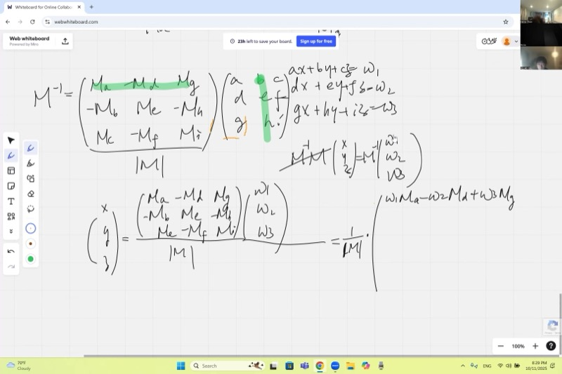
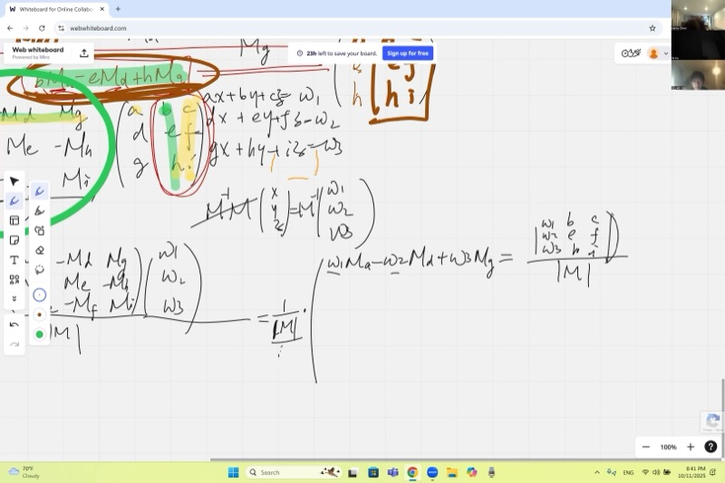
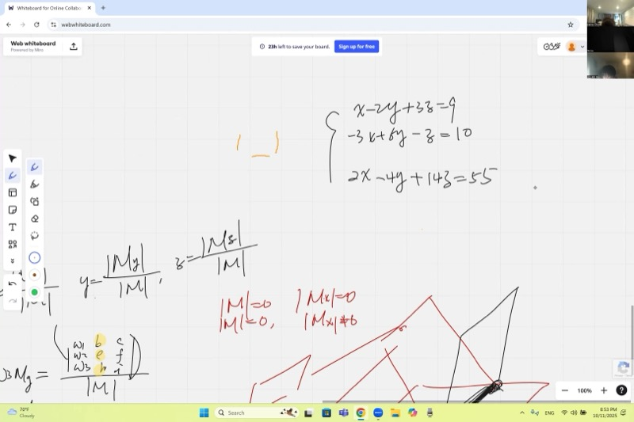
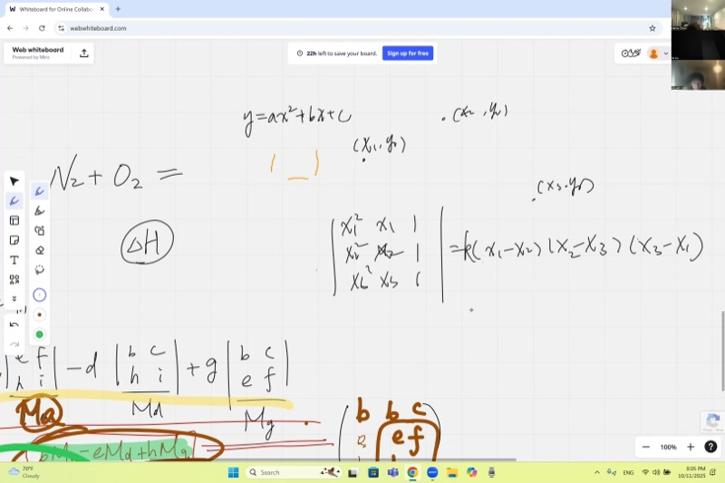

::: {.callout-tip collapse="true"}
## Real-World Connection: How Engineers Solve Massive Systems

Every time a structural engineer designs a bridge, they end up with hundreds of equations describing forces at every joint. Every time a circuit designer analyzes a chip, they get thousands of equations from Kirchhoff's laws. How do they solve all those equations at once?

**Cramer's rule** gives an elegant theoretical answer: replace one column of the coefficient matrix with the right-hand side, take the determinant, and divide. It is the foundation behind the solvers used in physics simulations, economics models, and computer graphics — anywhere systems of equations appear.
:::

## Topics Covered

- Recap: inverse of a 3×3 matrix using cofactors
- Deriving Cramer's rule from the matrix inverse
- Interpreting solutions as ratios of determinants
- Existence and uniqueness of solutions (one, none, or infinitely many)
- The Vandermonde determinant and parabola fitting through three points

::: {.callout-note collapse="true"}
## Review: Determinants and Cofactors (Morning Session Recap)

For a 3×3 matrix $M = \begin{pmatrix} a & b & c \\ d & e & f \\ g & h & i \end{pmatrix}$, the **determinant** is:

$$|M| = a(ei - fh) - d(bi - ch) + g(bf - ce)$$

Each smaller 2×2 determinant is called a **cofactor**. For example, $M_a = ei - fh$ is the cofactor you get by crossing out the row and column of $a$.

The determinant represents the **signed volume** of the parallelepiped formed by the three row (or column) vectors.
:::

## Lecture Video

```{=html}
<video controls width="100%" preload="metadata">
  <source src="https://github.com/ymote/learningmathteam/releases/download/v1.0/Saturday20251011afternoon.mp4" type="video/mp4">
</video>
```

## Key Video Frames









## The Inverse of a 3×3 Matrix

::: {.callout-important}
## Key Idea: Matrix Inverse from Cofactors

For an invertible matrix $M$, the inverse is:

$$M^{-1} = \frac{1}{|M|} \begin{pmatrix} M_a & -M_d & M_g \\ -M_b & M_e & -M_h \\ M_c & -M_f & M_i \end{pmatrix}$$

Notice the **transpose**: cofactors swap rows and columns, and signs follow a **checkerboard pattern** ($+, -, +, -, \ldots$).

**Critical detail:** you must divide by the determinant $|M|$. Without it, multiplying $M$ by this matrix gives $|M| \cdot I$ instead of $I$.
:::

The cofactor matrix (before transposing) looks like:

$$\begin{pmatrix} +M_a & -M_b & +M_c \\ -M_d & +M_e & -M_f \\ +M_g & -M_h & +M_i \end{pmatrix}$$

After transposing and dividing by $|M|$, we get the true inverse. You can verify by multiplying $M \cdot M^{-1}$:

- **Diagonal entries** produce $|M| / |M| = 1$ (matching element-cofactor pairs give the determinant).
- **Off-diagonal entries** produce $0 / |M| = 0$ (mismatched pairs give zero).

::: {.callout-note collapse="true"}
## Why Do Mismatched Pairs Give Zero?

When you multiply a row by the "wrong" cofactors — say the second column $(b, e, h)$ against the cofactors of the first column $(M_a, M_d, M_g)$ — the result is:

$$b \cdot M_a - e \cdot M_d + h \cdot M_g$$

This looks exactly like a determinant, but of a matrix where the first column has been **replaced** by the second column:

$$\begin{pmatrix} b & b & c \\ e & e & f \\ h & h & i \end{pmatrix}$$

Two identical columns mean two linearly dependent vectors — so the volume (determinant) is **zero**.
:::

## From Inverse to Solution: Deriving Cramer's Rule

A system of three equations:

$$\begin{cases} ax + by + cz = w_1 \\ dx + ey + fz = w_2 \\ gx + hy + iz = w_3 \end{cases}$$

can be written as $M \mathbf{v} = \mathbf{w}$, where $\mathbf{v} = \begin{pmatrix} x \\ y \\ z \end{pmatrix}$ and $\mathbf{w} = \begin{pmatrix} w_1 \\ w_2 \\ w_3 \end{pmatrix}$.

Multiplying both sides by $M^{-1}$:

$$\mathbf{v} = M^{-1} \mathbf{w} = \frac{1}{|M|} \begin{pmatrix} M_a & -M_d & M_g \\ -M_b & M_e & -M_h \\ M_c & -M_f & M_i \end{pmatrix} \begin{pmatrix} w_1 \\ w_2 \\ w_3 \end{pmatrix}$$

Reading off the first component:

$$x = \frac{w_1 M_a - w_2 M_d + w_3 M_g}{|M|}$$

::: {.callout-important}
## Cramer's Rule

$$x = \frac{|M_x|}{|M|}, \qquad y = \frac{|M_y|}{|M|}, \qquad z = \frac{|M_z|}{|M|}$$

where $M_x$ is $M$ with its **first column** replaced by $\mathbf{w}$, $M_y$ has the **second column** replaced, and $M_z$ has the **third column** replaced:

$$M_x = \begin{pmatrix} w_1 & b & c \\ w_2 & e & f \\ w_3 & h & i \end{pmatrix}, \quad M_y = \begin{pmatrix} a & w_1 & c \\ d & w_2 & f \\ g & w_3 & i \end{pmatrix}, \quad M_z = \begin{pmatrix} a & b & w_1 \\ d & e & w_2 \\ g & h & w_3 \end{pmatrix}$$
:::

::: {.callout-note collapse="true"}
## Why Does the Numerator Equal a Determinant?

Take $x = \frac{w_1 M_a - w_2 M_d + w_3 M_g}{|M|}$. The cofactors $M_a, M_d, M_g$ come from eliminating the first column. When we "force" the numerator into the form of a determinant, we need the first-column elements to match $w_1, w_2, w_3$ (since those are what the cofactors get multiplied by).

So we build a new matrix where the first column is $(w_1, w_2, w_3)^T$ and everything else stays the same. The cofactors $M_a, M_d, M_g$ are unchanged because they only involve columns 2 and 3. The resulting determinant is exactly our numerator.
:::

## Example: Solving a 3×3 System

::: {.callout-note collapse="true"}
## Worked Example

Solve:
$$\begin{cases} 2x - y + 3z = 9 \\ x + 4y - z = 2 \\ 3x + 2y + 5z = 21 \end{cases}$$

**Step 1:** Write the coefficient matrix and compute $|M|$.

$$M = \begin{pmatrix} 2 & -1 & 3 \\ 1 & 4 & -1 \\ 3 & 2 & 5 \end{pmatrix}$$

$$|M| = 2(4 \cdot 5 - (-1) \cdot 2) - 1((-1) \cdot 5 - 3 \cdot 2) + 3((-1) \cdot 2 - 4 \cdot 3)$$
$$= 2(22) - 1(-11) + 3(-14) = 44 + 11 - 42 = 13$$

Since $|M| \neq 0$, a unique solution exists.

**Step 2:** Compute $|M_x|$ (replace first column with $(9, 2, 21)^T$):

$$M_x = \begin{pmatrix} 9 & -1 & 3 \\ 2 & 4 & -1 \\ 21 & 2 & 5 \end{pmatrix}$$

$$|M_x| = 9(22) - 2(-5 - 6) + 21(1 - 12) = 198 + 22 - 231 = -11$$

Wait — let's recalculate more carefully:

$$|M_x| = 9(4 \cdot 5 - (-1) \cdot 2) - 2((-1) \cdot 5 - 3 \cdot 2) + 21((-1)(-1) - 4 \cdot 3)$$
$$= 9(22) - 2(-11) + 21(1 - 12) = 198 + 22 - 231 = -11$$

Hmm, that doesn't give a clean answer. Let's try a cleaner example instead. Consider:

$$\begin{cases} x + 2y + z = 9 \\ 2x - y + 3z = 8 \\ 3x + y - z = 2 \end{cases}$$

$$|M| = 1(-1 \cdot(-1) - 3 \cdot 1) - 2(2 \cdot(-1) - 3 \cdot 3) + 1(2 \cdot 1 - (-1) \cdot 3)$$
$$= 1(1-3) - 2(-2-9) + 1(2+3) = -2 + 22 + 5 = 25$$

$$|M_x| = \begin{vmatrix} 9 & 2 & 1 \\ 8 & -1 & 3 \\ 2 & 1 & -1 \end{vmatrix} = 9(1-3) - 8(-2-1) + 2(6+1) = -18 + 24 + 14 = 20 \;\;\Rightarrow\;\; x = \frac{20}{25} \;\; \text{— still not clean.}$$

The algebra is tedious by hand — and that is exactly the point the lecture makes. Cramer's rule is **conceptually simple** but **computationally heavy**. In practice we use it to understand *structure*, not to crunch numbers.
:::

## Existence and Uniqueness of Solutions

```{=html}
<div id="desmos-1" class="desmos-container"></div>
<script src="https://www.desmos.com/api/v1.9/calculator.js?apiKey=dcb31709b452b1cf9dc26972add0fda6"></script>
<script>
  var calc1 = Desmos.GraphingCalculator(document.getElementById('desmos-1'), {
    expressions: true,
    settingsMenu: false
  });
  // Two intersecting lines — unique solution
  calc1.setExpression({ id: 'line1', latex: 'y = 2x + 1', color: '#c74440', lineWidth: 3 });
  calc1.setExpression({ id: 'line2', latex: 'y = -x + 4', color: '#2d70b3', lineWidth: 3 });
  calc1.setExpression({ id: 'pt', latex: '(1, 3)', color: '#388c46', pointSize: 12, label: 'Unique solution (1,3)', showLabel: true });
  // Parallel lines — no solution
  calc1.setExpression({ id: 'line3', latex: 'y = 2x - 3', color: '#c74440', lineWidth: 2, lineStyle: Desmos.Styles.DASHED });
  calc1.setMathBounds({ left: -3, right: 7, bottom: -4, top: 8 });
</script>
```

The determinant of the coefficient matrix $|M|$ tells us everything:

| Condition | Geometric Meaning | Solutions |
|---|---|---|
| $|M| \neq 0$ | Planes meet at a single point | **Unique** solution |
| $|M| = 0$ and some $|M_x| \neq 0$ | Planes are parallel (no common point) | **No** solution |
| $|M| = 0$ and all $|M_x| = |M_y| = |M_z| = 0$ | Planes share a line or coincide | **Infinitely many** solutions |

::: {.callout-warning collapse="true"}
## The $\frac{0}{0}$ Trap

When both numerator and denominator are zero, the result is **indeterminate** — not infinity, not zero. You cannot determine the answer from Cramer's rule alone.

- $\frac{\text{nonzero}}{0} \to$ no solution (geometrically: planes parallel, intersection "at infinity")
- $\frac{0}{0} \to$ indeterminate (need to reduce the system further to find the family of solutions)

In 3D, three planes sharing a common line looks like three book pages joined at the spine — infinitely many intersection points along that line.
:::

## In-Class Example: A System with Infinitely Many Solutions

::: {.callout-note collapse="true"}
## Example from the lecture

$$\begin{cases} x - 2y + 3z = 9 \\ -3x + 6y - z = 10 \\ 2x - 4y + 14z = 55 \end{cases}$$

The coefficient matrix:

$$M = \begin{pmatrix} 1 & -2 & 3 \\ -3 & 6 & -1 \\ 2 & -4 & 14 \end{pmatrix}$$

**Step 1:** Compute $|M|$.

$$|M| = 1(6 \cdot 14 - (-1)(-4)) - (-3)((-2)(14) - 3 \cdot(-4)) + 2((-2)(-1) - 3 \cdot 6)$$
$$= 1(84 - 4) + 3(-28 + 12) + 2(2 - 18)$$
$$= 80 - 48 - 32 = 0$$

Since $|M| = 0$, we check the numerator determinants. In this case, they are also zero, confirming **infinitely many solutions**. One of the equations is a linear combination of the others — it is redundant.

Geometrically, the three planes intersect along a common line.
:::

## The Vandermonde Determinant and Curve Fitting

A key application: fitting a parabola $y = ax^2 + bx + c$ through three points $(x_1, y_1)$, $(x_2, y_2)$, $(x_3, y_3)$.

Plugging each point into $y = ax^2 + bx + c$ gives:

$$\begin{cases} x_1^2 a + x_1 b + c = y_1 \\ x_2^2 a + x_2 b + c = y_2 \\ x_3^2 a + x_3 b + c = y_3 \end{cases}$$

The coefficient matrix is:

$$V = \begin{pmatrix} x_1^2 & x_1 & 1 \\ x_2^2 & x_2 & 1 \\ x_3^2 & x_3 & 1 \end{pmatrix}$$

::: {.callout-important}
## The Vandermonde Determinant

$$|V| = -(x_1 - x_2)(x_2 - x_3)(x_3 - x_1)$$

This is **never zero** as long as $x_1, x_2, x_3$ are all different. Therefore, three distinct points always determine a unique parabola.
:::

::: {.callout-note collapse="true"}
## How Do We Know the Leading Coefficient Is $-1$?

We can factor the determinant by noticing its roots: when any two $x$-values are equal, two rows become identical and the determinant vanishes. So $(x_1 - x_2)$, $(x_2 - x_3)$, and $(x_3 - x_1)$ are all factors.

Since the determinant is a degree-3 polynomial in the $x_i$ variables (matching the degree of the product), there is only a constant $k$ left to determine. By expanding a single term — for example, the diagonal product $x_1^2 \cdot x_2 \cdot 1 = x_1^2 x_2$ — and matching it against the same term in $k(x_1 - x_2)(x_2 - x_3)(x_3 - x_1)$, we find $k = -1$.
:::

**Visualize parabola fitting: drag the three points to see the unique parabola through them.**

```{=html}
<div id="desmos-2" class="desmos-container"></div>
<script>
  var calc2 = Desmos.GraphingCalculator(document.getElementById('desmos-2'), {
    expressions: true,
    settingsMenu: false
  });
  // Three draggable points
  calc2.setExpression({ id: 'P1', latex: '(-2, 4)', color: '#c74440', pointSize: 12, label: 'P₁', showLabel: true });
  calc2.setExpression({ id: 'P2', latex: '(0, 0)', color: '#2d70b3', pointSize: 12, label: 'P₂', showLabel: true });
  calc2.setExpression({ id: 'P3', latex: '(3, 9)', color: '#388c46', pointSize: 12, label: 'P₃', showLabel: true });
  // Parabola through these three points using Lagrange interpolation
  calc2.setExpression({ id: 'x1', latex: 'x_1 = -2' });
  calc2.setExpression({ id: 'y1', latex: 'y_1 = 4' });
  calc2.setExpression({ id: 'x2', latex: 'x_2 = 0' });
  calc2.setExpression({ id: 'y2', latex: 'y_2 = 0' });
  calc2.setExpression({ id: 'x3', latex: 'x_3 = 3' });
  calc2.setExpression({ id: 'y3', latex: 'y_3 = 9' });
  calc2.setExpression({ id: 'parabola', latex: 'y = y_1\\frac{(x-x_2)(x-x_3)}{(x_1-x_2)(x_1-x_3)} + y_2\\frac{(x-x_1)(x-x_3)}{(x_2-x_1)(x_2-x_3)} + y_3\\frac{(x-x_1)(x-x_2)}{(x_3-x_1)(x_3-x_2)}', color: '#fa7e19', lineWidth: 3 });
  calc2.setMathBounds({ left: -5, right: 6, bottom: -3, top: 12 });
</script>
```

## Computational Complexity

Cramer's rule requires computing $n+1$ determinants, each of which involves $n!$ terms. For large systems:

| Variables ($n$) | Terms per determinant | Total operations |
|---|---|---|
| 3 | 6 | ~24 |
| 7 | 5,040 | ~40,320 |
| 10 | 3,628,800 | ~39,916,800 |
| 20 | $\approx 2.4 \times 10^{18}$ | Impractical |

> Cramer's rule is **conceptually beautiful** but **computationally expensive**. For large systems, numerical methods like Gaussian elimination ($O(n^3)$) are far more efficient.

## Cheat Sheet

::: {.key-formula}
| Concept | Formula / Rule |
|---|---|
| Determinant (3×3) | $\|M\| = a(ei-fh) - d(bi-ch) + g(bf-ce)$ |
| Matrix inverse | $M^{-1} = \frac{1}{\|M\|} \cdot (\text{cofactor matrix})^T$ |
| Cramer's rule for $x$ | $x = \frac{\|M_x\|}{\|M\|}$ (replace 1st column with $\mathbf{w}$) |
| Cramer's rule for $y$ | $y = \frac{\|M_y\|}{\|M\|}$ (replace 2nd column with $\mathbf{w}$) |
| Cramer's rule for $z$ | $z = \frac{\|M_z\|}{\|M\|}$ (replace 3rd column with $\mathbf{w}$) |
| Unique solution | $\|M\| \neq 0$ |
| No solution | $\|M\| = 0$ but some numerator $\neq 0$ |
| Infinitely many | $\|M\| = 0$ and all numerators $= 0$ |
| Vandermonde det | $-(x_1-x_2)(x_2-x_3)(x_3-x_1)$ |
| Parabola through 3 pts | Always unique if $x_1 \neq x_2 \neq x_3$ |

**Remember:** Cramer's rule turns solving a system into computing determinants. The denominator is always $|M|$; the numerator replaces the column corresponding to the variable you want.
:::
