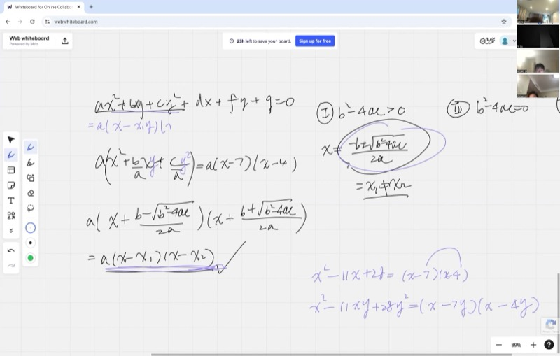
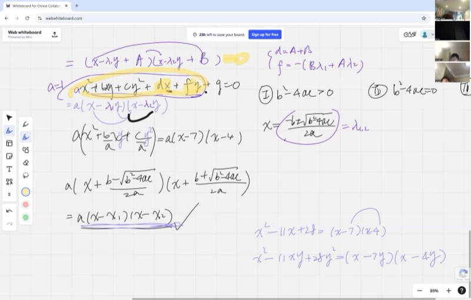
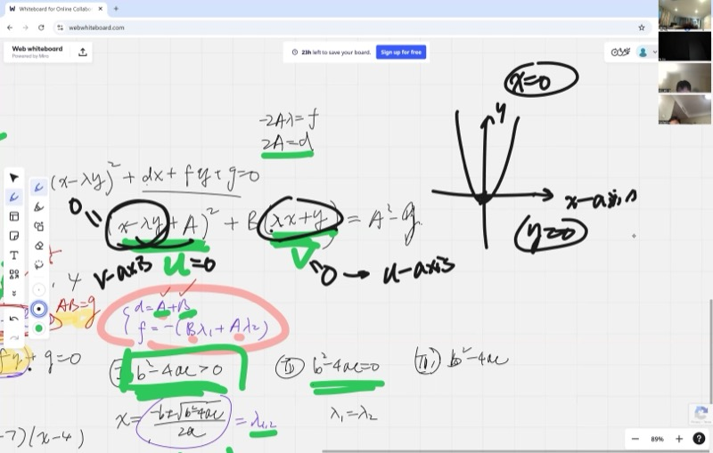
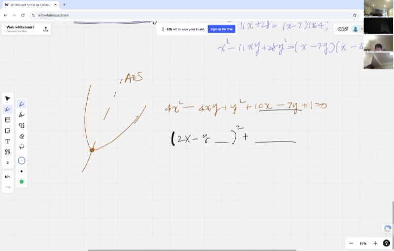

::: {.callout-tip collapse="true"}
## Why This Matters: Conics Are Everywhere

Conic sections -- ellipses, hyperbolas, and parabolas -- show up throughout science and engineering:

- **Planetary orbits** follow ellipses (Kepler's first law)
- **GPS and radar** use hyperbolas to triangulate positions
- **Telescope mirrors** are parabolic to focus light to a single point
- **Earthquake detection** uses hyperbolas from arrival-time differences at stations

In this lesson, we learn how to take *any* second-degree equation in two variables and classify it instantly using just three numbers -- no graphing required!
:::

## Topics Covered

- Factoring the general quadratic form $ax^2 + bxy + cy^2$
- Connection between single-variable and two-variable factoring
- Eigenvalues $\lambda_1, \lambda_2$ as roots of the characteristic equation
- Discriminant test: $b^2 - 4ac$ classifies conics
- Absorbing linear terms into factored form
- Coordinate transformation and rotation of axes for parabolas

## Lecture Video

```{=html}
<video controls width="100%" preload="metadata">
  <source src="https://github.com/ymote/learningmathteam/releases/download/v1.0/Saturday20251018afternoon.mp4" type="video/mp4">
</video>
```

## Key Video Frames









## What You Need to Know First

::: {.callout-note collapse="true"}
## Review: The Quadratic Formula

For a single-variable quadratic $ax^2 + bx + c = 0$, the two roots are:

$$x = \frac{-b \pm \sqrt{b^2 - 4ac}}{2a}$$

The expression $\Delta = b^2 - 4ac$ is called the **discriminant**. It tells us the nature of the roots:

- $\Delta > 0$: two distinct real roots
- $\Delta = 0$: one repeated (double) root
- $\Delta < 0$: no real roots (complex roots)
:::

::: {.callout-note collapse="true"}
## Review: Factored Form of a Quadratic

If a quadratic $ax^2 + bx + c$ has roots $x_1$ and $x_2$, then it factors as:

$$ax^2 + bx + c = a(x - x_1)(x - x_2)$$

For example, $x^2 - 11x + 28$ has roots $x_1 = 7$ and $x_2 = 4$, so:

$$x^2 - 11x + 28 = (x - 7)(x - 4)$$
:::

::: {.callout-note collapse="true"}
## What is a conic section?

A **conic section** is any curve you get by slicing a cone with a plane. The general second-degree equation in two variables is:

$$ax^2 + bxy + cy^2 + dx + fy + g = 0$$

Depending on the coefficients, this can be an **ellipse**, **hyperbola**, **parabola**, or a **degenerate** case (two lines, a point, etc.).
:::

## Key Concepts

::: {.callout-important}
## Key Ideas

1. The **type** of a conic is determined entirely by the three leading coefficients $a$, $b$, $c$ through the discriminant $b^2 - 4ac$.
2. The **eigenvalues** $\lambda_1, \lambda_2$ are the roots of treating $ax^2 + bxy + cy^2$ as a quadratic in $x/y$.
3. Classification:
   - $b^2 - 4ac > 0$ $\Longrightarrow$ **Hyperbola** (two distinct real $\lambda$'s, two asymptotes)
   - $b^2 - 4ac = 0$ $\Longrightarrow$ **Parabola** (one repeated $\lambda$, one direction of symmetry)
   - $b^2 - 4ac < 0$ $\Longrightarrow$ **Ellipse** (no real factorization, closed curve)
4. For parabolas, we rotate axes using **perpendicular** new variables $u$ and $v$ to recover the standard form.
:::

## 1. From One Variable to Two: Factoring Quadratic Forms

### Single-variable factoring

Starting from $ax^2 + bx + c$, we factor out $a$ and use the quadratic formula to find the roots $x_1, x_2$:

$$ax^2 + bx + c = a(x - x_1)(x - x_2)$$

### Extending to two variables

Now consider the **quadratic form** in two variables (just the degree-2 terms of a conic):

$$ax^2 + bxy + cy^2$$

::: {.callout-tip collapse="true"}
## How does the factoring trick extend?

Compare the single-variable case $x^2 - 11x + 28 = (x-7)(x-4)$ with:

$$x^2 - 11xy + 28y^2$$

Notice what changes: everywhere a constant appeared, we now have that constant times $y$. So the factorization becomes:

$$x^2 - 11xy + 28y^2 = (x - 7y)(x - 4y)$$

Each factor is now a **linear combination** of $x$ and $y$, which represents a **line** through the origin!
:::

To factor $ax^2 + bxy + cy^2$, we treat it as a quadratic in $x$ (with $y$ as a parameter). Dividing by $a$ and treating the ratio $\lambda = x/y$ as the unknown, the two roots $\lambda_1, \lambda_2$ satisfy:

$$\lambda = \frac{-b \pm \sqrt{b^2 - 4ac}}{2a}$$

and the factored form is:

$$ax^2 + bxy + cy^2 = a(x - \lambda_1 y)(x - \lambda_2 y)$$

We call $\lambda_1$ and $\lambda_2$ the **eigenvalues** of the quadratic form.

```{=html}
<div id="desmos-1" class="desmos-container"></div>
<script src="https://www.desmos.com/api/v1.9/calculator.js?apiKey=dcb31709b452b1cf9dc26972add0fda6"></script>
<script>
  var calc1 = Desmos.GraphingCalculator(document.getElementById('desmos-1'), {
    expressions: true,
    settingsMenu: false
  });
  calc1.setExpression({ id: 'line1', latex: 'y=\\frac{1}{7}x', color: '#c74440', lineStyle: 'DASHED', label: 'x - 7y = 0', showLabel: true });
  calc1.setExpression({ id: 'line2', latex: 'y=\\frac{1}{4}x', color: '#2d70b3', lineStyle: 'DASHED', label: 'x - 4y = 0', showLabel: true });
  calc1.setExpression({ id: 'curve', latex: 'x^2 - 11xy + 28y^2 = 1', color: '#388c46' });
  calc1.setMathBounds({ left: -3, right: 3, bottom: -3, top: 3 });
</script>
```

*The green curve $x^2 - 11xy + 28y^2 = 1$ is a hyperbola whose asymptotes (dashed lines) are exactly the two linear factors set to zero.*

## 2. Classifying Conics with the Discriminant

The discriminant $\Delta = b^2 - 4ac$ from the quadratic form $ax^2 + bxy + cy^2$ tells us everything:

### Case 1: $b^2 - 4ac > 0$ -- Hyperbola

Two distinct real roots $\lambda_1 \neq \lambda_2$ exist. The quadratic form factors into two non-parallel lines:

$$a(x - \lambda_1 y)(x - \lambda_2 y)$$

::: {.callout-tip collapse="true"}
## Why two distinct eigenvalues guarantee a hyperbola

When $\lambda_1 \neq \lambda_2$, two important things follow:

1. **The linear terms can be absorbed.** To accommodate $dx + fy$, we solve:
   $$A + B = d, \quad -B\lambda_1 + A\lambda_2 = f$$
   This $2 \times 2$ system has a **unique solution** precisely because $\lambda_1 \neq \lambda_2$ (the lines are not parallel, so they intersect).

2. **Asymptotic behavior exists.** Setting $(x - \lambda_1 y + A)(x - \lambda_2 y + B) = h$ (some constant), one factor can approach zero while the other grows without bound. This is only possible because the two lines $x - \lambda_1 y + A = 0$ and $x - \lambda_2 y + B = 0$ are **not parallel** (different slopes $1/\lambda_1$ vs $1/\lambda_2$). These lines are the **asymptotes**.
:::

### Case 2: $b^2 - 4ac = 0$ -- Parabola

A double root $\lambda_1 = \lambda_2 = \lambda$ means the form is a perfect square:

$$a(x - \lambda y)^2$$

We cannot absorb both linear terms into one factor, so we define new perpendicular coordinates and obtain a parabola in the rotated frame.

### Case 3: $b^2 - 4ac < 0$ -- Ellipse

No real roots exist -- the form cannot be factored over the reals. The curve is closed: an **ellipse** (or a circle as a special case).

```{=html}
<div id="desmos-2" class="desmos-container"></div>
<script>
  var calc2 = Desmos.GraphingCalculator(document.getElementById('desmos-2'), {
    expressions: true,
    settingsMenu: false
  });
  calc2.setExpression({ id: 'aa', latex: 'a=1', sliderBounds: {min: -3, max: 3, step: 0.1} });
  calc2.setExpression({ id: 'bb', latex: 'b=0', sliderBounds: {min: -6, max: 6, step: 0.1} });
  calc2.setExpression({ id: 'cc', latex: 'c=1', sliderBounds: {min: -3, max: 3, step: 0.1} });
  calc2.setExpression({ id: 'conic', latex: 'ax^2+bxy+cy^2=1', color: '#2d70b3' });
  calc2.setExpression({ id: 'disc', latex: 'D=b^2-4ac', color: '#c74440' });
  calc2.setMathBounds({ left: -4, right: 4, bottom: -4, top: 4 });
</script>
```

*Drag the sliders for $a$, $b$, $c$ and watch the conic change type. The value $D = b^2 - 4ac$ updates in real time -- positive for hyperbolas, zero at the transition, negative for ellipses.*

## 3. Absorbing Linear Terms: The Full Equation

Starting from the general conic (with $a = 1$ after dividing through):

$$x^2 + bxy + cy^2 + dx + fy + g = 0$$

After factoring the quadratic part, we want to write:

$$(x - \lambda_1 y + A)(x - \lambda_2 y + B) = h$$

where $h = AB - g$.

::: {.callout-tip collapse="true"}
## Finding A and B

Expanding the left side and matching the linear coefficients:

$$\begin{cases} A + B = d \\ -B\lambda_1 + A\lambda_2 = f \end{cases}$$

This is a $2 \times 2$ linear system in $A$ and $B$. It has a unique solution when the determinant is nonzero, which happens exactly when $\lambda_1 \neq \lambda_2$.

When $\lambda_1 = \lambda_2$ (parabola case), the system may have no solution -- meaning we cannot write the equation as a product of two linear factors. Instead, we proceed with a coordinate rotation.
:::

The two lines $x - \lambda_1 y + A = 0$ and $x - \lambda_2 y + B = 0$ are the **asymptotes** of the hyperbola. Their slopes are $1/\lambda_1$ and $1/\lambda_2$ respectively, and they are guaranteed to be non-parallel because $\lambda_1 \neq \lambda_2$.

## 4. Coordinate Rotation for Parabolas

When $b^2 - 4ac = 0$ (double root $\lambda$), the quadratic part becomes $(x - \lambda y)^2$ and we define new variables:

$$u = x - \lambda y, \qquad v = \lambda x + y$$

::: {.callout-important}
## Why These Specific New Variables?

The lines $u = 0$ and $v = 0$ (i.e., $x - \lambda y = 0$ and $\lambda x + y = 0$) are **perpendicular** to each other!

**Proof:** The slope of $x - \lambda y = 0$ is $\frac{1}{\lambda}$. The slope of $\lambda x + y = 0$ is $-\lambda$. Their product is:
$$\frac{1}{\lambda} \times (-\lambda) = -1$$
Slopes that multiply to $-1$ are perpendicular. This ensures that $u$ and $v$ form a proper (rotated) coordinate system.
:::

In the new coordinates, the equation becomes:

$$u^2 + (\text{linear in } u \text{ and } v) + (\text{constant}) = 0$$

After completing the square in $u$, this takes the form:

$$(u - \alpha)^2 = \beta v + \gamma$$

which is a **parabola** in the rotated $(u, v)$-plane!

## 5. Worked Example: $4x^2 - 4xy + y^2 + 10x - 7y + 1 = 0$

::: {.callout-tip collapse="true"}
## Step 1: Identify the quadratic form and compute the discriminant

The quadratic terms are $4x^2 - 4xy + y^2$.

$$\Delta = b^2 - 4ac = (-4)^2 - 4(4)(1) = 16 - 16 = 0$$

Since $\Delta = 0$, this is a **parabola**.
:::

::: {.callout-tip collapse="true"}
## Step 2: Factor the quadratic terms

$$4x^2 - 4xy + y^2 = (2x - y)^2$$

So $\lambda = \frac{1}{2}$ (the ratio in $x - \lambda y = 0$ gives us $2x - y$, meaning $\lambda = 1/2$).
:::

::: {.callout-tip collapse="true"}
## Step 3: Define perpendicular coordinates

We need $v$ perpendicular to $u = 2x - y$. The slope of $2x - y = 0$ is $2$, so we need slope $-1/2$:

$$u = 2x - y, \qquad v = x + 2y$$

These are perpendicular because the slopes $2$ and $-\frac{1}{2}$ are negative reciprocals.
:::

::: {.callout-tip collapse="true"}
## Step 4: Find the constant to complete the factored form

We write:

$$(2x - y + A)^2 + B(x + 2y) + C = 0$$

Expanding $(2x - y + A)^2 = 4x^2 - 4xy + y^2 + 4Ax - 2Ay + A^2$

Matching the coefficient of $x$: $4A + B = 10$

Matching the coefficient of $y$: $-2A + 2B = -7$

Solving:

$$\begin{cases} 4A + B = 10 \\ -2A + 2B = -7 \end{cases}$$

From the second equation: $B = \frac{2A - 7}{2}$

Substituting: $4A + \frac{2A - 7}{2} = 10 \Rightarrow 8A + 2A - 7 = 20 \Rightarrow 10A = 27 \Rightarrow A = \frac{27}{10}$

Then $B = \frac{27/5 - 7}{2} = \frac{-8/5}{2} = -\frac{4}{5}$

The constant: $C = 1 - A^2 = 1 - \frac{729}{100} = -\frac{629}{100}$

So the equation becomes:

$$(2x - y + \tfrac{27}{10})^2 = \tfrac{4}{5}(x + 2y) + \tfrac{629}{100}$$

This is a parabola in the $(u, v)$ coordinates with:

- **Axis of symmetry** along the direction of $v$: the line $x + 2y = \text{const}$
- **Opens** in the direction determined by the coefficient of $v$
:::

```{=html}
<div id="desmos-3" class="desmos-container"></div>
<script>
  var calc3 = Desmos.GraphingCalculator(document.getElementById('desmos-3'), {
    expressions: true,
    settingsMenu: false
  });
  calc3.setExpression({ id: 'conic', latex: '4x^2 - 4xy + y^2 + 10x - 7y + 1 = 0', color: '#2d70b3' });
  calc3.setExpression({ id: 'axis', latex: '2x - y + 2.7 = 0', color: '#c74440', lineStyle: 'DASHED', label: 'axis of symmetry', showLabel: true });
  calc3.setExpression({ id: 'uline', latex: '2x - y = 0', color: '#fa7e19', lineStyle: 'DOTTED', label: 'u-direction', showLabel: true });
  calc3.setExpression({ id: 'vline', latex: 'x + 2y = 0', color: '#388c46', lineStyle: 'DOTTED', label: 'v-direction', showLabel: true });
  calc3.setMathBounds({ left: -8, right: 6, bottom: -6, top: 8 });
</script>
```

*The parabola $4x^2 - 4xy + y^2 + 10x - 7y + 1 = 0$ shown in blue. The dashed red line is the axis of symmetry. The dotted orange and green lines show the $u$- and $v$-directions of the rotated coordinate system -- notice they are perpendicular.*

## 6. Summary: The Classification Algorithm

::: {.callout-note collapse="true"}
## Step-by-step procedure

Given $ax^2 + bxy + cy^2 + dx + fy + g = 0$:

1. **Compute** $\Delta = b^2 - 4ac$

2. **If $\Delta > 0$ (Hyperbola):**
   - Find $\lambda_1, \lambda_2$ from the quadratic formula
   - Factor: $a(x - \lambda_1 y)(x - \lambda_2 y)$
   - Solve the $2 \times 2$ system for $A, B$ to absorb linear terms
   - Result: $(x - \lambda_1 y + A)(x - \lambda_2 y + B) = h$
   - Asymptotes: $x - \lambda_1 y + A = 0$ and $x - \lambda_2 y + B = 0$

3. **If $\Delta = 0$ (Parabola):**
   - Factor: $a(x - \lambda y)^2$ (perfect square)
   - Define perpendicular coordinates: $u = x - \lambda y$, $v = \lambda x + y$
   - Find constant $A$ so that $u + A$ absorbs as much of the linear part as possible
   - Complete the square to get $(u + A)^2 = \beta v + \gamma$ (standard parabola form)

4. **If $\Delta < 0$ (Ellipse):**
   - Cannot factor over the reals
   - Complete the square in both variables (rotation of axes via eigenvalues of the coefficient matrix)
:::

## Cheat Sheet

::: {.key-formula}
| Discriminant $b^2 - 4ac$ | Conic Type | Eigenvalues | Factorization |
|---|---|---|---|
| $> 0$ | Hyperbola | Two distinct real $\lambda_1 \neq \lambda_2$ | $a(x - \lambda_1 y)(x - \lambda_2 y)$ |
| $= 0$ | Parabola | One repeated $\lambda$ | $a(x - \lambda y)^2$ |
| $< 0$ | Ellipse | No real eigenvalues | Cannot factor over $\mathbb{R}$ |

### Quick Classification

$$\boxed{b^2 - 4ac \begin{cases} > 0 & \text{Hyperbola} \\ = 0 & \text{Parabola} \\ < 0 & \text{Ellipse} \end{cases}}$$

### Eigenvalue Formula

$$\lambda_{1,2} = \frac{-b \pm \sqrt{b^2 - 4ac}}{2a}$$

### Perpendicular Rotation (Parabola Case)

$$u = x - \lambda y, \qquad v = \lambda x + y \qquad (\text{slopes are negative reciprocals})$$

### Absorbing Linear Terms (Hyperbola Case)

Solve $\begin{cases} A + B = d \\ -B\lambda_1 + A\lambda_2 = f \end{cases}$ for $A, B$. Asymptotes: $x - \lambda_i y + (\text{const}) = 0$.
:::
