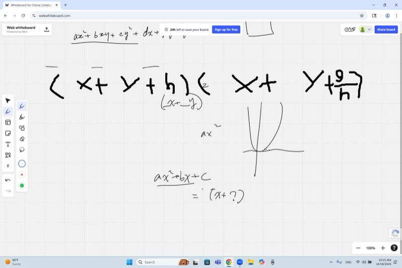
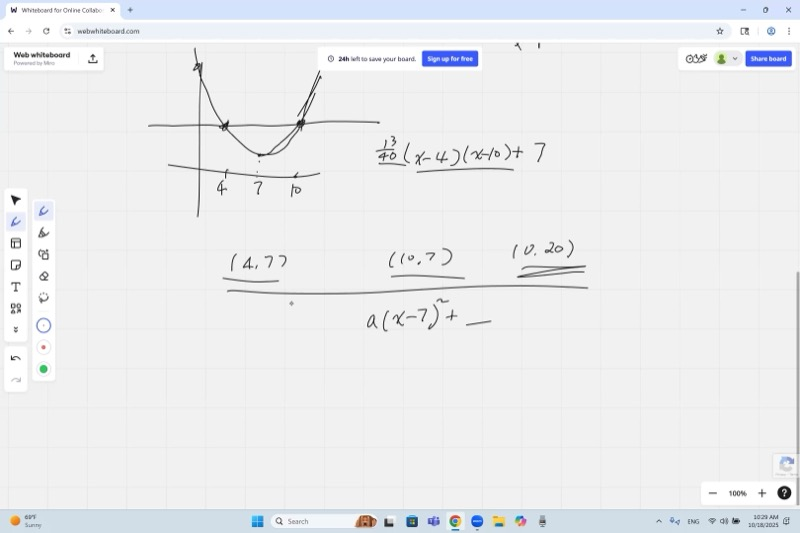
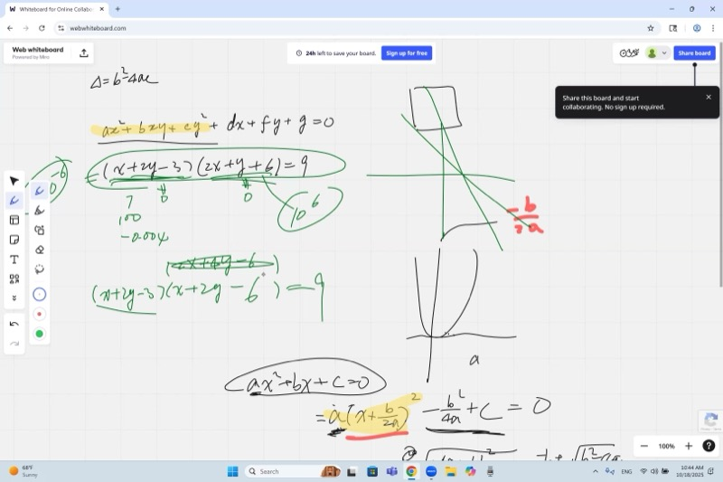
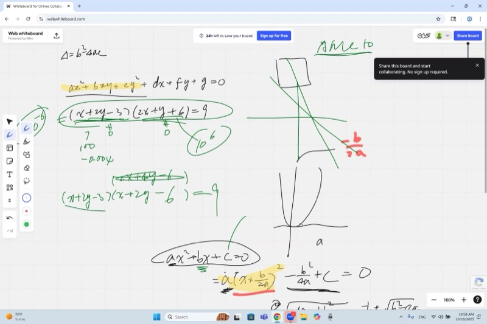

## Lecture Video

```{=html}
<video controls width="100%" preload="metadata">
  <source src="https://github.com/ymote/learningmathteam/releases/download/v1.0/Saturday20251018morning.mp4" type="video/mp4">
</video>
```

## Key Video Frames

```{=html}
<div style="display: flex; flex-direction: column; gap: 10px; margin: 1em 0;">




</div>
```

## Background

In earlier sessions we studied conic sections from multiple perspectives: their geometric definitions using foci and directrices, and the physical picture of slicing a cone. This lesson returns to the **algebraic** perspective. Starting from the general second-degree equation in two variables, we ask: *how do the coefficients alone tell you what shape the graph is?*

Along the way we revisit completing the square for a single-variable quadratic, re-derive the quadratic formula, and then extend the same discriminant idea to classify two-variable quadratic forms as ellipses, hyperbolas, or degenerate cases (pairs of lines, parabolas).

::: {.callout-important}
## Key Ideas

1. **Completing the square** rewrites $ax^2 + bx + c$ as $a\!\left(x + \frac{b}{2a}\right)^2 + \frac{4ac - b^2}{4a}$, revealing the vertex and axis of symmetry.
2. The **quadratic formula** $x = \frac{-b \pm \sqrt{b^2 - 4ac}}{2a}$ is a direct consequence of completing the square.
3. For the general conic $ax^2 + bxy + cy^2 + dx + ey + f = 0$, only the **quadratic coefficients** $a$, $b$, $c$ determine the *type* of curve; the linear terms $d$, $e$, $f$ only shift its position.
4. The **discriminant** $\Delta = b^2 - 4ac$ classifies the conic:
   - $\Delta < 0$ : ellipse (or circle)
   - $\Delta = 0$ : parabola
   - $\Delta > 0$ : hyperbola (two distinct linear factors $\Rightarrow$ two asymptotes)
5. When the quadratic part factors into two **identical** linear factors ($\Delta = 0$), the conic degenerates; when it factors into two **distinct** linear factors ($\Delta > 0$), the factor lines become asymptotes of a hyperbola.
:::

## 1. Review: The General Conic Equation

Every conic section can be written in the form

$$ax^2 + bxy + cy^2 + dx + ey + f = 0$$

where $a, b, c, d, e, f$ are real constants. This single equation can represent a circle, ellipse, parabola, hyperbola, a pair of lines, or even a single point, depending on the coefficients.

::: {.callout-note collapse="true"}
## Why don't $d$, $e$, $f$ affect the shape?

Consider the single-variable analogy. The graphs of $y = x^2$ and $y = x^2 + 6x + 11$ are **identical parabolas** -- the second is just the first shifted to a new location:

$$x^2 + 6x + 11 = (x+3)^2 + 2$$

The linear coefficient $6$ and constant $11$ produce a horizontal shift of $-3$ and a vertical shift of $+2$, but the *shape* (how wide, how narrow) is determined solely by the leading coefficient $1$.

The same principle holds in two variables. The terms $dx + ey + f$ translate the curve but do not change whether it is an ellipse or a hyperbola. Only $a$, $b$, $c$ (the quadratic part) determine the type.
:::

## 2. Completing the Square -- Single Variable

Given a quadratic $y = ax^2 + bx + c$ with $a \neq 0$:

**Step 1.** Factor out the leading coefficient from the $x$-terms:

$$y = a\!\left(x^2 + \frac{b}{a}x\right) + c$$

**Step 2.** Complete the square inside the parentheses using half the linear coefficient:

$$y = a\!\left(x + \frac{b}{2a}\right)^2 - \frac{b^2}{4a} + c$$

**Step 3.** Combine the constants:

$$\boxed{y = a\!\left(x + \frac{b}{2a}\right)^2 + \frac{4ac - b^2}{4a}}$$

::: {.callout-tip collapse="true"}
## Example: Complete the square for $y = 3x^2 + 12x + 7$

**Step 1.** Factor out $3$:

$$y = 3\!\left(x^2 + 4x\right) + 7$$

**Step 2.** Half of $4$ is $2$. Write $(x+2)^2 = x^2 + 4x + 4$, so we added $4$ inside:

$$y = 3\!\left(x + 2\right)^2 - 3 \cdot 4 + 7 = 3(x+2)^2 - 5$$

**Result:** Vertex at $(-2, -5)$, axis of symmetry $x = -2$, opens upward since $a = 3 > 0$.
:::

::: {.callout-tip collapse="true"}
## Common mistake: completing on the wrong coefficient

A frequent error is trying to accommodate the constant $c$ instead of the linear coefficient $b$. Remember: **always match the linear term** $\frac{b}{a}x$, not the constant. The constant is what gets adjusted at the end.

If $y = ax^2 + bx + c$, you complete the square on the coefficient of $x$, which is $\frac{b}{a}$, taking half of it: $\frac{b}{2a}$.
:::

### Reading the Graph from Vertex Form

From $y = a(x - h)^2 + k$:

| Feature | Value |
|---|---|
| Vertex | $(h, k)$ |
| Axis of symmetry | $x = h = -\frac{b}{2a}$ |
| Opens upward/downward | $a > 0$ (up) / $a < 0$ (down) |
| Width/narrowness | Determined solely by $|a|$ |

```{=html}
<div id="desmos-1" class="desmos-container"></div>
<script src="https://www.desmos.com/api/v1.9/calculator.js?apiKey=dcb31709b452b1cf9dc26972add0fda6"></script>
<script>
  var calc1 = Desmos.GraphingCalculator(document.getElementById('desmos-1'), {
    expressions: true,
    settingsMenu: false
  });
  calc1.setExpression({ id: 'a', latex: 'a=1', sliderBounds: {min: -3, max: 3, step: 0.1} });
  calc1.setExpression({ id: 'h', latex: 'h=0', sliderBounds: {min: -5, max: 5, step: 0.1} });
  calc1.setExpression({ id: 'k', latex: 'k=0', sliderBounds: {min: -10, max: 10, step: 0.1} });
  calc1.setExpression({ id: 'parabola', latex: 'y=a(x-h)^2+k', color: '#2d70b3' });
  calc1.setExpression({ id: 'vertex', latex: '(h, k)', color: '#c74440', pointStyle: 'POINT', pointSize: 12 });
  calc1.setExpression({ id: 'aos', latex: 'x=h', color: '#c74440', lineStyle: 'DASHED', lineWidth: 1.5 });
  calc1.setMathBounds({ left: -8, right: 8, bottom: -10, top: 10 });
</script>
```

*Drag the sliders to see how $a$ controls shape, while $h$ and $k$ only shift the parabola.*

## 3. Deriving the Quadratic Formula

::: {.callout-note collapse="true"}
## Proof: The Quadratic Formula from Completing the Square

Start with $ax^2 + bx + c = 0$ where $a \neq 0$.

From completing the square we already have:

$$a\!\left(x + \frac{b}{2a}\right)^2 + \frac{4ac - b^2}{4a} = 0$$

Rearrange:

$$a\!\left(x + \frac{b}{2a}\right)^2 = \frac{b^2 - 4ac}{4a}$$

Divide both sides by $a$:

$$\left(x + \frac{b}{2a}\right)^2 = \frac{b^2 - 4ac}{4a^2}$$

Take the square root (remember $\pm$):

$$x + \frac{b}{2a} = \pm\,\frac{\sqrt{b^2 - 4ac}}{2a}$$

Isolate $x$:

$$\boxed{x = \frac{-b \pm \sqrt{b^2 - 4ac}}{2a}}$$
:::

The expression $\Delta = b^2 - 4ac$ under the square root is the **discriminant**. It tells you whether the quadratic has two real roots ($\Delta > 0$), one repeated root ($\Delta = 0$), or no real roots ($\Delta < 0$).

## 4. Constructing a Quadratic from Points

::: {.callout-tip collapse="true"}
## Example: Find the quadratic through $(4, 7)$, $(10, 7)$, and $(0, 20)$

**Step 1. Spot the axis of symmetry.** The points $(4, 7)$ and $(10, 7)$ share the same $y$-value, so the axis of symmetry lies halfway between them:

$$x = \frac{4 + 10}{2} = 7$$

**Step 2. Write vertex form.** We know the parabola has the form:

$$y = a(x - 7)^2 + k$$

**Step 3. Use a symmetric pair to find $k$.** Plug in $(4, 7)$:

$$7 = a(4 - 7)^2 + k = 9a + k$$

**Step 4. Use the third point.** Plug in $(0, 20)$:

$$20 = a(0 - 7)^2 + k = 49a + k$$

**Step 5. Solve the system.** Subtract: $20 - 7 = 49a - 9a$, giving $13 = 40a$, so $a = \frac{13}{40}$.

Then $k = 7 - 9 \cdot \frac{13}{40} = 7 - \frac{117}{40} = \frac{163}{40}$.

$$y = \frac{13}{40}(x - 7)^2 + \frac{163}{40}$$

**Shortcut via factored form.** Since the axis is at $x = 7$, shifting the parabola down by $7$ puts the roots at $x = 4$ and $x = 10$. So:

$$y - 7 = a(x - 4)(x - 10)$$

Plug in $(0, 20)$: $\;13 = a(-4)(-10) = 40a$, giving $a = \frac{13}{40}$. Done in seconds.
:::

```{=html}
<div id="desmos-2" class="desmos-container"></div>
<script>
  var calc2 = Desmos.GraphingCalculator(document.getElementById('desmos-2'), {
    expressions: true,
    settingsMenu: false
  });
  calc2.setExpression({ id: 'parabola', latex: 'y=\\frac{13}{40}(x-7)^2+\\frac{163}{40}', color: '#2d70b3' });
  calc2.setExpression({ id: 'p1', latex: '(4, 7)', color: '#c74440', pointSize: 10, label: '(4, 7)', showLabel: true });
  calc2.setExpression({ id: 'p2', latex: '(10, 7)', color: '#c74440', pointSize: 10, label: '(10, 7)', showLabel: true });
  calc2.setExpression({ id: 'p3', latex: '(0, 20)', color: '#388c46', pointSize: 10, label: '(0, 20)', showLabel: true });
  calc2.setExpression({ id: 'aos', latex: 'x=7', color: '#c74440', lineStyle: 'DASHED', lineWidth: 1.5 });
  calc2.setMathBounds({ left: -3, right: 15, bottom: -2, top: 25 });
</script>
```

## 5. Classifying Conics with the Discriminant

Now we extend the discriminant idea to two variables. Consider just the quadratic part of the general conic:

$$ax^2 + bxy + cy^2$$

To classify the conic, treat this as a quadratic in $x$ (with $y$ as a parameter) and examine whether it **factors** into two linear expressions:

$$ax^2 + bxy + cy^2 = a\!\left(x - r_1 y\right)\!\left(x - r_2 y\right)$$

This factorization exists over the reals precisely when the discriminant

$$\Delta = b^2 - 4ac$$

is non-negative.

### The Classification Table

| Discriminant | Factorability | Conic type |
|---|---|---|
| $b^2 - 4ac < 0$ | Does **not** factor over reals | **Ellipse** (or circle if $a = c$, $b = 0$) |
| $b^2 - 4ac = 0$ | Factors into **identical** linear factors | **Parabola** (degenerate: one line or parallel lines) |
| $b^2 - 4ac > 0$ | Factors into **two distinct** linear factors | **Hyperbola** (degenerate: two intersecting lines) |

::: {.callout-note collapse="true"}
## Why does factoring into two lines give a hyperbola?

Suppose the quadratic part factors as $(px + qy)(rx + sy)$ with the two factors being genuinely different lines. Then the full conic equation looks something like:

$$(px + qy + \alpha)(rx + sy + \beta) = k$$

For any nonzero constant $k$, neither factor can be zero -- they are **untouchable**. But one factor can be made arbitrarily small while the other grows arbitrarily large, so the curve approaches both lines $px + qy + \alpha = 0$ and $rx + sy + \beta = 0$ without ever touching them.

Those two lines are the **asymptotes** of a hyperbola.

Now, if the two factors happen to be **parallel** (scalar multiples of each other, like $x + 2y$ and $2x + 4y$), then one factor being tiny forces the other to also be tiny -- you can no longer have one approach infinity while the other approaches zero. In that degenerate case ($\Delta = 0$), you do not get a hyperbola.
:::

::: {.callout-tip collapse="true"}
## Example: Classify $2x^2 + 5xy + 2y^2 - 7x - 8y + 6 = 0$

Compute the discriminant of the quadratic part:

$$\Delta = b^2 - 4ac = 5^2 - 4(2)(2) = 25 - 16 = 9 > 0$$

Since $\Delta > 0$, this is a **hyperbola**. The quadratic part factors:

$$2x^2 + 5xy + 2y^2 = (2x + y)(x + 2y)$$

The lines $2x + y = \text{const}$ and $x + 2y = \text{const}$ are the asymptotic directions.
:::

::: {.callout-tip collapse="true"}
## Example: Classify $x^2 + 2xy + y^2 + 3x - y + 1 = 0$

Compute the discriminant:

$$\Delta = 2^2 - 4(1)(1) = 4 - 4 = 0$$

Since $\Delta = 0$, the quadratic part factors into identical factors:

$$x^2 + 2xy + y^2 = (x + y)^2$$

This is a **degenerate conic** -- either a parabola or a pair of coincident/parallel lines, depending on the remaining terms.
:::

::: {.callout-tip collapse="true"}
## Example: Classify $x^2 + xy + y^2 - 2x + 4 = 0$

Compute the discriminant:

$$\Delta = 1^2 - 4(1)(1) = 1 - 4 = -3 < 0$$

Since $\Delta < 0$, this is an **ellipse**. The quadratic form $x^2 + xy + y^2$ cannot be factored over the reals into two linear expressions.
:::

## 6. From Factored Form to Asymptotes -- A Concrete Picture

```{=html}
<div id="desmos-3" class="desmos-container"></div>
<script>
  var calc3 = Desmos.GraphingCalculator(document.getElementById('desmos-3'), {
    expressions: true,
    settingsMenu: false
  });
  calc3.setExpression({ id: 'hyp', latex: '(2x+y-3)(x+2y-3)=9', color: '#2d70b3' });
  calc3.setExpression({ id: 'asym1', latex: '2x+y=3', color: '#c74440', lineStyle: 'DASHED', lineWidth: 1.5 });
  calc3.setExpression({ id: 'asym2', latex: 'x+2y=3', color: '#388c46', lineStyle: 'DASHED', lineWidth: 1.5 });
  calc3.setMathBounds({ left: -6, right: 10, bottom: -6, top: 10 });
</script>
```

*The dashed lines are the asymptotes. The hyperbola approaches them but never touches them. If the two factor-lines were identical, the curve would collapse into a parabola or degenerate case instead.*

## 7. Connecting Single-Variable and Two-Variable Discriminants

Notice the beautiful parallel:

| | Single variable: $ax^2 + bx + c = 0$ | Two variables: $ax^2 + bxy + cy^2$ |
|---|---|---|
| **Discriminant** | $b^2 - 4ac$ | $b^2 - 4ac$ |
| **$\Delta > 0$** | Two distinct real roots | Factors into two distinct lines $\to$ hyperbola |
| **$\Delta = 0$** | One repeated root | Identical factors $\to$ parabola / degenerate |
| **$\Delta < 0$** | No real roots | Cannot factor $\to$ ellipse |

This is not a coincidence. Classifying the two-variable quadratic form $ax^2 + bxy + cy^2$ is equivalent to solving $at^2 + bt + c = 0$ where $t = x/y$, and the discriminant is identical.

## Cheat Sheet

::: {.key-formula}
| What you need | Formula / Method |
|---|---|
| Complete the square | $ax^2 + bx + c = a\!\left(x + \frac{b}{2a}\right)^2 + \frac{4ac - b^2}{4a}$ |
| Axis of symmetry | $x = -\frac{b}{2a}$ |
| Quadratic formula | $x = \frac{-b \pm \sqrt{b^2 - 4ac}}{2a}$ |
| Discriminant (1 var) | $\Delta = b^2 - 4ac$: positive $\to$ 2 roots, zero $\to$ 1 root, negative $\to$ 0 real roots |
| Conic type (2 vars) | From $ax^2 + bxy + cy^2$: compute $\Delta = b^2 - 4ac$ |
| Ellipse | $\Delta < 0$ (cannot factor) |
| Parabola / degenerate | $\Delta = 0$ (repeated factor) |
| Hyperbola | $\Delta > 0$ (two distinct factors $\to$ two asymptotes) |
| Shape vs. position | Only $a, b, c$ determine shape; $d, e, f$ only shift |
| Find quadratic from points | Use axis of symmetry from matching $y$-values, then factored or vertex form |

### Quick Completing-the-Square Recipe

$$y = ax^2 + bx + c$$

1. Factor out $a$: $\;y = a\!\left(x^2 + \frac{b}{a}x\right) + c$
2. Half the inner coefficient: $\;\frac{b}{2a}$
3. Write the square: $\;\left(x + \frac{b}{2a}\right)^2$
4. Subtract what you added: $\;y = a\!\left(x + \frac{b}{2a}\right)^2 + c - \frac{b^2}{4a}$

### Conic Classification at a Glance

$$ax^2 + bxy + cy^2 + dx + ey + f = 0 \quad\xrightarrow{\;\Delta = b^2 - 4ac\;}\quad \begin{cases} \Delta < 0 & \text{ellipse} \\ \Delta = 0 & \text{parabola} \\ \Delta > 0 & \text{hyperbola} \end{cases}$$
:::
