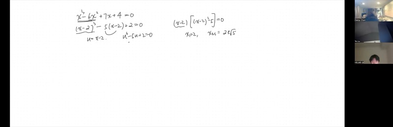
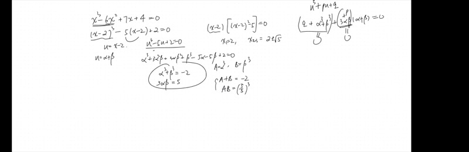
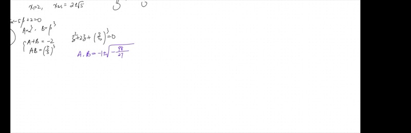
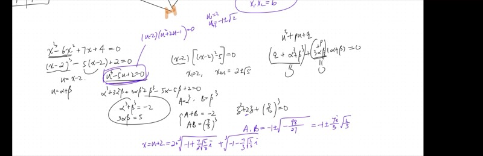

::: {.callout-tip collapse="true"}
## Why Solving Cubics Matters

Quadratic equations appear throughout mathematics and science, but nature does not stop at degree 2.

- **Engineering**: designing curved surfaces requires solving cubic (and higher) polynomial equations
- **Physics**: projectile motion in a medium with drag involves cubic relationships
- **Cryptography**: elliptic curve methods rely on cubic equations over finite fields
- **History**: the race to solve the cubic in 16th-century Italy (Cardano, Tartaglia, del Ferro) is one of the great dramas in mathematics

Mastering cubic equations also unlocks a deep connection between a polynomial's *coefficients* and its *roots* --- a theme that extends all the way to modern algebra.
:::

## Topics Covered

- Completing the cube to reduce a cubic equation
- The substitution $u = \alpha + \beta$ and splitting into two piles
- Reducing a cubic system to a quadratic via new variables $A = \alpha^3$, $B = \beta^3$
- Vieta's formulas: relating roots and coefficients without solving
- Polynomial long division after finding one root
- Complex conjugate cube roots and recovering all three real roots via polar form

## Lecture Video

```{=html}
<video controls width="100%" preload="metadata">
  <source src="https://github.com/ymote/learningmathteam/releases/download/v1.0/Saturday20251108afternoon.mp4" type="video/mp4">
</video>
```

## Key Video Frames









## Prerequisites

::: {.callout-note collapse="true"}
## What is a cubic equation?

A **cubic equation** is any polynomial equation whose highest-degree term is $x^3$.

**General form:** $x^3 + ax^2 + bx + c = 0$

Examples:

- $x^3 - 6x^2 + 7x = 0$ --- cubic
- $x^3 - 5x + 2 = 0$ --- cubic (no $x^2$ term; this is called a *depressed* cubic)
- $x^2 + 3x + 2 = 0$ --- NOT cubic (that's quadratic)
:::

::: {.callout-note collapse="true"}
## What is "completing the square" again?

For a quadratic $x^2 + ax + b$, we rewrite it as $\left(x + \frac{a}{2}\right)^2 + \left(b - \frac{a^2}{4}\right)$.

**Completing the cube** is the analogous idea: for $x^3 + ax^2 + \cdots$, we write $(x + \frac{a}{3})^3 + \cdots$ so that the $x^3$ and $x^2$ terms are absorbed, leaving only linear and constant terms to handle.
:::

::: {.callout-note collapse="true"}
## What are complex numbers?

A **complex number** has the form $a + bi$, where $i = \sqrt{-1}$.

- **Polar form:** $r(\cos\theta + i\sin\theta) = re^{i\theta}$, where $r$ is the magnitude and $\theta$ is the angle.
- **Conjugate:** The conjugate of $a + bi$ is $a - bi$.
- When you add a complex number and its conjugate, you get $2a$ --- always real!

We will use polar form heavily when extracting cube roots.
:::

## Key Concepts

::: {.callout-important}
## Key Ideas

1. **Completing the cube** eliminates the $x^2$ term by substituting $u = x - \frac{a}{3}$, reducing to a *depressed cubic* $u^3 + pu + q = 0$.
2. **The $\alpha + \beta$ substitution**: Set $u = \alpha + \beta$ and split the resulting expression into two groups, each set to zero. This gives $\alpha^3 + \beta^3 = -q$ and $3\alpha\beta = -p$.
3. **Vieta's formulas**: For $x^2 + ax + b = 0$ with roots $x_1, x_2$: $$x_1 + x_2 = -a, \qquad x_1 \cdot x_2 = b$$
4. **Reduction to a quadratic**: Setting $A = \alpha^3$, $B = \beta^3$, the sum and product conditions let us find $A$ and $B$ as roots of a quadratic.
5. **All three roots** come from the three cube roots of a complex number --- rotate by $120°$ in the complex plane.
:::

## 1. Completing the Cube

### The Idea

Just as completing the square absorbs the linear coefficient by halving it, **completing the cube absorbs the quadratic coefficient by taking one-third** of it.

Given:
$$x^3 - 6x^2 + 7x = 0$$

we set $(x - 2)^3$ because $\frac{6}{3} = 2$. Expanding:

$$(x-2)^3 = x^3 - 6x^2 + 12x - 8$$

So the original equation becomes:

$$\underbrace{(x-2)^3}_{\text{absorbs } x^3 - 6x^2} - 5(x-2) + 2 = 0$$

::: {.callout-tip collapse="true"}
## Step-by-step verification

Expand $(x-2)^3$:

$$x^3 - 6x^2 + 12x - 8$$

Our equation is $x^3 - 6x^2 + 7x = 0$. The first two terms match. The remaining terms are:

$$7x - 12x + 8 = -5x + 8$$

We want to write this in terms of $(x-2)$:

$$-5x + 8 = -5(x - 2) - 2$$

Wait --- let's recheck: $-5(x-2) = -5x + 10$. We need $-5x + 8$, so:

$$-5(x-2) + (8 - 10) = -5(x-2) - 2$$

Putting it together:

$$(x-2)^3 - 5(x-2) - 2 = 0$$

Substituting $u = x - 2$ gives the **depressed cubic**:

$$u^3 - 5u - 2 = 0$$
:::

### The Easy Case: When It Factors Directly

In the lecture, the first example used $+7x$ (not $+9x$), giving:

$$(x-2)^3 - 5(x-2) = 0$$

which factors as:

$$(x-2)\bigl[(x-2)^2 - 5\bigr] = 0$$

**Roots:** $x = 2$, $x = 2 + \sqrt{5}$, $x = 2 - \sqrt{5}$.

```{=html}
<div id="desmos-1" class="desmos-container"></div>
<script src="https://www.desmos.com/api/v1.9/calculator.js?apiKey=dcb31709b452b1cf9dc26972add0fda6"></script>
<script>
  var calc1 = Desmos.GraphingCalculator(document.getElementById('desmos-1'), {
    expressions: true,
    settingsMenu: false
  });
  calc1.setExpression({ id: 'cubic1', latex: 'y=x^3-6x^2+7x', color: '#2d70b3' });
  calc1.setExpression({ id: 'root1', latex: '(2, 0)', color: '#c74440', pointSize: 10, label: 'x = 2', showLabel: true });
  calc1.setExpression({ id: 'root2', latex: '(2+\\sqrt{5}, 0)', color: '#388c46', pointSize: 10, label: 'x = 2+sqrt(5)', showLabel: true });
  calc1.setExpression({ id: 'root3', latex: '(2-\\sqrt{5}, 0)', color: '#388c46', pointSize: 10, label: 'x = 2-sqrt(5)', showLabel: true });
  calc1.setMathBounds({ left: -3, right: 7, bottom: -10, top: 10 });
</script>
```

## 2. Vieta's Formulas

::: {.callout-important}
## Vieta's Formulas (Quadratic)

For $x^2 + ax + b = 0$ with roots $x_1$ and $x_2$:

$$x_1 + x_2 = -a \qquad \text{(sum of roots)}$$
$$x_1 \cdot x_2 = b \qquad \text{(product of roots)}$$
:::

### Why does this work?

::: {.callout-tip collapse="true"}
## Proof of Vieta's formulas for the quadratic case

If $x_1, x_2$ are roots, the polynomial factors as:

$$(x - x_1)(x - x_2) = x^2 - (x_1 + x_2)\,x + x_1 x_2$$

Comparing with $x^2 + ax + b$:

- Coefficient of $x$: $-(x_1 + x_2) = a \implies x_1 + x_2 = -a$
- Constant term: $x_1 x_2 = b$

That's it! No quadratic formula needed --- just expand and match.
:::

### Vieta's formulas extend to any degree

::: {.callout-note collapse="true"}
## Vieta's for cubics

For $x^3 + ax^2 + bx + c = 0$ with roots $x_1, x_2, x_3$:

$$x_1 + x_2 + x_3 = -a$$
$$x_1 x_2 + x_1 x_3 + x_2 x_3 = b$$
$$x_1 x_2 x_3 = -c$$

These are called **symmetric functions** of the roots because they don't change if you relabel the roots.
:::

### Example: Constructing a quadratic from sum and product

If you know $A + B = -2$ and $A \cdot B = \left(\frac{5}{3}\right)^3$, then $A$ and $B$ are roots of:

$$z^2 + 2z + \frac{125}{27} = 0$$

This is exactly the "Vieta backward" technique used in the lecture to reduce the cubic to a quadratic.

## 3. The Full Cubic Solution Machine

### Step 1: Reduce to depressed form

Start with $x^3 - 6x^2 + 9x = 0$ (the harder version from the lecture). Complete the cube:

$$u^3 - 5u + 2 = 0 \qquad \text{where } u = x - 2$$

### Step 2: Substitute $u = \alpha + \beta$

Expand:

$$\alpha^3 + 3\alpha^2\beta + 3\alpha\beta^2 + \beta^3 - 5\alpha - 5\beta + 2 = 0$$

Regroup:

$$\underbrace{(\alpha^3 + \beta^3 + 2)}_{\text{Pile 1}} + \underbrace{(3\alpha\beta - 5)(\alpha + \beta)}_{\text{Pile 2}} = 0$$

Set each pile to zero:

::: {.callout-tip collapse="true"}
## Why can we set each pile to zero separately?

We have **two** unknowns ($\alpha$ and $\beta$) but only **one** equation. That means we have a degree of freedom. We *choose* to impose the extra constraint $3\alpha\beta = 5$ (Pile 2 = 0), which then forces Pile 1 = 0 as well.

This is an engineering trick: we're not losing generality because any solution to the original equation can be decomposed this way.
:::

### Step 3: Reduce to a quadratic

Set $A = \alpha^3$ and $B = \beta^3$. Then:

$$A + B = -2 \qquad \text{and} \qquad AB = \left(\frac{5}{3}\right)^3 = \frac{125}{27}$$

By Vieta's (backward!), $A$ and $B$ are roots of:

$$z^2 + 2z + \frac{125}{27} = 0$$

::: {.callout-tip collapse="true"}
## Solving the quadratic

Using the quadratic formula:

$$z = \frac{-2 \pm \sqrt{4 - \frac{500}{27}}}{2} = \frac{-2 \pm \sqrt{\frac{108 - 500}{27}}}{2} = \frac{-2 \pm \sqrt{\frac{-392}{27}}}{2}$$

$$= -1 \pm \frac{\sqrt{392}}{2\sqrt{27}}\,i = -1 \pm \frac{14}{3\sqrt{27}}\,i = -1 \pm \frac{14\sqrt{3}}{27}\,i$$

So $A$ and $B$ are complex conjugates! This is the famous **casus irreducibilis**: even though all three roots are real, the intermediate computation passes through complex numbers.
:::

### Step 4: Extract cube roots in polar form

::: {.callout-tip collapse="true"}
## Converting to polar form and taking cube roots

Write $A = re^{i\theta}$ where:

- $r = |A| = \sqrt{1 + \frac{392}{27}} \approx \sqrt{15.52} \approx 3.94$
- $\theta = \pi - \arctan\!\left(\frac{14\sqrt{3}/27}{1}\right)$

The cube root is:

$$\alpha = r^{1/3}\,e^{i\theta/3}$$

Because angles are determined only modulo $2\pi$, we get **three** cube roots by adding $0$, $\frac{2\pi}{3}$, and $\frac{4\pi}{3}$ to $\frac{\theta}{3}$.

Each cube root $\alpha_k$ paired with its conjugate $\beta_k$ gives:

$$u_k = \alpha_k + \beta_k = 2\,\text{Re}(\alpha_k)$$

This is always real because we are adding conjugate pairs!
:::

## 4. Polynomial Long Division

Once you find one root (say by inspection), you can divide it out to reduce the degree.

### Example: $u^3 - 5u + 2 = 0$ with root $u = 2$

::: {.callout-tip collapse="true"}
## Long division walkthrough

Divide $u^3 + 0u^2 - 5u + 2$ by $(u - 2)$:

1. **Fit:** $u^3 \div u = u^2$. Write $u^2$.
2. **Check:** $u^2 \cdot (-2) = -2u^2$. We need $0u^2$, so add $+2u$.
3. **Fit:** $2u \cdot (-2) = -4u$. We have $-5u$, need $-5u - (-4u) = -u$ more. So add $+1$ (since we need $1 \cdot (-2) = -2$ to complete: $-5u + 4u = -u$... actually let's be careful):

Working through:

$$\frac{u^3 - 5u + 2}{u - 2} = u^2 + 2u - 1$$

**Verify:** $(u-2)(u^2 + 2u - 1) = u^3 + 2u^2 - u - 2u^2 - 4u + 2 = u^3 - 5u + 2$ ✓
:::

Now solve $u^2 + 2u - 1 = 0$:

$$u = \frac{-2 \pm \sqrt{4 + 4}}{2} = \frac{-2 \pm 2\sqrt{2}}{2} = -1 \pm \sqrt{2}$$

**All three roots of the original equation** $x^3 - 6x^2 + 9x = 0$ (recall $x = u + 2$):

| $u$ | $x = u + 2$ | Approximate value |
|---|---|---|
| $2$ | $4$ | $4$ |
| $-1 + \sqrt{2}$ | $1 + \sqrt{2}$ | $\approx 2.414$ |
| $-1 - \sqrt{2}$ | $1 - \sqrt{2}$ | $\approx -0.414$ |

```{=html}
<div id="desmos-2" class="desmos-container"></div>
<script>
  var calc2 = Desmos.GraphingCalculator(document.getElementById('desmos-2'), {
    expressions: true,
    settingsMenu: false
  });
  calc2.setExpression({ id: 'cubic2', latex: 'y=x^3-6x^2+9x', color: '#6042a6' });
  calc2.setExpression({ id: 'r1', latex: '(4, 0)', color: '#c74440', pointSize: 10, label: 'x = 4', showLabel: true });
  calc2.setExpression({ id: 'r2', latex: '(1+\\sqrt{2}, 0)', color: '#388c46', pointSize: 10, label: 'x = 1+sqrt(2)', showLabel: true });
  calc2.setExpression({ id: 'r3', latex: '(1-\\sqrt{2}, 0)', color: '#388c46', pointSize: 10, label: 'x = 1-sqrt(2)', showLabel: true });
  calc2.setExpression({ id: 'zero', latex: 'y=0', color: '#999', lineStyle: 'DASHED', lineWidth: 0.5 });
  calc2.setMathBounds({ left: -3, right: 7, bottom: -8, top: 12 });
</script>
```

## 5. Complex Cube Roots and the $120°$ Rotation

When you take the cube root of a complex number $re^{i\theta}$, there are **three** results:

$$r^{1/3}\,e^{i(\theta + 2k\pi)/3}, \qquad k = 0, 1, 2$$

These three roots are equally spaced at $120°$ apart on a circle of radius $r^{1/3}$.

```{=html}
<div id="desmos-3" class="desmos-container"></div>
<script>
  var calc3 = Desmos.GraphingCalculator(document.getElementById('desmos-3'), {
    expressions: true,
    settingsMenu: false
  });
  calc3.setExpression({ id: 'circle', latex: 'x^2+y^2=r^2', color: '#ccc', lineStyle: 'DASHED' });
  calc3.setExpression({ id: 'r', latex: 'r=1.2', sliderBounds: {min: 0.5, max: 2, step: 0.01} });
  calc3.setExpression({ id: 'theta', latex: '\\theta_0=0.3', sliderBounds: {min: 0, max: 6.28, step: 0.01} });
  calc3.setExpression({ id: 'p1', latex: '(r\\cos(\\theta_0), r\\sin(\\theta_0))', color: '#c74440', pointSize: 12, label: 'k=0', showLabel: true });
  calc3.setExpression({ id: 'p2', latex: '(r\\cos(\\theta_0+2\\pi/3), r\\sin(\\theta_0+2\\pi/3))', color: '#2d70b3', pointSize: 12, label: 'k=1', showLabel: true });
  calc3.setExpression({ id: 'p3', latex: '(r\\cos(\\theta_0+4\\pi/3), r\\sin(\\theta_0+4\\pi/3))', color: '#388c46', pointSize: 12, label: 'k=2', showLabel: true });
  calc3.setExpression({ id: 'origin', latex: '(0,0)', color: '#000', pointSize: 5 });
  calc3.setMathBounds({ left: -3, right: 3, bottom: -3, top: 3 });
</script>
```

**Drag the $\theta_0$ slider** to rotate all three cube roots together. Notice they always stay $120°$ apart.

::: {.callout-tip collapse="true"}
## Why adding conjugate cube roots always gives a real number

If $A = re^{i\theta}$, then its conjugate is $B = re^{-i\theta}$.

Their cube roots (for the same $k$) are:

$$\alpha_k = r^{1/3} e^{i(\theta + 2k\pi)/3}, \qquad \beta_k = r^{1/3} e^{-i(\theta + 2k\pi)/3}$$

Adding:

$$\alpha_k + \beta_k = 2\,r^{1/3}\cos\!\left(\frac{\theta + 2k\pi}{3}\right)$$

This is purely real for every $k$. Each value of $k = 0, 1, 2$ gives a different real root of the cubic.
:::

## Cheat Sheet

::: {.key-formula}
| Technique | Recipe |
|---|---|
| **Complete the cube** | $x^3 + ax^2 + \cdots \;\to\; (x + \frac{a}{3})^3 + \cdots$ (absorbs $x^3$ and $x^2$ terms) |
| **Depressed cubic** | $u^3 + pu + q = 0$ (no $u^2$ term) |
| **Vieta's (quadratic)** | Roots $x_1, x_2$ of $x^2+ax+b=0$: sum $= -a$, product $= b$ |
| **Vieta's (cubic)** | Roots $x_1,x_2,x_3$ of $x^3+ax^2+bx+c=0$: $\sum = -a$, $\sum_{\text{pairs}} = b$, product $= -c$ |
| **$\alpha+\beta$ method** | Set $u=\alpha+\beta$, impose $3\alpha\beta = -p$, get $\alpha^3+\beta^3=-q$ |
| **Reduce to quadratic** | $A=\alpha^3, B=\beta^3$: solve $z^2 + qz + (-p/3)^3 = 0$ |
| **Poly long division** | Know one root $r$ $\Rightarrow$ divide by $(x-r)$ to get a quadratic |
| **Three cube roots** | $\sqrt[3]{re^{i\theta}} = r^{1/3}e^{i(\theta+2k\pi)/3}$ for $k=0,1,2$ (spaced $120°$ apart) |

### Quick-Reference: Vieta's Formulas

$$\boxed{x^2 + ax + b = 0 \implies x_1 + x_2 = -a,\quad x_1 x_2 = b}$$

$$\boxed{x^3 + ax^2 + bx + c = 0 \implies \begin{cases} x_1+x_2+x_3 = -a \\ x_1x_2+x_1x_3+x_2x_3 = b \\ x_1x_2x_3 = -c \end{cases}}$$
:::
