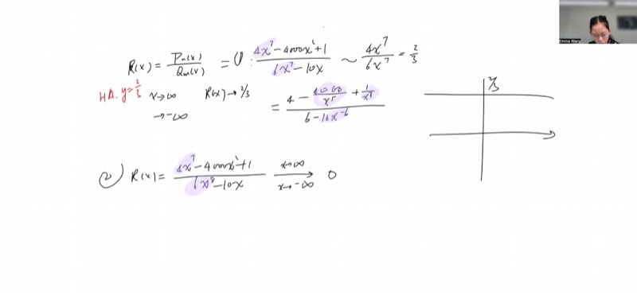
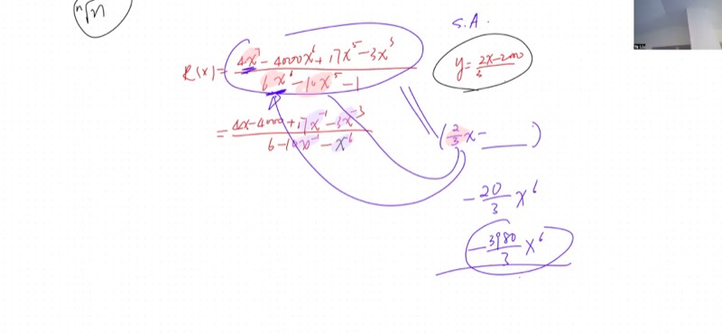
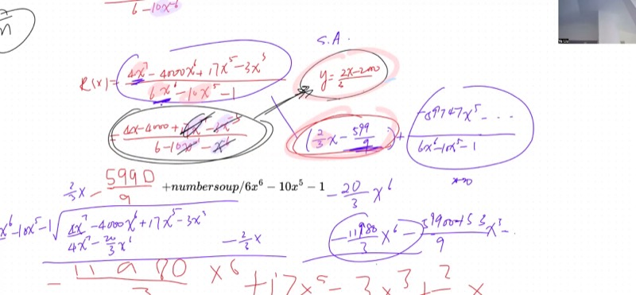
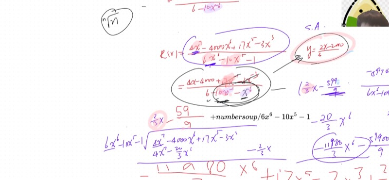

## Lecture Video

```{=html}
<video controls width="100%" preload="metadata">
  <source src="https://github.com/ymote/learningmathteam/releases/download/v1.0/Saturday20251129morning.mp4" type="video/mp4">
</video>
```

## Key Video Frames









## Background

We have previously studied polynomials --- finding roots, factoring, and analyzing their behavior as $x \to \pm\infty$ --- as well as completing the square, conic sections, and rotations. Now we take the next step: **dividing one polynomial by another** to create a *rational function*. This is exactly the kind of function that appears constantly in pre-calculus and calculus, from modeling real-world phenomena to analyzing rates of change. The central question of this lesson is: *what does a rational function look like when $x$ gets extremely large?*

::: {.callout-important}
## Key Ideas

1. A **rational function** is a ratio of two polynomials: $R(x) = \dfrac{P(x)}{Q(x)}$.
2. The **asymptotic behavior** (what happens as $x \to \pm\infty$) depends on comparing the degrees of the numerator and denominator.
3. Three cases arise:
   - $\deg(P) = \deg(Q)$: horizontal asymptote at $y = \dfrac{\text{leading coeff of } P}{\text{leading coeff of } Q}$
   - $\deg(P) < \deg(Q)$: horizontal asymptote at $y = 0$
   - $\deg(P) = \deg(Q) + 1$: **slant (oblique) asymptote**, found by polynomial long division
4. **Critical insight**: You may *discard vanishing terms* when the limit is a **finite constant**, but you must use **long division** when the limit involves a function of $x$ (such as a slant asymptote), because vanishing terms on the denominator can shift the result by a nontrivial constant when multiplied back through.
:::

## 1. Asymptotic Behavior: The Three Cases

Given a rational function $R(x) = \dfrac{P(x)}{Q(x)}$, we determine its end behavior by comparing the **leading terms** of the numerator and denominator.

### The Simplification Technique

Divide both numerator and denominator by $x^n$, where $n$ is the degree of the denominator. Then every term except possibly the leading ones will contain a negative power of $x$, and those terms approach zero as $x \to \pm\infty$.

### Case 1: Equal Degrees --- Horizontal Asymptote

::: {.callout-tip collapse="true"}
## Example: $R(x) = \dfrac{4x^7 - 4000x^2 + 1}{6x^7 - 10x}$

Divide both top and bottom by $x^7$:

$$R(x) = \frac{4 - \dfrac{4000}{x^5} + \dfrac{1}{x^7}}{6 - \dfrac{10}{x^6}}$$

As $x \to +\infty$ or $x \to -\infty$, all the fractional terms approach zero, so:

$$\lim_{x \to \pm\infty} R(x) = \frac{4}{6} = \frac{2}{3}$$

**Result:** Horizontal asymptote at $y = \dfrac{2}{3}$.

This shortcut works perfectly here because the final answer is a **constant** --- discarding zeros in the presence of a finite number is completely justified.
:::

### Case 2: Denominator Has Higher Degree --- Asymptote at Zero

::: {.callout-tip collapse="true"}
## Example: $R(x) = \dfrac{4x^7 - 4000x^2 + 1}{6x^8 - 10x}$

The denominator's leading term $6x^8$ dominates the numerator's $4x^7$. Even after cancellation, there is a leftover power of $x$ in the denominator:

$$\frac{4x^7}{6x^8} = \frac{4}{6x} = \frac{2}{3x} \to 0$$

**Result:** Horizontal asymptote at $y = 0$ (the $x$-axis itself).

The function approaches zero regardless of the sign of $x$, because the denominator's power overwhelms the numerator.
:::

### Case 3: Numerator Has Higher Degree --- Slant Asymptote

::: {.callout-tip collapse="true"}
## Example: $R(x) = \dfrac{4x^7 - 4000x^2 + 1}{6x^6 - 10x}$

The numerator has degree 7 and the denominator has degree 6. As $x \to +\infty$, $R(x) \to +\infty$; as $x \to -\infty$, $R(x) \to -\infty$.

The bulk figure suggests the function grows roughly like $\dfrac{4x^7}{6x^6} = \dfrac{2}{3}x$. But **is that really the asymptote?**

We must perform **polynomial long division** to find out. The result is:

$$R(x) = \underbrace{\frac{2}{3}x - \frac{5990}{9}}_{\text{slant asymptote}} + \frac{\text{remainder}}{6x^6 - 10x}$$

The remainder term vanishes as $x \to \infty$, confirming the **slant asymptote** is $y = \dfrac{2}{3}x - \dfrac{5990}{9}$.

**Result:** The asymptote is NOT simply $y = \frac{2}{3}x$ --- it has an additional constant term revealed only by long division!
:::

**Explore the three cases interactively:**

```{=html}
<div id="desmos-1" class="desmos-container"></div>
<script src="https://www.desmos.com/api/v1.9/calculator.js?apiKey=dcb31709b452b1cf9dc26972add0fda6"></script>
<script>
  var calc1 = Desmos.GraphingCalculator(document.getElementById('desmos-1'), {
    expressions: true,
    settingsMenu: false
  });
  // Case 1: equal degree, horizontal asymptote at 2/3
  calc1.setExpression({ id: 'case1', latex: 'y=\\frac{4x^3 - 10x + 1}{6x^3 - 2x}', color: '#2d70b3' });
  calc1.setExpression({ id: 'ha1', latex: 'y=\\frac{2}{3}', color: '#c74440', lineStyle: 'DASHED', lineWidth: 1.5 });
  // Case 3: numerator one degree higher, slant asymptote
  calc1.setExpression({ id: 'case3', latex: 'y=\\frac{4x^3 - 10x + 1}{6x^2 - 2}', color: '#388c46' });
  calc1.setExpression({ id: 'sa', latex: 'y=\\frac{2}{3}x + \\frac{2}{27}', color: '#fa7e19', lineStyle: 'DASHED', lineWidth: 1.5 });
  calc1.setMathBounds({ left: -15, right: 15, bottom: -15, top: 15 });
</script>
```

## 2. The Simplification Technique: Dividing by the Leading Power

The standard approach to finding asymptotic behavior:

1. Identify the leading power $x^n$ in the **denominator**.
2. Divide every term in both the numerator and denominator by $x^n$.
3. As $x \to \pm\infty$, all terms with negative powers of $x$ approach zero.
4. Read off the limit from the remaining non-vanishing terms.

::: {.callout-tip collapse="true"}
## Worked Example: Full Simplification

$$R(x) = \frac{4x^7 - 4000x^6 + 17x^5 - 3x^3}{6x^6 - 10x^5 - 1}$$

Divide everything by $x^6$ (the denominator's degree):

$$R(x) = \frac{4x - 4000 + 17x^{-1} - 3x^{-3}}{6 - 10x^{-1} - x^{-6}}$$

As $x \to \infty$, the terms $17x^{-1}$, $-3x^{-3}$, $-10x^{-1}$, and $-x^{-6}$ all approach zero, so:

$$R(x) \approx \frac{4x - 4000}{6} = \frac{2}{3}x - \frac{2000}{3}$$

**Slant asymptote:** $y = \dfrac{2}{3}x - \dfrac{2000}{3}$

But wait --- is this actually correct? The lecture reveals a subtle trap here. Read the next section carefully!
:::

## 3. The Pitfall: When Can You Discard Vanishing Terms?

This is the deepest insight from the lecture and the one the instructor was most emphatic about.

::: {.callout-important}
## The Golden Rule for Limits Involving Infinity

**If the limit is a finite constant** (e.g., a horizontal asymptote), you may freely discard terms that approach zero --- they are genuinely negligible compared to a fixed number.

**If the limit is itself a function that grows without bound** (e.g., a slant asymptote like $\frac{2}{3}x + c$), you **cannot** simply discard vanishing terms from the denominator, because when multiplied back through the leading term, they can produce a **nontrivial constant contribution**.
:::

### Why Does This Happen?

Consider the denominator after simplification:

$$6 - 10x^{-1} - x^{-6}$$

The term $-10x^{-1}$ approaches zero. But in the full expression, the numerator contains a term like $4x$. When you form the ratio $\dfrac{4x}{6 - 10x^{-1}}$, the $-10x^{-1}$ in the denominator interacts with the $4x$ in the numerator. Expanding:

$$\frac{4x}{6 - 10x^{-1}} \approx \frac{4x}{6}\cdot\frac{1}{1 - \frac{10}{6x}} \approx \frac{2x}{3}\left(1 + \frac{10}{6x} + \cdots\right) = \frac{2x}{3} + \frac{20}{18} + \cdots$$

That "$\frac{10}{6x}$" term looked negligible, but multiplied by $\frac{2x}{3}$, it produced a **finite constant** $\frac{10}{9}$ that shifts the asymptote!

::: {.callout-note collapse="true"}
## Proof: Why Long Division Gives the Correct Asymptote

**Claim:** If $\deg(P) = \deg(Q) + 1$, then $R(x) = \dfrac{P(x)}{Q(x)} = L(x) + \dfrac{r(x)}{Q(x)}$ where $L(x) = ax + b$ is the quotient from polynomial long division, $r(x)$ is the remainder with $\deg(r) < \deg(Q)$, and the slant asymptote is exactly $y = L(x)$.

**Proof:** By the division algorithm for polynomials:

$$P(x) = Q(x) \cdot L(x) + r(x), \quad \deg(r) < \deg(Q)$$

Therefore:

$$R(x) = L(x) + \frac{r(x)}{Q(x)}$$

Since $\deg(r) < \deg(Q)$, the fraction $\dfrac{r(x)}{Q(x)} \to 0$ as $x \to \pm\infty$.

Thus $R(x) - L(x) \to 0$, which is precisely the definition of $y = L(x)$ being an asymptote.

The naive method of dividing top and bottom by $x^n$ can give the correct **leading coefficient** of $L(x)$, but it may miss the constant term $b$ because discarded denominator terms interact with the growing numerator terms to produce that constant.
:::

### The General Principle (Beyond Rational Functions)

The instructor stressed that this lesson applies far beyond polynomials:

> When simplifying a limit that equals a **finite number**, discarding terms approaching zero is always safe. When the limit involves a **function that grows without bound**, discarding "small" terms is dangerous because they can combine with the growing part to produce finite contributions.

This principle will reappear with trigonometric functions, exponential functions, logarithms, and throughout calculus.

## 4. Polynomial Long Division: The Reliable Method

When you need exact asymptotic behavior (not just the leading term), **long division** is required.

::: {.callout-tip collapse="true"}
## Step-by-Step: Long Division of Polynomials

**Divide** $P(x) = 4x^7 - 4000x^6 + 17x^5 - 3x^3$ **by** $Q(x) = 6x^6 - 10x^5 - 1$.

**Step 1:** Divide leading terms: $\dfrac{4x^7}{6x^6} = \dfrac{2}{3}x$.

**Step 2:** Multiply: $\dfrac{2}{3}x \cdot (6x^6 - 10x^5 - 1) = 4x^7 - \dfrac{20}{3}x^6 - \dfrac{2}{3}x$.

**Step 3:** Subtract from $P(x)$:

$$(4x^7 - 4000x^6 + 17x^5 - 3x^3) - (4x^7 - \tfrac{20}{3}x^6 - \tfrac{2}{3}x) = -\frac{11980}{3}x^6 + 17x^5 - 3x^3 + \frac{2}{3}x$$

**Step 4:** Divide leading terms again: $\dfrac{-\frac{11980}{3}x^6}{6x^6} = -\dfrac{5990}{9}$.

**Step 5:** Multiply and subtract to get the remainder.

**Result:** $R(x) = \dfrac{2}{3}x - \dfrac{5990}{9} + \dfrac{\text{remainder}}{Q(x)}$

The **slant asymptote** is $y = \dfrac{2}{3}x - \dfrac{5990}{9}$.
:::

**Explore long division visually --- see how the rational function hugs its slant asymptote:**

```{=html}
<div id="desmos-2" class="desmos-container"></div>
<script>
  var calc2 = Desmos.GraphingCalculator(document.getElementById('desmos-2'), {
    expressions: true,
    settingsMenu: false
  });
  calc2.setExpression({ id: 'r', latex: 'y=\\frac{2x^3 - 5x^2 + 3x + 1}{x^2 - 1}', color: '#2d70b3' });
  calc2.setExpression({ id: 'slant', latex: 'y=2x - 5', color: '#fa7e19', lineStyle: 'DASHED', lineWidth: 2 });
  calc2.setExpression({ id: 'naive', latex: 'y=2x', color: '#c74440', lineStyle: 'DOTTED', lineWidth: 1.5 });
  calc2.setExpression({ id: 'va1', latex: 'x=-1', color: '#888', lineStyle: 'DASHED', lineWidth: 1 });
  calc2.setExpression({ id: 'va2', latex: 'x=1', color: '#888', lineStyle: 'DASHED', lineWidth: 1 });
  calc2.setExpression({ id: 'label1', latex: '(8, 2\\cdot8-5)', color: '#fa7e19', label: 'Correct: y=2x-5', showLabel: true, pointSize: 0 });
  calc2.setExpression({ id: 'label2', latex: '(8, 2\\cdot8)', color: '#c74440', label: 'Naive: y=2x', showLabel: true, pointSize: 0 });
  calc2.setMathBounds({ left: -10, right: 12, bottom: -20, top: 25 });
</script>
```

*The blue curve is the rational function. Notice how it approaches the **orange dashed line** (correct slant asymptote from long division, $y = 2x - 5$), not the red dotted line (naive estimate $y = 2x$).*

## 5. Summary Table: Finding Asymptotes

| Degree comparison | Asymptote type | How to find it | Method |
|---|---|---|---|
| $\deg(P) < \deg(Q)$ | Horizontal: $y = 0$ | Immediate | No division needed |
| $\deg(P) = \deg(Q)$ | Horizontal: $y = \dfrac{a_n}{b_n}$ | Divide leading coefficients | Simplify by $x^n$ |
| $\deg(P) = \deg(Q) + 1$ | Slant: $y = mx + b$ | Polynomial long division | **Must use long division** |
| $\deg(P) > \deg(Q) + 1$ | No linear asymptote | The function grows too fast | Long division gives a polynomial "asymptote" |

## Cheat Sheet

::: {.key-formula}
| Question | Answer |
|---|---|
| What is a rational function? | $R(x) = \dfrac{P(x)}{Q(x)}$, a polynomial divided by a polynomial |
| Horizontal asymptote exists when... | $\deg(P) \leq \deg(Q)$ |
| Horizontal asymptote value when $\deg(P) = \deg(Q)$ | $y = \dfrac{\text{leading coeff of } P}{\text{leading coeff of } Q}$ |
| Slant asymptote exists when... | $\deg(P) = \deg(Q) + 1$ |
| How to find a slant asymptote | Perform **polynomial long division**; the quotient $ax + b$ is the asymptote |
| Can I just divide top/bottom by $x^n$ for slant asymptotes? | **No!** This gives only the leading term; you miss the constant shift |
| When is it safe to discard "zero" terms? | When the final answer is a **finite constant**, not a growing function |
| Approaching from above or below? | Check the **sign of the remainder** term after long division |

### The Principle for Working with Infinity

> If your limit is a **number**, zeros are zeros --- discard freely.
> If your limit is a **function of $x$**, vanishing terms can combine with the growing part to produce finite constants. **Use long division** (or verify by taking the difference).
:::
