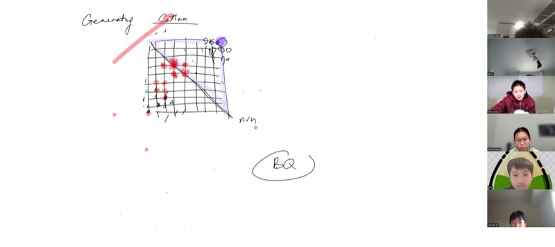
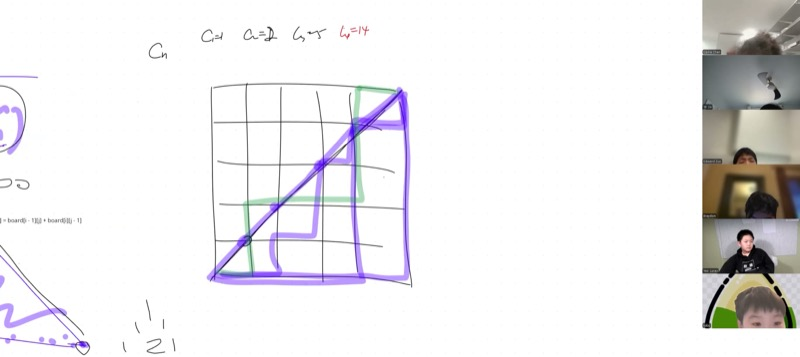
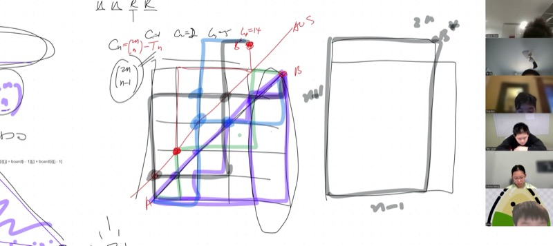
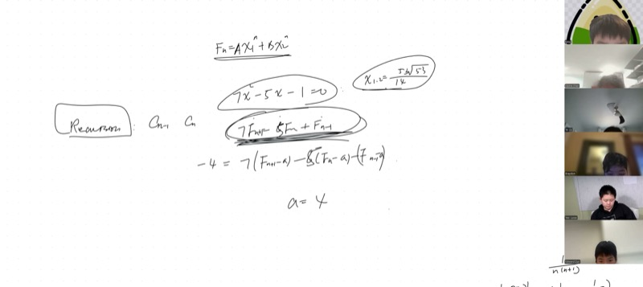

## Lecture Video

```{=html}
<video controls width="100%" preload="metadata">
  <source src="https://github.com/ymote/learningmathteam/releases/download/v1.0/Saturday20260110Morning.mp4" type="video/mp4">
</video>
```

## Background

Imagine you are standing at the bottom-left corner of an $n \times n$ grid and you want to walk to the top-right corner. You can only move **right** or **up** at each step. How many total paths are there? That is a classic combinatorics warm-up: $\binom{2n}{n}$. But what if we add a restriction --- your path must never go **above** the main diagonal? The number of such "legal" paths is a **Catalan number**, a sequence that appears everywhere in mathematics: in parenthesization of expressions, in the structure of binary trees, in polygon triangulations, and much more.

In this lesson we derive the closed-form formula for Catalan numbers in two completely different ways. First, we use a beautiful **reflection argument** (Andre's reflection) that converts the problem of counting bad paths into a simple grid-counting problem. Then we set up a **recursion** based on where a legal path first touches the diagonal and discover that the recursion is *nonlinear* --- unlike anything we have solved before. This motivates the introduction of **generating functions**, a powerful algebraic machine that encodes an entire sequence into a single polynomial (or power series), letting us manipulate sequences the way we manipulate functions.

::: {.callout-important}
## Key Ideas

1. **Grid paths**: The number of lattice paths from $(0,0)$ to $(n,n)$ using only right and up steps is $\binom{2n}{n}$.
2. **Catalan numbers**: The number of such paths that never cross above the main diagonal is $C_n = \frac{1}{n+1}\binom{2n}{n}$.
3. **Andre's reflection**: Every "trespassing" path can be reflected across the line $y = x + 1$ to create a one-to-one correspondence with *all* paths to a shifted destination, giving $C_n = \binom{2n}{n} - \binom{2n}{n-1}$.
4. **Catalan recursion**: $C_n = \displaystyle\sum_{j=0}^{n-1} C_j \cdot C_{n-1-j}$, a nonlinear recursion based on the first touching point on the diagonal.
5. **Generating functions**: The formal power series $G(x) = \displaystyle\sum_{k=0}^{\infty} C_k \, x^k$ encodes all Catalan numbers; squaring $G(x)$ reproduces the convolution in the recursion, leading to $G(x) = x\,G(x)^2 + 1$.
:::

## Counting Paths on a Grid

Consider an $n \times n$ grid. We start at corner $A = (0,0)$ and want to reach corner $B = (n,n)$. At each step we move either **right** (R) or **up** (U). Every path consists of exactly $2n$ steps --- $n$ rights and $n$ ups --- so we are choosing which $n$ of the $2n$ positions will be "right":

$$\text{Total paths} = \binom{2n}{n}$$

::: {.callout-tip collapse="true"}
## Example: Filling in Pascal's Triangle on the Grid

On a $4 \times 4$ grid, label each lattice point with the number of paths from $(0,0)$ to that point. The bottom row and left column are all $1$. Every interior point is the sum of its left neighbor and its bottom neighbor --- exactly the rule that builds Pascal's triangle. The corner value is $\binom{8}{4} = 70$.
:::

## The Catalan Constraint: Stay Below the Diagonal

A path is **legal** if it never goes strictly above the main diagonal $y = x$. Equivalently, at every point along the path, the number of up-steps taken so far never exceeds the number of right-steps.

The first few Catalan numbers are:

| $n$ | 0 | 1 | 2 | 3 | 4 | 5 |
|-----|---|---|---|---|---|---|
| $C_n$ | 1 | 1 | 2 | 5 | 14 | 42 |

Notice that $C_3 = 5$, not $6$, and it must be **odd**: every legal path has a mirror image (swap R and U, then reverse), and there is one path on the diagonal that maps to itself. This parity argument generalizes.

## Andre's Reflection Principle

Rather than counting legal paths directly, we count the **illegal** (trespassing) paths and subtract.

### Step 1: Identify the First Trespass

Every illegal path must cross the line $y = x$ at some point, meaning it touches the line $y = x + 1$. Call the **first** such touching point $P$.

### Step 2: Reflect the Remaining Journey

Starting at $P$, reflect the remainder of the path across the line $y = x + 1$. This swaps every subsequent R-step with a U-step and vice versa. The reflected path now ends not at $B = (n, n)$ but at a new point:

$$B^* = (n-1,\, n+1)$$

### Step 3: Establish a Bijection

This reflection is **reversible**: given any path from $A$ to $B^*$, it must cross the line $y = x + 1$ somewhere (since it ends above it). Reflect from the first crossing point to recover a unique trespassing path from $A$ to $B$. Therefore:

$$\text{(illegal paths to } B\text{)} = \text{(all paths to } B^*\text{)}$$

### Step 4: Count and Subtract

The number of paths from $(0,0)$ to $(n-1, n+1)$ is $\binom{2n}{n+1}$, since we still take $2n$ steps but now choose $n+1$ ups (or equivalently $n-1$ rights).

$$C_n = \binom{2n}{n} - \binom{2n}{n+1}$$

::: {.callout-note collapse="true"}
## Proof: Simplifying to the Closed Form

$$C_n = \binom{2n}{n} - \binom{2n}{n+1}$$

Write each binomial coefficient with factorials:

$$C_n = \frac{(2n)!}{n!\,n!} - \frac{(2n)!}{(n+1)!\,(n-1)!}$$

Factor out $\frac{(2n)!}{n!\,n!}$:

$$C_n = \frac{(2n)!}{n!\,n!}\left(1 - \frac{n!}{(n+1)!} \cdot \frac{n!}{(n-1)!}\right) = \binom{2n}{n}\left(1 - \frac{n}{n+1}\right) = \binom{2n}{n} \cdot \frac{1}{n+1}$$

Therefore:

$$\boxed{C_n = \frac{1}{n+1}\binom{2n}{n}}$$
:::

::: {.callout-tip collapse="true"}
## Example: Verify $C_4 = 14$

$$C_4 = \frac{1}{5}\binom{8}{4} = \frac{1}{5} \cdot 70 = 14$$

Alternatively: $C_4 = \binom{8}{4} - \binom{8}{5} = 70 - 56 = 14$. Both agree.
:::

### Asymptotic Behavior

The fraction of legal paths out of all paths is:

$$\frac{C_n}{\binom{2n}{n}} = \frac{1}{n+1}$$

As $n$ grows, this fraction shrinks toward zero. For $n = 100$, only about $1\%$ of all paths stay below the diagonal. Intuitively, a random walk on a large grid will almost certainly wander above the diagonal at some point.

```{=html}
<div id="desmos-catalan" class="desmos-container"></div>
<script src="https://www.desmos.com/api/v1.9/calculator.js?apiKey=dcb31709b452b1cf9dc26972add0fda6"></script>
<script>
  var elt = document.getElementById('desmos-catalan');
  var calc = Desmos.GraphingCalculator(elt, {
    expressions: true,
    settingsMenu: false
  });
  calc.setExpression({id: 'frac', latex: 'y = \\frac{1}{x+1}', color: '#2d70b3', lineWidth: 2.5});
  calc.setExpression({id: 'label', latex: 'y = 0', color: '#aaaaaa', lineWidth: 0.5});
  // Plot specific Catalan fraction points
  calc.setExpression({id: 'pt1', latex: '(1, 1/2)', color: '#c74440', pointSize: 9, label: 'n=1: 1/2', showLabel: true});
  calc.setExpression({id: 'pt2', latex: '(2, 1/3)', color: '#c74440', pointSize: 9, label: 'n=2: 1/3', showLabel: true});
  calc.setExpression({id: 'pt3', latex: '(3, 1/4)', color: '#c74440', pointSize: 9, label: 'n=3: 1/4', showLabel: true});
  calc.setExpression({id: 'pt4', latex: '(4, 1/5)', color: '#c74440', pointSize: 9, label: 'n=4: 1/5', showLabel: true});
  calc.setExpression({id: 'pt5', latex: '(5, 1/6)', color: '#c74440', pointSize: 9, label: 'n=5: 1/6', showLabel: true});
  calc.setMathBounds({left: -0.5, right: 10, bottom: -0.1, top: 0.7});
</script>
```

## The Catalan Recursion

There is a completely different way to derive Catalan numbers: **recursion based on the first diagonal touch**.

### Building the Recursion

Consider a legal path on an $n \times n$ grid. Look at the **first time** the path touches the main diagonal after leaving $(0,0)$. Suppose this first touch happens at the point $(j+1,\, j+1)$ for some $0 \le j \le n-1$.

- The path from $(0,0)$ to $(j+1, j+1)$ is forced to start with a right step and end with an up step (otherwise it would touch the diagonal earlier). The portion in between is a legal path on a $j \times j$ grid: there are $C_j$ such paths.
- The path from $(j+1, j+1)$ to $(n, n)$ is a legal path on an $(n-1-j) \times (n-1-j)$ grid: there are $C_{n-1-j}$ such paths.

Summing over all possible first-touch locations:

$$\boxed{C_n = \sum_{j=0}^{n-1} C_j \cdot C_{n-1-j}}$$

with $C_0 = 1$.

::: {.callout-tip collapse="true"}
## Example: Verify $C_4$ Using the Recursion

$$C_4 = C_0 C_3 + C_1 C_2 + C_2 C_1 + C_3 C_0$$
$$= 1 \cdot 5 + 1 \cdot 2 + 2 \cdot 1 + 5 \cdot 1 = 5 + 2 + 2 + 5 = 14 \checkmark$$
:::

### Why This Recursion Is Hard

This is a **nonlinear** recursion --- each term is a *product* of two earlier Catalan numbers, and we sum over a sliding window. Compare this to a linear recursion like the Fibonacci sequence $F_n = F_{n-1} + F_{n-2}$, which we can solve using eigenvalues of a characteristic polynomial. No such direct approach works here.

## Review: Solving Linear Recursions

Before introducing the heavy machinery needed for the Catalan recursion, let us recall how we handle **linear** recursions.

Given a recursion like:

$$7F_{n+1} = 6F_n + F_{n-1} + 5$$

**Step 1: Absorb the constant.** Define a shifted sequence $G_n = F_n - a$ chosen so the constant term vanishes. If the constant can be absorbed (i.e., $1$ is not an eigenvalue), we reduce to a homogeneous recursion.

**Step 2: Characteristic equation.** For $G_{n+1} = \alpha G_n + \beta G_{n-1}$, guess $G_n = r^n$ and solve the quadratic $r^2 = \alpha r + \beta$ for eigenvalues $r_1, r_2$.

**Step 3: General solution.** The solution is a linear combination:

$$G_n = A \cdot r_1^n + B \cdot r_2^n$$

where $A$ and $B$ are determined by initial conditions. If $r_1, r_2$ are complex, the solution involves rotation (amplitude and phase), which we have studied before.

::: {.callout-tip collapse="true"}
## Example: When Can We Not Absorb the Constant?

Consider $7F_{n+1} = 6F_n + F_{n-1} + 4$. Setting $G_n = F_n - a$, we need $7a = 6a + a + 4$, i.e., $0 = 4$. This fails because $r = 1$ is a root of the characteristic equation $7r^2 - 6r - 1 = 0$ (check: $7 - 6 - 1 = 0$). In such cases we use a different substitution --- try $G_n = F_n - an$ instead, which introduces a linear shift that can handle the resonant case.
:::

## Generating Functions: The Key to Nonlinear Recursions

Since the Catalan recursion is nonlinear, we need a new tool. A **generating function** is a formal power series that packages an entire sequence into a single algebraic object:

$$G(x) = \sum_{k=0}^{\infty} C_k \, x^k = C_0 + C_1 x + C_2 x^2 + C_3 x^3 + \cdots$$

We do **not** care about plugging in specific values of $x$ or whether the series converges. The power series is a *container* --- just as we use complex numbers as containers for angle information, we use $G(x)$ as a container for the Catalan sequence.

### The Convolution Connection

The Catalan recursion $C_n = \sum_{j=0}^{n-1} C_j \cdot C_{n-1-j}$ looks exactly like the formula for the coefficient of $x^{n-1}$ when we multiply two copies of $G(x)$ together. When you compute $G(x)^2$:

$$G(x)^2 = \left(\sum_{k=0}^{\infty} C_k x^k\right)^2 = \sum_{n=0}^{\infty} \left(\sum_{j=0}^{n} C_j C_{n-j}\right) x^n$$

The coefficient of $x^n$ in $G(x)^2$ is $\sum_{j=0}^{n} C_j C_{n-j}$, which is exactly $C_{n+1}$!

This means:

$$G(x)^2 = \frac{G(x) - C_0}{x} = \frac{G(x) - 1}{x}$$

Rearranging:

$$\boxed{x \, G(x)^2 - G(x) + 1 = 0}$$

This is a **quadratic equation in $G(x)$**! Solving with the quadratic formula gives a closed-form expression for $G(x)$, from which we can extract $C_n$ as the coefficient of $x^n$. This is the homework exploration for this lesson --- try squaring $G(x)$ and see the pattern emerge.

::: {.callout-note collapse="true"}
## Preview: Solving the Quadratic for $G(x)$

Treating $G(x)$ as the unknown in $xG^2 - G + 1 = 0$, the quadratic formula gives:

$$G(x) = \frac{1 \pm \sqrt{1 - 4x}}{2x}$$

We choose the minus sign (so that $G(0) = C_0 = 1$ after taking the limit). Expanding $\sqrt{1 - 4x}$ using the generalized binomial theorem recovers the formula $C_n = \frac{1}{n+1}\binom{2n}{n}$ as the coefficient of $x^n$. The full derivation will be completed in the next session.
:::

## Key Video Frames

<div style="display: flex; flex-direction: column; gap: 10px; margin: 1em 0;">
  
  
  
  
</div>

## Cheat Sheet

::: {.key-formula}
| Concept | Formula / Rule |
|---|---|
| Grid paths $(0,0) \to (n,n)$ | $\binom{2n}{n}$ |
| Catalan number (closed form) | $C_n = \frac{1}{n+1}\binom{2n}{n}$ |
| Catalan number (subtraction form) | $C_n = \binom{2n}{n} - \binom{2n}{n+1}$ |
| Catalan recursion | $C_n = \displaystyle\sum_{j=0}^{n-1} C_j \cdot C_{n-1-j}$, $C_0 = 1$ |
| First Catalan numbers | $1, 1, 2, 5, 14, 42, 132, 429, \ldots$ |
| Fraction of legal paths | $\frac{C_n}{\binom{2n}{n}} = \frac{1}{n+1}$ |
| Generating function | $G(x) = \displaystyle\sum_{k=0}^{\infty} C_k x^k$ satisfies $xG(x)^2 - G(x) + 1 = 0$ |
| Andre's reflection destination | Trespassing paths biject to all paths to $(n-1, n+1)$ |
| Linear recursion eigenvalues | $a_n = A r_1^n + B r_2^n$ where $r_1, r_2$ are roots of characteristic equation |

### Quick Reference: Catalan Number Values

| $n$ | $C_n$ | $\binom{2n}{n}$ | Fraction legal |
|-----|-------|-----------------|----------------|
| 0 | 1 | 1 | 1 |
| 1 | 1 | 2 | 1/2 |
| 2 | 2 | 6 | 1/3 |
| 3 | 5 | 20 | 1/4 |
| 4 | 14 | 70 | 1/5 |
| 5 | 42 | 252 | 1/6 |
| 6 | 132 | 924 | 1/7 |
:::
