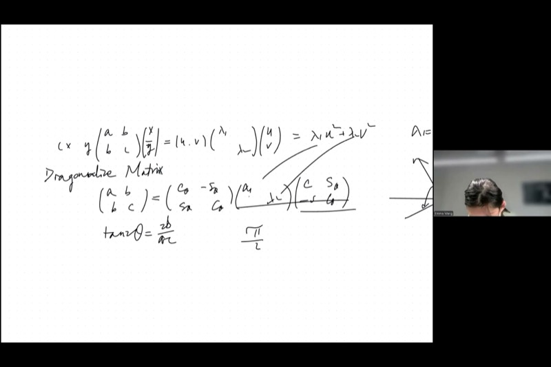
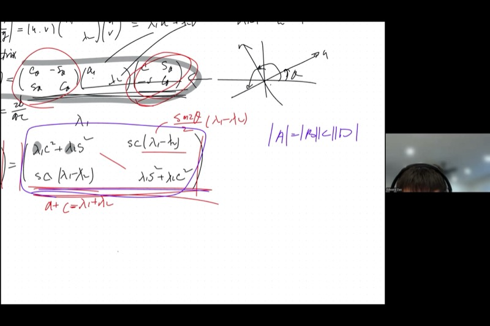
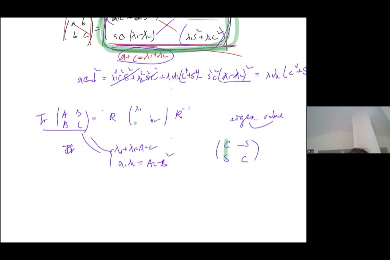
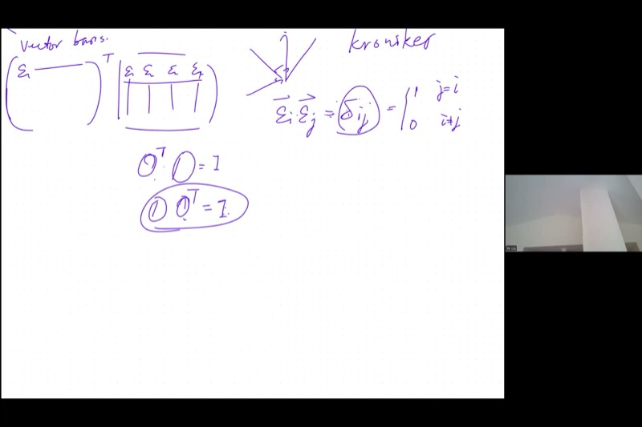

## Lecture Video

```{=html}
<video controls width="100%" preload="metadata">
  <source src="https://github.com/ymote/learningmathteam/releases/download/v1.0/Saturday202602021morning.mp4" type="video/mp4">
</video>
```

## Background

Imagine you have a quadratic expression like $3x^2 + 4xy + y^2$. This looks messy because of the $xy$ cross-term --- you cannot immediately tell whether this equation describes an ellipse, a hyperbola, or a parabola. But what if you could rotate your coordinate axes so the cross-term disappears, leaving you with something clean like $\lambda_1 u^2 + \lambda_2 v^2$?

That is exactly what **matrix diagonalization** achieves. Every symmetric matrix can be "unscrambled" by a rotation into a diagonal matrix whose entries --- the **eigenvalues** --- reveal the true geometry hiding inside the original expression. The rotation directions are given by **eigenvectors**, and the rotation matrix is an **orthogonal matrix** whose inverse is simply its transpose.

This lesson pulls together the threads from previous sessions: the quadratic form, rotational matrices, the tangent formula for finding the rotation angle, and two powerful invariants (the **trace** and the **determinant**) that let you find eigenvalues without computing the rotation at all. By the end, you will see how the equation $M\vec{\varepsilon} = \lambda\vec{\varepsilon}$ defines eigenvalues and eigenvectors --- one of the most important equations in all of mathematics and physics.

::: {.callout-important}
## Key Ideas

1. **Quadratic Form as a Matrix**: The expression $ax^2 + 2bxy + cy^2$ is encoded in the symmetric matrix $\begin{pmatrix} a & b \\ b & c \end{pmatrix}$, called a **metric tensor**.
2. **Diagonalization by Rotation**: A symmetric $2 \times 2$ matrix can always be diagonalized: $M = R(-\theta)\begin{pmatrix}\lambda_1 & 0 \\ 0 & \lambda_2\end{pmatrix}R(\theta)$, where $R(\theta)$ is a rotation matrix.
3. **Two Invariants Find Eigenvalues**: The **trace** $\lambda_1 + \lambda_2 = a + c$ and the **determinant** $\lambda_1 \lambda_2 = ac - b^2$ are unchanged by rotation, so you can find $\lambda_1, \lambda_2$ without computing $\theta$.
4. **Orthogonal Matrices**: A matrix whose columns are orthonormal vectors satisfies $O^T O = I$, meaning $O^{-1} = O^T$. Rotation matrices are orthogonal.
5. **Eigenvalue Equation**: The fundamental relationship $M\vec{\varepsilon} = \lambda\vec{\varepsilon}$ says that multiplying the eigenvector $\vec{\varepsilon}$ by $M$ simply scales it by the eigenvalue $\lambda$.
:::

## From Quadratic Forms to Matrices

Every quadratic expression in two variables can be written using a symmetric matrix:

$$ax^2 + 2bxy + cy^2 = \begin{pmatrix} x & y \end{pmatrix} \begin{pmatrix} a & b \\ b & c \end{pmatrix} \begin{pmatrix} x \\ y \end{pmatrix}$$

This matrix $M = \begin{pmatrix} a & b \\ b & c \end{pmatrix}$ is called a **metric tensor** --- it encodes a "twisted" way of measuring distance. In ordinary Euclidean geometry, distance is $x^2 + y^2$ (the Pythagorean sum). A general metric allows weighted and mixed terms.

::: {.callout-tip collapse="true"}
## Example: Identifying the Conic from a Quadratic

Consider $2x^2 + 6xy + 5y^2 = 1$. The matrix is:

$$M = \begin{pmatrix} 2 & 3 \\ 3 & 5 \end{pmatrix}$$

To classify this conic, we find the eigenvalues using our two invariants:

- **Trace**: $\lambda_1 + \lambda_2 = 2 + 5 = 7$
- **Determinant**: $\lambda_1 \lambda_2 = (2)(5) - 3^2 = 1$

So $\lambda_1$ and $\lambda_2$ satisfy $\lambda^2 - 7\lambda + 1 = 0$, giving $\lambda = \frac{7 \pm \sqrt{45}}{2} = \frac{7 \pm 3\sqrt{5}}{2}$.

Both eigenvalues are positive, so the conic is an **ellipse**.
:::

### When Eigenvalues Have Different Signs

The sign pattern of $\lambda_1, \lambda_2$ determines the conic section:

| Eigenvalue signs | Conic type | Example metric |
|---|---|---|
| Both positive | Ellipse | Standard distance |
| Both negative | Ellipse (reflected) | Negative-definite |
| Opposite signs | **Hyperbola** | Minkowski metric ($\lambda_1 = 1, \lambda_2 = -1$) |
| One is zero | Parabola | Degenerate case |

In Einstein's theory of relativity, spacetime uses the **Minkowski metric** with $\lambda_1 = 1$ and $\lambda_2 = -1$. This gives rise to **hyperbolic geometry**, where the "distance" $t^2 - x^2$ can be negative --- profoundly different from everyday Euclidean geometry, yet governing the fabric of our universe.

## Diagonalization: Two Routes to Eigenvalues

There are two approaches to diagonalizing the matrix $M = \begin{pmatrix} a & b \\ b & c \end{pmatrix}$.

### Route 1: Find the Rotation Angle First

From the previous session, the rotation angle $\theta$ that eliminates the cross-term satisfies:

$$\tan(2\theta) = \frac{2b}{a - c}$$

This equation has period $\pi$ in $2\theta$, so $\theta$ has period $\frac{\pi}{2}$. If $\theta$ is a solution, then $\theta + \frac{\pi}{2}$ is also a solution --- which makes sense, because swapping the two axes (a 90-degree rotation) just exchanges $\lambda_1$ and $\lambda_2$.

After finding $\theta$, you compute $\cos\theta$ and $\sin\theta$, plug into the rotated matrix, and read off $\lambda_1, \lambda_2$. This works but involves a lot of trigonometric algebra.

### Route 2: Use Invariants (Skip the Angle!)

A much cleaner approach uses two quantities that **do not change** under rotation:

$$\boxed{\lambda_1 + \lambda_2 = a + c \qquad \text{(trace)}}$$

$$\boxed{\lambda_1 \lambda_2 = ac - b^2 \qquad \text{(determinant)}}$$

These two equations let you solve for $\lambda_1$ and $\lambda_2$ directly --- no trigonometry required. They are the roots of the **characteristic polynomial**:

$$\lambda^2 - (a+c)\lambda + (ac - b^2) = 0$$

```{=html}
<div id="desmos-1" class="desmos-container"></div>
<script src="https://www.desmos.com/api/v1.9/calculator.js?apiKey=dcb31709b452b1cf9dc26972add0fda6"></script>
<script>
  var elt1 = document.getElementById('desmos-1');
  var calc1 = Desmos.GraphingCalculator(elt1, {
    expressions: true,
    settingsMenu: false
  });
  // Show a quadratic form and its rotated version
  calc1.setExpression({id: 'slider-a', latex: 'a_0 = 3', sliderBounds: {min: -5, max: 5, step: 0.1}});
  calc1.setExpression({id: 'slider-b', latex: 'b_0 = 1', sliderBounds: {min: -5, max: 5, step: 0.1}});
  calc1.setExpression({id: 'slider-c', latex: 'c_0 = 1', sliderBounds: {min: -5, max: 5, step: 0.1}});
  calc1.setExpression({id: 'conic', latex: 'a_0 x^2 + 2 b_0 x y + c_0 y^2 = 1', color: '#2d70b3'});
  calc1.setExpression({id: 'trace-label', latex: '(0, 2.5)', label: 'trace = a + c', showLabel: true, hidden: true, color: '#388c46'});
  calc1.setExpression({id: 'det-label', latex: '(0, 2.2)', label: 'det = ac - b²', showLabel: true, hidden: true, color: '#c74440'});
  calc1.setMathBounds({left: -3, right: 3, bottom: -3, top: 3});
</script>
```

*Adjust the sliders for $a$, $b$, $c$ above to see how different matrix entries change the conic. When the determinant $ac - b^2$ is positive, you get an ellipse; when negative, a hyperbola.*

::: {.callout-tip collapse="true"}
## Example: Finding Eigenvalues via Invariants

Given $M = \begin{pmatrix} 5 & 2 \\ 2 & 1 \end{pmatrix}$:

**Trace:** $\lambda_1 + \lambda_2 = 5 + 1 = 6$

**Determinant:** $\lambda_1 \lambda_2 = 5 \cdot 1 - 2^2 = 1$

**Characteristic polynomial:** $\lambda^2 - 6\lambda + 1 = 0$

$$\lambda = \frac{6 \pm \sqrt{36 - 4}}{2} = \frac{6 \pm \sqrt{32}}{2} = 3 \pm 2\sqrt{2}$$

So $\lambda_1 = 3 + 2\sqrt{2} \approx 5.83$ and $\lambda_2 = 3 - 2\sqrt{2} \approx 0.17$. Both positive, so the quadratic form defines an ellipse.
:::

## Proving the Trace Invariant

When you write out the diagonalization:

$$\begin{pmatrix} a & b \\ b & c \end{pmatrix} = \begin{pmatrix} \cos\theta & \sin\theta \\ -\sin\theta & \cos\theta \end{pmatrix} \begin{pmatrix} \lambda_1 & 0 \\ 0 & \lambda_2 \end{pmatrix} \begin{pmatrix} \cos\theta & -\sin\theta \\ \sin\theta & \cos\theta \end{pmatrix}$$

and multiply everything out, you find:

$$a = \lambda_1 \cos^2\theta + \lambda_2 \sin^2\theta$$
$$c = \lambda_1 \sin^2\theta + \lambda_2 \cos^2\theta$$

Adding these:

$$a + c = \lambda_1(\cos^2\theta + \sin^2\theta) + \lambda_2(\sin^2\theta + \cos^2\theta) = \lambda_1 + \lambda_2$$

The Pythagorean identity $\cos^2\theta + \sin^2\theta = 1$ causes $\theta$ to vanish completely. The trace is invariant under rotation.

## Proving the Determinant Invariant

::: {.callout-note collapse="true"}
## Full Calculation: Determinant Is Invariant

We compute the determinant of the expanded matrix directly. After multiplying out:

$$a = \lambda_1\cos^2\theta + \lambda_2\sin^2\theta, \quad c = \lambda_1\sin^2\theta + \lambda_2\cos^2\theta$$
$$b = (\lambda_1 - \lambda_2)\sin\theta\cos\theta$$

The determinant $ac - b^2$:

**Product $ac$:**
$$ac = (\lambda_1\cos^2\theta + \lambda_2\sin^2\theta)(\lambda_1\sin^2\theta + \lambda_2\cos^2\theta)$$

Expanding:

$$= \lambda_1^2 \cos^2\theta\sin^2\theta + \lambda_1\lambda_2\cos^4\theta + \lambda_1\lambda_2\sin^4\theta + \lambda_2^2\sin^2\theta\cos^2\theta$$

$$= (\lambda_1^2 + \lambda_2^2)\cos^2\theta\sin^2\theta + \lambda_1\lambda_2(\cos^4\theta + \sin^4\theta)$$

**Term $b^2$:**
$$b^2 = (\lambda_1 - \lambda_2)^2 \sin^2\theta\cos^2\theta$$

**Subtraction $ac - b^2$:**

$$= \lambda_1\lambda_2(\cos^4\theta + \sin^4\theta) + [(\lambda_1^2 + \lambda_2^2) - (\lambda_1 - \lambda_2)^2]\sin^2\theta\cos^2\theta$$

Now $(\lambda_1^2 + \lambda_2^2) - (\lambda_1 - \lambda_2)^2 = 2\lambda_1\lambda_2$, so:

$$= \lambda_1\lambda_2(\cos^4\theta + \sin^4\theta + 2\sin^2\theta\cos^2\theta)$$

$$= \lambda_1\lambda_2(\cos^2\theta + \sin^2\theta)^2 = \lambda_1\lambda_2$$

The angle vanishes completely, confirming $\det M = \lambda_1\lambda_2$.
:::

### Geometric Intuition: Why the Determinant Is Invariant

The determinant measures the **area** (or volume) of the parallelogram spanned by the matrix's column vectors. A rotation does not stretch or compress anything --- it only turns. Since the two rotation matrices each have determinant $1$, the overall scaling factor is $1 \times \lambda_1\lambda_2 \times 1 = \lambda_1\lambda_2$.

This is the factorization theorem for determinants: $\det(ABC) = \det(A)\det(B)\det(C)$. While we verified it by direct computation in this case, the general theorem is a deep result that requires more advanced linear algebra to prove rigorously.

## Orthogonal Matrices and Eigenvectors

### The Rotation Matrix as a Pair of Vectors

The rotation matrix can be viewed as two **column vectors**:

$$R(\theta) = \begin{pmatrix} \cos\theta & -\sin\theta \\ \sin\theta & \cos\theta \end{pmatrix} = \begin{pmatrix} | & | \\ \vec{\varepsilon}_1 & \vec{\varepsilon}_2 \\ | & | \end{pmatrix}$$

where $\vec{\varepsilon}_1 = \begin{pmatrix}\cos\theta \\ \sin\theta\end{pmatrix}$ and $\vec{\varepsilon}_2 = \begin{pmatrix}-\sin\theta \\ \cos\theta\end{pmatrix}$.

These vectors have three remarkable properties:

1. **Unit length**: $|\vec{\varepsilon}_1| = |\vec{\varepsilon}_2| = 1$ (by the Pythagorean identity)
2. **Orthogonal**: $\vec{\varepsilon}_1 \cdot \vec{\varepsilon}_2 = \cos\theta(-\sin\theta) + \sin\theta\cos\theta = 0$
3. **Negative reciprocal slopes**: slope of $\vec{\varepsilon}_1$ is $\frac{\sin\theta}{\cos\theta} = \tan\theta$; slope of $\vec{\varepsilon}_2$ is $\frac{\cos\theta}{-\sin\theta} = -\cot\theta = -\frac{1}{\tan\theta}$

Together, $\vec{\varepsilon}_1$ and $\vec{\varepsilon}_2$ form an **orthonormal basis** --- a rotated version of the standard $\hat{i}, \hat{j}$ directions.

```{=html}
<div id="desmos-2" class="desmos-container"></div>
<script>
  var elt2 = document.getElementById('desmos-2');
  var calc2 = Desmos.GraphingCalculator(elt2, {
    expressions: true,
    settingsMenu: false
  });
  calc2.setExpression({id: 'theta', latex: '\\theta_0 = 0.6', sliderBounds: {min: 0, max: 6.28, step: 0.01}});
  calc2.setExpression({id: 'circle', latex: 'x^2 + y^2 = 1', color: '#aaaaaa', lineWidth: 1});
  // epsilon 1
  calc2.setExpression({id: 'e1-vec', latex: '(t\\cos(\\theta_0), t\\sin(\\theta_0))', color: '#2d70b3', lineWidth: 3, parametricDomain: {min: 0, max: 1}});
  calc2.setExpression({id: 'e1-pt', latex: '(\\cos(\\theta_0), \\sin(\\theta_0))', color: '#2d70b3', pointSize: 8, label: 'ε₁', showLabel: true});
  // epsilon 2
  calc2.setExpression({id: 'e2-vec', latex: '(-t\\sin(\\theta_0), t\\cos(\\theta_0))', color: '#c74440', lineWidth: 3, parametricDomain: {min: 0, max: 1}});
  calc2.setExpression({id: 'e2-pt', latex: '(-\\sin(\\theta_0), \\cos(\\theta_0))', color: '#c74440', pointSize: 8, label: 'ε₂', showLabel: true});
  // Standard axes
  calc2.setExpression({id: 'i-hat', latex: '(t, 0)', color: '#388c46', lineWidth: 1, lineStyle: Desmos.Styles.DASHED, parametricDomain: {min: 0, max: 1}});
  calc2.setExpression({id: 'j-hat', latex: '(0, t)', color: '#388c46', lineWidth: 1, lineStyle: Desmos.Styles.DASHED, parametricDomain: {min: 0, max: 1}});
  calc2.setMathBounds({left: -1.5, right: 1.5, bottom: -1.5, top: 1.5});
</script>
```

*Drag the $\theta_0$ slider to rotate the orthonormal basis $\vec{\varepsilon}_1$ (blue) and $\vec{\varepsilon}_2$ (red). They always remain perpendicular and unit-length.*

### The Orthogonal Matrix Property

A matrix $O$ built from orthonormal column vectors is called an **orthogonal matrix**. Its defining property is:

$$\boxed{O^T O = I \qquad \Longleftrightarrow \qquad O^{-1} = O^T}$$

**Why this works:** When you multiply $O^T O$, the $(i,j)$ entry is the dot product $\vec{\varepsilon}_i \cdot \vec{\varepsilon}_j$. Since the columns are orthonormal:

$$\vec{\varepsilon}_i \cdot \vec{\varepsilon}_j = \delta_{ij} = \begin{cases} 1 & \text{if } i = j \\ 0 & \text{if } i \neq j \end{cases}$$

This is the **Kronecker delta** --- it produces the identity matrix.

::: {.callout-note collapse="true"}
## Proof: Left Inverse Implies Right Inverse

We proved $O^T O = I$, but does $O O^T = I$ also hold?

Starting from $O^T O = I$, multiply both sides on the right by $O^T$:

$$O^T O \cdot O^T = O^T$$
$$O^T (O O^T - I) = 0$$

Since $O^T$ has full rank (its determinant is nonzero --- it is built from independent vectors), the only matrix $X$ satisfying $O^T X = 0$ is $X = 0$. Therefore:

$$O O^T - I = 0 \qquad \Longrightarrow \qquad O O^T = I$$

A left inverse of an orthogonal matrix is also its right inverse.
:::

### Higher Dimensions

This structure generalizes naturally. In $n$ dimensions, an orthogonal matrix $O$ is built from $n$ mutually orthogonal unit vectors $\vec{\varepsilon}_1, \vec{\varepsilon}_2, \ldots, \vec{\varepsilon}_n$. The property $O^T O = I$ still holds, and $O^{-1} = O^T$ remains true. The Kronecker delta encodes all the pairwise dot products:

$$\vec{\varepsilon}_i \cdot \vec{\varepsilon}_j = \delta_{ij} \quad \text{for all } i, j = 1, \ldots, n$$

## The Eigenvalue Equation

Now we reach the culmination. Starting from the diagonalization:

$$M = E \begin{pmatrix} \lambda_1 & 0 \\ 0 & \lambda_2 \end{pmatrix} E^T$$

where $E = \begin{pmatrix} \vec{\varepsilon}_1 & \vec{\varepsilon}_2 \end{pmatrix}$ is the orthogonal matrix of eigenvectors, multiply both sides on the right by $E$:

$$M E = E \begin{pmatrix} \lambda_1 & 0 \\ 0 & \lambda_2 \end{pmatrix}$$

since $E^T E = I$. Written as column vectors:

$$M \begin{pmatrix} \vec{\varepsilon}_1 & \vec{\varepsilon}_2 \end{pmatrix} = \begin{pmatrix} \vec{\varepsilon}_1 & \vec{\varepsilon}_2 \end{pmatrix} \begin{pmatrix} \lambda_1 & 0 \\ 0 & \lambda_2 \end{pmatrix}$$

Multiply out the right-hand side column by column:

$$\begin{pmatrix} \vec{\varepsilon}_1 & \vec{\varepsilon}_2 \end{pmatrix} \begin{pmatrix} \lambda_1 & 0 \\ 0 & \lambda_2 \end{pmatrix} = \begin{pmatrix} \lambda_1 \vec{\varepsilon}_1 & \lambda_2 \vec{\varepsilon}_2 \end{pmatrix}$$

Comparing column by column, we get two separate equations:

$$\boxed{M\vec{\varepsilon}_1 = \lambda_1 \vec{\varepsilon}_1 \qquad \text{and} \qquad M\vec{\varepsilon}_2 = \lambda_2 \vec{\varepsilon}_2}$$

This is the **eigenvalue equation**: multiplying the matrix $M$ by an eigenvector $\vec{\varepsilon}$ simply scales the vector by its corresponding eigenvalue $\lambda$. The matrix does not rotate or distort the eigenvector --- it only stretches (or compresses or reflects) it.

::: {.callout-tip collapse="true"}
## Example: Verify the Eigenvalue Equation

For $M = \begin{pmatrix} 3 & 1 \\ 1 & 3 \end{pmatrix}$:

**Eigenvalues:** trace $= 6$, determinant $= 9 - 1 = 8$, so $\lambda^2 - 6\lambda + 8 = 0$, giving $\lambda_1 = 4$, $\lambda_2 = 2$.

**Finding $\vec{\varepsilon}_1$** for $\lambda_1 = 4$: Solve $(M - 4I)\vec{v} = \vec{0}$:

$$\begin{pmatrix} -1 & 1 \\ 1 & -1 \end{pmatrix}\begin{pmatrix} v_1 \\ v_2 \end{pmatrix} = \begin{pmatrix} 0 \\ 0 \end{pmatrix} \implies v_1 = v_2$$

Normalized: $\vec{\varepsilon}_1 = \frac{1}{\sqrt{2}}\begin{pmatrix} 1 \\ 1 \end{pmatrix}$

**Verify:** $M\vec{\varepsilon}_1 = \begin{pmatrix} 3 & 1 \\ 1 & 3 \end{pmatrix}\frac{1}{\sqrt{2}}\begin{pmatrix} 1 \\ 1 \end{pmatrix} = \frac{1}{\sqrt{2}}\begin{pmatrix} 4 \\ 4 \end{pmatrix} = 4 \cdot \frac{1}{\sqrt{2}}\begin{pmatrix} 1 \\ 1 \end{pmatrix} = 4\vec{\varepsilon}_1$

Similarly, $\vec{\varepsilon}_2 = \frac{1}{\sqrt{2}}\begin{pmatrix} 1 \\ -1 \end{pmatrix}$ is the eigenvector for $\lambda_2 = 2$.
:::

## Non-Zero Product of Matrices Can Be Zero

An interesting aside from the lecture: can two nonzero matrices multiply to give the zero matrix?

**Yes.** For example:

$$\begin{pmatrix} 1 & 0 \\ 0 & 0 \end{pmatrix} \begin{pmatrix} 0 & 0 \\ 0 & 1 \end{pmatrix} = \begin{pmatrix} 0 & 0 \\ 0 & 0 \end{pmatrix}$$

Neither factor is zero, but their product is. This happens because one matrix "projects" onto dimensions that the other annihilates. However, if a matrix has **full rank** (nonzero determinant, all columns linearly independent), then $AX = 0$ forces $X = 0$. This is why orthogonal matrices --- which always have determinant $\pm 1$ --- can never produce such cancellation.

## Key Video Frames

<div style="display: flex; flex-direction: column; gap: 10px; margin: 1em 0;">
  
  
  
  
</div>

## Cheat Sheet

::: {.key-formula}
| Concept | Formula / Rule |
|---|---|
| Symmetric matrix | $M = \begin{pmatrix} a & b \\ b & c \end{pmatrix}$ encodes the quadratic $ax^2 + 2bxy + cy^2$ |
| Rotation angle | $\tan(2\theta) = \dfrac{2b}{a - c}$ |
| Trace (sum of diagonal) | $\operatorname{tr}(M) = a + c = \lambda_1 + \lambda_2$ |
| Determinant | $\det(M) = ac - b^2 = \lambda_1\lambda_2$ |
| Characteristic polynomial | $\lambda^2 - (a+c)\lambda + (ac - b^2) = 0$ |
| Eigenvalue equation | $M\vec{\varepsilon} = \lambda\vec{\varepsilon}$ |
| Orthogonal matrix | $O^T O = O O^T = I$, so $O^{-1} = O^T$ |
| Kronecker delta | $\vec{\varepsilon}_i \cdot \vec{\varepsilon}_j = \delta_{ij}$ |
| Conic classification | Same-sign $\lambda$: ellipse; opposite signs: hyperbola; one zero: parabola |
| Minkowski metric | $\lambda_1 = 1, \lambda_2 = -1$ gives spacetime hyperbolic geometry |

### Quick Reference: Diagonalization Steps

| Step | Action |
|------|--------|
| 1 | Compute trace: $\lambda_1 + \lambda_2 = a + c$ |
| 2 | Compute determinant: $\lambda_1\lambda_2 = ac - b^2$ |
| 3 | Solve $\lambda^2 - \operatorname{tr}\lambda + \det = 0$ for eigenvalues |
| 4 | Classify conic from signs of $\lambda_1, \lambda_2$ |
| 5 | (Optional) Find $\theta$ from $\tan(2\theta) = 2b/(a-c)$ for the rotation |
| 6 | Find eigenvectors by solving $(M - \lambda I)\vec{v} = \vec{0}$ |
:::
