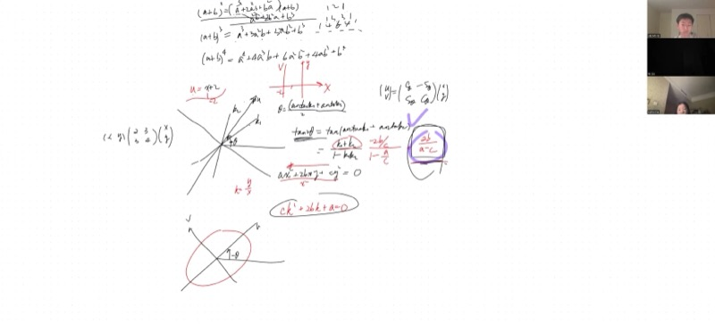
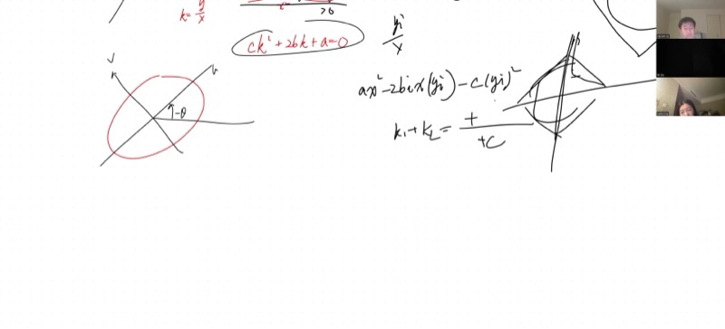
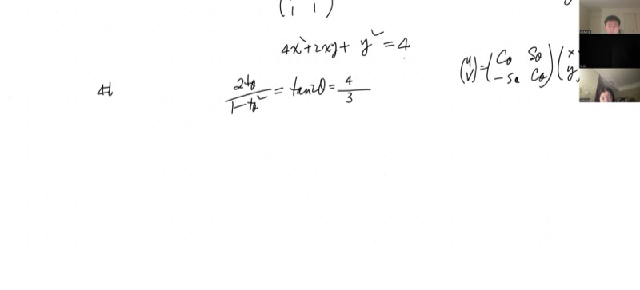

## Background

Every conic section (ellipse, hyperbola, parabola) has **symmetry axes** -- the directions along which it looks the "simplest." When the conic is aligned with the coordinate axes, these are just the $x$- and $y$-axes. But when a conic is **tilted** (the equation contains an $xy$ term), finding those hidden axes of symmetry becomes a real puzzle.

In earlier sessions, we learned how to classify conics using the $2 \times 2$ matrix of the quadratic form, and how to use rotational matrices to eliminate the $xy$ term. Today we tie everything together: we derive a single, elegant formula for the rotation angle $\theta$ that reveals the symmetry axes, prove it works **even when there are no asymptotes** (the ellipse case), and walk through a concrete numerical example. Along the way, we use Vieta's formulas, complex numbers, and a beautiful geometric trick that replaces $y$ with $yi$ to unify hyperbolas and ellipses.

In physics, the **principal axes** of a stress tensor or moment-of-inertia tensor are found by exactly this technique. In data science, **PCA (Principal Component Analysis)** is the same rotation applied to covariance matrices. Understanding this is a gateway to linear algebra, which is the language of modern science and engineering.

## Lecture Video

```{=html}
<video controls width="100%" preload="metadata">
  <source src="https://github.com/ymote/learningmathteam/releases/download/v1.0/Saturday20260221afternoon.mp4" type="video/mp4">
</video>
```

::: {.callout-important}
## Key Ideas

1. **The quadratic form matrix** $\begin{pmatrix} a & b \\ b & c \end{pmatrix}$ encodes the conic $ax^2 + 2bxy + cy^2 = d$; its determinant classifies the type (ellipse vs. hyperbola)
2. **Double-angle formula for the rotation**: $\tan(2\theta) = \dfrac{2b}{a - c}$ gives the angle of the symmetry axes
3. **Vieta's formulas** let us bypass solving for individual slopes $k_1, k_2$ -- we plug the sum and product directly
4. **Coordinate rotation vs. axis rotation**: rotating the *axes* by $+\theta$ means rotating the *coordinates* by $-\theta$
5. **The $yi$ trick**: replacing $y$ with $yi$ turns an ellipse into a hyperbola, proving the rotation formula works universally via the "bounding box" diagonal argument
:::

## The Quadratic Form and Its Matrix

A general second-degree equation in $x$ and $y$ (centered at the origin) can be written:

$$ax^2 + 2bxy + cy^2 = d$$

We package the coefficients into a symmetric matrix:

$$M = \begin{pmatrix} a & b \\ b & c \end{pmatrix}$$

The **determinant** $\det(M) = ac - b^2$ tells us the type:

| Determinant | Conic Type |
|---|---|
| $ac - b^2 > 0$ | **Ellipse** (no real asymptotes) |
| $ac - b^2 < 0$ | **Hyperbola** (two real asymptotes) |
| $ac - b^2 = 0$ | **Parabola / degenerate** |

::: {.callout-note collapse="true"}
## Why a matrix? (Connection to linear algebra)

The expression $ax^2 + 2bxy + cy^2$ can be written as a matrix product:

$$\begin{pmatrix} x & y \end{pmatrix} \begin{pmatrix} a & b \\ b & c \end{pmatrix} \begin{pmatrix} x \\ y \end{pmatrix} = ax^2 + 2bxy + cy^2$$

Finding the symmetry axes of the conic is equivalent to finding the **eigenvectors** of the matrix $M$. This is the central problem of linear algebra: diagonalizing a symmetric matrix. Everything we do today is an introduction to that idea.
:::

## Deriving the Rotation Angle from Asymptotes

### Step 1: Finding asymptote slopes via $k = y/x$

For a hyperbola, the asymptotes pass through the origin. Setting $ax^2 + 2bxy + cy^2 = 0$ and dividing by $x^2$:

$$ck^2 + 2bk + a = 0 \quad \text{where } k = \frac{y}{x}$$

The two roots $k_1, k_2$ are the slopes of the two asymptotes.

### Step 2: Vieta's formulas bypass explicit solutions

By **Vieta's formulas** applied to the quadratic $ck^2 + 2bk + a = 0$:

$$k_1 + k_2 = -\frac{2b}{c}, \qquad k_1 \cdot k_2 = \frac{a}{c}$$

### Step 3: The symmetry axes bisect the asymptotes

The major and minor axes of a conic are the **angle bisectors** of the asymptotes. If $\theta$ is the angle of a symmetry axis, then:

$$\theta = \frac{1}{2}\bigl(\arctan k_1 + \arctan k_2\bigr)$$

### Step 4: Apply the tangent addition formula

$$\tan(2\theta) = \tan\bigl(\arctan k_1 + \arctan k_2\bigr) = \frac{k_1 + k_2}{1 - k_1 k_2}$$

Substituting from Vieta's:

$$\tan(2\theta) = \frac{-2b/c}{1 - a/c} = \frac{-2b}{c - a} = \frac{2b}{a - c}$$

::: {.callout-important}
## The Master Formula

$$\boxed{\tan(2\theta) = \frac{2b}{a - c}}$$

This single formula gives the rotation angle of the symmetry axes for **any** conic $ax^2 + 2bxy + cy^2 = d$, whether elliptical or hyperbolic.
:::

## Coordinate Rotation: Mind the Sign

When we rotate the **axes** ($u$-$v$ frame) by angle $+\theta$ relative to $x$-$y$, the **coordinate transformation** uses angle $-\theta$:

$$\begin{pmatrix} u \\ v \end{pmatrix} = \begin{pmatrix} \cos\theta & \sin\theta \\ -\sin\theta & \cos\theta \end{pmatrix} \begin{pmatrix} x \\ y \end{pmatrix}$$

::: {.callout-tip collapse="true"}
## Intuition: Why the opposite sign?

Consider the simplest case: $u = x + 2$. The $u$-axis origin is shifted **right** by 2 in the $x$-world. But to convert, you need to **subtract**: a point at $x = 2$ maps to $u = 0$. The coordinate transformation always goes in the opposite direction of the geometric transformation.

Similarly, rotating the axes forward by $\theta$ means each point's new coordinates are obtained by rotating its position vector **backward** by $\theta$.
:::

## Why the Formula Works for Ellipses Too

For a hyperbola ($ac - b^2 < 0$), the asymptotes are real and the geometric argument is clear. But for an ellipse ($ac - b^2 > 0$), the quadratic $ck^2 + 2bk + a = 0$ has **no real roots** -- there are no real asymptotes!

### The Bounding Box Argument

Every conic lives inside (ellipse) or outside (hyperbola) a **bounding box** aligned with its symmetry axes.

```{=html}
<div id="desmos-1" class="desmos-container"></div>
<script src="https://www.desmos.com/api/v1.9/calculator.js?apiKey=dcb31709b452b1cf9dc26972add0fda6"></script>
<script>
var calc1 = Desmos.GraphingCalculator(document.getElementById('desmos-1'), {
  expressions: true,
  settingsMenu: false
});
calc1.setExpression({id: 'theta', latex: '\\theta_0=0.3', sliderBounds: {min: -1.57, max: 1.57, step: 0.01}});
calc1.setExpression({id: 'aa', latex: 'a_0=2', sliderBounds: {min: 0.5, max: 4, step: 0.1}});
calc1.setExpression({id: 'bb', latex: 'b_0=1', sliderBounds: {min: 0.5, max: 4, step: 0.1}});
calc1.setExpression({id: 'ellipse', latex: '\\frac{(x\\cos\\theta_0+y\\sin\\theta_0)^2}{a_0^2}+\\frac{(-x\\sin\\theta_0+y\\cos\\theta_0)^2}{b_0^2}=1', color: '#2d70b3'});
calc1.setExpression({id: 'axis1', latex: 'y=x\\tan(\\theta_0)', color: '#c74440', lineStyle: 'DASHED', lineWidth: 1.5});
calc1.setExpression({id: 'axis2', latex: 'y=-x/\\tan(\\theta_0)', color: '#388c46', lineStyle: 'DASHED', lineWidth: 1.5});
calc1.setMathBounds({left: -5, right: 5, bottom: -5, top: 5});
</script>
```

*Drag the $\theta_0$ slider to tilt the ellipse. The dashed lines show the symmetry axes, which always bisect the diagonals of the bounding box.*

### The $yi$ Substitution Trick

The key insight: replace $y$ with $yi$ (where $i = \sqrt{-1}$). The equation:

$$ax^2 + 2bxy + cy^2 = d$$

becomes:

$$ax^2 + 2b(xi)(yi)/i + c(yi)^2/(-1) \;\longrightarrow\; ax^2 - 2bi \cdot x(yi) - c(yi)^2 = d$$

Wait -- let's be precise. If we set $w = yi$, then $y = w/i = -wi$, and:

$$ax^2 + 2bx(-wi) + c(-wi)^2 = ax^2 - 2bwi \cdot x + c w^2 \cdot (-1)$$

::: {.callout-note collapse="true"}
## The rigorous argument

Starting from $ax^2 + 2bxy + cy^2 = d$ with $ac - b^2 > 0$ (ellipse), substitute $y \to yi$:

$$ax^2 + 2bx(yi) + c(yi)^2 = d$$
$$ax^2 + 2bi \cdot xy - cy^2 = d$$

The coefficient of $y^2$ flips sign: $+c \to -c$. Since $c > 0$ originally, the new "discriminant" becomes $a(-c) - (bi)^2 = -ac - (-b^2) = b^2 - ac < 0$, which means the transformed equation is **hyperbolic**.

Now this new hyperbola has real asymptotes with slopes $k_1, k_2$ (in the $x$-$yi$ plane). These slopes give the **diagonals of the bounding box** for the original ellipse. The angle bisectors of these diagonals are still the symmetry axes.

When we compute $k_1 + k_2$ and $k_1 k_2$ using Vieta's on the transformed equation, the factors of $i$ cancel in the final formula $\tan(2\theta) = \frac{2b}{a-c}$, giving the same real answer.

This is why the formula is universal: the algebra does not care whether the roots are real or complex. The formula $\tan(2\theta) = \frac{2b}{a-c}$ emerges from the coefficients alone.
:::

## Worked Example: $4x^2 + 2xy + y^2 = 4$

Let's apply the full algorithm to an elliptical conic.

### Step 1: Identify the matrix and type

$$M = \begin{pmatrix} 4 & 1 \\ 1 & 1 \end{pmatrix}, \quad \det(M) = 4 \cdot 1 - 1^2 = 3 > 0 \implies \text{Ellipse}$$

### Step 2: Find the rotation angle

$$\tan(2\theta) = \frac{2b}{a - c} = \frac{2(1)}{4 - 1} = \frac{2}{3}$$

::: {.callout-tip collapse="true"}
## Step 3: From $\tan(2\theta)$ to $\cos\theta$ and $\sin\theta$

We need the individual trig values to build the rotation matrix. Use the double-angle identity:

$$\tan(2\theta) = \frac{2\tan\theta}{1 - \tan^2\theta} = \frac{2}{3}$$

Let $t = \tan\theta$. Cross-multiplying:

$$3 \cdot 2t = 2(1 - t^2) \implies 6t = 2 - 2t^2 \implies 2t^2 + 6t - 2 = 0 \implies t^2 + 3t - 1 = 0$$

By the quadratic formula:

$$t = \frac{-3 \pm \sqrt{9 + 4}}{2} = \frac{-3 \pm \sqrt{13}}{2}$$

The two roots correspond to the two symmetry axes. We pick the smaller angle (larger cosine), so we take:

$$\tan\theta = \frac{-3 + \sqrt{13}}{2} \approx 0.303$$

**From tangent to cosine:** Use the identity $1 + \tan^2\theta = \sec^2\theta = \frac{1}{\cos^2\theta}$:

$$\cos^2\theta = \frac{1}{1 + t^2} = \frac{1}{1 + \frac{22 - 6\sqrt{13}}{4}} = \frac{4}{26 - 6\sqrt{13}}$$

Rationalizing:

$$\cos^2\theta = \frac{4(26 + 6\sqrt{13})}{(26)^2 - (6\sqrt{13})^2} = \frac{4(26 + 6\sqrt{13})}{676 - 468} = \frac{4(26 + 6\sqrt{13})}{208} = \frac{26 + 6\sqrt{13}}{52}$$

Then $\sin\theta = \tan\theta \cdot \cos\theta$, giving both components of the rotation matrix.
:::

### Step 4: Verify on Desmos

```{=html}
<div id="desmos-2" class="desmos-container"></div>
<script>
var calc2 = Desmos.GraphingCalculator(document.getElementById('desmos-2'), {
  expressions: true,
  settingsMenu: false
});
calc2.setExpression({id: 'conic', latex: '4x^2+2xy+y^2=4', color: '#2d70b3'});
calc2.setExpression({id: 'angle', latex: '\\theta_1=\\frac{1}{2}\\arctan\\left(\\frac{2}{3}\\right)', color: '#000000'});
calc2.setExpression({id: 'axis1', latex: 'y=x\\tan(\\theta_1)', color: '#c74440', lineStyle: 'DASHED', lineWidth: 2});
calc2.setExpression({id: 'axis2', latex: 'y=-x/\\tan(\\theta_1)', color: '#388c46', lineStyle: 'DASHED', lineWidth: 2});
calc2.setExpression({id: 'label1', latex: '(2\\cos(\\theta_1), 2\\sin(\\theta_1))', color: '#c74440', label: 'major axis', showLabel: true, pointSize: 0});
calc2.setExpression({id: 'label2', latex: '(-2\\sin(\\theta_1), 2\\cos(\\theta_1))', color: '#388c46', label: 'minor axis', showLabel: true, pointSize: 0});
calc2.setMathBounds({left: -3, right: 3, bottom: -3, top: 3});
</script>
```

*The tilted ellipse $4x^2 + 2xy + y^2 = 4$ with its symmetry axes computed from $\tan(2\theta) = 2/3$. The dashed lines pass through the vertices and co-vertices.*

### Step 5: Build the rotation matrix

Once you have $\cos\theta$ and $\sin\theta$, the new coordinates are:

$$u = x\cos\theta + y\sin\theta, \qquad v = -x\sin\theta + y\cos\theta$$

In the $(u, v)$ frame, the cross-term vanishes and the conic takes its standard form $\frac{u^2}{A^2} + \frac{v^2}{B^2} = 1$.

## The Full Algorithm (Summary)

::: {.callout-note collapse="true"}
## Step-by-step procedure for any tilted conic

Given $ax^2 + 2bxy + cy^2 = d$:

1. **Classify**: compute $\Delta = ac - b^2$. If $\Delta > 0$: ellipse. If $\Delta < 0$: hyperbola.

2. **Rotation angle**: $\tan(2\theta) = \dfrac{2b}{a - c}$ (if $a = c$, then $\theta = \pi/4$).

3. **Find $\tan\theta$**: solve $t^2 + \frac{a-c}{b} \cdot t - 1 = 0$ (from the double-angle identity).

4. **Find $\cos\theta, \sin\theta$**: from $\cos^2\theta = \frac{1}{1 + \tan^2\theta}$, then $\sin\theta = \tan\theta \cdot \cos\theta$.

5. **Rotate**: $u = x\cos\theta + y\sin\theta$, $v = -x\sin\theta + y\cos\theta$.

6. **Substitute** into the original equation: the $uv$ cross-term will be zero, leaving a standard-form conic.
:::

## Comparing Three Approaches

The lesson highlighted three different ways to find the same rotation angle:

| Approach | Method | Best for |
|---|---|---|
| **Rotational matrix** | Set the $uv$ coefficient to zero after substituting | Full rigor from first principles |
| **Asymptote bisection** | Factor the homogeneous part, find slopes, bisect | Hyperbolas with geometric intuition |
| **Vieta + double-angle** | Use $k_1 + k_2$ and $k_1 k_2$ directly in $\tan(2\theta)$ | Quick computation, no factoring needed |

All three yield the same result: $\tan(2\theta) = \frac{2b}{a - c}$.

## Using AI as a Mathematical Tool

An interesting segment of this lesson involved asking ChatGPT to prove that the rotation formula works for ellipses (where there are no real asymptotes). Key takeaways:

- **Formulate your question precisely** -- rigorous input gets rigorous output
- **Ask for elegant shortcuts** -- after seeing one proof, request alternatives
- **Verify the reasoning yourself** -- AI can make subtle logical errors
- **Use tools like Grammarly** to improve your mathematical writing

## Key Video Frames

<div style="display: flex; flex-direction: column; gap: 10px; margin: 1em 0;">
  
  
  
  
</div>

## Cheat Sheet

::: {.key-formula}
| Concept | Formula / Rule |
|---------|---------------|
| Quadratic form matrix | $M = \begin{pmatrix} a & b \\ b & c \end{pmatrix}$ for $ax^2 + 2bxy + cy^2$ |
| Conic classification | $ac - b^2 > 0$: ellipse; $< 0$: hyperbola; $= 0$: parabola |
| Rotation angle | $\tan(2\theta) = \dfrac{2b}{a - c}$ |
| Vieta's (slope quadratic) | $k_1 + k_2 = -\frac{2b}{c}$, $\quad k_1 k_2 = \frac{a}{c}$ |
| Coordinate rotation | $u = x\cos\theta + y\sin\theta$, $\quad v = -x\sin\theta + y\cos\theta$ |
| From $\tan\theta$ to $\cos\theta$ | $\cos^2\theta = \frac{1}{1 + \tan^2\theta}$ |
| Double-angle identity | $\tan(2\theta) = \frac{2\tan\theta}{1 - \tan^2\theta}$ |
| Axes vs. coordinates | Rotating axes by $+\theta$ $\iff$ rotating coordinates by $-\theta$ |

### Quick Reference: Tilted Conic Algorithm

1. **Read off** $a$, $b$, $c$ from the quadratic form
2. **Compute** $\tan(2\theta) = \frac{2b}{a - c}$
3. **Solve** for $\tan\theta$ via $t^2 + \frac{a-c}{b}t - 1 = 0$
4. **Convert** to $\cos\theta$, $\sin\theta$ using Pythagorean identity
5. **Rotate** coordinates and simplify to standard form
:::
