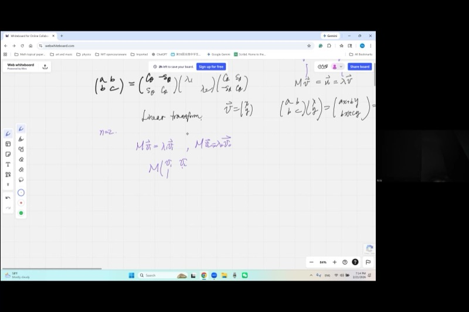
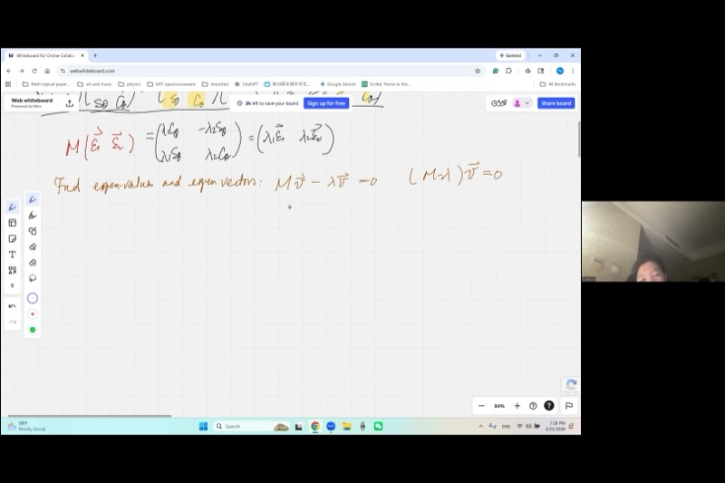
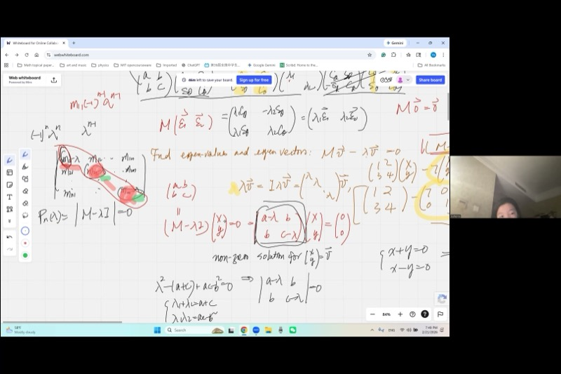

::: {.callout-tip collapse="true"}
## Applications: Why Eigenvalues Matter

Eigenvalues arise in facial recognition, search-engine ranking, structural engineering, and throughout AI and machine learning, where eigenvalue decomposition reveals how data varies. **Linear algebra is the single most important mathematical toolkit for science, engineering, and technology.**

This lesson connects the conic-section diagonalization developed in previous sessions to the far more powerful eigenvalue framework that generalizes to *any* dimension.
:::

## Topics Covered

- Linear transformations and matrix-vector multiplication
- Eigenvectors as fixed subspaces under a transformation
- Eigenvalues as dilation factors
- The characteristic equation $\det(M - \lambda I) = 0$
- Converting $\lambda v$ to matrix form using the identity matrix
- Why eigenvalues of a symmetric matrix reproduce the same diagonalization result
- Proof that trace and determinant are preserved under diagonalization

::: {.callout-note collapse="true"}
## Review: Diagonalizing Conic Sections with Rotation

In our previous session, we learned that a symmetric $2 \times 2$ matrix $\begin{pmatrix} a & b \\ b & c \end{pmatrix}$ representing a conic section can be diagonalized by a rotation matrix:

$$\begin{pmatrix} \cos\theta & \sin\theta \\ -\sin\theta & \cos\theta \end{pmatrix} \begin{pmatrix} a & b \\ b & c \end{pmatrix} \begin{pmatrix} \cos\theta & -\sin\theta \\ \sin\theta & \cos\theta \end{pmatrix} = \begin{pmatrix} \lambda_1 & 0 \\ 0 & \lambda_2 \end{pmatrix}$$

This rotation approach works beautifully in 2D, but becomes nightmarish in 3D and beyond. Today we learn a method that works in **any** dimension.
:::

## Lecture Video

```{=html}
<video controls width="100%" preload="metadata">
  <source src="https://github.com/ymote/learningmathteam/releases/download/v1.0/video1897151257.mp4" type="video/mp4">
</video>
```

## Key Video Frames








::: {.callout-important}
## Key Ideas

1. **Eigenvector**: A nonzero vector $\mathbf{v}$ such that $M\mathbf{v} = \lambda \mathbf{v}$. The transformation only stretches it — no rotation.

2. **Eigenvalue**: The scalar $\lambda$ that tells you how much the eigenvector is dilated.

3. **Characteristic equation**: $\det(M - \lambda I) = 0$ produces an $n$-th degree polynomial whose roots are the eigenvalues.

4. **Identity matrix trick**: To subtract a scalar $\lambda$ from a matrix $M$, write $M - \lambda I$ so both sides are matrices.

5. **Preserved quantities**: Under diagonalization, the **trace** ($\sum m_{ii} = \sum \lambda_i$) and the **determinant** ($\prod \lambda_i = \det M$) are invariant.
:::

## 1. From Quadratic Forms to Linear Transformations

Previously, we used the matrix $M = \begin{pmatrix} a & b \\ b & c \end{pmatrix}$ to encode a conic section (a quadratic form). Now we give it a new role: a **linear transformation** that acts on vectors.

Given a vector $\mathbf{v} = \begin{pmatrix} x \\ y \end{pmatrix}$, the transformation produces:

$$M\mathbf{v} = \begin{pmatrix} a & b \\ b & c \end{pmatrix}\begin{pmatrix} x \\ y \end{pmatrix} = \begin{pmatrix} ax + by \\ bx + cy \end{pmatrix} = \mathbf{u}$$

The output $\mathbf{u}$ is generally a completely different vector from $\mathbf{v}$ — rotated and stretched in some complicated way. But in rare, special cases...

## 2. Eigenvectors: The Vectors That Survive

::: {.callout-tip collapse="true"}
## Intuition: What does "fixed subspace" really mean?

Imagine shining a flashlight at a wall. The beam is a line (a 1D subspace). Now imagine applying a transformation to all of space. Most lines get twisted into new directions. But an **eigenvector direction** is a line that the transformation maps back onto itself — the beam stays on the same line, just possibly brighter or dimmer (dilated by $\lambda$).
:::

We are interested in the special case where $M$ does not rotate $\mathbf{v}$ at all:

$$M\mathbf{v} = \lambda \mathbf{v}$$

This means the output is **parallel** to the input — just scaled by a factor $\lambda$.

- The vector $\mathbf{v}$ is called an **eigenvector**.
- The scalar $\lambda$ is called an **eigenvalue**.
- The line through the origin in the direction of $\mathbf{v}$ is a **fixed subspace** (or invariant subspace).

Note: The zero vector $\mathbf{v} = \mathbf{0}$ trivially satisfies this for any $\lambda$, so we always require $\mathbf{v} \neq \mathbf{0}$.

**Explore how a $2 \times 2$ matrix transforms vectors — eigenvectors stay on their line:**

```{=html}
<div id="desmos-1" class="desmos-container"></div>
<script src="https://www.desmos.com/api/v1.9/calculator.js?apiKey=dcb31709b452b1cf9dc26972add0fda6"></script>
<script>
  var calc1 = Desmos.GraphingCalculator(document.getElementById('desmos-1'), {
    expressions: true,
    settingsMenu: false
  });
  // Matrix [[3,1],[1,3]] has eigenvalues 4 and 2, eigenvectors (1,1) and (1,-1)
  calc1.setExpression({ id: 'note', latex: '', label: 'Matrix M = [[3,1],[1,3]]', showLabel: true, hidden: true, secret: true });
  calc1.setExpression({ id: 'a_val', latex: 'a_{m}=3' });
  calc1.setExpression({ id: 'b_val', latex: 'b_{m}=1' });
  calc1.setExpression({ id: 'c_val', latex: 'c_{m}=3' });
  // Original vector (draggable)
  calc1.setExpression({ id: 'v', latex: '(1, 1)', color: '#2d70b3', pointSize: 12, label: 'v (drag me!)', showLabel: true, dragMode: 'xy' });
  // Transformed vector
  calc1.setExpression({ id: 'vx', latex: 'v_x = 1' });
  calc1.setExpression({ id: 'vy', latex: 'v_y = 1' });
  calc1.setExpression({ id: 'ux', latex: 'u_x = a_{m} \\cdot v_x + b_{m} \\cdot v_y' });
  calc1.setExpression({ id: 'uy', latex: 'u_y = b_{m} \\cdot v_x + c_{m} \\cdot v_y' });
  calc1.setExpression({ id: 'u', latex: '(u_x, u_y)', color: '#c74440', pointSize: 12, label: 'Mv (transformed)', showLabel: true });
  // Eigenvector directions
  calc1.setExpression({ id: 'eig1', latex: 'y = x', color: '#388c46', lineStyle: 'DASHED', lineWidth: 1.5, label: 'eigenvector direction: (1,1)', showLabel: true });
  calc1.setExpression({ id: 'eig2', latex: 'y = -x', color: '#fa7e19', lineStyle: 'DASHED', lineWidth: 1.5, label: 'eigenvector direction: (1,-1)', showLabel: true });
  calc1.setMathBounds({ left: -6, right: 8, bottom: -6, top: 8 });
</script>
```

*Try dragging the blue point onto the green dashed line $y = x$. Notice that the red transformed point lands on the same line — that is an eigenvector direction with $\lambda = 4$. Now try the orange line $y = -x$ — eigenvalue $\lambda = 2$.*

## 3. Bundling Eigenvectors into a Matrix Equation

::: {.callout-note collapse="true"}
## Derivation: From Two Eigenvector Equations to One Matrix Equation

Suppose we find two eigenvectors $\mathbf{v}_1$ and $\mathbf{v}_2$ with eigenvalues $\lambda_1$ and $\lambda_2$:

$$M\mathbf{v}_1 = \lambda_1 \mathbf{v}_1, \qquad M\mathbf{v}_2 = \lambda_2 \mathbf{v}_2$$

Place them side by side as columns of a matrix $P = [\mathbf{v}_1 \mid \mathbf{v}_2]$:

$$MP = M[\mathbf{v}_1 \mid \mathbf{v}_2] = [\lambda_1\mathbf{v}_1 \mid \lambda_2\mathbf{v}_2] = [\mathbf{v}_1 \mid \mathbf{v}_2]\begin{pmatrix} \lambda_1 & 0 \\ 0 & \lambda_2 \end{pmatrix} = P\Lambda$$

This works because matrix multiplication acts column by column. Each column of $P$ is independently multiplied by $M$, producing a scaled version of that same column.

Therefore:
$$MP = P\Lambda \quad\Longrightarrow\quad P^{-1}MP = \Lambda$$

This is **diagonalization**!
:::

When $M$ is symmetric and the eigenvectors come from a rotation matrix $R = \begin{pmatrix} \cos\theta & -\sin\theta \\ \sin\theta & \cos\theta \end{pmatrix}$, we get:

$$R^T M R = \Lambda$$

The rotation matrix $R$ has orthonormal columns (each column is a unit vector, and they are perpendicular). Multiplying $R$ by $R^T$ uses the Pythagorean identity:

$$R^T R = I \quad \text{(identity matrix)}$$

This confirms: the columns of the rotation matrix **are** the eigenvectors, and the rotation-based diagonalization from conic sections was secretly an eigenvalue decomposition all along.

## 4. Finding Eigenvalues: The Characteristic Equation

::: {.callout-important}
## The Identity Matrix Trick

One cannot subtract a scalar from a matrix: "$M - \lambda$" is meaningless (a matrix minus a number). Instead, multiply $\lambda$ by the identity matrix $I$:

$$M - \lambda I = \begin{pmatrix} a & b \\ b & c \end{pmatrix} - \lambda\begin{pmatrix} 1 & 0 \\ 0 & 1 \end{pmatrix} = \begin{pmatrix} a - \lambda & b \\ b & c - \lambda \end{pmatrix}$$

Now both sides are matrices and subtraction makes sense!
:::

Starting from $M\mathbf{v} = \lambda \mathbf{v}$, rewrite:

$$(M - \lambda I)\mathbf{v} = \mathbf{0}$$

We need a **nonzero** solution $\mathbf{v}$. From our study of linear systems, a homogeneous system has nonzero solutions if and only if the coefficient matrix is singular — that is:

$$\det(M - \lambda I) = 0$$

::: {.callout-note collapse="true"}
## Why does $\det = 0$ give nonzero solutions?

The system $(M - \lambda I)\mathbf{v} = \mathbf{0}$ represents two linear equations in two unknowns. If $\det \neq 0$, Cramer's rule gives a unique solution: $x = 0, y = 0$ (the trivial eigenvector we don't want).

When $\det = 0$, the two equations become **proportional** — they represent the same line. One equation is just a scaled copy of the other. This means we have one equation in two unknowns, giving **infinitely many solutions** — a whole line of eigenvectors!

Concretely, if $\frac{a}{c} = \frac{b}{d}$ in the system $ax + by = 0,\; cx + dy = 0$, this is equivalent to $ad = bc$, which is $\det = 0$.
:::

### Example: Finding Eigenvalues of a $2 \times 2$ Symmetric Matrix

::: {.callout-note collapse="true"}
## Worked Example

Let $M = \begin{pmatrix} 5 & 2 \\ 2 & 2 \end{pmatrix}$.

**Step 1:** Form $M - \lambda I$:
$$M - \lambda I = \begin{pmatrix} 5 - \lambda & 2 \\ 2 & 2 - \lambda \end{pmatrix}$$

**Step 2:** Set the determinant to zero:
$$(5 - \lambda)(2 - \lambda) - 4 = 0$$
$$10 - 7\lambda + \lambda^2 - 4 = 0$$
$$\lambda^2 - 7\lambda + 6 = 0$$

**Step 3:** Solve the quadratic (this is the **characteristic polynomial**):
$$(\lambda - 1)(\lambda - 6) = 0 \implies \lambda_1 = 1,\quad \lambda_2 = 6$$

**Check with Vieta's formulas:**

- $\lambda_1 + \lambda_2 = 7 = 5 + 2 = \text{trace}(M)$ ✓
- $\lambda_1 \cdot \lambda_2 = 6 = 5 \cdot 2 - 2^2 = \det(M)$ ✓
:::

### The General $2 \times 2$ Case

For $M = \begin{pmatrix} a & b \\ b & c \end{pmatrix}$:

$$\det(M - \lambda I) = (a - \lambda)(c - \lambda) - b^2 = \lambda^2 - (a+c)\lambda + (ac - b^2) = 0$$

By Vieta's formulas applied to this quadratic:

$$\lambda_1 + \lambda_2 = a + c = \operatorname{trace}(M)$$
$$\lambda_1 \cdot \lambda_2 = ac - b^2 = \det(M)$$

These are exactly the invariants we discovered during conic-section diagonalization!

## 5. Generalizing to $n$ Dimensions

::: {.callout-tip collapse="true"}
## Why This Matters Beyond 2D

In 2D, we had the geometric shortcut of rotation angles. In 3D, rotations require three angles and become very complicated. In 100 dimensions (common in data science), geometric intuition breaks down entirely.

But the eigenvalue approach — $\det(M - \lambda I) = 0$ — works identically in **every** dimension. That is its power.
:::

For an $n \times n$ matrix, the characteristic polynomial is:

$$\det(M - \lambda I) = \det\begin{pmatrix} m_{11} - \lambda & m_{12} & \cdots & m_{1n} \\ m_{21} & m_{22} - \lambda & \cdots & m_{2n} \\ \vdots & \vdots & \ddots & \vdots \\ m_{n1} & m_{n2} & \cdots & m_{nn} - \lambda \end{pmatrix} = 0$$

This determinant expands into an **$n$-th degree polynomial** in $\lambda$:

$$(-1)^n \lambda^n + (-1)^{n-1}(m_{11} + m_{22} + \cdots + m_{nn})\lambda^{n-1} + \cdots + a_0 = 0$$

### Proof: Trace Is Preserved

::: {.callout-note collapse="true"}
## Proof via the Characteristic Polynomial

**Claim:** $\lambda_1 + \lambda_2 + \cdots + \lambda_n = m_{11} + m_{22} + \cdots + m_{nn}$

**Proof:** To get $\lambda^{n-1}$ in the expansion of the determinant, we must select $(n-1)$ of the $n$ diagonal entries $(m_{ii} - \lambda)$, taking the $-\lambda$ from each, and then the constant $m_{jj}$ from the one diagonal entry we skip.

Consider the $3 \times 3$ case:
$$\det\begin{pmatrix} a-\lambda & b & d \\ \cdot & e-\lambda & f \\ \cdot & \cdot & j-\lambda \end{pmatrix}$$

The $\lambda^2$ terms arise from picking two of $\{a-\lambda, e-\lambda, j-\lambda\}$ and the constant from the third:

- Skip $a-\lambda$: contributes $a \cdot (-\lambda)(-\lambda) = a\lambda^2$
- Skip $e-\lambda$: contributes $e\lambda^2$
- Skip $j-\lambda$: contributes $j\lambda^2$

The coefficient of $\lambda^{n-1}$ (with proper signs) is $(-1)^{n-1}(m_{11} + m_{22} + \cdots + m_{nn})$.

By Vieta's formulas, the sum of the roots equals $\frac{-\text{coefficient of } \lambda^{n-1}}{\text{coefficient of } \lambda^n}$, which simplifies (after the $(-1)$ signs cancel) to:

$$\sum_{i=1}^n \lambda_i = \sum_{i=1}^n m_{ii} = \operatorname{trace}(M) \qquad \blacksquare$$
:::

### Proof: Determinant Is Preserved

::: {.callout-note collapse="true"}
## Proof via a Substitution Trick

**Claim:** $\lambda_1 \cdot \lambda_2 \cdots \lambda_n = \det(M)$

**Proof:** The characteristic polynomial can be written as:

$$p(\lambda) = \det(M - \lambda I)$$

The constant term of this polynomial is obtained by setting $\lambda = 0$:

$$p(0) = \det(M - 0 \cdot I) = \det(M)$$

But since the roots of $p(\lambda)$ are $\lambda_1, \ldots, \lambda_n$, we also know:

$$p(\lambda) = (-1)^n(\lambda - \lambda_1)(\lambda - \lambda_2)\cdots(\lambda - \lambda_n)$$

Setting $\lambda = 0$:

$$p(0) = (-1)^n(-\lambda_1)(-\lambda_2)\cdots(-\lambda_n) = (-1)^n \cdot (-1)^n \cdot \lambda_1\lambda_2\cdots\lambda_n = \lambda_1\lambda_2\cdots\lambda_n$$

Therefore:
$$\det(M) = \lambda_1 \cdot \lambda_2 \cdots \lambda_n \qquad \blacksquare$$

This is the elegant "$\lambda = 0$ trick" from the lecture — you never need to expand the full determinant!
:::

## 6. The Complete Eigenvalue Procedure

Here is the streamlined algorithm that works in any dimension:

**Given** an $n \times n$ matrix $M$:

1. **Form** $M - \lambda I$ (subtract $\lambda$ from each diagonal entry).
2. **Compute** $\det(M - \lambda I) = 0$ to get the **characteristic polynomial**.
3. **Solve** the polynomial to find the $n$ eigenvalues $\lambda_1, \lambda_2, \ldots, \lambda_n$.
4. **For each** $\lambda_i$, solve $(M - \lambda_i I)\mathbf{v} = \mathbf{0}$ to find the eigenvector(s).

**Explore the characteristic polynomial for different matrices:**

```{=html}
<div id="desmos-2" class="desmos-container"></div>
<script>
  var calc2 = Desmos.GraphingCalculator(document.getElementById('desmos-2'), {
    expressions: true,
    settingsMenu: false
  });
  calc2.setExpression({ id: 'title', latex: '', label: 'Characteristic polynomial of [[a,b],[b,c]]', showLabel: true, hidden: true, secret: true });
  calc2.setExpression({ id: 'a', latex: 'a = 5', sliderBounds: {min: -5, max: 10, step: 0.5} });
  calc2.setExpression({ id: 'b', latex: 'b = 2', sliderBounds: {min: -5, max: 5, step: 0.5} });
  calc2.setExpression({ id: 'c', latex: 'c = 2', sliderBounds: {min: -5, max: 10, step: 0.5} });
  calc2.setExpression({ id: 'poly', latex: 'p(x) = x^2 - (a+c)x + (a \\cdot c - b^2)', color: '#2d70b3', lineWidth: 3 });
  calc2.setExpression({ id: 'zeros', latex: 'p(x) = 0', color: '#c74440', pointSize: 10, label: 'eigenvalues', showLabel: true });
  calc2.setExpression({ id: 'trace_line', latex: 'x = \\frac{a+c}{2}', color: '#388c46', lineStyle: 'DASHED', lineWidth: 1, label: 'trace/2 (axis of symmetry)', showLabel: true });
  calc2.setMathBounds({ left: -5, right: 10, bottom: -10, top: 15 });
</script>
```

*Adjust the sliders for $a$, $b$, $c$ and watch the eigenvalues (red dots on the $x$-axis) move. Notice: the parabola's axis of symmetry is always at $\frac{a+c}{2}$ (half the trace).*

## 7. Summary: Two Roads to Diagonalization

| | Rotation Approach | Eigenvalue Approach |
|---|---|---|
| **Method** | Find angle $\theta$ to rotate axes | Solve $\det(M - \lambda I) = 0$ |
| **Works in** | 2D only | Any dimension |
| **Finds** | $\theta$, then $\lambda_1, \lambda_2$ | $\lambda_1, \ldots, \lambda_n$ directly |
| **Geometric meaning** | Explicitly rotates coordinate axes | Finds directions that are only scaled |
| **Connection** | Columns of $R(\theta)$ *are* the eigenvectors! |

## Cheat Sheet

::: {.key-formula}
| Concept | Formula / Rule |
|---|---|
| Eigenvector equation | $M\mathbf{v} = \lambda\mathbf{v}$, with $\mathbf{v} \neq \mathbf{0}$ |
| Identity matrix trick | $\lambda\mathbf{v} = \lambda I\, \mathbf{v}$, so $M - \lambda$ becomes $M - \lambda I$ |
| Characteristic equation | $\det(M - \lambda I) = 0$ |
| $2\times 2$ char. polynomial | $\lambda^2 - \operatorname{trace}(M)\,\lambda + \det(M) = 0$ |
| Trace preserved | $\lambda_1 + \lambda_2 + \cdots + \lambda_n = m_{11} + m_{22} + \cdots + m_{nn}$ |
| Determinant preserved | $\lambda_1 \cdot \lambda_2 \cdots \lambda_n = \det(M)$ |
| Nonzero solutions exist | iff $\det(\text{coefficient matrix}) = 0$ |
| Symmetric matrix guarantee | Real eigenvalues, orthogonal eigenvectors |
| $\lambda = 0$ trick | Constant term of $p(\lambda) = \det(M) = \prod \lambda_i$ |
:::
